Introduction
========

Aim & composition of this manual
----------------

**This manual explains the functions of GridDB.**

This manual is targeted at administrators who are in-charge of the operational management of GridDB and designers and developers who perform system design and development using GridDB.

The contents of this manual are as follows.

-   What is GridDB?
    -   Describes the features and application examples of GridDB.
-   Structure of GridDB
    -   Describes the cluster operating structure in GridDB.
-   The data model of GridDB
    -   Describes the data model of GridDB.
-   Functions provided by GridDB
    -   Describes the data management functions, and operating functions provided by GridDB.
-   Parameter
    -   Describes the parameters to control the operations in GridDB.

{}
- GridDB Community Edition is only available in single configuration, and cluster configuration with multiple nodes is limited only to GridDB Enterprise Edition.
- OS user (gsadm) is created when GridDB is installed using the package.
- ODBC is Enterprise Edition only.
{}

What is GridDB?
==========

GridDB is a distributed NoSQL database to manage a group of data (known as a row) that is made up of a key and multiple values.  Besides having a composition of an in-memory database that arranges all the data in the memory, it can also adopt a hybrid composition combining the use of a disk (including SSD as well) and a memory. By employing a hybrid composition, it can also be used in small scale, small memory systems.

In addition to the 3 Vs (volume, variety, velocity) required in big data solutions, data reliability/availability is also assured in GridDB. Using the autonomous node monitoring and load balancing functions, labor-saving can also be realized in cluster applications.

<a id="griddb_features"></a>

Features of GridDB
------------

### Big data (volume)[Enterprise Edition]

As the scale of a system expands, the data volume handled increases and thus the system needs to be expanded so as to quickly process the big data.

System expansion can be broadly divided into 2 approaches - scale-up (vertical scalability) and scale-out (horizontal scalability).

-   What is scale-up (vertical scalability)?

    This approach reinforces the system by adding memory to the operating machines, using SSD for the disks, adding processors, and so on. Generally, this approach increases individual processing time and increases the system processing speed. On the other hand, since the nodes must be stopped before the scale-up operation, as it is not a cluster application using multiple machines, once a failure occurs, failure recovery is also time-consuming.

-   What is scale-out (horizontal scalability)?

    This approach increases the number of nodes constituting a system to improve the processing capability. Since multiple nodes are generally set to operate in coordination, this approach features that there is no need to completely stop the service during maintenance or even when a failure occurs. However, the application management time and effort increases as the number of nodes increases. This architecture is suitable for performing highly parallel processing.

In GridDB, in addition to the scale-up approach to increase the number of operating nodes and reinforce the system, new nodes can be added to expand the system with a scale-out approach to incorporate nodes into an operating cluster.

As an in-memory processing database, GridDB can handle a large volume of data with its scale-out model. In GridDB, data is distributed throughout the nodes inside a cluster that is composed of multiple nodes. That is, GridDB provides a large-scale memory database by handling memories of more than one nodes as one big memory space.

Moreover, since GridDB manages data both in memories and on a disk, even when a single node is in operation, it can maintain and access the data larger than its memory size. A large capacity that is not limited by the memory size can also be realized.

<figure>

<figcaption>Combined use of in-memory/disk</figcaption>
</figure>


System expansion can be carried out online with a scale-out approach. That is, without stopping the system in operation, the system can be expanded when the volume of data increases.

In the scale-out approach, data is relocated into the new nodes added to the system in accordance with the load of each existing node in the system. As GridDB will optimize the load balance, the application administrator does not need to worry about the data arrangement. Operation is also easy because a structure to automate such operations has been built into the system.

<figure>

<figcaption>Scale-out model</figcaption>
</figure>

### Various data types (variety)

GridDB data adopts a Key-Container data model that is expanded from Key-Value. Data is stored in a device equivalent to a RDB table known as a container.  (A container can be considered a RDB table for easier understanding.)

When accessing data in GridDB, the model allows data to be short-listed with a key thanks to its Key-Value database structure, allowing processing to be carried out at the highest speed. A design that prepares a container serving as a key is required to support the entity under management.

<figure>

<figcaption>Data model</figcaption>
</figure>

Besides being suitable for handling a large volume of time series data (TimeSeries container) that is generated by a sensor or the like and other values paired with the time of occurrence, space data such as position information, etc. can also be registered and space specific operations (space intersection) can also be carried out in a container. A variety of data can be handled as the system supports non-standard data such as array data, BLOB and other data as well.

### High-speed processing (velocity)

A variety of architectural features is embedded in GridDB to achieve high-speed processing.

#### Processing is carried out in the memory space as much as possible

In the case of an operating system with an in-memory in which all the data is arranged, there is no real need to be concerned about the access overhead in the disk. However, in order to process a volume of data so large that it cannot be saved in the memory, there is a need to localize the data accessed by the application and to reduce access to the data arranged in the disk as much as possible.

In order to localize data access from an application, GridDB provides a function to arrange related data in the same block as far as possible. Since data in the data block can be consolidated according to the hints provided in the data, the memory hit rate is raised during data access, thereby increasing the processing speed for data access. By setting hints for memory consolidation according to the access frequency and access pattern in the application, limited memory space can be used effectively for operation (Affinity function).


#### Reduces the overhead

In order to minimize waiting time caused by locks or latches in a simultaneous access to the database, GridDB allocates exclusive memory and DB files to each CPU core and thread, so as to eliminate waiting time for exclusive and synchronization processing.

<figure>

<figcaption>Architecture</figcaption>
</figure>

In addition, direct access between the client and node is possible in GridDB by caching the data arrangement when accessing the database for the first time on the client library end. Since direct access to the target data is possible without going through the master node to manage the operating status of the cluster and data arrangement, access to the master node can be centralized to reduce communication cost substantially.

<figure>

<figcaption>Access from a client</figcaption>
</figure>

#### Processing in parallel

GridDB provides high-speed processing using the following functions: parallel processing e.g. by dividing a request into processing units capable of parallel processing in the drive engine and executing the process using a thread in the node and between nodes, as well as dispersing a single large data into multiple nodes (partitioning) for processing to be carried out in parallel between nodes.

### Reliability/availability[Enterprise Edition]

Data are duplicated in a cluster and the duplicated data, replicas, are located in multiple nodes. Replicas include master data, called an owner replica, and duplicated data called a backup. By using these replicas, processing can be continued in any of the nodes constituting a cluster even when a failure occurs. Special operating procedures are not necessary as the system will also automatically perform re-arrangement of the data after a node failure occurs (autonomous data arrangement). Data arranged in a failed node is restored from a replica and then the data is re-arranged so that the set number of replicas is reached automatically.

Duplex, triplex or multiplex replica can be set according to the availability requirements.

Each node performs persistence of the data update information using a disk. Even if a failure occurs in the cluster system, all the registered and updated data up to the failure can be restored without being lost.

In addition, since the client also possesses cache information on the data arrangement and management, upon detecting a node failure, it will automatically perform a failover and data access can be continued using a replica.

<figure>

<figcaption>High availability</figcaption>
</figure>


GridDB Editions
------------

GridDB has the following products.

-   GridDB Community Edition (CE)
-   GridDB Enterprise Edition (EE)

In addition to the features described in [Features of GridDB](#griddb_features) above, GridDB has the following two features:


-   NewSQL interface
    -   In addition to being SQL 92 compliant, GridDB AE supports ODBC (C language interface) and JDBC (Java interface) application interfaces.
    -   By using ODBC/JDBC, direct access to the database from BI (Business Intelligence) or ETL (Extract Transfer Load) tool becomes possible.
    -  	Containers can be considered as tables and operated.
-   Table partitioning function
    -   Partitioning function for high speed access to a huge table.
    -   Since data is divided into multiple parts and distributed to multiple nodes, it is possible to parallelize data search and extraction from the table, thus realizing faster data access.

<figure>
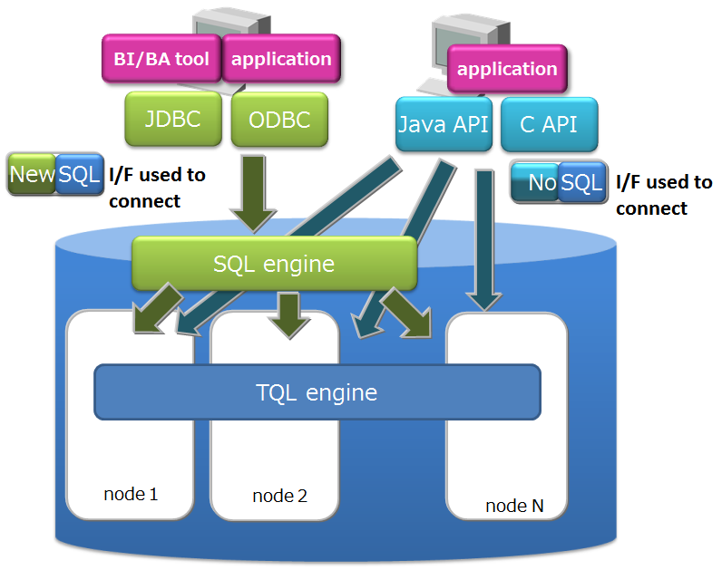
<figcaption>GridDB editions</figcaption>
</figure>

The features of each interface are as follows.

-   NoSQL interface (NoSQL I/F)
    -   Client APIs (C, Java) of NoSQL I/F focus on batch processing of big data at high speed.
    -   It is used for data collection, high-speed access of key value data, simple aggregate calculation using TQL, etc.
-   NewSQL interface (NewSQL I/F)
    -   ODBC/JDBC of NewSQL I/F focus on cooperation with existing applications and development productivity using SQL.
    -   It is used to classify and analyze data collected using BI tools, etc.

When using GridDB, both NoSQL I/F and NewSQL I/F can be used depending on the use case.

<figure>
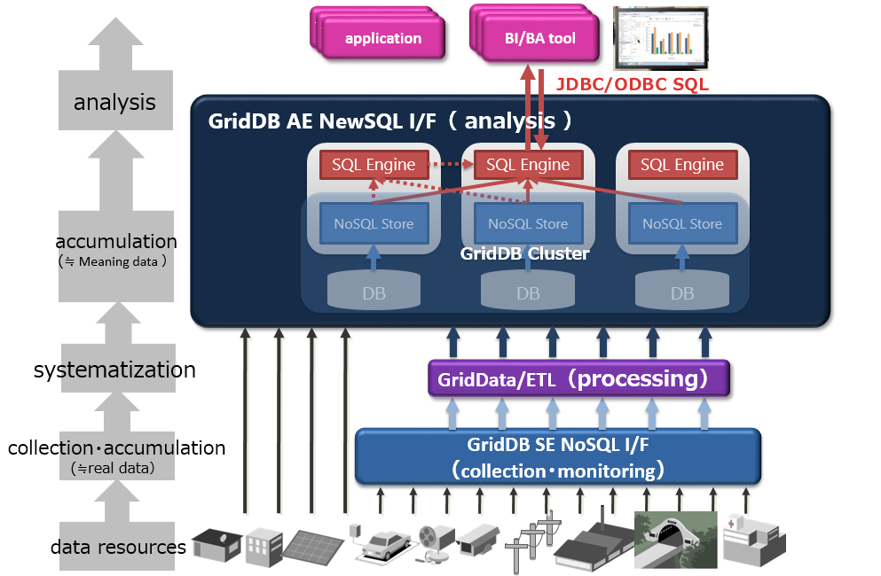
<figcaption>Use case</figcaption>
</figure>


The GridDB database and NoSQL/NewSQL interface of GridDB are compatible within the same major version (e.g., a minor version upgrade).  The version notation is as follows:

-   The version of GridDB is represented as "X.Y[.Z]", and each symbol represents the following.
    -   Major version (X): Changed for significant enhancements.
    -   Minor version (Y): Changed for expanding or adding functions.
    -   Revision (Z): Changed for such as bug fixes.

When using both NoSQL I/F and NewSQL I/F in GridDB AE, check the following specification in advance

-   Containers created by NoSQL I/F can be operated as tables by NewSQL I/F.  Containers created with NoSQL I/F can be accessed as tables in NewSQL I/F.
-   And tables created with NewSQL I/F can be accessed as containers in NoSQL I/F.  The names of tables and containers must be unique.


# Terminology

Describes the terms used in GridDB in a list.

| Term                                                | Description    |
|--------------------------------|------------------------------------------------------------------------|
| Node                                                | Refers to the individual server process to perform data management in GridDB.                   |
| Cluster                                             | Single or a set of nodes that perform data management together in an integrated manner.     |
| Master node                                         | Node to perform a cluster management process.                                         |
| Follower node                                       | All other nodes in the cluster other than the master node.                       |
| number of nodes constituting a cluster              | Refers to the number of nodes constituting a GridDB cluster. When starting GridDB for the first time, the number is used as a threshold value for the cluster to be valid. (Cluster service is started when the number of nodes constituting a cluster joins the cluster.)  |
| number of nodes already participating in a cluster  | Number of nodes currently in operation that have been incorporated into the cluster among the nodes constituting the GridDB cluster. |
| Block                                               | A block is a data unit for data persistence processing in a disk (hereinafter referred to a checkpoint) and is the smallest physical data management unit in GridDB. Multiple container data are arranged in a block. Block size is set up in a definition file (cluster definition file) before the initial startup of GridDB. |
| Partition                                           | A partition is a unit of data management for placing a container and is equivalent to a data file on the file system when persisting data to a disk. One partition corresponds to one data file. It is also the smallest unit of data placement between clusters, as well as a unit of data movement and copy for adjusting the load balance between nodes (rebalancing) and for managing data multiplexing (replicas) in the event of a failure. |
| Row                                                 | Refers to one row of data registered in a container or table. Multiple rows are registered in a container or table. A row consists of values of columns corresponding to the schema definition of the container (table).   |
| Container (Table)                                   | Container to manage a set of rows. It may be called a container when operated with NoSQL I/F, and may be called a table when operated with NewSQL I/F. What these names refer are the same object, only in different names. A container has two data types: collection and timeseries container.        |
| Collection (table)                                  | One type of container (table) to manage rows having a general key.     |
| Timeseries container (timeseries table)             | One type of container (table) to manage rows having a timeseries key. Possesses a special function to handle timeseries data. |
| Database file                                       | A database file is a group of files where the data retained by nodes configuring a cluster is written to disks or SSDs and is persisted. A database file is a collective term for data files, checkpoint log files, and transaction log files. |
| Data file                                           | A file to which partition data is written.  Updated information located on the memory is reflected at the interval  (/checkpoint/checkpointInterval) specified in the node definition file. |
| Checkpoint log file                                 | This is a file for storing block management information for a partition. Block management information is written in smaller batches at the interval (/checkpoint/checkpointInterval) specified in the node definition file. |
| Transaction log file                                | Update information of the transaction is saved sequentially as a log. |
| LSN (Log Sequence Number)                           | Shows the update log sequence number, which is assigned to each partition during the update in a transaction. The master node of a cluster configuration maintains the maximum number of LSN (MAXLSN) of all the partitions maintained by each node. |
| Replica                                             | Replication is the process of creating an exact copy of the original data. In this case, one or more replica are created and stored on multiple nodes, which results to the creation of partition across the nodes. There are 2 forms of replica, master and backup. The former one refers to the original or master data, whereas the latter one is used in case of failure as a reference.       |
| Owner node                                          | A node that can update a container in a partition. A node that records the container serving as a master among the replicated containers. |
| Backup node                                         | A node that records the container for backup data among the replicated containers.      |
| Definition file                                     | Definition file includes two types of parameter files: gs_cluster.json, hereinafter referred to as a cluster definition file, used when composing a cluster; gs_node.json, hereinafter referred to as a node definition file, used to set the operations and resources of the node in a cluster. It also includes a user definition file for GridDB administrator users.   |
| Event log file                                      | Event logs of the GridDB server are saved in this file including messages such as errors, warnings and so on. including messages such as errors, warnings and so on.                     |
| Audit log file           | It is a file in which audit logs of the GridDB server are stored.        |
| OS user (gsadm)                                     | An OS user has the right to execute operating functions in GridDB. An OS user named gsadm is created during the GridDB installation.       |
| Administrator user                                  | An administrator user is a GridDB user prepared to perform operations in GridDB.         |
| General user                                        | A user used in the application system.                     |
| user definition file                                | File in which an administrator user is registered. During initial installation, 2 administrators, system and admin, are registered.               |
| Cluster database                                    | General term for all databases that can be accessed in a GridDB cluster system.                                                                            |
| Database                                            | Theoretical data management unit created in a cluster database. A public database is created in a cluster database by default. Data separation can be realized for each user by creating a new database and giving a general user the right to use it.                 |
| Full backup                                         | A backup of the cluster database currently in use is stored online in the backup directory specified in the node definition file.      |
| Differential/incremental backup                     | A backup of the cluster database currently in use is stored online in the backup directory specified in the node definition file. In subsequent backups, only the difference in the update block after the backup is backed up.    |
| Automatic log backup                                | In addition to backing up the cluster database currently in use in the specified directory online, the transaction log is also automatically picked up at the same timing as the transaction log file writing. The write timing of the transaction log file follows the value of /dataStore/logWriteMode in the node definition file.            |
| Failover                                            | When a failure occurs in a cluster currently in operation, the structure allows the backup node to automatically take over the function and continue with the processing.       |
| Client failover                                     | When a failure occurs in a cluster currently in operation, the structure allows the backup node to be automatically re-connected to continue with the processing as a retry process when a failure occurs in the API on the client side.    |
| Table partitioning                                  | Function to access a huge table quickly by allowing concurrent execution by processors of multiple nodes, and the memory of multiple nodes to be used effectively by distributing the placement of a large amount of table data with multiple data registrations in multiple nodes.             |
| Data partition                                      | General name of data storage divided by table partitioning. Multiple data partitions are created for a table by table partitioning. Data partitions are distributed to the nodes like normal containers. The number of data partitions and the range of data stored in each data partition are depending on the type of table partitioning (hash, interval or interval-hash). |
| Data Affinity                                       | A function to raise the memory hit rate by placing highly correlated data in a container in the same block and localizing data access.      |
| Placement of container/table based on node affinity | A function to reduce the network load during data access by placing highly correlated containers in the same node.       |


Structure of GridDB
==============

Describes the cluster operating structure in GridDB.


Composition of a cluster
--------------

GridDB is operated by clusters which are composed of multiple nodes. Before accessing the database from an application system, nodes must be started and the cluster must be constituted, that is, cluster service is executed.

A cluster is formed and cluster service is started when a number of nodes specified by the user joins the cluster. Cluster service will not be started and access from the application will not be possible until all nodes constituting a cluster have joined the cluster.

A cluster needs to be constituted even when operating GridDB with a single node. In this case, the number of nodes constituting a cluster is 1. A composition that operates a single node is known as a single composition.

<figure>

<figcaption>Cluster name and number of nodes constituting a cluster</figcaption>
</figure>


A cluster name is used to distinguish a cluster from other clusters so as to compose a cluster using the right nodes selected from multiple GridDB nodes on a network. Using cluster names, multiple GridDB clusters can be composed in the same network.
A cluster is composed of nodes with the following features in common: cluster name, the number of nodes constituting a cluster, and the connection method setting. A cluster name needs to be set in the cluster definition file for each node constituting a cluster, and needs to be specified as a parameter when composing a cluster as well.

The method of constituting a cluster using multicast is called the multicast method. See [Consideration of cluster configuration](#cluster_configuration_methods) for details about cluster configuration methods.

The operation of a cluster composition is shown below.

<figure>
  
  <figcaption>Operation of a cluster composition</figcaption>
</figure>

To start up a node and compose a cluster, the [operation commands](#operating_commands) gs_startnode/gs_joincluster command or [gs_sh](#label_gs_sh) are used. In addition, there is a service control function to start up the nodes at the same time as the OS and to compose the cluster.


To compose a cluster, the number of nodes joining a cluster (number of nodes constituting a cluster) and the cluster name must be the same for all the nodes joining the cluster.

Even if a node fails and is separated from the cluster after operation in the cluster started, cluster service will continue so long as the majority of the number of nodes is joining the cluster.

Since cluster operation will continue as long as the majority of the number of nodes is in operation. So, a node can be separated from the cluster for maintenance while keeping the cluster in operation. The node can be get back into the cluster via network after the maintenance. Nodes can also be added via network to reinforce the system.

### Status of node

Nodes have several types of status that represent their status. The status changes by user command execution or internal processing of the node. The [status of a cluster](#status_of_cluster) is determined by the status of the nodes in a cluster.

This section explains types of node status, status transition, and how to check the node status.

- Types of node status

  | Node status | Description                                 |
  |-----------|----------------------------------------------|
  | STOP      | The GridDB server has not been started in the node. |
  | STARTING  | The GridDB server is starting in the node. Depending on the previous operating state, start-up processes such as recovery processing of the database are carried out. The only possible access from a client is checking the status of the system with a gs_stat command or gs_sh command. Access from the application is not possible. |
  | STARTED   | The GridDB server has been started in the node. However, access from the application is not possible as the node has not joined the cluster. To obtain the cluster composition, execute a cluster operating command, such as gs_joincluster or gs_sh to join the node to the cluster. |
  | WAIT      | The system is waiting for the cluster to be composed. Nodes have been informed to join a cluster but the number of nodes constituting a cluster is insufficient, so the system is waiting for the number of nodes constituting a cluster to be reached. WAIT status also indicates the node status when the number of nodes constituting a cluster drops below the majority and the cluster service is stopped. |
  | SERVICING | A cluster has been constituted and access from the application is possible. However, access may be delayed if synchronization between the clusters of the partition occurs due to a re-start after a failure when the node is stopped or the like. |
  | STOPPING  | Intermediate state in which a node has been instructed to stop but has not stopped yet. |
  | ABNORMAL  | The state in which an error is detected by the node in SERVICING state or during state transition. A node in the ABNORMAL state will be automatically separated from the cluster. After collecting system operation information, it is necessary to forcibly stop and restart the node in the ABNORMAL state. By re-starting the system, recovery processing will be automatically carried out.|

- Transition in the node status

  <figure>
    
    <figcaption>Node status</figcaption>
  </figure>

  | State transition  | State transition event | Description                                                                   |
  |----------------|-------------|-----------------------------------------------------------------------|
  |      ①         | Command execution | Start a node by executing the commands such as gs_startnode command, gs_sh, and service start-up.     |
  |      ②         | System     | Status changes automatically at the end of recovery processing or loading of database files.       |
  |      ③         | Command execution | Joining a node to a cluster by executing the commands such as gs_joincluster/gs_appendcluster command, gs_sh, and service statrt-up.   |
  |      ④         | System     | Status changes automatically when the required number of component nodes join a cluster.                  |
  |      ⑤         | System     | Status changes automatically when some nodes consisting the cluster are detached from the service due to a failure or by some other reasons, and the number of nodes joining the cluster become less than half of the value set in the definition file. |
  |      ⑥         | Command execution | Detaches a node from a cluster by executing the commands such as gs_leavecluster command and gs_sh. |
  |      ⑦         | Command execution | Detaches a node from a cluster by executing the commands such as gs_leavecluster/gs_stopcluster command or gs_sh.   |
  |      ⑧         | Command execution | Stop a node by executing the commands such as gs_startnode command, gs_sh, and service stop.      |
  |      ⑨         | System     | Stops the server process once the final processing ends                                   |
  |      ⑩         | System     | Detached state due to a system failure. In this state, the node needs to be stopped by force once.  |


- How to check the node status

  The node status is determined by the combination of the node status and the node role.

  The status of the node can be checked with [gs_sh](#label_gs_sh) or [gs_admin](#integrated_operation_control).

  The operation status of a node and the role of a node can be checked from the result of the gs_stat command, which is in json format. That is, for the operation status of a node, check the value of /cluster/nodeStatus, for the role of a node, check /cluster/clusterStatus)

  The table below shows the node status, determined by the combination of the operation status of a node and the role of a node.

  | Node status | Operation status of a node<br>(/cluster/nodeStatus)  | Role of a node<br>(/cluster/clusterStatus) |
  |------------|------------------------------|------------------------|
  | STOP       | - (Connection error of gs_stat)      | －  (Connection error of gs_stat)    |
  | STARTING   | INACTIVE                     | SUB_CLUSTER            |
  | STARTED    | INACTIVE                     | SUB_CLUSTER            |
  | WAIT       | ACTIVE                       | SUB_CLUSTER           |
  | SERVICING  | ACTIVE                       | MASTER or FOLLOWER   |
  | STOPPING   | NORMAL_SHUTDOWN              | SUB_CLUSTER           |
  | ABNORMAL   | ABNORMAL                     | SUB_CLUSTER           |

  - Operation status of a node

    The table below shows the operation status of a node. Each state is expressed as the value of /cluster/nodeStatus of the gs_stat command.

    | Operation status of a node | Description                   |
    |------------------|------------------------|
    | ACTIVE           | Non-active state          |
    | ACTIVATING       | In transition to a non-active state.   |
    | NACTIVE         | Non-active state        |
    | DEACTIVATING     | In transition to a non-active state. |
    | NORMAL_SHUTDOWN  |  In shutdown process     |
    | ABNORMAL                   | Abnormal state                |

  - Role of a node

    The table below shows the role of a node. Each state is expressed as the value of /cluster/clusterStatus of the gs_stat command.

    A node has two types of roles: "master" and "follower".
    To start a cluster, one of the nodes which constitute the cluster needs to be a "master." The master manages the whole cluster.
    All the nodes other than the master become "followers." A follower performs cluster processes, such as a synchronization, following the directions from the master.

    | Role of a node           | Description     |
    |-----------------------------|-----------|
    | MASTER                      | Master     |
    | FOLLOWER                    | Follower   |
    | SUB_CLUSTER/SUB_MASTER | Role undefined   |

<a id="status_of_cluster"></a>

### Status of cluster

The cluster operating status is determined by the state of each node, and the status may be one of 3 states - IN OPERATION/INTERRUPTED/STOPPED.

During the initial system construction, cluster service starts after all the nodes, the number of which was specified by the user as the number of nodes constituting a cluster, have joined the cluster.

During initial cluster construction, the state in which the cluster is waiting to be composed when all the nodes that make up the cluster have not been incorporated into the cluster is known as [INIT_WAIT]. When the number of nodes constituting a cluster has joined the cluster, the state will automatically change to the operating state.

Operation status includes two states, [STABLE] and [UNSTABLE].

-   [STABLE] state
    -   State in which a cluster has been formed by the number of nodes specified in the number of nodes constituting a cluster and service can be provided in a stable manner.
-   [UNSTABLE] state
    -   A cluster in this state is joined by the nodes less than "the number of the nodes constituting the cluster" but more than half the constituting clusters are in operation.
    -   Cluster service will continue for as long as a majority of the number of nodes constituting a cluster is in operation.

A cluster can be operated in an [UNSTABLE] state as long as a majority of the nodes are in operation even if some nodes are detached from a cluster due to maintenance and for other reasons.

Cluster service is interrupted automatically in order to avoid a split brain when the number of nodes constituting a cluster is less than half the number of nodes constituting a cluster. The status of the cluster will become [WAIT].

-   What is split brain?

    A split brain is an action where multiple cluster systems performing the same process provide simultaneous service when a system is divided due to a hardware or network failure in a tightly-coupled system that works like a single server interconnecting multiple nodes. If the operation is continued in this state, data saved as replicas in multiple clusters will be treated as master data, causing data inconsistency.

To resume the cluster service from a [WAIT] state, add the node, which recovered from the abnormal state, or add a new node, by using a node addition operation.  After the cluster is joined by all the nodes, the number of which is the same as the one specified in "the number of nodes constituting a cluster", the status will be [STABLE], and the service will be resumed.

Even when the cluster service is disrupted, since the number of nodes constituting a cluster becomes less than half due to failures in the nodes constituting the cluster, the cluster service will be automatically restarted once a majority of the nodes joine the cluster by adding new nodes and/or the nodes restored from the errors to the cluster.

<figure>

<figcaption>Cluster status</figcaption>
</figure>

A STABLE state is a state in which the value of the json parameter shown in gs_stat, /cluster/activeCount, is equal to the value of /cluster/designatedCount. (Output content varies depending on the version.)

``` example
$ gs_stat -u admin/admin
{
    "checkpoint": {
          :
          :
    },
    "cluster": {
        "activeCount":4,                       // Nodes in operation within the cluster
        "clusterName": "test-cluster",
        "clusterStatus": "MASTER",
        "designatedCount": 4,                  // Number of nodes constituting a cluster
        "loadBalancer": "ACTIVE",
        "master": {
            "address": "192.168.0.1",
            "port": 10040
        },
        "nodeList": [                          // Node list constituting a cluster
            {
                "address": "192.168.0.1",
                "port": 10040
            },
            {
                "address": "192.168.0.2",
                "port": 10040
            },
            {
                "address": "192.168.0.3",
                "port": 10040
            },
            {
                "address": "192.168.0.4",
                "port": 10040
            },

        ],
        :
        :
```

The status of the cluster can be checked with [gs_sh](#label_gs_sh) or [gs_admin](#integrated_operation_control). An example on checking the cluster status with gs_sh is shown below.

``` example
$ gs_sh
gs> setuser admin admin gsadm                  //Setting a connecting user
gs> setnode node1 192.168.0.1 10040            //Definition of a node constituting the cluster
gs> setnode node2 192.168.0.2 10040
gs> setnode node3 192.168.0.3 10040
gs> setnode node4 192.168.0.4 10040
gs> setcluster cluster1 test150 239.0.0.5 31999 $node1 $node2 $node3 $node4   //Cluster definition
gs> startnode $cluster1                        //Start-up of all nodes making up the cluster
gs> startcluster $cluster1                     //Instructing cluster composition
Waiting for cluster to start. 
The GridDB cluster has been started. 
gs> configcluster  $cluster1                      // Checking status of cluster
Name                  : cluster1
ClusterName           : test-cluster
Designated Node Count : 4
Active Node Count     : 4
ClusterStatus         : SERVICE_STABLE            // Stable state

Nodes:
  Name    Role Host:Port              Status
-------------------------------------------------
  node1     M  192.168.0.1:10040    SERVICING
  node2     F  192.168.0.2:10040    SERVICING
  node3     F  192.168.0.3:10040    SERVICING
  node4     F  192.168.0.4:10040    SERVICING

gs> leavecluster $node2
Waiting for a node to separate from cluster. 
The GridDB node has leaved the GridDB cluster. 
gs> configcluster  $cluster1
Name                  : cluster1
ClusterName           : test150
Designated Node Count : 4
Active Node Count     : 3
ClusterStatus         : SERVICE_UNSTABLE          // Unstable state

Nodes:
  Name    Role Host:Port              Status
-------------------------------------------------
  node1     M  192.168.0.1:10040    SERVICING        // Master node
  node2     -  192.168.0.2:10040    STARTED          
  node3     F  192.168.0.3:10040    SERVICING        // Follower node
  node4     F  192.168.0.4:10040    SERVICING        // Follower node
```

### Status of partition

The partition status represents the status of the entire partition in a cluster,
showing whether the partitions in an operating cluster are accessible, or the partitions are balanced.

| Partition status | Description |
|--------------|----------------|
| NORMAL       | All the partitions are in normal states where all of them are placed as planned. |
| NOT_BALANCE  | With no replica_loss, no owner_loss but partition placement is unbalanced. |
| REPLICA_LOSS | Replica data is missing in some partitions<br>(Availability of the partition is reduced, that is, the node cannot be detached from the cluster.) |
| OWNER_LOSS   | Owner data is missing in some partitions.<br>(The data of the partition are not accessible.)      |
| INITIAL      | The initial state no partition has joined the cluster |

Partition status can be checked by executing gs_stat command to a master node. (The state is expressed as the value of /cluster/partitionStatus)

```example
$ gs_stat -u admin/admin
{
    :
    :
"cluster": {
    :
    "nodeStatus": "ACTIVE",
    "notificationMode": "MULTICAST",
    "partitionStatus": "NORMAL",
    :
```

[Notes]
- The value of /cluster/partitionStatus of the nodes other than a master node may not be correct. Be sure to check the value of a master node.

<a id="cluster_configuration_methods"></a>

Consideration of cluster configuration
----------------

Configuring a cluster requires the following considerations:
- First, determine the configuration method between nodes that make up a cluster and between the cluster and the client. Choose one of the following three: the multicast method, the fixed list method, and the provider method.
- Then, determine whether multiple communication paths are needed in the communication between the cluster and client and set them up as needed.
- Next, set the number of replicas depending on the levels of availability. If fault tolerance is required on a per-availability zone basis, enable the rack-zone awareness feature.

### Cluster configuration methods

Cluster configuration methods refer to configuration methods for communication between nodes that make up a cluster and between the cluster and the client, while recognizing the address list for each communication, three of which are provided:

-   Multicast method
    -   This is a method in which address lists are recognized through the discovery of nodes using multicast.
-   Fixed list method
    -   This is a method in which address lists are recognized by launching a cluster, specifying the fixed address list that makes up the cluster in the cluster definition file.
-   Provider method
    -   This is a method in which address lists are recognized according to the address lists provided by the address provider.
    -   The address provider can be configured as a Web service or as a static content.

<figure>

</figure>

The table below compares the three cluster configuration methods.

| Property | Multicast method | Fixed list method | Provider method          |
|--------------|------------------------------------|-----------------------------------------------|-----------------------|
| Parameters | - Multicast address and port | - List of IP addresses and port numbers of all the nodes | - Provider URL     |
| Use case | - When multicast is available. | - When multicast is not available.<br />- System size can be estimated accurately. | - When multicast is not available.<br />- System size cannot be estimated.        |
| Cluster operation | - Perform automatic discovery of nodes at a specified time interval.  | - Set a common address list for all nodes.<br />- Read that list only once at node startup. | - Obtain the address list at a specified time interval from the address provider. |
| Benefits | - No need to restart the cluster to add a node. | - Free from errors because lists are checked for consistency. <br>Easy to grasp the current nodes configuring the cluster.  | - No need to restart the cluster to add a node.    |
| Drawbacks | - Multicast is often unavailable in the cloud environment.<br>Communication across segments is not possible. | - A restart of the cluster is required to add a node | - An update of  the connection setting on the application side is also required. | - There is a need to ensure the availability of the address provider.    |


### Multiple communication paths

In the GridDB cluster,  it is possible to set multiple communication paths to the client. The default cluster-client communication path is the same as the communication path between cluster nodes. By setting multiple communication paths, however, it will be possible to establish a connection using a commutation path other than the default, called an external communication path.
The client will be able to specify which communication path to use.

<figure>

</figure>

This type of network configuration that uses multiple communication paths is used in cases such as the following:
- To improve convenience by directly referencing or operating GridDB services that are provided on the cloud from the user's on-premises environment outside the cloud, using an external communication path.
- In addition to using the services from the user's on-premises environment outside the cloud, to enable fast application processing using the default communication path from the environment within the cloud.

### Rack-zone awareness

GridDB provides the rack-zone awareness feature, which would improve availability in the event of a rack failure, an availability zone failure, and other per-physical configuration group failures. 
Given that the owner and backups of certain data are located within the same configuration group, if a failure occurs in this group, access to the data would be disabled.
The rack-zone awareness feature solves this problem by making it possible to pre-define groups that a cluster node belongs to; GridDB then references this definition and controls the allocation of the owner and backups to the node to place the owner and backups in other groups.
With this feature, even when a failure occurs in a certain group, access to data is still possible because data backups are placed in other groups.
Another advantage of this feature is that in this case, the owner and backups are allocated in such a way that they are placed in each group and node as evenly as possible.

The rack-zone awareness feature effectively improves availability when such configuration groups as racks and availability zones are available.
While it is generally required to set up a large number of replicas in order to improve availability, there is a trade-off between the number of replicas and the performance of transactions because increasing the number of replicas decreases the performance.
The rack-zone awareness feature computes the placement of owner and backup data as a top priority to guard against the event of a failure that occurs on a per-group basis.
For this reason, if configuration groups are available, this feature can improve availability while minimizing the number of replicas (or more specifically, maintaining transaction performance).
To use this feature, you need to set rack-zone options in the settings file; no other special operations are necessary.

To illustrate the point, explanation is provided as to how data placement in a cluster consisting of six nodes, three groups, six partitions, and two replicas differs depending on whether the rack-zone awareness feature is used or not.
(The figure below shows an example where a cloud availability zone (AZ) is used.)
The figure on the left shows typical data placement with the rack-zone awareness feature, and the figure on the right shows that without this feature.

<figure>
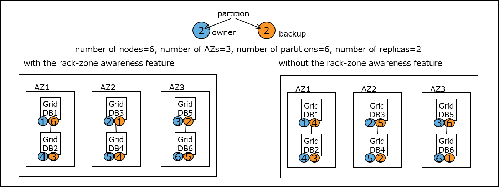
</figure>

If without the rack-zone awareness feature as shown on the right, there is a possibility that the data owner and backups might be placed within the same AZ.
For example, in GridDB2 within AZ1, the owner of cluster partition 4 data (blue circle) is placed. 
At the same time, data backups for cluster partition 4 (orange circle) are also placed in GridDB1 within AZ1.
With this data placement, access to cluster partition 4 is no longer possible once a failure occurs in an AZ1.
By contrast, the rack-zone awareness feature guarantees that such data placement is not made as shown on the left.
For example, the owner of cluster partition 4 data (blue circle) is placed in AZ1.
At the same time, data backups for cluster partition 4 (orange circle) are placed in AZ2, instead of AZ1. The same can be said of other cluster partition data.

In short, by placing the owner and backups for all cluster partition data in a separate AZ, this rack-zone awareness feature enables access to all those cluster partition data even in the event of a failure regardless of in which AZ a failure occurs.
Note, however, that in order to constrain data placement in the same rack zone, the number of owners and backups assigned to each node may vary, albeit slightly.
It should also be noted that while the time between when a failure occurs and when the system reaches a cluster-stable state (that is, when data synchronization starts) tends to be slightly longer, GridDB optimizes the allocation of owner and backup data to the node, so that there would not be a great difference between the case with rack-zone awareness and the case without, in terms of imbalanced data as well as the amount of time required to reach the stable state.


#### Settings methods

#### Cluster configuration methods

Three cluster configuration methods, namely, the multicast method, the fixed list method, and the provider method, are available. These methods need to be set individually between nodes that make up a cluster and between the cluster and the client.  The following describes only the settings between nodes. For the settings between the cluster and the client, see the API references for clients.

#### Multicast method

In this method, a cluster is configured using multicast by granting a multicast address to start a node.  Multicast is defined for three services:  cluster, transaction, and SQL services. If multicast is selected for cluster services, multicast should also be selected for the rest of the services, i.e., transaction and SQL services.

To configure a cluster using the multicast method, set the following parameters in the cluster definition file:

**Cluster definition file**

| Parameter                   | JSON Data type | Description                                                                     |
|-----------------------------|----------|--------------------------------------------------------------------------|
| /cluster/notificationAddress | string         | Specify the multicast IP address needed to configure a cluster. |
| /cluster/notificationPort | int       | Specify the multicast port number needed to configure a cluster. |
| /transaction/notificationAddress | string         | Specify the multicast IP address needed to process transactions with the client. |
| /transaction/notificationPort | int        | Specify the multicast port number needed to process transactions with the client. |
| /sql/notificationAddress | string         | Specify the multicast IP address needed to process SQL together with the client. |
| /transaction/notificationPort | int        | Specify the multicast port number needed to process SQL together with the client. |


If the multicast method is unavailable, use the fixed list method or the provider method.

``` example
{
                             :
                             :
    "cluster":{
        "clusterName":"yourClusterName",
        "replicationNum":2,
        "heartbeatInterval":"5s",
        "loadbalanceCheckInterval":"180s",
        "notificationAddress":"239.0.0.1",
    		"notificationPort":20000        
    },
    "transaction":{
      "notificationAddress":"239.0.0.1",
  		"notificationPort":31999
    },
    "sql":{
      "notificationAddress":"239.0.0.1",
  		"notificationPort":41999
    }
    :
    :    
}
```

##### Fixed list method

When a fixed address list is given to start a node, the list is used to compose the cluster.

When composing a cluster using the fixed list method, configure the parameters in the cluster definition file.

**cluster definition file**

| Parameter                   | JSON Data type | Description                                                                     |
|-----------------------------|----------|--------------------------------------------------------------------------|
| /cluster/notificationMember | string         | Specify the address list when using the fixed list method as the cluster configuration method. |

For the elements of /cluster/notificationMethods above, specify the following for each service:
 "service name":{"address"}:"IP address","port":port number

For the elements in /cluster/notificationMethods above, follow the rule below:
To use multiple connection paths, add parameters for transactionPublic and sqlPublic and specify the IP addresses and port numbers for external connection for each of the two.
These IP addresses must be the same as publicServiceAddress for transaction/sql specified in the node definition file during the node startup. Likewise, the port numbers must be the same as sevicePort for transaction/sql.

| Parameter                   | JSON Data type | Description                                                                     |
|-----------------------------|----------|--------------------------------------------------------------------------|
| /cluster/address | string   | Specify the IP address for cluster service communication. |
| /cluster/port | int   | Specify the port number for the IP address above. |
| /sync/address | string   | Specify the IP address for sync service communication. |
| /cluster/port | int   | Specify the port number for the IP address above. |
| /system/address | string   | Specify the IP address for system service communication. |
| /system/port | int   | Specify the port number for the IP address above. |
| /transaction/address | string   | Specify the IP address for transaction service communication which will be the default communication path. |
| /transaction/port | int   | Specify the port number for the IP address above. |
| /sql/address | string   | Specify the IP address for SQL service communication which will be the default communication path. |
| /sql/port | int   | Specify the port number for the IP address above. |
| /transactionPublic/address | string   | Specify the IP address for transaction service communication which will be an external communication path. |
| /transactionPublic/port | int   | Specify the port number for the IP address above. |
| /sqlPublic/address | string   | Specify the IP address for SQL service communication which will be an external communication path. |
| /sqlPublic/port | int   | Specify the port number for the IP address above. |

The following shows a configuration example of the cluster definition file for using the default communication path:

``` example
{
                             :
                             :
    "cluster":{
        "clusterName":"yourClusterName",
        "replicationNum":2,
        "heartbeatInterval":"5s",
        "loadbalanceCheckInterval":"180s",
        "notificationMember": [
            {
                "cluster": {"address":"172.17.0.44", "port":10010},
                "sync": {"address":"172.17.0.44", "port":10020},
                "system": {"address":"172.17.0.44", "port":10040},
                "transaction": {"address":"172.17.0.44", "port":10001},
                "sql": {"address":"172.17.0.44", "port":20001}
            },
            {
                "cluster": {"address":"172.17.0.45", "port":10010},
                "sync": {"address":"172.17.0.45", "port":10020},
                "system": {"address":"172.17.0.45", "port":10040},
                "transaction": {"address":"172.17.0.45", "port":10001},
                "sql": {"address":"172.17.0.45", "port":20001}
            },
            {
                "cluster": {"address":"172.17.0.46", "port":10010},
                "sync": {"address":"172.17.0.46", "port":10020},
                "system": {"address":"172.17.0.46", "port":10040},
                "transaction": {"address":"172.17.0.46", "port":10001},
                "sql": {"address":"172.17.0.46", "port":20001}
            }
        ]
    },
                             :
                             :
}
```


##### Provider method[Enterprise Edition]

Get the address list supplied by the address provider to perform cluster configuration.

When composing a cluster using the provider method, configure the parameters in the cluster definition file.

**cluster definition file**

| Parameter                                    | JSON Data type | Description            |
|----------------------------------------------|----------|---------------|
| /cluster/notificationProvider/url            | string         | Specify the URL of the address provider when using the provider method as the cluster configuration method.                     |
| /cluster/notificationProvider/updateInterval | string         | Specify the interval to get the list from the address provider. Specify the value more than 1 second and less than 2<sup>31</sup> seconds. |

The format of the node list returned by the provider follows the same rule as that for the fixed list.

A configuration example of a cluster definition file is shown below.

``` example
{
                             :
                             :
    "cluster":{
        "clusterName":"yourClusterName",
        "replicationNum":2,
        "heartbeatInterval":"5s",
        "loadbalanceCheckInterval":"180s",
        "notificationProvider":{
            "url":"http://example.com/notification/provider",
            "updateInterval":"30s"
        }
    },
                             :
                             :
}
```

The address provider can be configured as a Web service or as a static content.  The address provider needs to provide the following specifications.

-   Compatible with the GET method.
-   When accessing the URL, the node address list of the cluster containing the cluster definition file in which the URL is written is returned as a response.
    -   Response body: Same JSON as the contents of the node list specified in the fixed list method
    -   Response header: Including Content-Type:application/json

Below is an example of a response sent from the address provider.  Note that when multiple communication paths are specified, transactionPublic and sqlPublic should also be specified.

``` example
$ curl http://example.com/notification/provider
[
    {
        "cluster": {"address":"172.17.0.44", "port":10010},
        "sync": {"address":"172.17.0.44", "port":10020},
        "system": {"address":"172.17.0.44", "port":10040},
        "transaction": {"address":"172.17.0.44", "port":10001},
        "sql": {"address":"172.17.0.44", "port":20001}
    },
    {
        "cluster": {"address":"172.17.0.45", "port":10010},
        "sync": {"address":"172.17.0.45", "port":10020},
        "system": {"address":"172.17.0.45", "port":10040},
        "transaction": {"address":"172.17.0.45", "port":10001},
        "sql": {"address":"172.17.0.45", "port":20001}
    },
    {
        "cluster": {"address":"172.17.0.46", "port":10010},
        "sync": {"address":"172.17.0.46", "port":10020},
        "system": {"address":"172.17.0.46", "port":10040},
        "transaction": {"address":"172.17.0.46", "port":10001},
        "sql": {"address":"172.17.0.46", "port":20001}
    }
]
```

[Note]
-   Set either the /cluster/notificationAddress, /cluster/notificationMember, /cluster/notificationProvider in the cluster definition file to match the cluster configuration method used.

#### Multiple communication paths

To enable multiple communication paths in the GridDB cluster, specify the IP address for an external communication path in the node definition file in each of the nodes configuring a cluster and configure the cluster.  There is no need to specify the port number again because the port number will be the same as the port number specified for servicePort.

**Node definition file**

| Parameter                   | JSON Data type | Description                                                                     |
|----------------------------------------------|----------|---------------|
| /transaction/publicServiceAddress            | string   | Specify the IP address corresponding to the external communication path for transaction services. |
| /sql/publicServiceAddress            | string   | Specify the IP address corresponding to the external communication path for SQL services. |


The following is an example for node definition file settings.
	
``` example
{
                             :
                             :

    "transaction":{
        "serviceAddress":"172.17.0.44",
        "publicServiceAddress":"10.45.1.10",        
        "servicePort":10001
    },      
    "sql":{
      "serviceAddress":"172.17.0.44",
      "publicServiceAddress":"10.45.1.10",      
      "servicePort":20001
    },
    :
    :    
```

Below is a sample node list for enabling multiple communication paths.

``` example
{
                             :
                             :
    "cluster":{
        "clusterName":"yourClusterName",
        "replicationNum":2,
        "heartbeatInterval":"5s",
        "loadbalanceCheckInterval":"180s",
        "notificationMember": [
            {
                "cluster": {"address":"172.17.0.44", "port":10010},
                "sync": {"address":"172.17.0.44", "port":10020},
                "system": {"address":"172.17.0.44", "port":10040},
                "transaction": {"address":"172.17.0.44", "port":10001},
                "sql": {"address":"172.17.0.44", "port":20001},
                "transactionPublic": {"address":"10.45.1.10", "port":10001},
                "sqlPublic": {"address":"10.45.1.10", "port":20001}
            },
            {
                "cluster": {"address":"172.17.0.45", "port":10010},
                "sync": {"address":"172.17.0.45", "port":10020},
                "system": {"address":"172.17.0.45", "port":10040},
                "transaction": {"address":"172.17.0.45", "port":10001},
                "sql": {"address":"172.17.0.45", "port":20001},
                "transactionPublic": {"address":"10.45.1.11", "port":10001},
                "sqlPublic": {"address":"10.45.1.11", "port":20001}
            },
            {
                "cluster": {"address":"172.17.0.46", "port":10010},
                "sync": {"address":"172.17.0.46", "port":10020},
                "system": {"address":"172.17.0.46", "port":10040},
                "transaction": {"address":"172.17.0.46", "port":10001},
                "sql": {"address":"172.17.0.46", "port":20001},
                "transactionPublic": {"address":"10.45.1.12", "port":10001},
                "sqlPublic": {"address":"10.45.1.12", "port":20001}
            }
        ]
    },
                             :
                             :
}
```

#### Rack-zone awareness

**Cluster definition file** 

| Parameter | Data type | Definition  |
|-----------------------------|----------|--------------------------------------------------------------------------|
| /cluster/rackZoneAwareness  | bool   | Specifies whether to adopt a data placement strategy using the rack-zone awareness feature. If so, make sure to select "true" and specify rackZoneId.|
| /cluster/rackZoneId         | string | an identifier needed for the rack-awareness feature that is granted per group. It should be one to 64 alphanumeric characters. |

The following is an example for node definition file settings.

``` example
{
                             :
                             :
    "cluster":{
        "servicePort":10010
        "rackZoneAwareness":true,
        "rackZoneId":"zone-01",
    },
                             :
                             :
}
```

<a id="data_model"></a>
# Data model

GridDB is a unique Key-Container data model that resembles Key-Value. It has the following features.
-   A concept resembling a RDB table that is a container for grouping Key-Value has been introduced.
-   A schema to define the data type for the container can be set. An index can be set in a column.
-   Transactions can be carried out on a row basis within the container. In addition, ACID is guaranteed on a container basis.

<figure>

<figcaption>Data model</figcaption>
</figure>

GridDB manages data in blocks, containers, tables, rows, and partitions.


-   Block

    A block is a data unit for data persistence processing in a disk (hereinafter referred to a checkpoint) and is the smallest physical data management unit in GridDB.
    Multiple container data are arranged in a block. Block size is set up in a definition file (cluster definition file) before the initial startup of GridDB.

    As a database file is created during initial startup of the system, the block size cannot be changed after initial startup of GridDB.

-   Container (Table)

    A container is a data structure that serves as an interface with the user.  A container consists of multiple blocks.  Data structure serving as an I/F with the user. Container to manage a set of rows. It is called a container when operating with NoSQL I/F, and a table when operating with NewSQL I/F. 2 data types exist, collection (table) and timeseries container (timeseries table).

    Before registering data in an application, there is a need to make sure that a container (table) is created beforehand. Data is registered in a container (table).

-   Row

    A row refers to a row of data to be registered in a container or table. Multiple rows can be registered in a container or table but this does not mean that data is arranged in the same block. Depending on the registration and update timing, data is arranged in suitable blocks within partitions.

    A row includes columns of more than one data type.

-   Partition

    A partition is a data management unit that includes 1 or more containers or tables.

    A partition is a data arrangement unit between clusters for managing the data movement to adjust the load balance between nodes and data multiplexing (replica) in case of a failure. Data replica is arranged in a node to compose a cluster on a partition basis.

    A node that can update a container in a partition is called an owner node and one owner node is allocated to one partition. A node that maintains replicas other than owner nodes is a backup node. Master data and multiple backup data exist in a partition, depending on the number of replicas set.

    The relationship between a container and a partition is persistent and the partition which has a specific container is not changed. The relationship between a partition and a node is temporary and the autonomous data placement may cause partition migration to another node.

    Data retained by a partition is saved in an OS disk as a physical database file. 

<figure>
  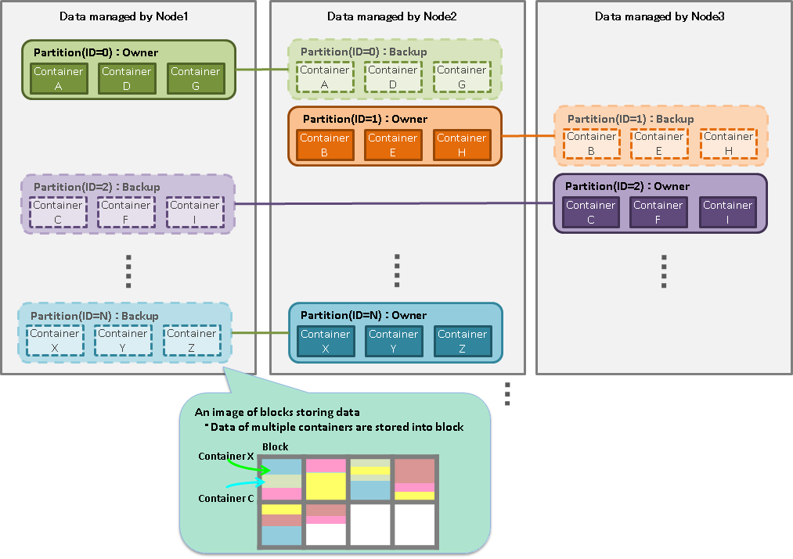
  <figcaption>Data management unit</figcaption>
</figure>

  

<a id="label_container"></a>
## Container

To register and search for data in GridDB, a container (table) needs to be created to store the data.  Data structure serving as an I/F with the user. Container to manage a set of rows. It is called a container when operating with NoSQL I/F, and a table when operating with NewSQL I/F.

The naming rules for containers (tables) are the same as those for databases.
-   A string consisting of alphanumeric characters, the underscore mark, the hyphen mark, the dot mark, the slash mark and the equal mark can be specified. The container name should not start with a number.
-   Although the name is case sensitive, a container (table) cannot be created if it has the same name as an existing container when they are case insensitive.


[Notes]
- Avoid the name already used for naming a [view](#label_view) in the same database.


### Type

There are 2 container (table) data types.
A timeseries container (timeseries table) is a data type which is suitable for managing hourly data together with the occurrence time while a collection (table) is suitable for managing a variety of data.


### Data type

The schema can be set in a container (table). The basic data types that can be registered in a container (table) are the basic data type and array data type .

#### Basic data types

Describes the basic data types that can be registered in a container (table). A basic data type cannot be expressed by a combination of other data types.

| JSON Data type | Description                                                                                              |
|-------------|--------------------------------------------------------------------------------------------------|
| BOOL           | True or false                                                                           |
| STRING         | Composed of an arbitrary number of characters using the unicode code point                                         |
| BYTE           | Integer value from -2<sup>7</sup>to 2<sup>7</sup>-1 (8bits)                                                |
| SHORT          | Integer value from -2<sup>15</sup>to 2<sup>15</sup>-1 (16bits)                                             |
| INTEGER        | Integer value from -2<sup>31</sup>to 2<sup>31</sup>-1 (32bits)                                             |
| LONG           | Integer value from -2<sup>63</sup>to 2<sup>63</sup>-1 (64bits)                                            |
| FLOAT          | Single precision (32 bits) floating point number defined in IEEE754                                                   |
| DOUBLE         | Double precision (64 bits) floating point number defined in IEEE754                                                   |
| TIMESTAMP      | Data type expressing the date and time Data format maintained in the database is UTC, and accuracy is in milliseconds         |
| GEOMETRY       | Data type to represent a space structure                                                                        |
| BLOB           | Data type for binary data such as images, audio, etc.                                                        |

The following restrictions apply to the size of the data that can be managed for STRING, GEOMETRY and BLOB data. The restriction value varies according to the block size which is the input/output unit of the database in the GridDB definition file (gs_node.json).

| Data type | Block size (64KB)                                        | Block size (from 1MB to 32MB)         |
|------------|--------------------------------|---------------------------------|
| STRING    | Maximum 31KB (equivalent to UTF-8 encode)                | Maximum 128KB (equivalent to UTF-8 encode) |
| GEOMETRY  | Maximum 31KB (equivalent to the internal storage format) | Maximum 128KB (equivalent to the internal storage format)    |
| BLOB      | Maximum 1GB - 1Byte                                      | Maximum 1GB - 1Byte                 |


**GEOMETRY-type (Spatial-type)**

GEOMETRY-type (Spatial-type) data is often used in map information system and available only for a NoSQL interface, not supported by a NewSQL interface.

GEOMETRY type data is described using WKT (Well-known text). WKT is formulated by the Open Geospatial Consortium (OGC), a nonprofit organization promoting standardization of information on geospatial information. In GridDB, the spatial information described by WKT can be stored in a column by setting the column of a container as a GEOMETRY type.

GEOMETRY type supports the following WKT forms.

-   POINT
    -   Point represented by two or three-dimensional coordinate.
    -   Example) POINT(0 10 10)
-   LINESTRING
    -   Set of straight lines in two or three-dimensional space represented by two or more points.
    -   Example) LINESTRING(0 10 10, 10 10 10, 10 10 0)
-   POLYGON
    -   Closed area in two or three-dimensional space represented by a set of straight lines. Specify the corners of a POLYGON counterclockwise. When building an island in a POLYGON, specify internal points clockwise.
    -   Example) POLYGON((0 0,10 0,10 10,0 10,0 0)), POLYGON((35 10, 45 45, 15 40, 10 20, 35 10),(20 30, 35 35, 30 20, 20 30))
-   POLYHEDRALSURFACE
    -   Area in the three-dimensional space represented by a set of the specified area.
    -   Example) POLYHEDRALSURFACE(((0 0 0, 0 1 0, 1 1 0, 1 0 0, 0 0 0)), ((0 0 0, 0 1 0, 0 1 1, 0 0 1, 0 0 0)), ((0 0 0, 1 0 0, 1 0 1, 0 0 1, 0 0 0)), ((1 1 1, 1 0 1, 0 0 1, 0 1 1, 1 1 1)), ((1 1 1, 1 0 1, 1 0 0, 1 1 0, 1 1 1)), ((1 1 1, 1 1 0, 0 1 0, 0 1 1, 1 1 1)))
-   QUADRATICSURFACE
    -   Two-dimensional curved surface in a three-dimensional space represented by defining equation f(X) = \<AX, X\> + BX + c.

The space structure written by QUADRATICSURFACE cannot be stored in a container, only can be specified as a search condition.

Operations using GEOMETRY can be executed with API or TQL.

With TQL, management of two or three-dimensional spatial structure is possible. Generating and judgement function are also provided.

``` example
 SELECT * WHERE ST_MBRIntersects(geom, ST_GeomFromText('POLYGON((0 0,10 0,10 10,0 10,0 0))'))
```

See [GridDB TQL Reference](GridDB_TQL_Reference.md) for details of the functions of TQL.


#### HYBRID

A data type composed of a combination of basic data types that can be registered in a container.  The only hybrid data type in the current version is an array.

- Array

  Expresses an array of values. Among the basic data types, only GEOMETRY and BLOB data cannot be maintained as an array. The restriction on the data volume that can be maintained in an array varies according to the block size of the database.

  | Data type | Block size (64KB)                                        | Block size (from 1MB to 32MB) |
  |--------|---------------------|----------------------|
  | Number of arrays | 4000              | 65000                |

[Note]

The following restrictions apply to TQL operations in an array column.

-   Although the i-th value in the array column can be compared, calculations (aggregation) cannot be performed on all the elements.

  - (Example) When columnA was defined as an array
    -   The elements in an array such as select \* where ELEMENT (0, column A) \> 0 can be specified and compared. However, a variable cannot be specified instead of "0" in the ELEMENT.

    -   Aggregation such as select SUM (column A) cannot be carried out.


<a id="primary_key"></a>
### Primary key

A primary key can be set in a container (table), The uniqueness of a row with a set ROWKEY is guaranteed. NULL is not allowed in the column ROWKEY is set.

In NewSQL I/F, ROWKEY is called as PRIMARY KEY.

-   For a timeseries container (timeseries table)
    -   A ROWKEY can be set in the first column of the row. (This is set in Column No. 0 since columns start from 0 in GridDB.)
    -   ROWKEY (PRIMARY KEY) is a TIMESTAMP
    -   Must be specified.
-   For a collection (table)
    -   ROWKEY (PRIMARY KEY) can be set to multiple columns that are continuous from the first column. The ROWKEY set to multiple columns is called composite ROWKEY, which can be set up to 16 columns.
        - Example) ROWKEY can be set to str1, str2, str3, which are consecutive from the first column.
          ```
          CREATE TABLE sample_table1 
          (str1 string, str2 string, str3 string, str4 string, str5 string, int1 integer,
           PRIMARY KEY(str1, str2, str3));
          ```
        - Example) ROWKEY can not be set to str1, str3, str4, which are not consecutive columns. Executing the following SQL will cause an error.
          ```
          CREATE TABLE sample_table2 
          (str1 string, str2 string, str3 string, str4 string, str5 string, int1 integer,
           PRIMARY KEY(str1, str3, str4));
          ```
    -   A ROWKEY (PRIMARY KEY) is either a STRING, INTEGER, LONG or TIMESTAMP column.
    -   Need not be specified.

A default index prescribed in advance according to the column data type can be set in a column set in ROWKEY (PRIMARY KEY).

In the current version GridDB, the default index of all STRING, INTEGER, LONG or TIMESTAMP data that can be specified in a ROWKEY (PRIMARY KEY) is the TREE index.


    

<a id="label_view"></a>
## View

View provides reference to data in a container.

Define a reference (SELECT statement) to a container when creating a view. A view is an object similar to a container, but it does not have real data. When executing a query containing a view, the SELECT statement, which was defined when the view was created, is evaluated, and a result is returned.

Views can only be referenced (SELECT), neither adding data (INSERT), updating (UPDATE), nor deletion data (DELETE) are not accepted.


[Notes]
- Avoid the name already used for naming a container in the same database.
- The naming rule of a view is the same as the [naming rule of a container](#label_container).

    

# Database function

## Resource management

Besides the database residing in the memory, other resources constituting a GridDB cluster are perpetuated to a disk.  The perpetuated resources are listed below.

-   Database file

    A database file is a collective term for data files and checkpoint log files, where databases on the memory are periodically written to, and transaction log files that are saved every time data is updated. 

<figure>
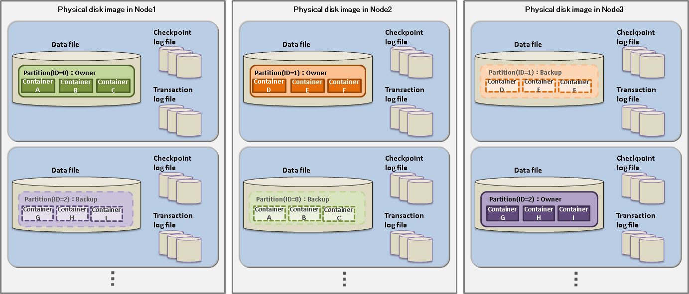
<figcaption>A group of data files</figcaption>
</figure>

-   Data file

    A checkpoint file is a file where partitions are persisted to a disk. Updated information is reflected in the memory by a cycle of the node definition file (/checkpoint/checkpointInterval). The file size expands relative to the data capacity. Once expanded, the size of a data file does not decrease even when data including container data and row data is deleted. In this case, GridDB reuses the free space instead. A data files can be split into smaller ones.

-   Checkpoint log file

    A checkpoint log file is a file where block management information for partitions are persisted to a disk. Block management information is written in smaller batches at the interval (/checkpoint/checkpointInterval) specified in the node definition file. By default, a maximum of ten files are created for each partition. The number of split files can be adjusted by the number of batches (splits) /checkpoint/partialCheckpointInterval in the node definition file. 

-   Transaction log file

    Transaction data that are written to the database in memory is perpetuated to the transaction log file by writing the data sequentially in a log format. One file stores the logs of transactions executed from the start of the last checkpoint to the start of the next checkpoint. By default, a maximum of three files are created for each partition, consisting of the current log file and the previous two generations of log files. 

-   Definition file

    Definition file includes two types of parameter files: gs_cluster.json, hereinafter referred to as a cluster definition file, used when composing a cluster; gs_node.json, hereinafter referred to as a node definition file, used to set the operations and resources of the node in a cluster. It also includes a user definition file for GridDB administrator users.

-   Event log file

    The event log of the GridDB server is saved in this file, including messages such as errors, warnings and so on.

-   Audit log file

    Audit logs of the GridDB server, which include access logs, operational logs, and messages that record error logs, are saved in this file. 

-   Backup file

    Backup data in the data file of GridDB is saved.


The placement of these resources is defined in GridDB home (path specified in environmental variable GS_HOME).  In the initial installation state, the /var/lib/gridstore directory is GridDB home, and the initial data of each resource is placed under this directory.

The directories are placed initially as follows.

``` example
/var/lib/gridstore/        # GridDB home directory path
     admin/                # gs_admin home directory
     backup/               # Backup directory
     conf/                 # Definition files directory
          gs_cluster.json  # Cluster definition file
          gs_node.json     # Node definition file
          password         # User definition file
     data/                 # data files and checkpoint log directory
     txnlog/               # Transaction log directory
     expimp/               # Export/Import directory
     log/                  # Log directory
     audit/                # Server audit log directory (only when audit logs are set)
```

The location of GridDB home can be changed by setting the .bash_profile file of the OS user gsadm. If you change the location, please also move resources in the above directory accordingly.

The .bash_profile file contains two environment variables, GS_HOME and GS_LOG.

``` example
vi .bash_profile

# GridStore specific environment variables
GS_LOG=/var/lib/gridstore/log
export GS_LOG
GS_HOME=/var/lib/gridstore                    // GridDB home directory path
export GS_HOME
```

The database directory, backup directory, server event log directory, and server audit log directory can be changed by changing the settings of the node definition file as well.

See [Parameters](#label_parameters) for the contents that can be set in the cluster definition file and node definition file.


## Data access function

To access GridDB data, there is a need to develop an application using NoSQL I/F or NewSQL I/F. Data can be accessed simply by connecting to the cluster database of GridDB without having to take into account position information on where the container or table is located in the cluster database. The application system does not need to consider which node constituting the cluster the container is placed in.

In the GridDB API, when connecting to a cluster database initially, placement hint information of the container is retained (cached) on the client end together with the node information (partition).

Communication overheads are kept to a minimum as the node maintaining the container is connected and processed directly without having to access the cluster to search for nodes that have been placed every time the container used by the application is switched.

Although the container placement changes dynamically due to the rebalancing process in GridDB, the position of the container is transmitted as the client cache is updated regularly. For example, even when there is a node mishit during access from a client due to a failure or a discrepancy between the regular update timing and re-balancing timing, relocated information is automatically acquired to continue with the process.

<a id="tql_and_sql"></a>
### TQL and SQL

TQL and SQL-92 compliant SQL are supported as database access languages.

-   What is TQL?

    A simplified SQL prepared for GridDB. The support range is limited to functions such as search, aggregation, etc., using a container as a unit. TQL is employed by using the client API (Java, C language) of GridDB.

    The TQL is adequate for the search in the case of a small container and a small number of hits. For that case, the response is faster than SQL. The number of hits can be suppressed by the LIMIT clause of TQL.

    For the search of a large amount of data, SQL is recommended.

    TQL is available for the containers and partitioned tables created by operations through the NewSQL interface. The followings are the limitations of TQL for the partitioned tables.

    -   Filtering data by the WHERE clause is available. But aggregate functions, timeseries data selection or interpolation, min or max function and ORDER BY clause, etc. are not available.

    -   It is not possible to apply the update lock.

    See [GridDB TQL Reference](GridDB_TQL_Reference.md) for details.

-   What is SQL?

    Standardization of the language specifications is carried out in ISO to support the interface for defining and performing data operations in conformance with SQL-92 in GridDB. SQL can be used in NewSQL I/F.

    SQL is also available for the containers created by operations through the NoSQL interface.

    See [GridDB SQL reference](GridDB_SQL_Reference.md) for details.

<a id="batch_functions"></a>
### Batch-processing function to multiple containers

An interface to quickly process event information that occurs occasionally is available in NoSQL I/F.

When a large volume of events is sent to the database server every time an event occurs, the load on the network increases and system throughput does not increase. Significant impact will appear especially when the communication line bandwidth is narrow. Multi-processing is available in NoSQL I/F to process multiple row registrations for multiple containers and multiple inquiries (TQL) to multiple containers with a single request. The overall throughput of the system rises as the database server is not accessed frequently.

An example is given below.

- Multi-put

  - A container is prepared for each sensor name as a process to register event information from multiple sensors in the database. The sensor name and row array of the timeseries event of the sensor are created and a list (map) summarizing the data for multiple sensors is created. This list data is registered in the GridDB database each time the API is invoked.

  - Multi-put API optimizes the communication process by combining requests of data registration into multiple containers to a node in GridDB, which is formed by multiple clusters. In addition, multi-registrations are processed quickly without performing MVCC when executing a transaction.

  - In a multi-put processing, transactions are committed automatically. Data is confirmed on a single case basis.

<figure>

<figcaption>Multi-put</figcaption>
</figure>


- Multi-query (fetchAll)

  - Instead of executing multiple queries to a container, these can be executed in a single query by aggregating event information of the sensor. For example, this is most suitable for acquiring aggregate results such as the daily maximum, minimum and average values of data acquired from a sensor, or data of a row set having the maximum or minimum value, or data of a row set meeting the specified condition.

<figure>

<figcaption>fetchAll</figcaption>
</figure>

- Multi-get

  - Instead of executing multiple queries to a sensor, these can be executed in a single query by consolidating event information of the sensor.  For example, this is most suitable for acquiring aggregate results such as the daily maximum, minimum and average values of data acquired from a sensor, or data of a row set having the maximum or minimum value, or data of a row set meeting the specified condition.

  - In a RowKeyPredicate object, the acquisition condition is set in either one of the 2 formats below.
    - Specify the acquisition range
    - Specified individual value

<figure>

<figcaption>multi-get</figcaption>
</figure>

<a id="index_function"></a>
## Index function

A condition-based search can be processed quickly by creating an index for the columns of a container (table).

Two types of indexes are available: tree indexes (TREE) and spatial indexes (SPATIAL).
The index that can be set differs depending on the container (table) type and column data type.

-   TREE INDEX
    -   A tree index is used for an equality search and a range search (including greater than/equal to, and less than/equal to).
    -   This can be set for columns of the following data type in any type of container (table), except for columns corresponding to a rowkey in a timeseries container (timeseries table).
        -   STRING
        -   BOOL
        -   BYTE
        -   SHORT
        -   INTEGER
        -   LONG
        -   FLOAT
        -   DOUBLE
        -   TIMESTAMP
    -   Only a tree index allows an index with multiple columns, which is called a composite index. A composite index can be set up to 16 columns, where the same column cannot be specified more than once.
-   SPATIAL INDEX
    -   Can be set for only GEOMETRY columns in a collection. This is specified when conducting a spatial search at a high speed.

Although there are no restrictions on the no. of indices that can be created in a container, creation of an index needs to be carefully designed. An index is updated when the rows of a configured container are inserted, updated or deleted. Therefore, when multiple indices are created in a column of a row that is updated frequently, this will affect the performance in insertion, update or deletion operations.

An index is created in a column as shown below.
-   A column that is frequently searched and sorted
-   A column that is frequently used in the condition of the WHERE section of TQL
-   High cardinality column (containing few duplicated values)

[Note]
- Only a tree index can be set to the column of a table (time series table).

<a id="ts_data_functions"></a>
## Function specific to time series data

To manage data frequently produced from sensors, data is placed in accordance with the data placement algorithm (TDPA: Time Series Data Placement Algorithm), which allows the best use of the memory. In a timeseries container (timeseries table), memory is allocated while classifying internal data by its periodicity. When hint information is given in an affinity function, the placement efficiency rises further. Moreover, a timeseries container moves data out to a disk if necessary and releases expired data at almost zero cost.

A timeseries container (timeseries table) has a TIMESTAMP ROWKEY (PRIMARY KEY).

### Operation function of TQL

#### Aggregate operations

In a timeseries container (timeseries table), the calculation is performed with the data weighted at the time interval of the sampled data. In other words, if the time interval is long, the calculation is carried out assuming the value is continued for an extended time.

The functions of the aggregate operation are as follows:

- TIME_AVG

  - TIME_AVG Returns the average weighted by a time-type key of values in the specified column.
  - The weighted average is calculated by dividing the sum of products of sample values and their respective weighted values by the sum of weighted values. The method for calculating a weighted value is as shown above.
  - The details of the calculation method are shown in the figure:

<figure>
  
  <figcaption>Aggregation of weighted values (TIME_AVG)</figcaption>
</figure>

#### Selection/interpolation operation

Time data may deviate slightly from the expected time due to the timing of the collection and the contents of the data to be collected. Therefore when conducting a search using time data as a key, a function that allows data around the specified time to be acquired is also required.

The functions for searching the timeseries container (timeseries table) and acquiring the specified row are as follows:

-   TIME_NEXT(\*, timestamp)

    Selects a time-series row whose timestamp is identical with or just after the specified timestamp.

-   TIME_NEXT_ONLY(\*, timestamp)

    Select a time-series row whose timestamp is just after the specified timestamp.
-   TIME_PREV(\*, timestamp)

    Selects a time-series row whose timestamp is identical with or just before the specified timestamp.
-   TIME_PREV_ONLY(\*, timestamp)

    Selects a time-series row whose timestamp is just before the specified timestamp.

In addition, the functions for interpolating the values of the columns are as follows:

-   TIME_INTERPOLATED(column, timestamp)

    Returns a specified column value of the time-series row whose timestamp is identical with the specified timestamp, or a value obtained by linearly interpolating specified column values of adjacent rows whose timestamps are just before and after the specified timestamp, respectively.

-   TIME_SAMPLING(\*|column, timestamp_start, timestamp_end, interval, DAY|HOUR|MINUTE|SECOND|MILLISECOND)

    Takes a sampling of Rows in a specific range from a given start time to a given end time.

    Each sampling time point is defined by adding a sampling interval multiplied by a non-negative integer to the start time, excluding the time points later than the end time.

    If there is a Row whose timestamp is identical with each sampling time point, the values of the Row are used. Otherwise, interpolated values are used.

### Expiry release function

An expiry release is a function to delete expired row data from GridDB physically. The data becomes unavailable by removing from a target for a search or a delete before deleting.  Deleting old unused data results to keep database size results in prevention of performance degradation caused by bloat of database size.

<figure>

<figcaption>Expiry release settings</figcaption>
</figure>

The retention period is set in container units. The row which is outside the retention period is called "expired data." The APIs become unable to operate expired data because it becomes unavailable. Therefore, applications can not access the row. Expired data will be the target for being deleted physically from GridDB after a certain period. Cold data is automatically removed from database intact.

#### Expiry release settings

Expiry release can be used in a partitioned container (table).

- It can be set for the following tables partitioned by interval and interval-hash.
  - Timeseries table
  - Collection table with a TIMESTAMP-type partitioning key
- Setting items consist of a retention period and a retention period unit.
    -   The retention period unit can be set in day/hour/minute/sec/millisecond units. The year unit and month unit cannot be specified.
    -   The expiration date of rows is calculated by adding the last date and time of the row stored period in the partition to the retention period. The rows stored in the same data partition have the same expiration date.
    -   The unit becoming cold data is a data partition. Physical data delete is executed on a data partition basis.

<figure>
  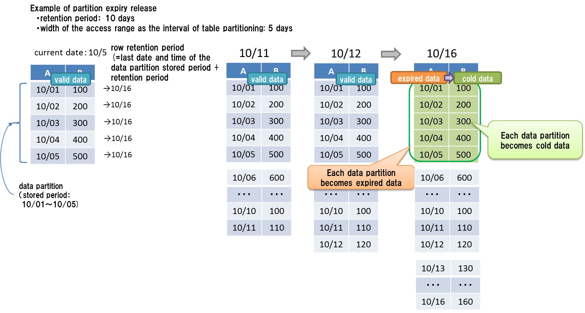
  <figcaption>Partition expiry release</figcaption>
</figure>

[Note]

- Expiry release should be set when creating a table. They cannot be changed after creation.
- The current time used for judging expiration depends on the environment of each node of GridDB. Therefore, because of the network latency or time difference of the execution environments, you may not be able to access the rows in a GridDB node whose environment time is ahead of that of the client you use; on the contrary, you may be able to access the rows if the client you use is ahead of the time of GridDB. You had better set the period a larger value than you need to avoid unintentional loss of rows.
- The expired rows are separated from the object of search and updating, being treated as not to exist in the GridDB. Operations to the expired row do not cause errors.
  - For example, for settings with an expiration of 30 days, even when a row with a timestamp of 31 days before the present date is registered, registration processing does not lead to an error, while the row is not saved in the table.
- When you set up expiry release, be sure to synchronize the environment time of all the nodes of a cluster. If the time is different among the nodes, the expired data may not be released at the same time among the nodes.
- The period that expired data becomes cold data depends on the setting of the retention period in the expiry release.

  | Retention period  | Max period that expired data becomes cold data |
  |--------------|------------------------------------------------|
  | \-3 days          | about 1.2 hours                                         |
  | 3 days-12 days    | about 5 hours                                          |
  | 12 days-48 days   | about 19 hours                                         |
  | 48 days-192 days  | about 3 days                                          |
  | 192 days-768 days | about 13 days                                         |
  | 768 days-         | about 50 days                                         |

#### Automatic deletion of cold data or save as an archive

The management information for database files are periodically scanned every one second, and a row that has become cold data at the time of scanning is physically deleted. The amount of scanning the management information for database files is 2000 blocks per execution. It can be set /dataStore/batchScanNum in the node definition file (gs_node.json). There is a possibility that the size of DB keeps increasing because the speed of automatic deletion is behind one of registration in the system which data are registered frequently. Increase the amount of scanning to avoid it.


<a id="table_partitioning"></a>
## Table partitioning function

In order to improve the operation speed of applications connected to multiple nodes of the GridDB cluster, it is important to arrange the data to be processed in memory as much as possible. For a huge container (table) with a large number of registered data, the CPU and memory resources in multiple nodes can be effectively used by splitting data from the table and distributing the data across nodes. Distributed rows are stored in the internal containers called "data partition". The allocation of each row to the data partition is determined by a "partitioning key" column specified at the time of the table creation.

GridDB supports hash partitioning, interval partitioning and interval-hash partitioning as table partitioning methods.

Creating and Deleting tables can be performed only through the NewSQL interface. Data registration, update and search can be performed through the NewSQL/NoSQL interface. (There are some restrictions. See [TQL and SQL](#tql_and_sql) for the details.)

-   Data registration

    When data is registered into a table, the data is stored in the appropriate data partition according to the partitioning key value and the partitioning method. It is not possible to specify a data partition to be stored.

-   Index

    When creating an index on a table, a local index for each data partition is created. It is not possible to create a global index for the whole table.

-   Data operation

    An error occurs for updating the partitioning key value of the primary key column. If updating is needed, delete and reregister the data.

    Updating the partitioning key value of the not primary key column can be executed through NoSQL I/F.

-   Expiry release function

    Expiry release can be set for the following tables partitioned by interval and interval-hash. 
     - Timeseries table
     - Collection table with a TIMESTAMP-type partitioning key

-   Notes

    Starting with V4.3, specifying a column other than the primary key as a partitioning key when the primary key does exist generates an error by default. To avoid this error, set false to /sql/partitioningRowkeyConstraint in the cluster definition file (gs_cluster.json).

    When specifying the column as a partitioning key other than the primary key, the primary key constraint is ensured in each data partition, but it is not ensured in the whole table. So, the same value may be registered in multiple rows of a table.

<figure>
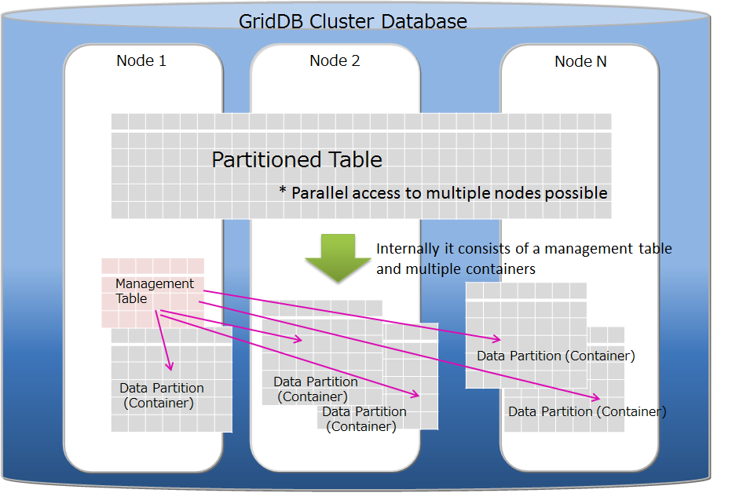
<figcaption>Table partitioning</figcaption>
</figure>

### Benefits of table partitioning

Dividing a large amount of data through a table partitioning is effective for efficient use of memory and for performance improvement in data search which can select the target data.

-   efficient use of memory

    In data registration and search, data partitions required for the processing are loaded into memory. Other data partitions, not target to the processing, are not loaded. So when the data to be processed is locally concentrated on some data partitions, the amount of loading data is reduced. The frequency of swap-in and swap-out is decreased and the performance is upgraded.

-   selecting target data in data search

    In data search, only data partitions matching the search condition are selected as the target data. Unnecessary data partitions are not accessed. This function is called "pruning".  Because the amount of accessed data reduces, the search performance is upgraded. Search conditions which can enable the pruning are different depending on the type of the partitioning.

The followings describe the behaviors on the above items for both cases in not using the table partitioning and in using the table partition.

When a large amount of data is stored in single table which is not partitioned, all the required data might not be able to be placed on main memory and the performance might be degraded by frequent swap-in and swap-out between database files and memory. Particularly the degradation is significant when the amount of data is much larger than the memory size of a GridDB node. And data accesses to that table concentrate on single node and the parallelism of database processing decreases.

<figure>
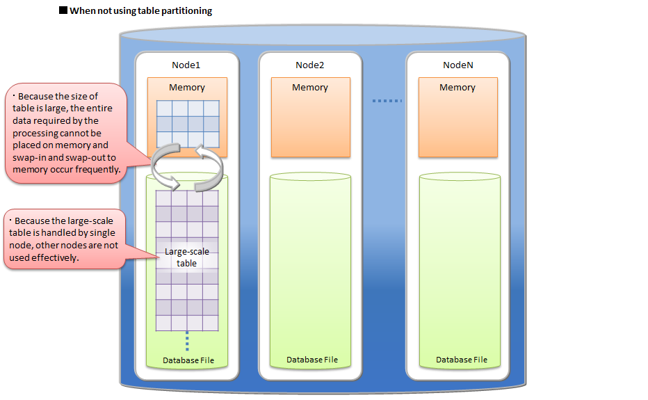
<figcaption>When not using table partitioning</figcaption>
</figure>

By using a table partitioning, the large amount of data is divided into data partitions and those partitions are distributed on multiple nodes.

In data registration and search, only necessary data partitions for the processing can be loaded into memory. Data partitions not target to the processing are not loaded. Therefore, in many cases, data size required by the processing is smaller than for a not partitioned large table and the frequency of swap-in and swap-out decreases. By dividing data into data partitions equally, CPU and memory resource on each node can be used more effectively.

In addition data partitions are distributed on nodes, so parallel data access becomes possible.

<figure>
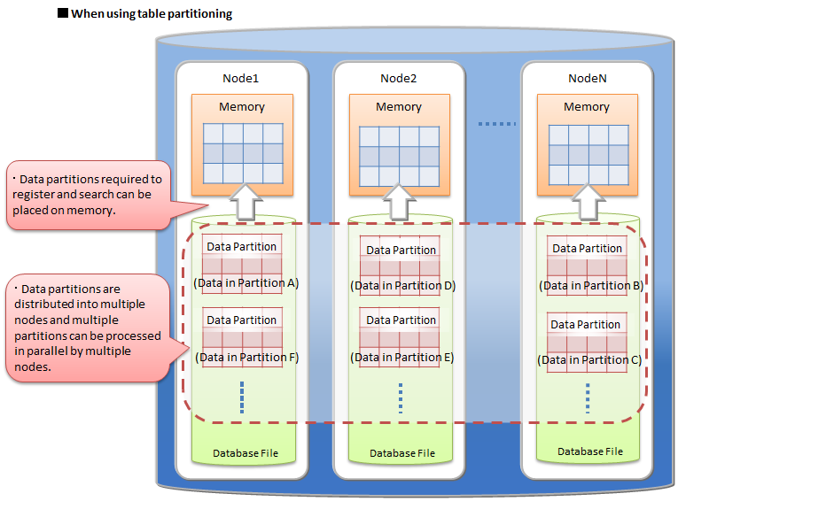
<figcaption>When using table partitioning</figcaption>
</figure>

### Hash partitioning

The rows are evenly distributed in the data partitions based on the hash value.

Also, when using an application system that performs data registration frequently, the access will concentrate at the end of the table and may lead to a bottleneck. A hash function that returns an integer from 1 to N is defined by specifying the partition key column and division number N, and division is performed based on the returned value.

<figure>
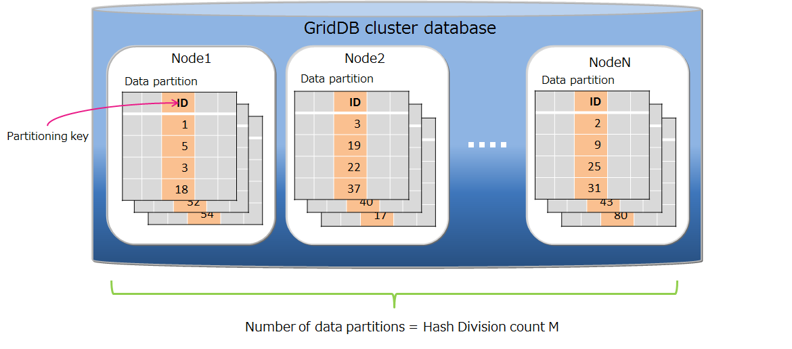
<figcaption>Hash partitioning</figcaption>
</figure>

-   Data partitioning

    By specifying the partitioning key and the division count M, a hash function that returns 1-M is defined, and data partitioning is performed by the hash value. The maximum hash value is 1024.

-   Partitioning key

    There is no limitation for the column type of a partitioning key.

-   Creation of data partitions

    Specified number of data partitions are created automatically at the time of the table creation. It is not possible to change the number of data partitions. The table re-creation is needed for changing the number.

-   Deletion of a table

    It is not possible to delete only a data partition.

    By deleting a hash partitioned table, all data partitions that belong to it are also deleted

-   Pruning

    In key match search on hash partitioning, by pruning, the search accesses only data partitions which match the condition. So the hash partitioning is effective for performance improvement and memory usage reduction in that case.

### Interval partitioning

In the interval partitioning, the rows in a table are divided by the specified interval value and is stored in data partitions. The range of each data partition (from the lower limit value to the upper limit value) is automatically determined by the interval value.

The data in the same range are stored in the same data partition, so for the continuous data or for the range search, the operations can be performed on fewer memory.

<figure>
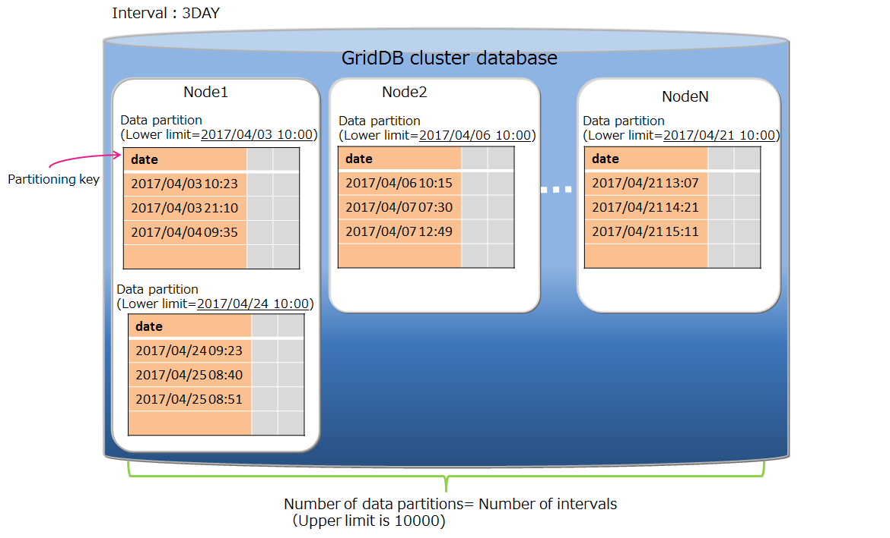
<figcaption>Interval partitioning</figcaption>
</figure>

-   Data partitioning

    Data partitioning is performed by the interval value.  The possible interval values are different depending on the partitioning key type.
    -   BYTE type : from 1 to 2<sup>7</sup>-1
    -   SHORT type : from 1 to 2<sup>15</sup>-1
    -   INTEGER type : from 1 to 2<sup>31</sup>-1
    -   LONG type : from 1000 to 2<sup>63</sup>-1
    -   TIMESTAMP: more than 1

    When the partitioning key type is TIMESTAMP, it is necessary to specify the interval unit as 'DAY'.

-   Partitioning key

    Data types that can be specified as a partitioning key are BYTE, SHORT, INTEGER, LONG and TIMESTAMP.  The partitioning key is a column that needs to have "NOT NULL" constraint.

-   Creation of data partitions

    Data partitions are not created at the time of creating the table. When there is no data partition for the registered row, a new data partition is automatically created.

    The upper limit of the number of the data partitions is 10000. When the number of the data partitions reaches the limit, the data registration that needs to create a new data partition causes an error. For that case, delete unnecessary data partitions and reregister the data.

    It is desired to specify the interval value by considering the range of the whole data and the upper limit, 10000, for the number of data partitions. If the interval value is too small to the range of the whole data and too many data partitions are created, the maintenance of deleting unnecessary data partitions is required frequently.

-   Deletion of a table

    Each data partition can be deleted. The data partition that has been deleted cannot be recreated.
    All registration operations to the deleted data partition cause an error.
    Before deleting the data partition, check its data range by a metatable.
    See the [GridDB SQL reference](GridDB_SQL_Reference.md) for the details of the metatable schema.

    By deleting an interval partitioned table, all data partitions that belong to it are also deleted.

    All data partitions are processed for the data search on the whole table, so the search can be performed efficiently by deleting unnecessary data partitions beforehand.

-   Maintenance of data partitions

    In the case of reaching the upper limit, 10000, for the number of data partitions or existing unnecessary data partitions, the maintenance by deleting data partitions is needed.

    -   How to check the number of data partitions

        It can be check by search the metatable that holds the data about data partitions. See [GridDB SQL reference](GridDB_SQL_Reference.md) for details.
        

    -   How to delete data partitions

        They can be deleted by specifying the lower limit value in the data partition. See [GridDB SQL reference](GridDB_SQL_Reference.md) for the details.

<figure>
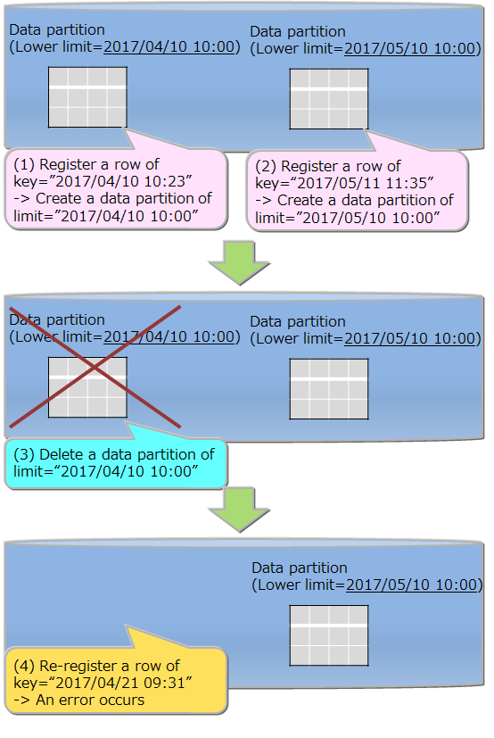
<figcaption>Examples of interval partitioned table creation and deletion</figcaption>
</figure>

-   Pruning

    By specifying a partitioning key as a search condition in the WHERE clause, the data partitions corresponding the specified key are only referred for the search, so that the processing speed and the memory usage are improved.

#### User-specified data partition placement

In the case where the target tables are interval partitioned tables with TIMESTAMP-type partitioning keys, the user can create the tables, specifying where to place interval partitions.

In a normal CREATE TABLE SQL statement, where to place data partitions is determined by unique rules, but there may be conflicts regarding where to place data partitions with the same date when multiple interval partitioned tables are involved, as illustrated in the following figure. In this case, conflicts in locations where data partitions with the same date are placed lead to further conflicts among processing threads, which may reduce concurrency during data processing.

<figure>
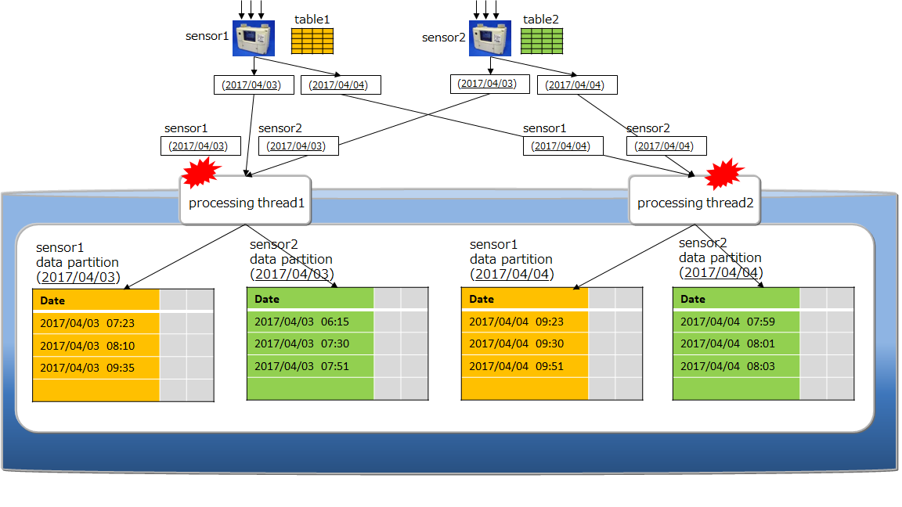
<figcaption>Example of conflicts in locations of data partitions with the same date</figcaption>
</figure>

If an interval group number is specified when creating tables, it would be possible to place data partitions according to regularity so that tables will be allocated in such a way that they do not cause conflicts among processing threads on the same day, as illustrated below.

<figure>
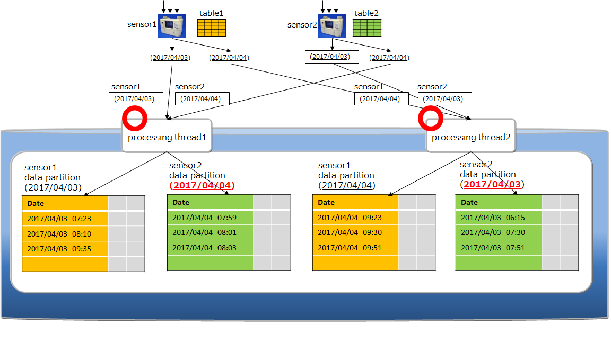
<figcaption>Example of user-specified data partition placement during table creation</figcaption>
</figure>

***Notes***
There are several conditions to be met to effectively use this user-specified data partition placement feature. These conditions need to be reviewed before starting operation as listed below:

 1. All the nodes that form the cluster need to have the same degree of parallelism beforehand. Moreover, operation should be performed in such a way that the degree of parallelism at the outset is maintained throughout, because once it is changed after creating tables, the full benefits will not be gained.

 2. Design tables so as to keep the number of tables where conflicts should be avoided equal to or smaller than the degree of parallelism as a general rule. Specifying the number greater than this degree may degrade performance.

 3. To continuously maintain stable performance, cluster node configuration at the time when the table was created and cluster partition placement, including the owner of each node and backups, need to be continuously maintained by operation.

### Interval-hash partitioning

The interval-hash partitioning is a combination of the interval partitioning and the hash partitioning. First the rows are divided by the interval partitioning, and further each division is divided by hash partitioning.  The number of data partitions is obtained by multiplying the interval division count and the hash division count together.

<figure>
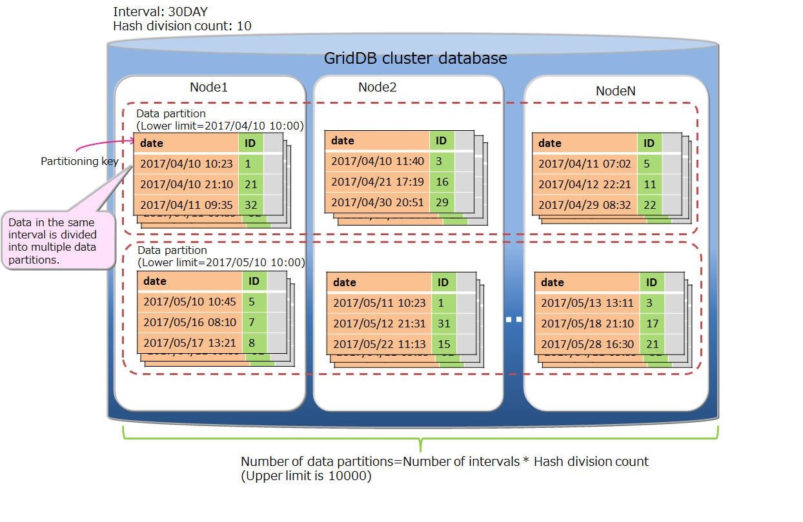
<figcaption>Interval-hash partitioning</figcaption>
</figure>

The rows are distributed to multiple nodes appropriately through the hash partitioning on the result of the interval partitioning. On the other hand, the number of data partitions increases, so that the overhead of searching on the whole table also increases. Please judge to use the partitioning by considering its data distribution and search overhead.

The basic functions of the interval-hash partitioning are the same as the functions of interval partitioning and the hash partitioning. The items specific for the interval-hash partitioning are as follows.

-   Data partitioning

    The possible interval values of LONG are different from the interval partitioning.
    -   BYTE type : from 1 to 2<sup>7</sup>-1
    -   SHORT type : from 1 to 2<sup>15</sup>-1
    -   INTEGER type : from 1 to 2<sup>31</sup>-1
    -   LONG type : from 1000 \* hash division count to 2<sup>63</sup>-1
    -   TIMESTAMP: more than 1

-   Number of data partitions

    Including partitions divided by hash, the upper limit of number of data partitions is 10000. The behavior and requiring maintenance when the limit has been reached are same as interval partitioning.

-   Deletion of a table

    A group of data partitions which have the same range can be deleted. It is not possible to delete only a data partition divided by the hash partitioning.

### Selection criteria of table partitioning type

Hash, interval and interval-hash are supported as a type of table partitioning by GridDB.

A column which is used in conditions of search or data access must be specified as a partitioning key for dividing the table. If a width of range that divides data equally can be determined for values of the partitioning key, interval or interval-hash is suitable. Otherwise hash should be selected.

<figure>
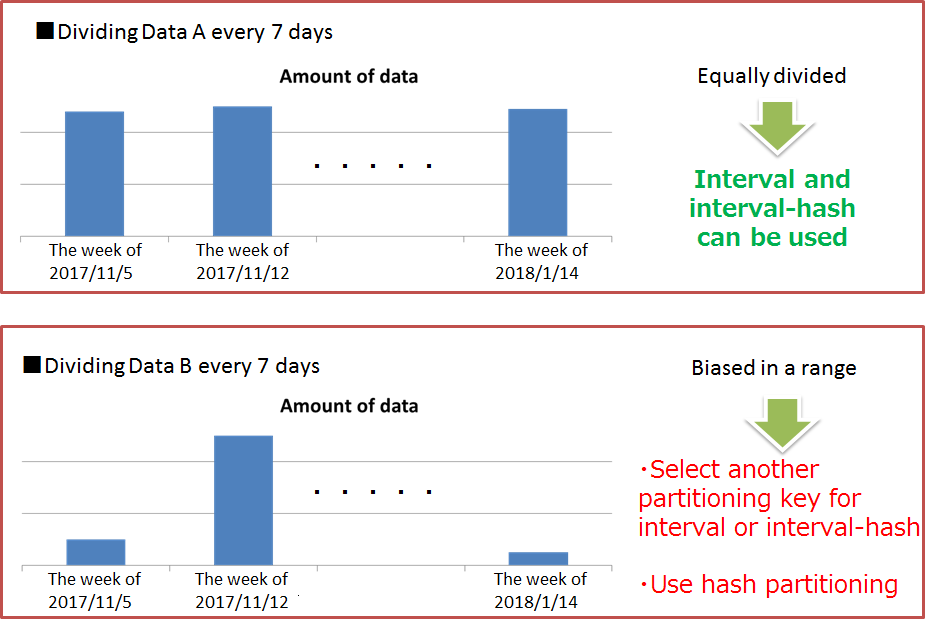
<figcaption>Data range</figcaption>
</figure>

- Interval partitioning, interval-hash partitioning

  If an interval, a width of range to divide data equally, can be determined beforehand, interval partitioning is suitable.  In the query processing on interval partitioning, by partitioning pruning, the result is acquired from only the data partitions matching the search condition, so the performance is improved. Besides the query processing, when registering successive data in a specific range, performance is improved.

  <figure>
  
  <figcaption>Interval partitioning</figcaption>
  </figure>

  Therefore, when using interval partitioning, by selecting an appropriate interval value based on frequently registered or searched data range in application programs, required memory size is reduced. For example, in the case of a system in which time-series data such as sensor data is frequently searched for the latest data, if the search target range is the division width value of interval partitioning, the search is performed in the memory of the data partition size to be processed and the performance dose not deteriorates.

  <figure>
  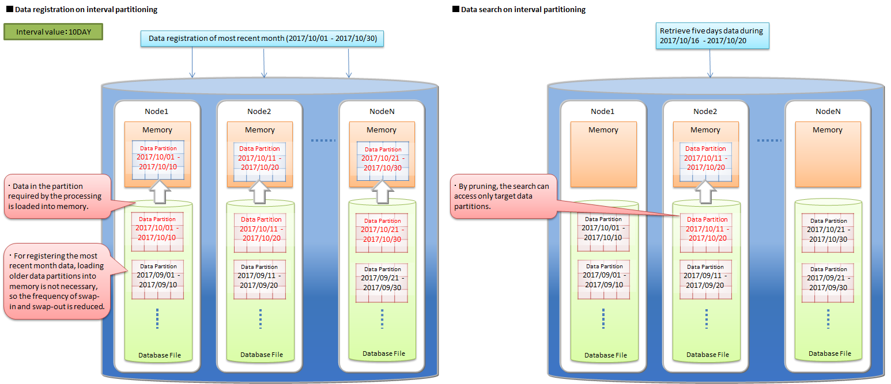
  <figcaption>Examples of data registration and search on interval partitioning</figcaption>
  </figure>

  Further by using interval-hash partitioning, data in each interval is distributed to multiple nodes equally, so accesses to the same data partition can also be performed in parallel.

  <figure>
  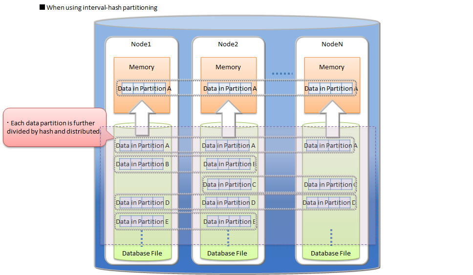
  <figcaption>Interval-hash partitioning</figcaption>
  </figure>

- Hash partitioning

  When the characteristics of data to be stored is not clear or finding the interval value, which can divide the data equally, is difficult, hash partitioning should be selected. By specifying a column holding unique values as a partitioning key, uniform partitioning for a large amount of data is performed automatically.

  <figure>
  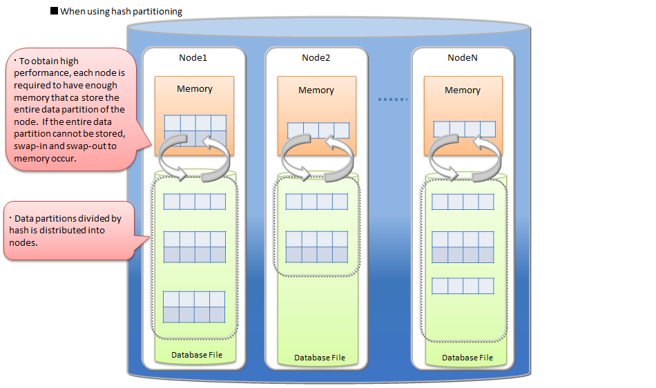
  <figcaption>Hash partitioning</figcaption>
  </figure>

  When using hash partitioning, the parallel access to the entire table and the partitioning pruning which is enabled only for exact match search can be performed, so the system performance can be improved. But, to obtain high performance, each node is required to have enough memory that can store the entire data partition of the node.

  <figure>
  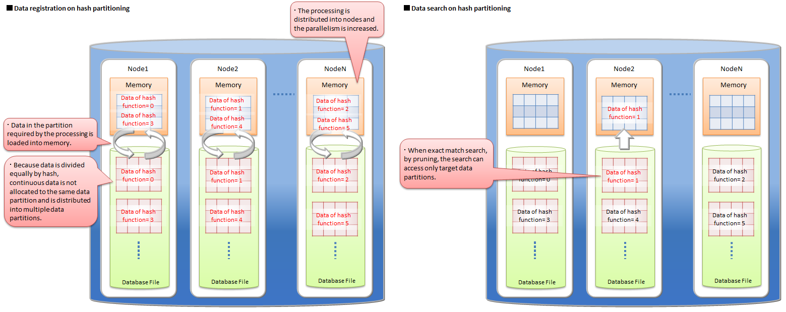
  <figcaption>Examples of data registration and search on hash partitioning</figcaption>
  </figure>

## Transaction function

GridDB supports transaction processing on a container basis and ACID characteristics which are generally known as transaction characteristics. The supporting functions in a transaction process are explained in detail below.

### Starting and ending a transaction

When a row search or update etc. is carried out on a container, a new transaction is started and this transaction ends when the update results of the data are committed or aborted.

[Note]
-   A commit is a process to confirm transaction information under processing to perpetuate the data.
    -   In GridDB, updated data of a transaction is stored as a transaction log by a commit process, and the lock that had been maintained will be released.
-   An abort is a process to rollback (delete) all transaction data under processing.
    -   In GridDB, all data under processing are discarded and retained locks will also be released.

The initial action of a transaction is set in autocommit.

In autocommit, a new transaction is started every time a container is updated (data addition, deletion or revision) by the application, and this is automatically committed at the end of the operation.  A transaction can be committed or aborted at the requested timing by the application by turning off autocommit.

A transaction recycle may terminate in an error due to a timeout in addition to being completed through a commit or abort. If a transaction terminates in an error due to a timeout, the transaction is aborted. The transaction timeout is the elapsed time from the start of the transaction.  Although the initial value of the transaction timeout time is set in the definition file (gs_node.json), it can also be specified as a parameter when connecting to GridDB on an application basis.

### Transaction consistency level

There are 2 types of transaction consistency levels, immediate consistency and eventual consistency. This can also be specified as a parameter when connecting to GridDB for each application.  The default setting is immediate consistency.

- immediate consistency

  - Container update results from other clients are reflected immediately at the end of the transaction concerned. As a result, the latest details can be referenced all the time.

- eventual consistency

  - Container update results from other clients may not be reflected immediately at the end of the transaction concerned.  As a result, there is a possibility that old details may be referred to.

Immediate consistency is valid in update operations and read operations.  Eventual consistency is valid in read operations only.  For applications which do not require the latest results to be read all the time, the reading performance improves when eventual consistency is specified.

### Transaction isolation level

Conformity of the database contents need to be maintained all the time.  When executing multiple transaction simultaneously, the following events will generally surface as issues.

-   Dirty read

    An event which involves uncommitted data written by a dirty read transaction being read by another transaction.

-   Non-repeatable read

    An event which involves data read previously by a non-repeatable read transaction becoming unreadable. Even if you try to read the data read previously by a transaction again, the previous data can no longer be read as the data has already been updated and committed by another transaction (the new data after the update will be read instead).

-   Phantom read

    An event in which the inquiry results obtained previously by a phantom read transaction can no longer be acquired. Even if you try to execute an inquiry executed previously in a transaction again in the same condition, the previous results can no longer be acquired as the data satisfying the inquiry condition has already been changed, added and committed by another transaction (new data after the update will be acquired instead).

In GridDB, "READ_COMMITTED" is supported as a transaction isolation level.  In READ_COMMITTED, the latest data confirmed data will always be read.

When executing a transaction, this needs to be taken into consideration so that the results are not affected by other transactions. The isolation level is an indicator from 1 to 4 that shows how isolated the executed transaction is from other transactions (the extent that consistency can be maintained).

The 4 isolation levels and the corresponding possibility of an event raised as an issue occurring during simultaneous execution are as follows.

| Isolation level   | Dirty read                | Non-repeatable read       | Phantom read |
|----------------------------|------------------|------------------|------------------|
| READ_UNCOMMITTED | Possibility of occurrence | Possibility of occurrence | Possibility of occurrence |
| READ_COMMITTED   | Safe                      | Possibility of occurrence | Possibility of occurrence |
| REPEATABLE_READ  | Safe                      | Safe                      | Possibility of occurrence |
| SERIALIZABLE      | Safe                      | Safe                      | Safe             |

In READ_COMMITED, if data read previously is read again, data that is different from the previous data may be acquired, and if an inquiry is executed again, different results may be acquired even if you execute the inquiry with the same search condition. This is because the data has already been updated and committed by another transaction after the previous read.

In GridDB, data that is being updated by MVCC is isolated.

### MVCC

In order to realize READ_COMMITTED, GridDB has adopted "MVCC (Multi-Version Concurrency Control)".

MVCC is a processing method that refers to the data prior to being updated instead of the latest data that is being updated by another transaction when a transaction sends an inquiry to the database. System throughput improves as the transaction can be executed concurrently by referring to the data prior to the update.

When the transaction process under execution is committed, other transactions can also refer to the latest data.

<figure>

<figcaption>MVCC</figcaption>
</figure>

### Lock

There is a data lock mechanism to maintain the consistency when there are competing container update requests from multiple transactions.

The lock granularity differs depending on the type of container. In addition, the lock range changes depending on the type of operation in the database.

#### Lock granularity

The lock granularity for each container type is as follows.

-   Collection: Lock by ROW unit.
-   Timeseries container: Locked by ROW collection
    -   In a ROW collection, multiple rows are placed in a timeseries container by dividing a block into several data processing units.  This data processing unit is known as a row set. It is a data management unit to process a large volume of timeseries containers at a high speed even though the data granularity is coarser than the lock granularity in a collection.

These lock granularity were determined based on the use-case analysis of each container type.

-   Collection data may include cases in which an existing ROW data is updated as it manages data just like a RDB table.
-   A timeseries container is a data structure to hold data that is being generated with each passing moment and rarely includes cases in which the data is updated at a specific time.

#### Lock range by database operations

Container operations are not limited to just data registration and deletion but also include schema changes accompanying a change in data structure, index creation to improve speed of access, and other operations. The lock range depends on either operations on the entire container or operations on specific rows in a container.

-   Lock the entire container
    -   Index operations (createIndex/dropIndex)
    -   Deleting container
    -   Schema change
-   Lock in accordance with the lock granularity
    -   put/update/remove
    -   get(forUpdate)

    In a data operation on a row, a lock following the lock granularity is ensured.

If there is competition in securing the lock, the subsequent transaction will be put in standby for securing the lock until the earlier transaction has been completed by a commit or rollback process and the lock is released.

A standby for securing a lock can also be cancelled by a timeout besides completing the execution of the transaction.

### Data perpetuation

Data registered or updated in a container or table is perpetuated in the disk or SSD, and protected from data loss when a node failure occurs. In data persistence, there are two processes: one is a checkpoint process for periodically saving the updated data on the memory in data files and checkpoint log files for each block, and the other is a transaction log process for sequentially writing the updated data to transaction log files in sync with data updates.

To write to a transaction log, either one of the following settings can be made in the node definition file.

-   0: SYNC
-   An integer value of 1 or higher: DELAYED_SYNC

In the "SYNC" mode, log writing is carried out synchronously every time an update transaction is committed or aborted. In the "DELAYED_SYNC" mode, log writing during an update is carried out at a specified delay of several seconds regardless of the update timing. Default value is "1 (DELAYED_SYNC 1 sec)".

When "SYNC" is specified, although the possibility of losing the latest update details when a node failure occurs is lower, the performance is affected in systems that are updated frequently.

On the other hand, if "DELAYED_SYNC" is specified, although the update performance improves, any update details that have not been written in the disk when a node failure occurs will be lost.

If there are 2 or more replicas in a raster configuration, the possibility of losing the latest update details when a node failure occurs is lower even if the mode is set to "DELAYED_SYNC" as the other nodes contain replicas. Consider setting the mode to "DELAYED_SYNC" as well if the update frequency is high and performance is required.

In a checkpoint, the update block is updated in the database file.  A checkpoint process operates at the cycle set on a node basis. A checkpoint cycle is set by the parameters in the node definition file. Initial value is 60 sec (1 minute).

By raising the checkpoint execution cycle figure, data perpetuation can be set to be carried out in a time band when there is relatively more time to do so e.g. by perpetuating data to a disk at night and so on. On the other hand, when the cycle is lengthened, the disadvantage is that the number of transaction log files that have to be rolled forward when a node is restarted outside the system process increases, thereby increasing the recovery time.

<figure>
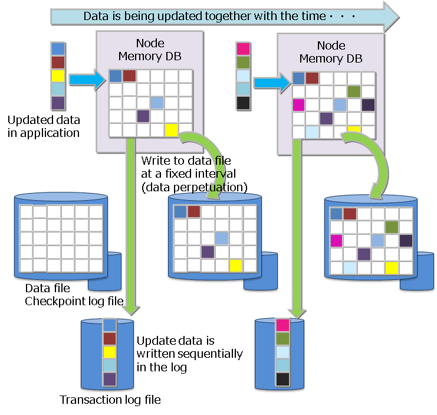
<figcaption>Checkpoint</figcaption>
</figure>

### Timeout process

NoSQL I/F and a NewSQL I/F have different setting items for timeout processing.

#### NoSQL I/F timeout process

In the NoSQL I/F, 2 types of timeout could be notified to the application developer, Transaction timeout and Failover timeout. The former is related to the processing time limit of a transaction, and the latter is related to the retry time of a recovery process when a failure occurs.

-   TransactionTimeout

    The timer is started when access to the container subject to the process begins, and a timeout occurs when the specified time is exceeded.

    Transaction timeout is configured to delete lock, and memory from a long-duration update lock (application searches for data in the update mode, and does not delete when the lock is maintained) or a transaction that maintains a large amount of results (application does not delete the data when the lock is maintained). Application process is aborted when transaction timeout is triggered.

    A transaction timeout time can be specified in the application with a parameter during cluster connection. The upper limit of this can be specified in the node definition file.  The default value of upper limit is 300 seconds. To monitor transactions that take a long time to process, enable the timeout setting and set a maximum time in accordance with the system requirements.

-   FailoverTimeout

    Timeout time during an error retry when a client connected to a node constituting a cluster which failed connects to a replacement node. If a new connection point is discovered in the retry process, the client application will not be notified of the error. Failover timeout is also used in timeout during initial connection.

    A failover timeout time can be specified in the application by a parameter during cluster connection. Set the timeout time to meet the system requirements.

Both the transaction timeout and failover timeout can be set when connecting to a cluster using a GridDB object in the Java API or C API.
See "GridDB Java API reference" ([GridDB_Java_API_Reference.html)](GridDB_Java_API_Reference.html)and "GridDB C API reference" ([GridDB_C_API_Reference.html](GridDB_C_API_Reference.html)) for details.

  

#### NewSQL I/F timeout process

There are 3 types of timeout as follows:

-   Login (connection) timeout

    Timeout for initial connection to the cluster. The default value is 300 seconds (5 minutes) and can be changed using DriverManager of API .

-   Network timeout

    Timeout in response between client and cluster. The timeout time is 300 seconds (5 minutes) and can not be changed in the current GridDB version.

    If the server does not respond for 15 seconds during communication from the client, it will retry, and if there is no response for 5 minutes it will timeout. There is no timeout during long-term query processing.

-   Query timeout

    Timeout time can be specified for each query to be executed. The default value for the timeout time is not set, allowing long-term query processing. In order to monitor the long-term query, set the timeout time according to the requirements of the system. The setting can be specified by Statement of the API.


## Replication function

Data replicas are created on a partition basis in accordance with the number of replications set by the user among multiple nodes constituting a cluster.

A process can be continued non-stop even when a node failure occurs by maintaining replicas of the data among scattered nodes. In the client API, when a node failure is detected, the client automatically switches access to another node where the replica is maintained.

The default number of replication is 2, allowing data to be replicated twice when operating in a cluster configuration with multiple nodes.

When there is an update in a container, the owner node (the node having the master replica) among the replicated partitions is updated.

There are 2 ways of subsequently reflecting the updated details from the owner node in the backup node.

-   Asynchronous replication

    Replication is carried out without synchronizing with the timing of the asynchronous replication update process. Update performance is better for quasi-synchronous replication but the availability is worse.

-   Quasi-synchronous replication

    Although replication is carried out synchronously at the quasi-synchronous replication update process timing, no appointment is made at the end of the replication. Availability is excellent but performance is inferior.

If performance is more important than availability, set the mode to asynchronous replication and if availability is more important, set it to quasi-synchronous replication.

[Note]
- The number of replications is set in the cluster definition file (gs_cluster.json) /cluster/replicationNum.  Synchronous settings of the replication are set in the cluster definition file (gs_cluster.json) /transaction/replicationMode.


## Affinity function

The affinity function is a function that links related data. GridDB provides two types of affinity functions, data affinity and node affinity.

### Data Affinity

Data affinity has two functionalities: one is for grouping multiple containers (tables) together and placing them in a separate block, and the other is for placing each container (table) in a separate block.

### Grouping multiple containers together and placing them in a separate block

This is a function to group containers (tables) placed in the same partition based on hint information and place each of them in a separate block. By storing only data that is highly related to each block, data access is localized and thus increase the memory hit rate.

Hint information is provided as a property when creating a container (table). The characters that can be used for hint information have some restrictions just as container (table) names follow naming rules.

Data with the same hint information is placed in the same block as much as possible. Hint information is set depending on rate of data updates and data reference. For example, consider the data structure when system data is registered, referenced or updated by the following operating method in a system that samples and refers to the data on a daily, monthly or annual basis in a monitoring system.

1.  Data in minutes is sent from the monitoring device and saved in the container created on a monitoring device basis.
2.  Since data reports are created daily, one day's worth of data is aggregated from the data in minutes and saved in the daily container
3.  Since data reports are created monthly, daily container (table) data is aggregated and saved in the monthly container
4.  Since data reports are created annually, monthly container (table) data is aggregated and saved in the annual container
5.  The current space used (in minutes and days) is constantly updated and displayed in the display panel.

In GridDB, instead of occupying a block in a container unit, data close to the time is placed in the block. Therefore, refer to the daily container (table) in 2., perform monthly aggregation and use the aggregation time as a ROWKEY (PRIMARY KEY). The data in 3. and the data in minutes in 1. may be saved in the same block.

When performing yearly aggregation (No.4 above) of a large amount of data, the data which need constant monitoring (No.1) may be swapped out. This is caused by reading the data, which is stored in different blocks (No.4 above), into the memory that is not large enough for all the monitoring data.

In this case, hints are provided according to the access frequency of containers (tables), for example, per minute, per day, and per month, to separate infrequently accessed data and frequently accessed data from each other to place each in a separate block during data placement.

In this way, data can be placed to suit the usage scene of the application by the data affinity function.

<figure>

<figcaption>Grouping multiple containers together and placing them in a separate block</figcaption>
</figure>

[Note]
-   Data affinity has no effect on containers (tables) placed in different partitions.   
To place specific containers (tables) in the same partition, use the node affinity function.

### Placing each container (table) in a separate block

This is a function to occupy blocks on a per container (table) basis. Allocating a unique block to a container enables faster scanning and deletion on a per container basis.

As hint information, set a special string "**#unique**" to property information when creating a container. Data in a container with this property information is placed in a completely separate block from data in other containers.

<figure>
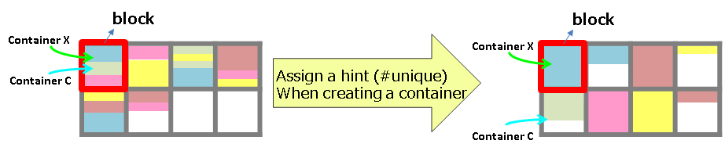
<figcaption>
</figcaption>
</figure>

[Note]
There is a possibility that the memory hit rate when accessing multiple containers is reduced.


### Node affinity

Node affinity refers to a function to place closely related containers or tables in the same node and thereby reduce the network load when accessing the data. In the GridDB SQL, a table JOIN operation can be described, such that while joining tables, it reduces the network load for accessing tables each placed in separate nodes of the cluster. While node affinity is not effective for reducing the turnaround time as concurrent processing using multiple nodes is no longer possible, it may improve throughput because of a reduction in the network load.

<figure>

<figcaption>Placement of container/table based on node affinity</figcaption>
</figure>


To use the node affinity function, hint information is given in the container (table) name when the container (table) is created. A container (table) with the same hint information is placed in the same partition.  Specify the container name as shown below.

-   Container (table) name@node affinity hint information

The naming rules for node affinity hint information are the same as the naming rules for the container (table) name.

[Note]
-   This function cannot be used when table partitioning is in use.


## Change the definition of a container (table)


You can change container definition including that of column addition after creating a container. Operations that can be changed and the interfaces to be used are given below.

| When the operating target is a single node | NoSQL API | SQL |
|----------------------|-----------|------|
| Add column(tail)                           | ✓         | ✓    |
| Add column(except for tail)                | ✓ (*1)   | ✗    |
| Delete column                              | ✓ (*1)   | ✗    |
| rename column                              |✗ |✓     |
-   (*1) If you add columns except to the tail or delete columns, the container is recreated internally. Therefore, it takes a long time to operate the container whose data amount is large.
-   Operations that are not listed above, such as changing the name of a container, cannot be performed.

### Add column

Add a new column to a container.

- NoSQL API
  - Add a column with GridStore\#putContainer.
  - Get container information "ContainerInfo" from an existing container. Execute putContainer after setting a new column to container information.
    See "GridDB Java API reference" ([GridDB_Java_API_Reference.html)](GridDB_Java_API_Reference.html) for details.

  - [Example program]
    ```java
    // Get container information
        ContainerInfo conInfo = store.getContainerInfo("table1");
        List<ColumnInfo> newColumnList = new ArrayList<ColumnInfo>();
        for ( int i = 0; i < conInfo.getColumnCount(); i++ ){
            newColumnList.add(conInfo.getColumnInfo(i));
        }
        // Set a new column to the tail
        newColumnList.add(new ColumnInfo("NewColumn", GSType.INTEGER));
        conInfo.setColumnInfoList(newColumnList);
        
        // Add a column
        store.putCollection("table1", conInfo, true);
    ```

- SQL
  - Add a column using the ALTER TABLE syntax.
  - Only the operation of adding a column to the tail is available. See the [GridDB SQL reference](GridDB_SQL_Reference.md) for details.

If you obtain existing rows after adding columns, the "empty value" defined in the data type of each column as a additional column value returns.
See Container\<K,R\> of a "GridDB Java API reference" ([GridDB_Java_API_Reference.html](GridDB_Java_API_Reference.html)) for details about the empty value.

<figure>

<figcaption>Example of adding an column</figcaption>
</figure>

### Delete column

Delete a column. It is only operational with NoSQL APIs.

-   NoSQL API
    -   Delete a column with GridStore\#putContainer. Get container information "ContainerInfo" from an existing container at first. Then, execute putContainer after excluding column information of a deletion target.
      See "GridDB Java API reference" ([GridDB_Java_API_Reference.html)](GridDB_Java_API_Reference.html) for details.


### Rename column

Rename a container column, which is only operational with SQL.

-   SQL
    - Add a column using the ALTER TABLE syntax. See the [GridDB SQL reference](GridDB_SQL_Reference.md) for details.

## Database compression/release function


<a id="block_data_compression"></a>
### Block data compression

When GridDB writes in-memory data to the database file residing on the disk, a database with larger capacity independent to the memory size can be obtained. However, as the size increases, so does the cost of the storage. The block data compression function is a function to assist in reducing the storage cost that increases relative to the amount of data by compressing database files (data files). In this case, flash memory with a higher price per unit of capacity can be utilized much more efficiently than HDD.

**Compression method**

When the data on memory is exported to database files (data files), compression is performed for each block, which represents the write unit in GridDB. The vacant area of Linux's file space due to compression can be deallocated, thereby reducing disk usages.

**Supported environment**

Since block data compression uses the Linux function, it depends on the Linux kernel version and file system. Block data compression is supported in the following environment.
-   OS: RHEL / CentOS 7.9 and later, Ubuntu Server 20.04
-   File system: XFS
-   File system block size: 4 KB

  If block data compression is enabled in other environments, the GridDB node will fail to start.

**Configuration method**

The compression function needs to be configured in every nodes.

-   Set the following string in the node definition file (gs_node.json) /dataStore/storeCompressionMode.
    -   To disable compression functionality: NO_COMPRESSION (default)
    -   To enable compression functionality: COMPRESSION
-   The settings will be applied after GridDB node is restarted.
-   By restarting GridDB node, enable/disable operation of the compression function can be changed.

[Note]
-   Block data compression can only be applied to data files. Checkpoint log files, transaction log files, backup files, and the data on memory in GridDB are not subject to compression.
-   Block data compression makes data files into sparse files.
-   Even when the compression function is enabled, data that has already been written to data files cannot be compressed.

### Deallocation of unused data blocks

The deallocation of unused data block space is the function to reduce the size of database files (actual disk space allocated) by deallocating the Linux file blocks in the unused block space in database files (data files).

Use this function in the following cases.

-   A large amount of data has been deleted
-   There is no plan to update data and it is necessary to keep the DB for a long term.
-   The disk becomes full when updating data and reducing the DB size is needed temporarily.

The processing for the deallocation of unused blocks, the support environment and the execution method are explained below.

**Processing for deallocation**

During the startup of a GridDB node, unused space in database files (data files) is deallocated. Those remain deallocated until data is updated on them.

**Supported environment**

The support environment is the same as the [block data compression](#block_data_compression).

**Execution method**

Specify the deallocation option, --releaseUnusedFileBlocks, of the gs_startnode command, in the time of starting GridDB nodes.

Check the size of unused space in database  files (data files) and the size of allocated disk space using the following command.
-   Items shown by the gs_stat command
    -   storeTotalUse

        The total data capacity that the node retains in data files (in bytes)

    -   dataFileAllocateSize

        The total size of blocks allocated to data files (in bytes)

It is desired to perform this function when the size of allocated and unused blocks is large (storeTotalUse << dataFileAllocateSize).

[Note]

-   This function is available only for data files. Unused space in checkpoint log files, transaction log files and backup files is not deallocated.
-   Deallocation of unused data blocks makes data files into sparse files.
-   This function can reduce the disk usage in data files, but can be disadvantageous in terms of performance in that by making data files into sparse files, fragmentation is more likely to occur.
-   The start-up of GridDB with this function may take more time than the normal start-up.


# Operating function

## Service

GridDB service is automatically performed during OS start-up to start a node or cluster.

The GridDB service is enabled immediately after installing the packages. Since the service is enabled, the GridDB server is started at the same time the OS starts up, and the server is stopped when the OS is stopped.

When you use an interface that integrates middleware and application operation including OS monitoring and database software operation, consideration of dependency with other middleware such as whether to use service or operating commands for GridDB operation is necessary.

GridDB service is automatically performed during OS start-up to start a GridDB node (hereinafter, node) or GridDB cluster (hereinafter cluster). The node or cluster is stopped when the OS is shut down.

The following can be carried out by the service.
-   Starting, stopping, and rebooting a node
-   Checking the process state of a node

  

The service operation procedures to the cluster of three nodes are as follows.

- Starting the cluster using services

  Suppose that three nodes are stopped.

  | User's operation | State of node A | State of node B | State of node C |
  |--------------------------------|--------------|--------------|--------------|
  | － | Stopped node | Stopped node | Stopped node    |
  | (1) Start services for nodes A/B/C | Starting a node<br />Having Joined the cluster | Starting a node<br />Having Joined the cluster | Starting a node<br />Having Joined the cluster |

  - The services are automatically executed at OS startup.
  - To start a cluster by starting the services, the number of nodes constituting a cluster and the cluster name must be defined in the configuration files of the services.
  - When the number of nodes joining the cluster is equals to the defined number of nodes constituting the cluster, the cluster is started automatically.

  

- Stopping a node using a service

  Suppose that the cluster is in operation.

  | User's operation | State of node A | State of node B | State of node C |
  |--------------|--------------|--------------|--------------|
  | － | Having Joined the cluster | Having Joined the cluster | Having Joined the cluster |
  | (1) Stopping the service of the node B. | Having Joined the cluster | Being detached from the cluster.<br />Node being stopped | Having Joined the cluster |

  

- Starting the cluster using services

  Suppose that the cluster is in operation.

  | User's operation | State of node A | State of node B | State of node C    |
  |-------------------------------|----------------|-----------------|-----------------|
  | － | Having Joined the cluster | Having Joined the cluster | Having Joined the cluster   |
  | Stop the cluster (\* caution).       | Being detached from the cluster. | Being detached from the cluster. | Being detached from the cluster. |
  | (2) Stop the service of nodes A/B/C. | Stopped node                     | Stopped node                     | Stopped node      |


[Note]
- **When stopping the cluster, execute the gs_stopcluster command and leave/stop each node by a service stop.**
  If you do not stop the cluster with the gs_stopcluster command, autonomous data arrangement may occur due to node leaving.
  If data relocation happens frequently, network or disk I/O may become a load.
  If you leave the node after stopping the cluster, data arrangement will not occur. To prevent unnecessary data rearrangement, be sure to stop the cluster in advance.
  To stop a cluster, execute the operating command gs_stopcluster, use the integrated operation control gs_admin, or use gs_sh.

  

If you do not use service control, disable service at all the runlevels in the way as follows.

``` example
# /sbin/chkconfig gridstore off
```

## User management function

There are 2 types of GridDB user, an OS user which is created during installation and a GridDB user to perform operations/development in GridDB (hereinafter referred to a GridDB user).

### OS user

An OS user has the right to execute operating functions in GridDB and a gsadm user is created during GridDB installation. This OS user is hereinafter referred to gsadm.

All GridDB resources will become the property of gsadm. In addition, all operating commands in GridDB are executed by a gsadm.

Authentication is performed to check whether the user has the right to connect to the GridDB server and execute the operating commands. This authentication is performed by a GridDB user.

### GridDB user  

-   Administrator user and general user

    There are 2 types of GridDB user, an administrator user and a general user, which differ in terms of which functions can be used. Immediately after the installation of GridDB, 2 users, a system and an admin user, are registered as default administrator users.

    An administrator user is a user created to perform GridDB operations while general users are users used by the application system.

    For security reasons, administrator users and general users need to be used differently according to the usage purpose.

-   Creating a user

    An administrator user can register or delete a gsadm, and the information is saved in the password file of the definition file directory as a GridDB resource. As an administrator user is saved/managed in a local file of the OS, it has to be placed so that the settings are the same in all the nodes constituting the cluster. In addition, administrator users need to be set up prior to starting the GridDB server. After the GridDB server is started, administrative users are not valid even if they are registered.

    An administrator user can create a general user after starting cluster operations in GridDB. A general user cannot be registered before the start of cluster services. A general user can only be registered using an operating command against a cluster as it is created after a cluster is composed in GridDB and maintained as management information in the GridDB database.

    Since information is not communicated automatically among clusters, an administrator user needs to make the same settings in all the nodes and perform operational management such as determining the master management node of the definition file and distributing information from the master management node to all the nodes that constitute the cluster.

<figure>
  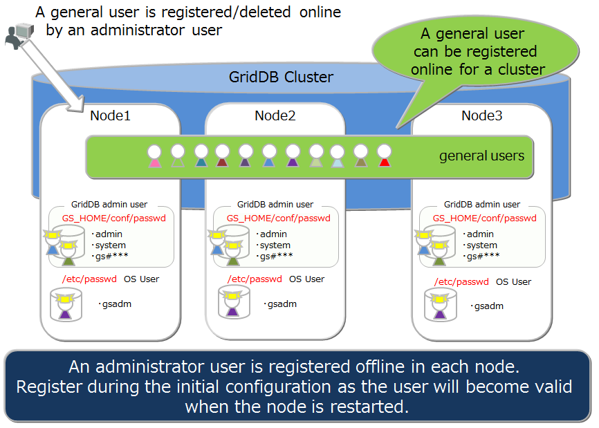
  <figcaption>GridDB users</figcaption>
</figure>


-   Rules when creating a user

    There are naming rules to be adopted when creating a user name.
    -   Administrator user: Specify a user starting with "gs\#". After "gs\#", the name should be composed of only alphanumeric characters and the underscore mark. Since the name is not case-sensitive, gs\#manager and gs\#MANAGER cannot be registered at the same time.

    -   General user: Specify using alphanumeric characters and the underscore mark. The container name should not start with a number. In addition, since the name is not case-sensitive, user and USER cannot be registered at the same time. System and admin users cannot be created as default administrator users.

    -   Password: No restrictions on the characters that can be specified.

    A string of up to 64 characters can be specified for the user name and password.

### Usable function

The operations available for an administrator and a general user are as follows. Among the operations, commands which can be executed by a gsadm without using a GridDB user are marked with "??".

| When the operating target is a single node | Operating details                              | Operating tools used     | gsadm | Administrator user | General user            |
|------------------------|-------------------------------------|--------------------------------------------|-------|------------|-----------------------|
| Node operations                            | start node                                     | gs_startnode/gs_sh     |       | ✓                  | ✗                     |
|                        | stop node                                      | gs_stopnode/gs_sh      |       | ✓                  | ✗                     |
| Cluster operations                         | Building a cluster                             | gs_joincluster/gs_sh   |       | ✓                  | ✗                     |
|                        | Adding a node to a cluster                     | gs_appendcluster[EE only]/gs_sh |       | ✓                  | ✗                     |
|                        | Detaching a node from a cluster                | gs_leavecluster/gs_sh  |       | ✓                  | ✗                     |
|                        | Stopping a cluster                             | gs_stopcluster/gs_sh   |       | ✓                  | ✗                     |
| User management                            | Registering an administrator user              | gs_adduser              | ✓✓    | ✗                  | ✗                     |
|                        | Deletion of administrator user                 | gs_deluser              | ✓✓    | ✗                  | ✗                     |
|                        | Changing the password of an administrator user | gs_passwd               | ✓✓    | ✗                  | ✗                     |
|                        | Creating a general user                        | gs_sh                   |       | ✓                  | ✗                     |
|                        | Deleting a general user                        | gs_sh                   |       | ✓                  | ✗                     |
|                        | Changing the password of a general user        | gs_sh                   |       | ✓                  | ✓: Individual only           |
| Database management                        | Creating/deleting a database                   | gs_sh                   |       | ✓                  | ✗                     |
|                        | Assigning/cancelling a user in the database    | gs_sh                   |       | ✓                  | ✗                     |
| Data operation                             | Creating/deleting a container or table         | gs_sh                   |       | ✓                  | O : Only when update operation is possible in the user's DB     |
|                        | Registering data in a container or table       | gs_sh                   |       | ✓                  | O : Only when update operation is possible in the user's DB     |
|                        | Searching for a container or table             | gs_sh                   |       | ✓                  | ✓: Only in the DB of the individual     |
|                        | Creating index to a container or table         | gs_sh                   |       | ✓                  | O : Only when update operation is possible in the user's DB     |
| Backup management                          | Creating a backup                              | gs_backup[EE only]               |       | ✓                  | ✗                     |
| Backup management                          | Restoring a backup                             | gs_restore[EE only]              | ✓✓    | ✗                  | ✗                     |
|                        | Displaying a backup list                       | gs_backuplist[EE only]           |       | ✓                  | ✗                     |
| System status management                   | Acquiring system information                   | gs_stat                 |       | ✓                  | ✗                     |
|                        | Changing system parameter                      | gs_paramconf            |       | ✓                  | ✗                     |
| Data import/export                         | Importing data                                 | gs_import               |       | ✓                  | ✓: Only in accessible object |
| Export                                     | Exporting data                                 | gs_export               |       | ✓                  | ✓: Only in accessible object |


### Database and users

Access to a cluster database in GridDB can be separated on a user basis. The separation unit is known as a **database**.  The following is a cluster database in the initial state.

-   public
    -   The database can be accessed by all administrator user and general users.
    -   This database is used when connected without specifying the database at the connection point.

Multiple databases can be created in a cluster database. Creation of databases and assignment to users are carried out by an administrator user.

The rules for creating a database are as shown below.

-   The maximum no. of users and the maximum no. of databases that can be created in a cluster database is 128.
-   A string consisting of alphanumeric characters, the underscore mark, the hyphen mark, the dot mark, the slash mark and the equal mark can be specified for the database. The container name should not start with a number.
-   A string consisting of 64 characters can be specified for the database name.
-   Although the case sensitivity of the database name is maintained, a database which has the same name when it is not case-sensitive cannot be created. For example, both database and DATABASE cannot be registered.
-   Public and "information_schema" cannot be specified for default DB.

When assigning general users to a database, specify permissions as follows :
-   ALL
    -   All operations to a container are allowed such as creating a container, adding a row, searching, and creating an index.
-   READ
    -   Only search operations are allowed.

Only assigned general users and administrator users can access the database. Administrator user can access all databases.  The following rules apply when assign a general user to a database.
-   Multiple general users can be assigned to one database.
-   When assigning general users to a database, only one type of permission can be granted.
-   When assigning multiple general users to one database, different permission can be granted for each user.
-   Multiple databases can be assigned to 1 user

<figure>
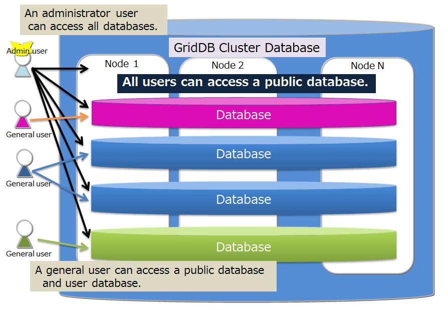
<figcaption>Database and users</figcaption>
</figure>

### Authentication method

GridDB offers the following two authentication methods:
-   internal authentication
-   LDAP authentication

The following explains each method.

#### Internal authentication

GridDB manages the user name, password, and privilege of administrative and general GridDB users. If the authentication method is not specified, internal authentication is used by default.

The administrative user is managed using the operation commands gs_adduser, ,gs_deluser, and gs_passwd.

General users are managed using the SQL statements CREATE USER, DROP USER, and SET PASSWORD, whereas their access rights are managed using the SQL statements GRANT and REVOKE.

**User cache settings**

To set cache for general user information, edit the following node definition file (gs_node.json):

[Note]
-   To reflect the changes made, restart the server.


| Parameter                  | Default | Value                 |
|---------------------------------|------------|------------------------|
| /security/userCacheSize | 1000  | Specify the number of entries for general and LDAP users to be cached. |
| /security/userCacheUpdateInterval | 60  | Specify the refresh interval for cache in seconds.|

#### LDAP authentication[Enterprise Edition]

GridDB manages general GridDB users by LDAP. It also manages LDAP users' access rights by allowing the user create a role having the same name as user names and group names within LDAP and manipulate LDAP users' access rights. Moreover, it provides the caching capability of user information managed by LDAP for faster authentication operation.

[Note]
-   Install openldap2.4 on the server where the GridDB node runs. For detail, see the manual for openLDAP.
-   LDAP cannot manage the administrative user, who is always managed using internal authentication.


**settings common to internal and LDAP authentication**

To use LDAP authentication, edit the cluster definition file (gs_cluster.json) as described below.

| Parameter                  | Default | Value                 |
|---------------------------------|------------|------------------------|
| /security/authentication | INTERNAL  | Specify either INTERNAL (internal authentication) or LDAP (LDAP authentication) as an authentication method to be used. |
| /security/ldapRoleManagement | USER  | Specify either USER (mapping using the LDAP user name) or GROUP (mapping using the LDAP group name) as to which one the GridDB role is mapped to.          |
| /security/ldapUrl   |  | Specify the LDAP server using the format: ldap[s]://host[:port] |


[Note]
-   Only one LDAP server can be specified for /security/ldapUrl.
-   The following LDAP server is supported:
    -   OpenLDAP 2.4 or later.
    -   Active Directory Schema Version 87 (Windows Server 2016 or later).
-   To reflect the changes made, restart the server.


**Role management**

Roles are managed by the SQL statements CREATE ROLE and DROP ROLE. If "USER" is specified for /security/ldapRoleManagement, the role is created using the LDAP user name, whereas if "GROUP" is specified, the role is created using the LDAP group name. The access authority granted to the role created is managed using the SQL statements GRANT and REVOKE.

**Settings for LDAP authentication mode**

Specify simple mode (directly binding with a user account) or search mode (searching and authenticate users after binding with an LDAP administrative user), Then edit the cluster definition file (gs_cluster.json) as described below:

[Note]
-   Simple mode and search mode are incompatible.
-   To reflect the changes made, restart the server.

■Simple mode


| Parameter                  | Default | Value                 |
|---------------------------------|------------|------------------------|
| /security/ldapUserDNPrefix |   | To generate the user's DN (identifier), specify the string to be concatenated in front of the user name. |
| /security/ldapUserDNSuffix |  | To generate the user's DN (identifier), specify the string to be concatenated after the user name.|


■Search mode


| Parameter                  | Default | Value                 |
|---------------------------------|------------|------------------------|
| /security/ldapBindDn |   | Specify the LDAP administrative user's DN. |
| /security/ldapBindPassword |  | Specify the password for the LDAP administrative user.|
| /security/ldapBaseDn |  | Specify the root DN from which to start searching.|
| /security/ldapSearchAttribute | uid  | Specify the attributes to search for.|
| /security/ldapMemberOfAttribute | memberof | Specify the attributes where the group DN to which the user belongs is set (valid if ldapRoleManagement=GROUP).|

**User cache settings**

To set cache for LDAP user information, edit the following node definition file (gs_node.json):

[Note]
-   To reflect the changes made, restart the server.


| Parameter                  | Default | Value                 |
|---------------------------------|------------|------------------------|
| /security/userCacheSize | 1000  | Specify the number of entries for general and LDAP users to be cached. |
| /security/userCacheUpdateInterval | 60  | Specify the refresh interval for cache in seconds.|

**Setup examples**

The following example shows sample settings for the conditions below:

-   Active Directory(host=192.168.1.100 port=636)
-   user DN (cn=TEST, ou=d1 ou=dev dc=example, dc=com)
-   The user is only allowed to search the sample DB.
-   Map the GridDB role using the user name.
-   Authenticate in simple mode.

■Sample role settings (SQL statements)
``` example
 CREATE ROLE TEST
 GRANT SELECT ON sampleDB to TEST
```

■Sample server settings (excerpt from gs_cluster.json)
``` example
            :
"security":{
    "authentication":"LDAP",
    "ldapRoleManagement":"USER",
    "ldapUrl":"ldaps://192.168.1.100:636",
    "ldapUserDnPrefix":"CN=",
    "ldapUserDnSuffix":",ou=d1,ou=dev,dc=example,dc=com",
    "ldapSearchAttribute":"",
    "ldapMemberOfAttribute": "" 
},
            :
```


## Security features[Enterprise Edition]

### Communication encryption

GridDB supports SSL connection between the GridDB cluster and the client.

[Note]
-   Install OpenSSL 3.0.7 or later on the server on which the GridDB node runs.
-   Make sure the openSSL version is 1.1.1 using the following command:
``` example
$ python -c "import ssl; print(ssl.OPENSSL_VERSION)" 
```

**Settings**

To enable SSL connection, edit the cluster definition file (gs_cluster.json) and the node definition file (gs_node.json), as illustrated below: 
Then place the server certificate and the private key file in the appropriate directory. 

[Note]
- To reflect the changes made, restart the server. 
- SSL connection between nodes constituting a GridDB cluster is not supported. It is recommended to place the GridDB cluster in in a secure network not directly accessible externally. 
- An option is available to enable server corticated verification, but host name verification is not supported. To prevent man-in-the-middle attack it is recommended to use a certificate created by your own Certificate Authority (CA). 
- Confirmation of certificate revocation using the  certificate revocation list (CRL) is not supported. 

\*cluster definition file (gs_cluster.json)

| Parameter | Default | Value |
|---------------------------------|------------|------------------------|
| /system/serverSslMode | DISABLED  | For SSL connection settings, specify DISABLED (SSL invalid), PREFERRED (SSL valid, but non-SSL connection is allowed as well), or REQUIRED (SSL valid; non-SSL connection is not allowed ).  |
| /system/sslProtocolMaxVersion | TLSv1.2 | As a TLS protocol version, specify either TLSv1.2 or TLSv1.3.  |

\*Node definition file (gs_node.json)

| Parameter | Default | Value |
|---------------------------------|------------|------------------------|
| /system/securityPath | security  | Specify the full path or relative path to the directory where the server certificate and the private key are placed.  |
| /system/serviceSslPort | 10045 | SSL listen port for operation commands |

\*Server certificate and private key

To enable SSL, place the server certificate and the private key in the directory where `/system/securityPath` is set with the following file names: 

- gs_node.crt: certificate file
- gs_node.key: private key file


**Client settings**

SSL connection and server certificate verification can be specified on the client side. For details, see each tool and the API reference. 

## Failure process function[Enterprise Edition]

In GridDB, recovery for a single point failure is not necessary as replicas of the data are maintained in each node constituting the cluster.  The following action is carried out when a failure occurs in GridDB. 


1.  When a failure occurs, the failure node is automatically isolated from the cluster. 
2.  Failover is carried out in the backup node in place of the isolated failure node. 
3.  Partitions are rearranged autonomously as the number of nodes decreases as a result of the failure (replicas are also arranged). 

A node that has been recovered from a failure can be incorporated online into a cluster operation. A node can be incorporated into a cluster which has become unstable due to a failure using the gs_joincluster command. As a result of the node incorporation, the partitions will be rearranged autonomously and the node data and load balance will be adjusted. 

In this way, although advance recovery preparations are not necessary in a single failure, recovery operations are necessary when operating in a single configuration or when there are multiple overlapping failures in the cluster configuration. 

When operating in a cloud environment, even when physical disk failure or processor failure is not intended, there may be multiple failures such as a failure in multiple nodes constituting a cluster, or a database failure in multiple nodes. 

### Type and treatment of failures

An overview of the failures which occur and the treatment method is shown in the table below. 

A node failure refers to a situation in which a node has stopped due to a processor failure or an error in a GridDB server process, while a database failure refers to a situation in which an error has occurred in accessing a database placed in a disk. 

| Configuration of GridDB | Type of failure           | Action and treatment                                                           |
|--------------|----------------------|----------------------------------------------------------------------|
| Single configuration    | Node failure              | Although access from the application is no longer possible, data in a transaction which has completed processing can be recovered simply by restarting the transaction, except when caused by a node failure. Recovery by another node is considered when the node failure is prolonged.                                                          |
| Single configuration    | Database failure          | The database file is recovered from the backup data in order to detect an error in the application. Data at the backup point is recovered.    |
| Cluster configuration   | Single node failure       | The error is covered up in the application, and the process can continue in nodes with replicas. Recovery operation is not necessary in a node where a failure has occurred.        |
| Cluster configuration   | Multiple node failure     | If both owner/backup partitions of a replica exist in a failure target node, the cluster will operate normally even though the subject partitions cannot be accessed. Except when caused by a node failure, data in a transaction which has completed processing can be recovered simply by restarting the transaction. Recovery by another node is considered when the node failure is prolonged.                     |
| Cluster configuration   | Single database failure   | Since data access will continue through another node constituting the cluster when there is a database failure in a single node, the data can be recovered simply by changing the database deployment location to a different disk, and then starting the node again.                    |
| Cluster configuration   | Multiple database failure | A partition that cannot be recovered in a replica needs to be recovered at the point backup data is sampled from the latest backup data.                  |


### Client failover

If a node failure occurs when operating in a cluster configuration, the partitions (containers) placed in the failure node cannot be accessed. At this point, a client failover function to automatically connect to the backup node again and continue the process is activated in the client API. To automatically perform a failover countermeasure in the client API, the application developer does not need to be aware of the error process in the node. 

However, due to a network failure or simultaneous failure of multiple nodes, an error may also occur and access to the target application operations may not be possible. 

Depending on the data to be accessed, the following points need to be considered in the recovery process after an error occurs. 

- For a collection in which the timeseries container or row key is defined, the data can be recovered by executing the failed operation or transaction again. 

- For a collection in which the row key is not defined, the failed operation or transaction needs to be executed again after checking the contents of the DB. 

[Note]
- In order to simplify the error process in an application, it is recommended that the row key be defined when using a collection.  If the data cannot be uniquely identified by a single column value but can be uniquely identified by multiple column values, a column having a value that links the values of the multiple columns is recommended to be set as the row key so that the data can be uniquely identified. 

### Automatic restarting function

If the GridDB node abnormally terminates or the node process is forcibly terminated, it will automatically restart the node and join to the cluster.  Operation manager does not need to be aware of restoring the cluster status to normal operation. 

<figure>
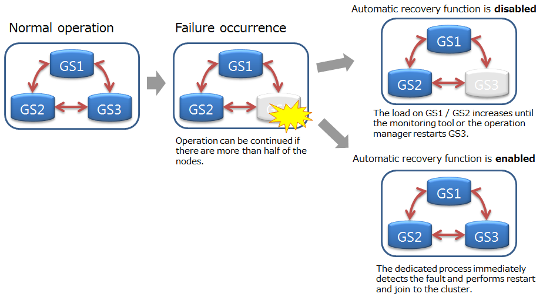
<figcaption>Automatic recovery function</figcaption>
</figure>

[Note]

Automatic restart is not performed in the following cases: 
-   In case when the user explicitly turns it off.
-   In case of an unrecoverable failure (Node status: ABNORMAL).
-   In case of trying automatic restart more than 5 times.
-   In case of the node is not joined to the cluster before the failure.

**Settings**

The parameters of automatic recovery function is as follows. 

| Parameter                  | Default | Value                 |
|---------------------------------|------------|------------------------|
| SVC_ENABLE_AUTO_RESTART | true    | true(Enabled)/false(Disabled) |
| GS_USER                   | admin   | Set as appropriate                   |
| GS_PASSWORD               | admin   | Set as appropriate                   |

When changing the parameters, edit the start configuration file: `/etc/sysconfig/gridstore/gridstore.conf` . 

- SVC_ENABLE_AUTO_RESTART
  - Set whether to enable or disable this function. This parameter can be changed by restarting the node. 
  - If you want to control GridDB's fault recovery with another monitoring system, set false. 

- GS_USER/GS_PASSWORD
  - Set the GridDB administrator user name and password. 
  - These parameters are used in the following cases: 
    - In case of starting, stopping, restarting by services
    - In case of the -u option is not specified with the gs_startnode

[Note]
-   If the specified GS_USER / GS_PASSWORD is invalid, or if these are not specified, the GridDB node will fail to start up. 


## Export/import function

In the GridDB export/import tools, to recover a database from local damages or the database migration process, save/recovery functions are provided in the database and container unit. 

In a GridDB cluster, container data is automatically arranged in a node within a cluster. The user does not need to know how the data is arranged in the node (data position transmission). 
There is also no need to be aware of the arrangement position in data extraction and registration during export/import as well. The export/import configuration is as follows. 

<figure>
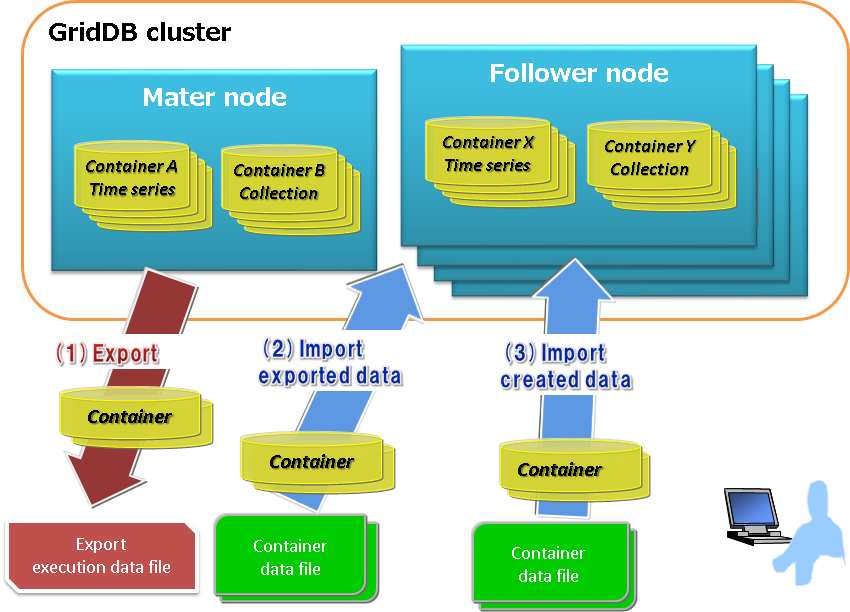
<figcaption>Export/import configuration</figcaption>
</figure>

[Export]

(1) Save the container and row data of a GridDB cluster in the file below. A specific container can also be exported by specifying its name. 
-   **Container data file**
    -   Save GridDB container data and row data. 
    -   There are 2 types of format available, one for saving data in a container unit and the other for consolidating and saving data in multiple containers. 
-   **Export execution data file**
    -   Save the data during export execution. This is required to directly recover exported data in a GridDB cluster. 

[Import]

(2) Import the container and export execution data files, and recover the container and row data in GridDB. A specific container data can also be imported as well. 

(3) Import container data files created by the user, and register the container and row data. 

[Note]
-   An exported container data file has the same format as the container data file created by a user. 
-   If the container during export is manipulated, the manipulated data may be referenced. 


## Backup/restoration function[Enterprise Edition]

Regular data backup needs to be performed in case of data corruption caused by database failures and malfunctions of the application. The backup operation method should be selected according to the service level requirements and system resources. 

This section explains the types of backup and following features. 

- Backup operations
  - This section explains the different types of backup available and how to use them. 
- Recovery from a failure
 - This section explains failure detection and how to recover from one. 

### Backup method

Regular data backup needs to be performed in case of data corruption caused by database failures and malfunctions of the application. The type and interval of the backup operation needs to be determined based on the requirement to maintain cluster consistency,  duration of backup, the available disk capacity, and the recovery requirements in case of failure (e.g. point of recovery). The resolution method needs to be selected according to the system resources and the request from the service level of the recovery warranty. Backup methods available for GridDB are shown below.

| Backup method                                                         | Recovery point                 | Features                                                                                                                                                                                                                                             |
|-----------------------------------------------------------------------|--------------------------|--------------------------------------------------------------------------------------------------------------------------------------------------------------------------------------------------------------------------------------------------|
| Offline backup                                                        | Stopping the cluster           | Clusters must keep stopping until copying the backup completes.  The recovery point is not different from node to node.                                                                                                                                                 |     |
| Online backup (baseline with differential/incremental)                | Completing the backup          | Use the GridDB backup command. There is a possibility that the recovery point is different from node to node depending on the timing when obtaining the backup completes.                                                                                                                      |     |
| Online backup (automatic log)                                         | Immediately before the failure | Use the GridDB backup command. There is a possibility that the start-up time gets longer because the data is recovered to the latest with transaction logs.                                                                                                                    |     |
| File system level online backup (cluster snapshots) | When the snapshot is taken | The backup is obtained by using the cluster snapshot function and collaborating with the snapshot of an OS and a storage. |     |


To perform an offline backup, stop the cluster by using gs_stopcluster command first, and stop all the nodes constituting the cluster.  Next, backup the data under the database file directory of each node (directory indicated by /dataStore/dbPath, /dataStore/transactionLogPath in gs_node.json). 

To know about the GridDB online backup functions, please refer to [Online backup and recovery operations on a per-node basis](#online_backup_and_recovery_operations).

To perform a file system level online backup instead of using the GridDB online backup function, refer to [File system level online backup and recovery operations (using the cluster snapshot function)](#file_system_level_backup_and_recovery_operations).


[Note]
-   When an online backup is performed, please stop the related updating among multiple containers. Then, it is possible to prevent creating the logically inconsistent backup for the entire cluster.
-   When a node failure occurs during a cluster snapshot or online backup, pause the online backup and perform the backup again starting with the first node. This re-allocation (rebalancing) of partitions after a node failure can avoid a situation where the necessary data is not backed up. (元の英語の意味が不明のため訳しなおした）
-   It is recommended to perform file system level online backups (cluster snapshot) when all the partitions are in a stable state at the time the cluster snapshot is taken. The purpose here is to maintain consistency of clusters. By so doing, synchronization would not occur even when the cluster is re-configured after the restore process. 


**Backup definition files**

In backup operation, in addition to a regular backup of the database files, backup of the definition files is also needed. 

Use an OS command to perform a backup of the node definition file (gs_node.json), cluster definition file (gs_cluster.json), user definition file (password) in the $GS_HOME/conf directory (/var/lib/gridstore/conf by default) in addition to a regular backup of the database files. 

Be sure to backup the definition file if there are configuration changes or when a user is registered or changed. 


<a id="online_backup_and_recovery_operations"></a>
### Online backup and recovery operations on a per-node basis

#### Backup operations

This section explains the GridDB backup operations in the event of failure. 

##### Types of backup

In GridDB, backup of node units can be carried out online. A backup of the entire cluster can be carried out online while maintaining the services by performing a backup of all the nodes constituting the GridDB cluster in sequence. Note, however, that if this method is employed to take backups for the entire cluster, cluster consistency is not maintained, which means it is likely that synchronization would be performed after rebuilding the cluster by restoring data from backups. To prioritize maintaining cluster consistency, consider using "online backups with a cluster snapshot".

The types of online backup provided by GridDB are as follows.

| Backup type                     | Backup actions                | Recovery point                       |
|------------------------|--------------------------------|--------------------------------|
| Full backup                     | A backup of the cluster database currently in use is stored online in node units in the backup directory specified in the node definition file.  | Full backup collection point |
| Differential/incremental backup | A backup of the cluster database currently in use is stored online in node units in the backup directory specified in the node definition file. In subsequent backups, only the difference in the update block after the backup is backed up.  | Differential/incremental backup collection point |
| Automatic log backup            | In addition to backing up the cluster database currently in use which is stored online in node units in the backup directory specified in the node definition file, the transaction log is also automatically picked up at the same timing as the transaction log file writing. The write timing of the transaction log file follows the value of /dataStore/logWriteMode in the node definition file.  | Latest transaction update point |

The recovery point differs depending on the type of backup used. 

The various backup operations and systems recommendation provided by GridDB are shown below.

-   Full backup

    A full backup is acquired after an overnight batch process to update data in a reference system. A full backup will take a while to complete as data in all the database files will be copied. In addition, the data capacity at the backup collection destination needs to be the same as the database file.

    The backup disk capacity needs to be multiplied by the actual database size according to how many backup generations to retain. 

<figure>
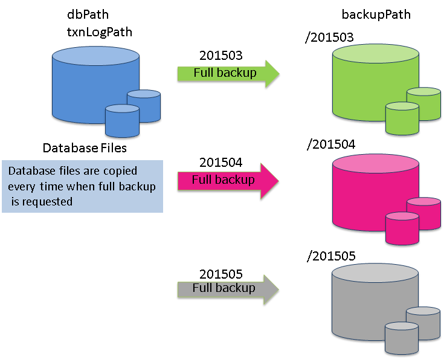
<figcaption>Full backup</figcaption>
</figure>


-   Differential/incremental backup

    In differential/incremental backup, once a full backup of the entire databases have been performed, only the differences between the current and the updated data will be backed up.  This type of backup is suitable for systems which needs to be backed up quickly, and systems which perform systematic operations such as automatic backup of batch operations during the night, monthly full backup (baseline creation), differential (since) backup once a week, incremental backup (incremental) once a day, etc. 

    As an incremental backup uses only updated data, it can be carried out faster compared to a full backup or differential backup. However, recovery when a failure occurs may take a while as the update block needs to be rolled forward for the data of the full backup. A differential backup using a regular Baseline or Since command is required. 

<figure>
  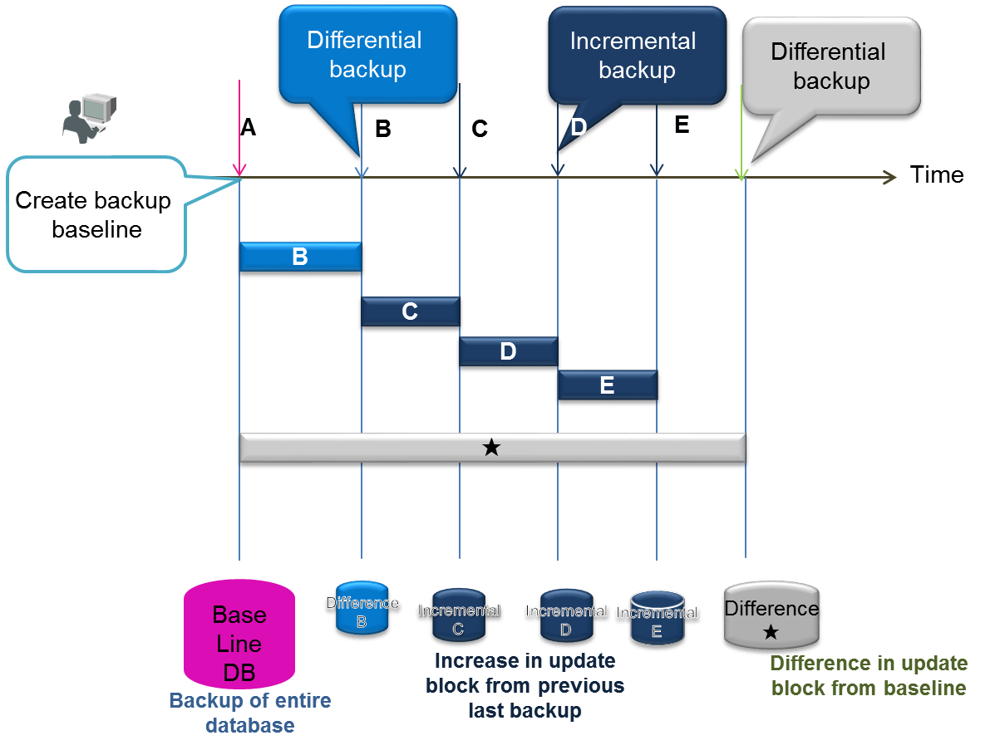
  <figcaption>Differential/incremental backup</figcaption>
</figure>


-   Automatic log backup

    After performing a full backup with an automatic log backup command (baseline creation), the updated log will be collected in the backup directory. Backup operation is not required as a transaction log will be taken automatically. This command is used when you want to simplify the operation or when you do not wish to impose a load on the system due to the backup. However, if the baseline is not updated regularly, recovery will take a while as the number of transaction log files used in recovery when a failure occurs increases. In a differential/incremental backup, data of the same block will be backed up as a single data when updated, but in an automatic log backup, a log is recorded every time there is an update, so recovery during a failure takes more time than a differential/incremental backup. 

<figure>

<figcaption>Automatic log backup</figcaption>
</figure>

[Note]
-   To shorten the recovery time when failure occurs during a differential/incremental backup or automatic log backup, a full backup that will serve as the baseline needs to be performed regularly. 

The type of backup is specified in the command option. 

##### Checking backup-related parameters

Specify /dataStore/backupPath in the node definition file as the backup destination. Take into consideration physical failure of the disk, and be sure to set up the backup destination and database file (/dataStore/dbPath, /dataStore/transactionLogPath) so that the file is stored in a different physical disk. 

There are 2 log persistency modes for transactions. Default is NORMAL. 
-   NORMAL: unnecessary transaction log files will be deleted by a checkpoint process. 
-   KEEP_ALL_LOG: All transaction log files are retained. 

KEEP_ALL_LOG is specified only for special operations. e.g. when issuing instructions to delete a log file in conjunction with the backup software of other companies, etc., but normally this is not used.  

A specified example of a node definition file is shown below. 

``` example
$ cat /var/lib/gridstore/conf/gs_node.json         # The example of checking a setting
{
    "dataStore":{
        "dbPath":"/var/lib/gridstore/data",
        "transactionLogPath":"/var/lib/gridstore/txnlog",
        "backupPath":"/mnt/gridstore/backup",      # Backup directory
        "storeMemoryLimit":"1024",
        "concurrency":2,
        "logWriteMode":1,
        "persistencyMode":"NORMAL"                 #Perpetuation mode
            :
            :
}
```

##### Backup execution

This section explains how to use a full backup, differential/incremental backup, and automatic log backup.

Specify the backup name (BACKUPNAME) when executing any type of backup. For the data created by backup, a directory with the same name as the backup name (BACKUPNAME) is created and placed under the directory specified in backupPath in the node definition file.

Up to 12 alphanumeric characters can be specified in the BACKUPNAME.

##### Full backup

When a failure occurs, the system can be recovered up to the point where the full backup was completed.  Implement a full backup of all the nodes constituting the cluster. Backup data is stored in the directory indicated by the BACKUPNAME of the command. It is recommended to specify the date in the BACKUPNAME in order to make it easier to understand and manage the backup data gathered.

Execute the following command on all the nodes inside the cluster.

``` example
$ gs_backup -u admin/admin 20141025
```

In this example,
1.  "20141025" is specified as a backup name (BACKUPNAME), and a directory "20141025" will be created under the backup directory.
2. In the "20141025" directory, backup information files (gs_backup_info.json and gs_backup_info_digest.json) and an LSN information file (gs_lsn_info.json) are created. In the "data" directory, data files and checkpoint log files are created, while in the "txnlog" directory, transaction log files are created.

``` example
/var/lib/gridstore/backup/
        20141025/                           # backup directory
                gs_backup_info.json         # backup information file
                gs_backup_info_digest.json  # backup information file
                gs_lsn_info.json            # LSN information file
                data/
                    0/                      # partition number 0
                        0_part_0.dat        # data file backup
                        0_117.cplog         # checkpoint log backup
                        0_118.cplog
                        ...
                    1/
                    2/
                    ...
                txnlog/
                    0/                      # partition number 0
                        0_120.xlog          # transaction log backup
                        0_121.xlog
                    1/
                    2/
                    ...
```

A backup command will only notify the server of the backup instructions and will not wait for the process to end.

Check the completion of the backup process by the status of the gs_stat command.

``` example

$ gs_backup -u admin/admin 20141025
$ gs_stat -u admin/admin --type backup
BackupStatus: Processing
```

-   The backup status (BackupStatus) will be one of the following.
    -   Processing: Under execution
    -   \-: Completed or not in operation

The status of the gs_backuplist command shows whether the backup has been performed properly.

``` example
$ gs_backuplist -u admin/admin

BackupName   Status   StartTime                EndTime
------------------------------------------------------------------------
 20141025NO2     P   2014-10-25T06:37:10+0900 -
 20141025        NG  2014-10-25T02:13:34+0900 -
 20140925        OK  2014-09-25T05:30:02+0900 2014-09-25T05:59:03+0900
 20140825        OK  2014-08-25T04:35:02+0900 2014-08-25T04:55:03+0900
```

The status symbol of the backup list indicates the following.
-   P: Backup execution in progress
-   NG: An error has occurred during backup execution, backup data is abnormal
-   OK: Backup has been carried out normally

##### Differential/incremental block backup

When a failure occurs, data can be recovered until the last differential/incremental backup was performed by using the full backup serving as the baseline (reference point) and the differential/incremental backup after the baseline.  Get the full backup as a baseline for the differential/incremental backup and specify differential/incremental backup thereafter.

The backup interval needs to be studied in accordance with the service targets for the data update capacity and the time taken for recovery, but use the following as a guide.

-   Full backup of baseline (baseline): monthly
-   Differential backup of updated blocks after creation of the baseline (since): weekly
-   Incremental backup (incremental) of updated blocks after a baseline or differential backup: daily

Creation of baseline for full backup is specified below. In this example, BACKUPNAME is "201504."

``` example
$ gs_backup  -u admin/admin --mode baseline 201504
$ gs_stat -u admin/admin --type backup
BackupStatus: Processing(Baseline)
```

Database file in the data directory is copied under the backup directory as a baseline for the backup.

Specify incremental or since as the mode of the backup command (gs_backup) when performing a regular backup of the differential/incremental block after creating a baseline (backup of data block updated after a full backup of the baseline). Specify the same BACKUPNAME as when the baseline was created. In this example, BACKUPNAME is "201504."

``` example
*****  For incremental backup
$ gs_backup  -u admin/admin --mode incremental 201504
$ gs_stat  -u admin/admin --type backup
BackupStatus: Processing(Incremental)

*****  For differential backup
$ gs_backup  -u admin/admin --mode since 201504
$ gs_stat  -u admin/admin --type backup
BackupStatus: Processing(Since)
```

The status of the gs_backuplist command shows whether the backup has been performed properly. As a differential/incremental backup will become a single recovery unit in a multiple backup, it will be treated as a single backup in the list of BACKUPNAME. Therefore, specify the backup name and check the details to see the detailed status.

A differential/incremental backup can be confirmed by checking that an asterisk "\*" is appended at the beginning of the BACKUPNAME. The status of a differential/incremental backup is always "--".

The status of differential/incremental backup can be checked by specifying the BACKUPNAME in the argument of the gs_backuplist command.

``` example
*****  Display a list of BACKUPNAME
$ gs_backuplist -u admin/admin

BackupName   Status   StartTime                EndTime
------------------------------------------------------------------------
*201504          --  2015-04-01T05:20:00+0900 2015-04-24T06:10:55+0900
*201503          --  2015-03-01T05:20:00+0900 2015-04-24T06:05:32+0900
  :
 20141025NO2     OK   2014-10-25T06:37:10+0900 2014-10-25T06:37:10+0900

*****  Specify the individual BACKUPNAME and display the detailed information
$ gs_backuplist -u admin/admin 201504

BackupName : 201504

BackupData            Status   StartTime                EndTime
--------------------------------------------------------------------------------
201504_lv0                OK  2015-04-01T05:20:00+0900 2015-04-01T06:10:55+0900
201504_lv1_000_001        OK  2015-04-02T05:20:00+0900 2015-04-01T05:20:52+0900
201504_lv1_000_002        OK  2015-04-03T05:20:00+0900 2015-04-01T05:20:25+0900
201504_lv1_000_003        OK  2015-04-04T05:20:00+0900 2015-04-01T05:20:33+0900
201504_lv1_000_004        OK  2015-04-05T05:20:00+0900 2015-04-01T05:21:15+0900
201504_lv1_000_005        OK  2015-04-06T05:20:00+0900 2015-04-01T05:21:05+0900
201504_lv1_001_000        OK  2015-04-07T05:20:00+0900 2015-04-01T05:22:11+0900
201504_lv1_001_001        OK  2015-04-07T05:20:00+0900 2015-04-01T05:20:55+0900
```

A directory will be created in the backup directory according to the following rules to store the differential/incremental backup data.

-   BACKUPNAME_lv0: Baseline backup data of the differential/incremental backup is stored. lv0 fixed.
-   BACKUPNAME_lv1_NNN_MMM: Differential (Since) and incremental (Incremental) backup data of the differential/incremental backup is stored.
    -   NNN count is increased during a differential backup.
    -   MMM count is cleared to 000 during a differential backup and increased during an incremental backup.

The status symbol of the backup list indicates the following.
-   P: Backup execution in progress
-   NG: An error has occurred during backup execution, backup data is abnormal
-   OK: Backup has been carried out normally

In a differential/incremental backup, the log output of updated blocks named <partition number>_n_incremental.cplog is produced in the BackupData directory/data directory/<partition number> directory, where "n" in "_n_" denotes a numerical value.

Differential/incremental backup can be compared to a full backup and backup time can be reduced. However, recovery when a failure occurs may take a while as the update block is rolled forward for the data of the full backup.  Get the baseline regularly or execute a differential backup from the baseline by specifying since .

[Note]
-   Partitions are automatically arranged (rebalanced) according to the cluster configuration changes and system load. When a differential log backup is specified after the arrangement of the partitions is changed, a message error "Log backup cannot be performed due to a change in the partition status" will appear. In this case, be sure to back up all the nodes constituting the cluster (baseline). Re-arrangement of partitions (rebalancing) occurs when the cluster configuration is changed as shown below.
    -   Increase the number of nodes constituting a cluster by adding nodes
    -   Decrease the number of nodes constituting a cluster by detaching nodes

##### Automatic log backup

GridDB automatically outputs a transaction log to the backup directory. Therefore, the system can always be recovered to the latest condition.  As backup is carried out automatically, it is not possible to perform systematic backups according to the system operating state such as a "backup process scheduled in advance during low peak periods". In addition, due to the automatic log backup, a system load will be imposed more or less during normal operation as well. Therefore, use of this indication is recommended only when there are surplus system resources.

Specify as follows when using an automatic log backup. In this example, BACKUPNAME is "201411252100."

``` example
$ gs_backup -u admin/admin --mode auto 201411252100
$ gs_stat -u admin/admin --type backup
```

Execute the command to get the backup data in the directory indicated in BACKUPNAME.
-   During an automatic log backup, operational settings for errors which occur during backup can be set in the option mode.
    -   Auto: When a backup error occurs, the node will become ABNORMAL and stop.
    -   auto_nostop: Backup will be incomplete when a backup error occurs but the node will continue to operate.

In this example,
1.  A directory with the name "201411252100" will be created under the backup directory.
2. In the "201411252100" directory, backup information files (gs_backup_info.json and gs_backup_info_digest.json) and an LSN information file (gs_lsn_info.json) are created. In the "data" directory, data files and checkpoint log files are created, while in the "txnlog" directory, transaction log files are created.
3. 3. Under the "201411252100"/"txnlog" directory, transaction log files are created when execution of the transaction is completed.

When operating with an automatic log backup, the transaction log file in 3) is rolled forward for the full backup data in 2) during recovery when a failure occurs. Therefore, specify the --mode auto to perform a full backup regularly as the recovery time will increase when the number of log files used during recovery increases.

##### Checking backup operation

The mode of the backup currently being executed and the detailed execution status can also be checked in data that can be obtained from the gs_stat command.

``` example
$ gs_stat -u admin/admin

    "checkpoint": {
        "backupOperation": 3,
        "duplicateLog": 0,
        "endTime": 0,
        "mode": "INCREMENTAL_BACKUP_LEVEL_0",
        "normalCheckpointOperation": 139,
        "pendingPartition": 1,
        "requestedCheckpointOperation": 0,
        "startTime": 1429756253260
    },
        :
        :
```

The meaning of each parameter related to the backup output in gs_stat is as follows.
-   backupOperation: Number of backups performed after system start-up.
-   duplicateLog: Automatic log backup is performed to indicate whether a redundant log output has been carried out.
    -   0: automatic log backup off
    -   1: automatic log backup on
-   endtime: "0" when backup or checkpoint is being performed. The time is set when the process ends.
-   mode: Name of the backup or checkpoint process is displayed. Name of the backup process last performed or currently under execution is displayed.
    -   BACKUP: Perform a full backup with an automatic log backup or full backup
    -   INCREMENTAL_BACKUP_LEVEL_0: Create baseline of differential/incremental backup
    -   INCREMENTAL_BACKUP_LEVEL_1_CUMULATIVE: Differential backup from the baseline
    -   INCREMENTAL_BACKUP_LEVEL_1_DIFFERENTIAL: Incremental backup from the last

##### Collecting container data

When a database failure occurs, it is necessary to understand which container needs to be recovered and how to contact the user of the container. To detect a container subject to recovery, the following data needs to be collected regularly.
-   List of containers arranged in a partition
    -   As containers are automatically created and arranged in the partitions according to the specifications of the application system, a list of containers and partition arrangements need to be output regularly using the gs_sh command.

Operating efforts can be cut down by creating a gs_sh command script to output the container list in advance.

In the example below, a gs_sh sub-command is created with the file name listContainer.gsh.

``` example
setnode node1 198.2.2.1  10040
setnode node2 198.2.2.2  10040
setnode node3 198.2.2.3  10040
setcluster cl1 clusterSeller 239.0.0.20 31999 $node1 $node2 $node3
setuser admin admin gstore
connect $cl1
showcontainer
connect $cl1 db0
showcontainer
 :   Repeat as many as the number of dbs
quit
```

Change the node variables such as node 1, node 2, node 3 that constitute a cluster, and change the cluster variable such as cl1, user settings and database data where appropriate to suit the environment.

Execute the gs_sh script file as shown below to collect a list of containers and partitions.

``` example
$ gs_sh listContainer.gsh>`date +%Y%m%d`Container.txt
```

Information is saved in 20141001Container.txt is as follows.

``` example
Database : public
Name                  Type         PartitionId
------------------------------------------------
container_7           TIME_SERIES            0
container_9           TIME_SERIES            7
container_2           TIME_SERIES           15
container_8           TIME_SERIES           17
container_6           TIME_SERIES           22
container_3           TIME_SERIES           25
container_0           TIME_SERIES           35
container_5           TIME_SERIES           44
container_1           TIME_SERIES           53
:
 Total Count: 20

Database : db0
Name                  Type         PartitionId
---------------------------------------------
CO_ALL1              COLLECTION           32
COL1                 COLLECTION          125
 Total Count: 2
```


#### Recovery operation

An overview of the recovery operation when a failure occurs is given below.
1.  Failure recognition and checking of recovery range
2.  Recovery operation and node startup
3.  Incorporation of node in cluster
4.  Confirmation of recovery results and operation

##### Failure recognition and checking of recovery range

When a failure occurs in GridDB, in addition to the cause of the failure being output to the event log file of the node in which the error occurred, if it is deemed that node operation cannot continue, the node status will become ABNORMAL and the node will be detached from the cluster service.

Cluster service will not stop even if the node status becomes ABNORMAL as operations are carried out with multiple replicas in a cluster configuration. Data recovery is necessary when all partitions including the replicas were to fail.

Use gs_stat to check the status of the master node to see whether data recovery is necessary or not. Recovery is necessary if the value of /cluster/partitionStatus is "OWNER_LOSS".

``` example
$ gs_stat -u admin/admin -p 10041
{
    "checkpoint": {
        :
    },
    "cluster": {
        "activeCount": 2,
        "clusterName": "clusterSeller",
        "clusterStatus": "MASTER",
        "designatedCount": 3,
        "loadBalancer": "ACTIVE",
        "master": {
            "address": "192.168.0.1",
            "port": 10011
        },
        "nodeList": [
            {
                "address": "192.168.0.2",
                "port": 10011
            },
            {
                "address": "192.168.0.3",
                "port": 10010
            }
        ],
        "nodeStatus": "ACTIVE",
        "partitionStatus": "OWNER_LOSS",     ★
        "startupTime": "2014-10-07T15:22:59+0900",
        "syncCount": 4
          :
```

Use the gs_partition command to check for data to be recovered. Partitions with problems can be checked by specifying the --loss option and executing the command.

In the example below, an error has occurred in Partition 68 due to a problem with node 192.168.0.3.


``` example
$ gs_partition -u admin/admin -p 10041 --loss

[
 {
        "all": [
            {
                "address": "192.168.0.1",
                "lsn": 0,
                "port": 10011,
                "status": "ACTIVE"
            },
            :
            :
            ,
            {
                "address": "192.168.0.3",
                "lsn": 2004,
                "port": 10012,
                "status": "INACTIVE"   <---  The status of this node is not ACTIVE.
            }
        ],
        "backup": [],
        "catchup": [],
        "maxLsn": 2004,
        "owner": null,           //Partition owner is not present in the cluster.
        "pId": "68",             //ID of partition which needs to be recovered     
        "status": "OFF"
   },
   {
     :

   }
  ]
```

##### Recovery operation and node startup

###### Recovery from backup data

When a problem occurs in a database due to a problem in the system e.g. a disk failure, etc., the data will be recovered from the backup. The following needs to be noted during recovery.

[Note]
-   Take note of the number of partitions and the parameter value of the processing parallelism in the cluster definition file.  Set the configuration value of the node to restore to be the same as the configuration value of the backup node. The node cannot start correctly if it is not the same.
-   If data files are set to be split, pay attention to the parameter value for the number of splits in the node definition file. Make sure that the backup nodes and the nodes to be restored should have the same number of splitting. If they are not the same, restoration will fail.
-   When you want to recover a cluster database to a specific point, the backup and restoration processes need to be carried out for the entire cluster.
-   When some of the nodes are restored in a cluster operation, the replicas maintained in other nodes will become valid (this occurs when LSN data is new) and it may not be possible to return to the status of the restored backup database.
-   In particular, if the cluster configuration has changed from the time the backup was created, there will be no restoration effect. As the data will be autonomously re-arranged if the node is forced to join a cluster, there is a high probability that the data will become invalid even when restored.
-   If data is missing in the backup data file, or if the contents have been revised, a GridDB node will not be able to start services.

Restore backup data to a GridDB node.

Follow the procedure below to restore a node from backup data.

1.  Check that no node has been started.
    -   Check that the cluster definition file is the same as the other nodes in the cluster that the node is joining.

2.  Check the backup name used in the recovery. This operation is executed on a node.
    -   Check the backup status and select one that has been backed up correctly.

3. Check that past data files, checkpoint log files, and transaction log files are not left behind in the database file directories (/var/lib/gridstore/data and /var/lib/gridstore/txnlog by default) of the node. 
    -   Delete if unnecessary and move to another directory if required.

4.  Execute the restore command on the machine starting the node.
5.  Start node.

Use the command below to check the backup data.

-   gs_backuplist -u user name/password

A specific example to display a list of the backup names is shown below.  A list of the backup names can be displayed regardless of the startup status of the nodes. The status appears as "P" (abbreviation for Processing) if the backup process is in progress with the nodes started.

A list of the backup is displayed in sequence starting from the latest one. In the example below, the one with the 201912 BACKUPNAME is the latest backup.

``` example
$ gs_backuplist -u admin/admin
 BackupName   Status  StartTime                 EndTime
-------------------------------------------------------------------------
*201912           --  2019-12-01T05:20:00+09:00 2019-12-01T06:10:55+09:00
*201911           --  2019-11-01T05:20:00+09:00 2019-11-01T06:10:55+09:00
  :
 20191025NO2      OK  2019-10-25T06:37:10+09:00 2019-10-25T06:38:20+09:00
 20191025         NG  2019-10-25T02:13:34+09:00 -
 20191018         OK  2019-10-18T02:10:00+09:00 2019-10-18T02:12:15+09:00

$ gs_backuplist -u admin/admin 201912

BackupName : 201912

BackupData            Status StartTime                 EndTime
--------------------------------------------------------------------------------
201912_lv0                OK 2019-12-01T05:20:00+09:00 2019-12-01T06:10:55+09:00
201912_lv1_000_001        OK 2019-12-02T05:20:00+09:00 2019-12-02T05:20:52+09:00
201912_lv1_000_002        OK 2019-12-03T05:20:00+09:00 2019-12-03T05:20:25+09:00
201912_lv1_000_003        OK 2019-12-04T05:20:00+09:00 2019-12-04T05:20:33+09:00
201912_lv1_000_004        OK 2019-12-05T05:20:00+09:00 2019-12-05T05:21:25+09:00
201912_lv1_000_005        OK 2019-12-06T05:20:00+09:00 2019-12-06T05:21:05+09:00
201912_lv1_001_000        OK 2019-12-07T05:20:00+09:00 2019-12-07T05:22:11+09:00
201912_lv1_001_001        OK 2019-12-08T05:20:00+09:00 2019-12-08T05:20:55+09:00

```

[Note]
-   If the status displayed is NG, the backup file may be damaged and so restoration is not possible.

Check the data among the 201912 backup data used in the recovery. Differential/incremental backup data used for recovery can be checked in the --test option of gs_restore. In the --test option, only data used for recovery is displayed and restoration of data will not be carried out. Use this in the preliminary checks.

The example above shows the use of the baseline data in the 201912_lv0 directory, differential data (Since) in the 201912_lv1_001_000 directory, and incremental data in the 201912_lv1_001_001 directory for recovery purposes in a recovery with the 201912 BACKUPNAME output.

``` example

-bash-4.2$ gs_restore --test 201912

BackupName : 201912
BackupFolder : /var/lib/gridstore/backup

RestoreData           Status StartTime                 EndTime
--------------------------------------------------------------------------------
201912_lv0                OK 2019-09-06T11:39:28+09:00 2019-09-06T11:39:28+09:00
201912_lv1_001_000        OK 2019-09-06T20:01:00+09:00 2019-09-06T20:01:00+09:00
201912_lv1_001_001        OK 2019-09-06T20:04:42+09:00 2019-09-06T20:04:43+09:00

```

When a specific partition fails, there is a need to check where the latest data of the partition is being maintained.

Use the gs_backuplist command on all the nodes constituting the cluster, and specify the ID of the partition for which you wish to check the --partitionId option for execution. Use the node backup that contains the largest LSN number for recovery. Use the node backup that contains the largest LSN number for recovery.

``` example
Perform for each node constituting the cluster. 

$ gs_backuplist -u admin/admin --partitionId=68
 BackupName    ID   LSN
----------------------------------------------------------
 20191018      68   1534
*201911        68   2349
*201912        68   11512
```

"\*" is assigned to BACKUPNAME for a differential/incremental backup.

An execution example to restore backup data is shown below. Restoration is executed with the nodes stopped.

``` example
$ mv ${GS_HOME}/data/* ${GS_HOME}/temp/data         # Move data files and checkpoint log files.
$ mv ${GS_HOME}/txnlog/* ${GS_HOME}/temp/txnlog     # Move transaction log files.
$ gs_restore 201912                                 # restoration
```

The process below is performed by executing a gs_restore command.

-   Copy backup files from the 201912_lv0 and 201912_lv1_001_001 directories under the backup directory (/dataStore/backupPath in the node definition file) to the database directory (/dataStore/dbPath and /dataStore/transactionLogPath in the node definition file).

Start the node after restoration. See *Operations after node startup* for the processing after startup.

``` example
$ gs_startnode -u admin/admin -w
```

###### Recovery from a node failure

When the status of node becomes ABNORMAL due to a node failure, or a node is terminated due to an error, the cause of the error needs to be identified in the event log file.

If there is no failure in the database file, the data in the database file can be recovered simply by removing the cause of the node failure and starting the node.

When the node status becomes ABNORMAL, force the node to terminate once and then investigate the cause of the error first before restarting the node.

Stop a node by force.

``` example
$ gs_stopnode -f -u admin/admin -w
```

Identify the cause of the error and start the node if it is deemed to be not a database failure. By starting the node, a roll forward of the transaction log will be carried out and the data will be recovered to the latest status.

``` example
$ gs_startnode -u admin/admin -w
```

See *Operations after node startup* for the processing after startup.


<a id="operations_after_node_startup"></a>
##### Operations after node startup

Perform the following operation after starting a node.

1.  Join node into the cluster
2.  Data consistency check and failover operations

###### Join node into the cluster

After starting the node, execute a gs_joincluster command with waiting option (-w) to join the recovered node into the cluster.

``` example
$ gs_joincluster -u admin/admin -c clusterSeller -n 5 -w
```


###### Data consistency check and failover operations

After incorporating a node into a cluster, check the recovery status of the partition. When recovery of a database file is carried out from a backup for a cluster operating online, the LSN of the partition maintained online may not match.  The command below can be used to investigate the detailed data of the partition and find out the container included in the lost data by comparing it to data gathered when collecting container data.

Use a gs_partition command to get missing data of a partition. If partition data is missing, only the partition with the missing data will be displayed. If not, no information displayed and there is no problem with data consistency.

``` example
$ gs_partition  -u admin/admin --loss
 [
      {
        "all": [
            {
                "address": "192.168.0.1",
                "lsn": 0,
                "port": 10040,
                "status": "ACTIVE"
            },
            {
                "address": "192.168.0.2",
                "lsn": 1207,
                "port": 10040,
                "status": "ACTIVE"
            },
            {
                "address": "192.168.0.3",
                "lsn": 0,
                "port": 10040,
                "status": "ACTIVE"
            },
        ],
        "backup": [],
        "catchup": [],
        "maxLsn": 1408,
        "owner": null,
        "pId": "1",
        "status": "OFF"
    },
:
]
```

Partition data is deemed to be missing if the LSN is different from the MAXLSN maintained by the master node.  The status of the nodes constituting the cluster is ACTIVE but the status of the partition is OFF.  Execute a gs_failovercluster command to incorporate directly into the system.

``` example
$ gs_failovercluster -u admin/admin --repair
```

At the end of the failover, check that the /cluster/partitionStatus is NORMAL by executing a gs_stat command to the master node, and that there is no missing data in the partition by executing a gs_partition command.

##### Operations after completion of recovery

After recovery ends, perform a full backup of all the nodes constituting the cluster.


<a id="file_system_level_backup_and_recovery_operations"></a>
### File system level online backup and recovery operations (using the cluster snapshot function)

To perform backups while maintaining cluster consistency, use the cluster snapshot function to take system level online backups. This method directly backs up the data directory by using LVM snapshots or the snapshot function provided by the storage, or by copying database files directly to the backup directory.

By combining GridDB's automatic log backup function with the cluster snapshot function, it is also possible to recover data to the latest version by setting as the baseline the backups retrieved using the method above. Note, however, in this case, cluster consistency is not maintained, which means synchronization may occur after rebuilding the cluster by restoring data on a per-node basis. For details about the automatic log backup function, see [online backups](#online_backup_and_recovery_operations).


#### Online backup with cluster snapshots

The cluster snapshot function is a function that creates a stationary point for the entire cluster to make it possible to perform backups while maintaining cluster-wide consistency. 
With this function, it is possible to back up online using LVM snapshots or the snapshot function provided by the storage. In addition to a significant reduction in the amount of time required for backups, this enables to match the recovery point for each node within the cluster and thereby ensure stable operations shortly after recovery.

The procedure is as follows,

1. Pause the node rebalancing process of the cluster.
2. Pause the regular checkpoint process on all nodes within the cluster.
3. Run the manual checkpoint process on all nodes within the cluster and wait for its completion.
4. Execute the cluster snapshot restore information file creation command from any node.
    -   This will be the recovery point.
5. Take snapshots including the database file directory on all nodes within the cluster.
    -   Perform Step 5 for taking snapshots individually on each node. You do not need to start them simultaneously.
    -   In the environment where snapshots cannot be taken, copy data at this point by using the OS copy command. More specifically, copy transaction log files first and then copy data files and checkpoint log files. (In this case, skip Step 8 below.)
6. Restart the regular checkpoint process on all nodes within the cluster.
7. Restart the node rebalancing process of the cluster.
8. On all nodes within the cluster, copy the database file directory from the snapshots taken.
    -   Delete snapshots that are no longer needed, if needs be.

The approximate recovery point of the backups taken is the point at which the cluster snapshot restore information file creation command is executed.

[Note]
-   The above procedure may decrease database performance because of the Copy on write process during snapshot creation. Make sure to thoroughly validate performance in advance.


The following describes a specific example for the procedure.

Pause the data rebalancing process of the cluster (relocation of data between nodes). Run the following command to stop new rebalancing processes for the entire cluster. This prevents data placement from being changed during backup creation.
``` example
$ gs_loadbalance -u admin/admin --cluster --off
```

Next, run the checkpoint control command to pause the regular checkpoint process. This stops new writes to database files and puts the system to the quiescent state so that no updates would occur in database files.
``` example
$ gs_checkpoint -u admin/admin --off
```

Then, execute the manual checkpoint process with the wait option (-w). This writes data in GridDB store memory to database files and persists data.

``` example
$ gs_checkpoint -u admin/admin --manual -w
```

Upon completion of the manual checkpoint process (after a response from the above command), execute the cluster snapshot restore information file creation command from any node, specifying the directory where files are created (/mnt/backup/202208010300/snapshotinfo (*1) in the following example).  With a single execution of the command, files are created on all nodes.
The cluster snapshot restore information file has records of the point at which snapshots are created. These records are used when restoring database from backups using the cluster snapshot function.
``` example
$ gs_clustersnapshotinfo -u admin/admin -d /mnt/backup/202208010300/snapshotinfo
```

Run snapshot retrieval in this state and create backups. Review the specific procedures on an individual basis; they vary depending on the environment. 

Upon completion of the above procedure, restart the regular checkpoint process to revert back to the regular update process of database.
``` example
$ gs_checkpoint -u admin/admin --on
```

Finally, restart the rebalancing process of the cluster that has been stopped. Run the following command to restart the rebalancing process for the entire cluster.
``` example
$ gs_loadbalance -u admin/admin --cluster --on
```

At this point, the cluster is returned to the normal state of the GridDB cluster.

After the cluster is returned to the normal state, copy the database file directory from the snapshots taken on all nodes within the cluster.
Delete snapshots that are no longer needed as needs be. Review the specific procedures on an individual basis; they vary depending on the environment. 


[Note]
-   If any one of the partitions is in any state other than stable at the point cluster snapshots are taken, synchronization may be performed after rebuilding the cluster by restoring data from cluster snapshots.


#### Recovery operation and node startup

If you restore from the backup data by a snapshot and file copying, follow the below procedure.

1.  Check that no node has been started.
    -   Check that the cluster definition file is the same as the other nodes in the cluster that the node is joining.

2. Check that past data files, checkpoint log files, and transaction log files are not left behind in the database file directories (/var/lib/gridstore/data and /var/lib/gridstore/txnlog by default) of the node. 
    -   Delete if unnecessary and move to another directory if required.

3. On each of the nodes, copy "backup data to be restored" (*2) and the "cluster snapshot restore information file "(*1) to the database file directory. 
    -   If you recover the database to the updated point using the log backup simultaneously, restore the corresponding log backup data with the restore command specifying the updateLogs option.


4.  Start node.

The following describes a specific example for Step 3.

First, copy the back up data for restoration to the database file directory.
The following example assumes backups (*2) exist in /mnt/backup/202208010300/data/ and /mnt/backup/202208010300/txnlog.

``` example
$ cp -p /mnt/backup/202208010300/data/* ${GS_HOME}/data
$ cp -p /mnt/backup/202208010300/txnlog/* ${GS_HOME}/txnlog
```

Next, on each of the nodes, copy the appropriate cluster snapshot restore information file to the database file directory.

``` example
$ cp -p gs_cluster_snapshot_info.json ${GS_HOME}/data
```

The cluster snapshot restore information file is output to the following destination directory path (*1) in the following file structure. On each of the nodes, copy the file (gs_cluster_snapshot_info.json) in the appropriate directory.

``` example
/mnt/backup/202208010300/snapshotinfo
  +- yyyymmddhhmmss
       +- cluster_snapshot_info_<node IP address>_<system service port number>
            gs_cluster_snapshot_info.json
       +- cluster_snapshot_info_<node IP address>_<system service port number>
            gs_cluster_snapshot_info.json
       +- cluster_snapshot_info_<node IP address>_<system service port number>
            gs_cluster_snapshot_info.json
(where yyyymmddhhmmss is the year, month, day, hour, minute, and second when the command is executed.)
```

After placing files on each of the nodes as described above, start each node to restore data. For the processing after the startup, see the section on [operations after node startup](#operations_after_node_startup).


### Backup file

#### Installed directories and files

A directory with the name specified in BACKUPNAME of the backup command will be created under the directory indicated by /dataStore/backupPath in the node definition file to store the following files. In the case of differential/incremental backup, the BACKUPNAME_lv0 (baseline) BACKUPNAME_lv1_NNN_MMM (differential/incremental backup) directory is created under the backup directory to similarly store the following files.

1.  Backup data file (gs_backup_info.json,gs_backup_info_digest.json)
    -   Data such as the backup start time, end time and backup file size, etc., is maintained in gs_backup_info.json as backup time data while digest data is maintained in gs_backup_info_digest.json. Data is output to gs_backuplist based on this file.

2.  Sequence number (gs_lsn_info.json)
    -   LSN (Log Sequence Number) indicating the sequence number of the partition update is output. The LSN maintained by the partition at the point the backup is performed is output.

3.  Data file (<partition number>_part_n.dat), where "n" in "_n." denotes a numerical value. 
    -   Data files are placed under the data directory/<partition number> directory.
    -   If data files are set to be split, data files as many as the number of splits (/dataStore/dbFileSplitCount) are created.

4.  Checkpoint log file (<partition number>_n.cplog), where "n" in "_n." denotes a numerical value. 
    -   Checkpoint log files are placed under the data directory/<partition number> directory.

5.  Transaction log file (<partition number>_n.xlog), where "n" in "_n." denotes a numerical value. 
    -   Transaction log files are placed under the txnlog directory/<partition number> directory.
    -   A new transaction log file is added according to the operation during a full backup or an automatic log backup.

6.  Differential/incremental block log file (gs_log_n_incremental.cplog), where "n" in "_n_" denotes a numerical value.
    -   Maintain a checkpoint log file of the update block in the differential/incremental backup.
    -   Checkpoint log files are placed under the data directory/<partition number> directory.


#### Deleting unnecessary backup files

Unnecessary backup data can be deleted from directories that are no longer required in the BACKUPNAME unit. Since all management information of the backup data is located under the BACKUPNAME directory, there is no need to delete other registry data and so on.  During a differential/incremental backup, delete all the BACKUPNAME_lv0, BACKUPNAME_lv1_NNN_MMM directory groups.


## Rolling upgrade[Enterprise Edition]

The upgrade of nodes while the cluster is running is possible by the rolling upgrade.  By operating one by one to leave a node from the cluster, upgrading GridDB on the node and join the node to the cluster again, GridDB on all nodes are replaced to a newer version.

Follow the procedures below to perform upgrade using the rolling upgrade function.

1. Make a plan for the operations of rolling upgrade in advance
    - Estimate the time of the operations. The operations for a node are as follows.  Estimate the time of the following operations and calculate the time for all the nodes.  The estimated time is about 5 minutes for the operations other than the start-up of a node (recovery).
      -   Leave cluster
      -   Stopped node
      -   Installation of GridDB
      -   Start-up node (recovery)
      -   Join cluster
    - When there are many data updates before leaving the cluster or during the rolling upgrade, the recovery may take longer than usual.


2. Disable the automatic data arrangement setting in a cluster.
    - In rolling upgrade, since the cluster configuration is changed repeatedly, the autonomous data redistribution is disabled, while upgrading all the nodes. By avoiding redundant data redistribution, this setting reduces the load of processing or network communication.
    - By executing the gs_goalconf command with the --cluster option, the autonomous data redistribution on all the nodes of the cluster is disabled.
    - Example:
      ``` example
      $ gs_goalconf -u admin/admin --off --cluster
      ```

3. Confirm the cluster configuration
    - After upgrading all of the follower nodes, upgrade a master node at the end in the rolling upgrade procedure.  Therefore, confirm the cluster configuration before upgrading to decide the order of upgrading nodes.
    - Confirm a master node using the gs_config command. Nodes except for the master node are follower nodes.
    - Example:
      ``` example
      $ gs_config -u admin/admin
      ```

4. Upgrade all follower nodes one by one
    - Perform the following operations on each follower node. Login the node and do the operations.  From starting these operations and until finishing step 5, the operations of SQL cause an error. See "Points to note" for details.
      - a. Acquire the present data distribution setting from the master node. (gs_goalconf)
        - Example:
          ``` example
          $ gs_goalconf -u admin/admin -s MASTER_IP --manual > last_goal.json
          ```
      - b. Set the data distribution settings to all the nodes so as to detach the target node from a cluster. (gs_goalconf)
        - To detach the node safely, set the data distribution so that the target does not have the owner of a replica. This operation takes around the following seconds: number of partitions \* number of nodes / 10.
        - Since a backup and an owner are switched in some partitions, client fail over may occur. The processing that does not support client fail over causes an error.
        - Example:
          ``` example
          $ gs_goalconf -u admin/admin --manual --leaveNode NODE_IP --cluster
          ```
      - c. Wait until the partition state of a master node becomes NORMAL. (gs_stat)
        - Example:
          ``` example
          $ gs_stat -u admin/admin -s MASTER_IP | grep partitionStatus
          ```
      - d. Disable the autonomous data distribution function of all the nodes. (gs_loadbalance)
        - Example:
          ``` example
          $ gs_loadbalance -u admin/admin --off --cluster
          ```
      - e. Detach a node from a cluster. (gs_leavecluster)
        - Example:
          ``` example
          $ gs_leavecluster -u admin/admin --force -w
          ```
      - f. Stop the node normally (gs_stopnode)
        - Example:
          ``` example
          $ gs_stopnode -u admin/admin -w
          ```
      - g. Upgrade GridDB.
      - Start the node. (gs_startnode)
        - Example:
          ``` example
          $ gs_startnode -u admin/admin -w
          ```
      - i. Disable the autonomous data distribution function. (gs_loadbalance)
        - The --cluster option is not needed because of the operation on single node.
        - Example:
          ``` example
          $ gs_loadbalance -u admin/admin --off
          ```
      - j. Disable the autonomous data redistribution. (gs_goalconf)
        - The --cluster option is not needed because of the operation on single node.
        - Example:
          ``` example
          $ gs_goalconf -u admin/admin --off
          ```
      - k. Join the node to the cluster (gs_joincluster)
        - Example) Cluster name: mycluster, The number of nodes in the cluster: 5
          ``` example
          $ gs_joincluster -u admin/admin -c mycluster -n 5 -w
          ```
      - l. Wait until the partition state of a master node becomes REPLICA_LOSS. (gs_stat)
        - Example:
          ``` example
          $ gs_stat -u admin/admin -s MASTER_IP | grep partitionStatus
          ```
      - m. Set the data redistribution setting to the original. (gs_goalconf)
        - This operation takes around the following seconds: number of partitions \* number of nodes / 10.
        - Example:
          ``` example
          $ gs_goalconf -u admin/admin --manual --set last_goal.json --cluster
          ```
      - n. Enable the autonomous data distribution function of all the nodes. (gs_loadbalance))
        - Since a backup and an owner are switched in some partitions, client fail over may occur. The processing that does not support client fail over causes an error.
        - Example:
          ``` example
          $ gs_loadbalance -u admin/admin --on --cluster
          ```
      - o. Wait until the partition state of the master node becomes NORMAL. (gs_stat)
        - Example:
          ``` example
          $ gs_stat -u admin/admin -s MASTER_IP | grep partitionStatus
          ```
5. Upgrade the master node
   - Upgrade the master node checked in Procedure 3. Upgrading procedure is same as procedure 4.

6. Check that all nodes are the new version (gs_stat)

7. Enable autonomous data redistribution.
   - Example:
     ``` example
     $ gs_goalconf -u admin/admin --on --cluster
     ```

A sample script is available which performs the procedures from a. to o. for upgrading a node. After installing the server package, the script will be distributed to the following directory.

``` example
$ ls /usr/griddb/sample/ja/rolling_upgrade
Readme.txt  rolling_upgrade_sample.sh

$ ls /usr/griddb/sample/en/rolling_upgrade
Readme.txt  rolling_upgrade_sample.sh
```

[Note]
-   The rolling upgrade can be used for version 4.0 or later.
-   The rolling upgrade can not be performed when the current major version and the replaced major version of the cluster are different.

    Example) When the current version is V4.0 and the version to be replaced is V5.0, the rolling upgrade cannot be performed because the major versions are different.

-   The replaced version is required to be newer than the current version.
-   Additional functions of the new version cannot be available until the rolling upgrade for all of the nodes has completed.

[Note]
-   Try to execute the rolling upgrade in a test environment to confirm whether there is not a problem in the procedure before upgrading clusters in operation.
-   Confirm that there is enough free space for update installation of the package before executing the procedure.
-   Continuation of the SQL process during the rolling upgrade is not guaranteed.
    -   There is a possibility that search with SQL is continued due to client failover, however, it is possible that an error returns if the load of nodes is high.
-   When the master node is replaced, the cluster stops temporarily (about 1 minute).
    -   For the processing that can be failed over (NoSQL interface and SQL search), if the cluster restarts in the failover time, no error occurs on the client.
-   When there are many data updates during a rolling upgrade, the synchronization of data takes time.  There is a possibility that the system runs out of resources temporarily because the nodes other than being upgraded nodes need to process requirement.  Therefore, it is recommended that the rolling upgrade is executed on the time when the number of the client access is low.
-   If the synchronous setting of the replication is asynchronous, keeping the operation of a registration and an update during the rolling upgrade sometimes results in the situation that you can not access the part of partition when nodes are isolated temporarily. Retry if needed because there is a possibility that client failover fails at the time.
-   Do not keep operating while there are the nodes of multiple versions in the cluster.

<a id="label_event_log"></a>
## Event log function

An event log is a log to record system operating information and messages related to event information e.g. exceptions which occurred internally in a GridDB node etc.

An event log is created with the file name gridstore-%Y%m%d-n.log in the directory shown in the environmental variable GS_LOG (Example: gridstore-20150328-5.log). 22/5000 The file switches at the following timing:

-   When the log is written first after the date changes
-   When the node is restarted
-   When the size of one file exceeds 1MB

The default value of the maximum number of event log files is 30. If it exceeds 30 files, it will be deleted from the old file. The maximum number can be changed with the node definition file.

Output format of event log is as follows.

-   (Date and time) (host name) (thread no.) (log level) (category) [(error trace no.): (error trace no. and name)] (message) \< (base64 detailed information: Detailed information for problem analysis in the support service)\>

    An overview of the event can be found using the error trace number.

``` example

2014-11-12T10:35:29.746+0900 TSOL1234 8456 ERROR TRANSACTION_SERVICE [10008:TXN_CLUSTER_NOT_SERVICING] (nd={clientId=2, address=127.0.0.1:52719}, pId=0, eventType=CONNECT, stmtId=1) <Z3JpZF9zdG9yZS9zZXJ2ZXIvdHJhbnNhY3Rpb25fc2VydmljZS5jcHAgQ29ubmVjdEhhbmRsZXI6OmhhbmRsZUVycm9yIGxpbmU9MTg2MSA6IGJ5IERlbnlFeGNlcHRpb24gZ3JpZF9zdG9yZS9zZXJ2ZXIvdHJhbnNhY3Rpb25fc2VydmljZS5jcHAgU3RhdGVtZW50SGFuZGxlcjo6Y2hlY2tFeGVjdXRhYmxlIGxpbmU9NjExIGNvZGU9MTAwMDg=>

```

The event log output level can be changed online by using the gs_logconf command. When analyzing details of trouble information, change it online. However, online changes are temporary memory changes. Therefore, in order to make it permanent such as setting valid at restart of the node, it is necessary to change the trace item of the node definition file of each node constituting the cluster.

The current setting can be displayed with the gs_logconf command. Output content varies depending on the version.

``` example
$ gs_logconf -u admin/admin
{
    "levels": {
        "CHECKPOINT_FILE": "ERROR",
        "CHECKPOINT_SERVICE": "INFO",
        "CHUNK_MANAGER": "ERROR",
        "CHUNK_MANAGER_IODETAIL": "ERROR",
        "CLUSTER_OPERATION": "INFO",
        "CLUSTER_SERVICE": "ERROR",
        "COLLECTION": "ERROR",
        "DATA_STORE": "ERROR",
        "DEFAULT": "ERROR",
        "EVENT_ENGINE": "WARNING",
        "IO_MONITOR": "WARNING",
        "LOG_MANAGER": "WARNING",
        "MAIN": "WARNING",
        "MESSAGE_LOG_TEST": "ERROR",
        "OBJECT_MANAGER": "ERROR",
        "RECOVERY_MANAGER": "INFO",
        "REPLICATION_TIMEOUT": "WARNING",
        "SESSION_TIMEOUT": "WARNING",
        "SYNC_SERVICE": "ERROR",
        "SYSTEM": "UNKNOWN",
        "SYSTEM_SERVICE": "INFO",
        "TIME_SERIES": "ERROR",
        "TRANSACTION_MANAGER": "ERROR",
        "TRANSACTION_SERVICE": "ERROR",
        "TRANSACTION_TIMEOUT": "WARNING"
    }
}
```
<a id="label_event_log"></a>
## Audit log feature[Enterprise Edition]

### Purpose of audit logs

To perform a database audit, traditional event logs do not suffice for the following reasons:

 - Event logs do not indicate the IP address of the connection destination to be operated on, nor do they show which database and table are to be operated on.
 - Because of their poor readability due to lack of uniformity in format, they are difficult to analyze automatically.

 - Audit omissions may occur when a large amount of event logs is recorded because there is a limit to the number of audit log files that are generated.

These problems can be resolved by enabling GridDB's "audit log feature" which makes it possible to perform a database audit mainly for the following purposes:

- Detection and prevention of illegal connection
   - If a connection request that is difficult to detect is made or a connection request is made in sequence for a specified period of time, GridDB analyzes audit logs and thereby detects the IP address of the requested connection destination and other relevant information. With this information, GridDB quickly takes appropriate action such as limiting access.
 
 - Detection and prevention of illegal operation
	- If an illegal operation is performed on data to be audited, GridDB will analyze audit logs, detect the user(s) who performed the operation as well as the connection information and the contents of operation to check the scope of the impact and others. If an error has occurred due to an illegal operation, GridDB detects the relevant error logs as well.	
	
- Detection and prevention of data tampering
	- Using audit logs, GridDB proves that no illegal operation, including illegal access and data tampering, is performed on data to be audited.

<figure>
  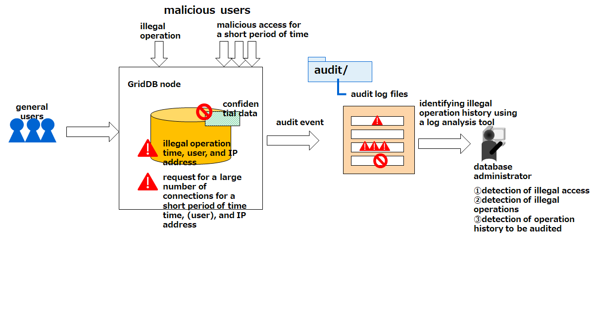
  <figcaption>Database audit using audit logs</figcaption>
</figure>

### Overview of the feature

Audit logs record a history of access to databases, operations, and errors. More specifically, the following three events are recorded as audit logs:

 - Access logs
    - Logs that record a history of connections, disconnections, and login authentication. 
 - Operational logs
    - Logs that record a history of connections, disconnections, and login authentication. 
 - Error logs
    - Logs that record a history of errors that have occurred during operations performed in response to the request of a client.

Audit logs are enabled if the audit log feature is set to true (auditLogs=true) in the node definition file. When doing so, it is possible to specify a directory path (auditLogsPath) where audit log files are output. With all these settings, audit log files with the following file name are generated.

```
gs_audit-%Y%m%d-n.log (n denotes the order in which files are generated on the same day.)
```

Unlike event logs, audit logs must be enabled in the node definition file in order to generate audit log files and their directories; otherwise, they are not generated.

Audit log files are switched in the following cases. The file size limit (auditMessageLimit Size) can be modified in the node definition file.

-   The first log after midnight is passed is created.
-   The node is restarted.
-   The size of a single file exceeds the default value (10 MB).

Audit logs are output in CSV format, with each audit item separated by a space as shown below:

```
(date and time) (host name) (thread number) (output level) (category) [(error trace number):(error trace name)] (user name) (administrator privilege) (database name) (application name) (IP address from which connection originated:port number from which connection originated) (connection destination IP address:connection destination port number) (operation class) (request type) (operation content) (operation target) (operation identifier) (operation details)
```

Below is an output sample of audit logs. Note that subsequent samples include line breaks to format the command for reading. 

``` example

2023-03-24T17:26:26.359+09:00 TDSL1234 14268 ERROR AUDIT_DDL
[280003:SQL_DDL_TABLE_ALREADY_EXISTS] user1 admin db1 (null)
192.0.2.1:63482 203.0.113.1:20001 SQL CREATE_TABLE
"create table table1(a integer);"
e71c8b74-8752-4726-987d-ebd0e8da8d4:1 
"'tableName'=['table1']
Execute SQL failed (reason=CREATE TABLE failed
(reason=Specified create table 'table1' already exists)
on executing statement..."
```

Using the audit log feature, generally, incurs a performance overhead (cost of writing to files) in proportion to the number of audit log outputs. For this reason, consider selecting operations to be audited in each operating environment.

Operations to be audited are categorized into the following "operation categories" based on the operation content. The output levels settings are the same as those for event logs, but in audit logs, they have different meaning as explained below:

- INFO: records operational logs and error logs as audit logs. (*1)
- ERROR: records error logs as audit logs.
- CRITICAL: do not record any audit logs including error logs. (*2)

  (*1 Access logs are recorded instead of operational and error logs only when AUDIT_CONNECT is enabled.)
  (*2 At CRITICAL level, no items are recorded as audit logs.)

| operation category | definition of parameters and their limits | default output level |
|-------------|------------------------|--------------------|
| AUDIT_CONNECT | output level of audit logs related to connection (including disconnection and authentication) | INFO |
| AUDIT_SQL_READ | output level of audit logs related to SQL (SELECT) | CRITICAL |
| AUDIT_SQL_WRITE | output level of audit logs related to SQL (DML) | CRITICAL |
| AUDIT_DDL | output level of audit logs related to SQL (DDL) | CRITICAL |
| AUDIT_DCL | output level of audit logs related to SQL (DCL) | CRITICAL |
| AUDIT_NOSQL_READ | output level of audit logs related to NoSQL for executeQuery operation | CRITICAL |
| AUDIT_NOSQL_WRITE | output level of audit logs related to NoSQL for executeUpdate operation | CRITICAL |
| AUDIT_SYSTEM | output level of audit logs for operating commands other than STAT | CRITICAL |
| AUDIT_STAT |  output level of audit logs for the operating command STAT  | CRITICAL |

The default output level is INFO for access logs (AUDIT_CONNECT); for others it is CRITICAL, which means "not to be audited." As such, when audit logs are enabled in the node definition file, only access logs are recorded. For this reason, before starting operation, the database administrator needs to set appropriate operation categories to be audited according to audit purposes. 

The database administrator can specify operation categories to be audited in the node definition file, or online. In the latter case, the status of the settings can be checked using the command gs_logconf just like event logs. But in this online method, the settings are not persisted and return to the original operation categories. For this reason, it is strongly recommended to determine audit categories before starting operation.

The followings are the setting items related to audit logs that are specified in the node definition file.

| audit category | initial value | &nbsp; definition of parameters and their limits &nbsp; | modification made after |
|------------|-------|------------------------|------|
| /trace/auditLogs | false |  Set the category to "true" to enable audit logs. | startup |
| /trace/auditLogsPath | "" |  This refers to a directory where audit log files are placed.  The default directory name is audit. <br>If a directory named audit does not exist in the specified path at startup, a directory for audit logs and audit log files are created based on the settings. <br>If auditLog is set to "true" and this particular audit category is not set, they are created in the GridDB home directory. | startup |
| /trace/auditFileLimit | 10 MB | This refers to the upper size limit of a single audit log file on the same date.  <br>If the file size exceeds the specified limit, a new audit log file will automatically be created to which audit log files are switched. <br>At the same time, the serial number contained in the name of this new audit log file is incremented by one.  | startup |
| /trace/auditMessageLimit | 1024 | This refers to the upper string size limit of a single audit log record. <br>If the string size exceeds the specified limit, only the information within the specified size is recorded as audit logs, and the rest is omitted.  | startup |

### Procedure to perform audit logs

As a preliminary for performing a database audit, determine operation categories and their output levels that are to be audited. Output levels are specified in the same way as audit logs, but in this case, note that the output level should be set to "CRITICAL" to exclude logs from logs to be audited.

- To obtain access logs: AUDIT_CONNECT=INFO
- To obtain operational logs: operation category=INFO
- To obtain error logs: operation category=ERROR
- Do not obtain any logs including error logs: operation category=CRITICAL

Below are some of the typical policies for setting audit categories. Of all logs, "access logs" are the most important item for audit purposes. For this reason, if the audit log feature is enabled, access logs will be set to be audited by default. For operational and error logs, add the description in the node definition file for each audit request according to their needs. 
- Record access logs.
    - When audit logs are enabled by setting auditLogs to "true", access logs are output by default.

- Record only access logs to databases and error logs.
    - Set AUDIT_CONNECT to INFO; set the remaining operation categories to ERROR.

- Record only SQL-related operational logs and error logs.
    - Set AUDIT_SQL_READ, AUDIT_SQL_WRITE, AUDIT_DDL, and AUDIT_DCL to INFO; set the remaining operation categories to ERROR.

- Record operational logs related to executeUpdate operation but do not record those related to executeQuery operation. In addition, record all the error logs.
    - Set AUDIT_SQL_WRITE and AUDIT_NOSQL_WRITE to INFO; set the remaining operation categories to ERROR.
    - For operation categories to which ERROR is set, operational logs are not recorded; only error logs are recorded. 

- Exclude all NoSQL-related operations from an audit.
    - Set AUDIT_NOSQL_READ and AUDIT_NOSQL_WRITE to CRITICAL. In this case, error logs are not output as audit logs even when an error occurs, not to mention operational logs.

- Record all operations to be audited.
    - The following are all set to INFO: AUDIT_CONNECT, AUDIT_SQL_READ, AUDIT_SQL_WRITE, AUDIT_DDL, AUDIT_DCL, AUDIT_NOSQL_READ, AUDIT_NOSQL_WRITE, AUDIT_STAT, and AUDIT_SYSTEM.

Below is the system configuration using audit logs.

<figure>
  
  <figcaption>System configuration using audit logs</figcaption>
</figure>


Audit logs are output on the node to which the client has directly connected. That is, audit logs are recorded on a per-node basis, which means that the following actions are required:

- Make the setting items for audit logs on all nodes identical in advance.
- When modifying operation categories to be audited online, apply the modification made to all nodes. Another thing to note is that because the result of online modification is not persisted, make sure to update the node definition file during the next restart.
- To analyze audit logs, collect audit log information for each node and analyze audit logs across all nodes. 

### Analysis using audit logs

The output items for audit logs have the same output format for access logs, operational logs, and event logs. The following table gives the details of audit log output items. For optional items where no applicable item is found, the output would be the string "null".

| audit item|&nbsp;definition&nbsp;|sample|data type|required or optional|
|----------------|---------------------------------|----------------------------------|-----|----|
| date and time | The format is yyyy-MM-ddTHH:mm:ss.ms+tz |2023-03-24T17:26:26.359+09:00| time type | required |
| host name | name of the calling host | tdsl1234 | string type | required |
| thread number | thread ID obtained from the system | 2345 | numerical type | required|
| output level | INFO, ERROR, or CRITICAL | INFO | string type | required |
| operation category | operation categories to be audited | AUDIT_CONNECT | string type | required | 
| error/trace information | [error/trace code number:error/trace code name] | [280003:SQL_DDL_TABLE_ALREADY_EXISTS] | string type | required |
| user name | login user name | user1 | string type |optional |
| administrator privilege | either ADMIN or USER| ADMIN | string type | optional |
| database name | PUBLIC if unspecified, if specified, the name of the specified database | db1 | string type |optional |
| application name | applicable only when set by the client | app1 | string type |optional |
| IP address from which connection originated | IP address from which connection (on the client side) originated and the port number <br>The IP address should be in IPv4 format and of string type; the port number is of numeric type, separated by a colon (:). | 192.0.2.1:63482 | string type | optional |
| connection destination IP address | IP address and port number of a connection destination (on the server side)<br>The IP address is in IPv4 format and of string type; the port number is of numeric type, separated by a colon (:). | 203.0.113.1:20001 | string type | optional |
| operation class | string equal to the string  subsequent to "AUDIT_ " in operation category names. | CONNECT | string type | optional |
| request type | SQL, NOSQL, or SYSTEM | SQL | string type | optional |
| operation content | With the request type SQL, SELECT, DML, DDL, or DCL. For  NoSQL, a command name corresponding to the API. For control commands, the command name. | SELECT | string type | optional |
| operation target | With the request type SQL, the name of the SQL. For NoSQL, the name of a target container or the name of an index. For control commands, the command name.　| SELECT * from table1 | string type | optional |
| operation identifier | statement identifier (internal information)<br>string resulting from dividing UUID consisting of 32 characters into five substrings consisting of 8, 4, 4, 4, and 12 characters, respectively, each separated by "-" with a colon (:) and an arbitrary identification number attached at the end. | 6a4ccd7a-818a-45e8-88c7-1ebda78d1959:1 | string type | optional | 
| operation details | operation details about operational logs <br>An error message is output in the event of an error<br>If necessary, information is added to the message in the following key-value format. <br>'key name' = ['value 1', 'value 2',...] | "'tableName'=['table1'] Execute SQL failed (reason=CREATE TABLE failed ..." | optional |

SQLに対する操作対象のテーブル名は解析内容によっては対象が複数個数になることがあります。これらは、操作情報詳細'tableName'=['テーブル名1', 'テーブル名2'...]の項目が追加されます。

Below are some samples.

a) Obtaining access logs

Set AUDIT_CONNECT to INFO and establish the following connection using JDBC.

```
Connection con = DriverManager.getConnection(url, user, password);
```

In this case, the following audit logs are output, where you can find information including the user name (user1), IP address (192.0.2.1:63482), and the target database (db1) is recorded.
```
023-03-27T17:16:13.507+09:00 TDSL1234 1848 INFO AUDIT_CONNECT
[10917:TXN_AUDIT_CALLED]
user1 user db1 app1
192.0.2.1:63482 203.0.113.1:50001
SQL CONNECT 
"" 0000-00-00-00-000000:0 ""
```

Once the connection is closed or destroyed, the following audit logs are output.

```
2023-03-24T17:46:15.723+09:00 TDSL1234 1848 INFO AUDIT_CONNECT
[10917:TXN_AUDIT_CALLED]
user1 user db1 app1
192.0.2.1:63482 203.0.113.1:50001 
SQL DISCONNECT 
"" 0000-00-00-00-000000:0 ""
```

b) Obtaining operational logs

Set AUDIT_SQL_READ to INFO and execute the following SQL statement using JDBC.

``` example
SELECT * FROM table1 A, table2 B WHERE A.col1 = B.col2
```

In this case, the following audit logs are output, where the following operational information is recorded as part of audit logs in addition to the connection information recorded in access logs:
-strings of an executed SQL statement (SELECT * FROM table1 A, ...),
-SQL type (SELECT),
-operation identifier (282d7b10-...), and
-a list of table names to be accessed (tables 1 and 2)
Analyze these operational logs.

```
2023-03-24T17:06:53.848+09:00 TDSL1234 16812 INFO AUDIT_SQL_READ [200909:SQL_EXECUTION_INFO]
user1 user db1 app1
192.0.2.1:63482 203.0.113.1:50001 
SQL SELECT "SELECT * FROM table1 A, table2 B WHERE A.col1 = B.col2"
282d7b10-f7f0-4dd8-bef-25eb30e5c2f4:5
"'tableName'=['table1','table2']"
```

c) Analyzing error logs

Set AUDIT_SQL_READ to INFO or ERROR and execute the following SQL statement using JDBC. This query results in an error because table1 does not have the notFoundColumn column.

```
SELECT notFoundColumn FROM table1
```

In this case, the following error logs are output:
```
2023-03-24T17:24:23.278+09:00 TDSL1234 25464 ERROR AUDIT_SQL_READ
[240008:SQL_COMPILE_COLUMN_NOT_FOUND]
user1 user db1 app1
192.0.2.1:63482 203.0.113.1:50001 SQL
SELECT "SELECT notFoundColumn FROM table1"
282d7b10-f7f0-4dd8-bef-25eb30e5c2f4:6 
"'tableName'=['table1']
Column not found (name=notFoundColumn) on executing statement..."
```

d) Analyzing categories outside the scope of an audit

Set AUDIT_SQL_READ to CRITICAL and execute the following SQL statement in a similar manner.

```
SELECT notFoundColumn FROM table1
```

Unlike c), no output is recorded in audit logs even in the event of an error.

```
```

## Checking operation state

### Performance and statistical information

GridDB performance and statistical information can be checked in GridDB using the operating command gs_stat. gs_stat represents information common in the cluster and performance and statistical information unique to the nodes.

Among the outputs of the gs_stat command, the performance structure is an output that is related to the performance and statistical information.

An example of output is shown below. The output contents vary depending on the version.

``` example
-bash-4.1$ gs_stat -u admin/admin -s 192.168.0.1:10040
{
    :
    "performance": {
        "batchFree": 0,
        "dataFileSize": 65536,
        "dataFileUsageRate": 0,
        "checkpointWriteSize": 0,
        "checkpointWriteTime": 0,
        "currentTime": 1428024628904,
        "numConnection": 0,
        "numTxn": 0,
        "peakProcessMemory": 42270720,
        "processMemory": 42270720,
        "recoveryReadSize": 65536,
        "recoveryReadTime": 0,
        "sqlStoreSwapRead": 0,
        "sqlStoreSwapReadSize": 0,
        "sqlStoreSwapReadTime": 0,
        "sqlStoreSwapWrite": 0,
        "sqlStoreSwapWriteSize": 0,
        "sqlStoreSwapWriteTime": 0,
        "storeDetail": {
            "batchFreeMapData": {
                "storeMemory": 0,
                "storeUse": 0,
                "swapRead": 0,
                "swapWrite": 0
            },
            "batchFreeRowData": {
                "storeMemory": 0,
                "storeUse": 0,
                "swapRead": 0,
                "swapWrite": 0
            },
            "mapData": {
                "storeMemory": 0,
                "storeUse": 0,
                "swapRead": 0,
                "swapWrite": 0
            },
            "metaData": {
                "storeMemory": 0,
                "storeUse": 0,
                "swapRead": 0,
                "swapWrite": 0
            },
            "rowData": {
                "storeMemory": 0,
                "storeUse": 0,
                "swapRead": 0,
                "swapWrite": 0
            }
        },
        "storeMemory": 0,
        "storeMemoryLimit": 1073741824,
        "storeTotalUse": 0,
        "swapRead": 0,
        "swapReadSize": 0,
        "swapReadTime": 0,
        "swapWrite": 0,
        "swapWriteSize": 0,
        "swapWriteTime": 0,
        "syncReadSize": 0,
        "syncReadTime": 0,
        "totalLockConflictCount": 0,
        "totalReadOperation": 0,
        "totalRowRead": 0,
        "totalRowWrite": 0,
        "totalWriteOperation": 0
    },
    :
}
```

Information related to performance and statistical information is explained below. The description of the storeDetail structure is omitted as this is internal debugging information.
-   The type is shown below.
    -   CC: Current value of all cluster
    -   c: Current value of specified node
    -   CS: Cumulative value after service starts for all clusters
    -   s: Cumulative value after service starts for all nodes
    -   CP: Peak value after service starts for all clusters
    -   p: Peak value after service starts for all nodes
-   Check the event figure to be monitored, and show the items that ought to be reviewed in continuing with operations.

| Output parameters | Type | Description | Event to be monitored |
|----------------------------|------|-----------------------------------------------------|-----|
| dataFileSize               | c    | Data file size (in bytes)                                    |     |
| dataFileUsageRate          | c    | Data file usage rate                                           |     |
| checkpointWrite            | s    | the number of writes checkpoint processing performs to data files |     |
| checkpointWriteSize        | s    | the size of writes to data files during checkpoint processing (in bytes) |     |
| checkpointWriteTime        | s    | the elapsed time to be spent by writing to data files during checkpoint processing (in milliseconds) |     |
| checkpointWriteCompressTime| s    | the elapsed time to be spent by compressing data written to data files during checkpoint processing (in milliseconds) |     |
| dataFileAllocateSize       | c    | The total size of blocks allocated to data files (in bytes)           |     |
| currentTime                | c    | Current time                                                                |     |
| numConnection              | c    | Current no. of connections. Number of connections used in the transaction process, not including the number of connections used in the cluster process. Value is equal to the no. of clients + no. of replicas \* no. of partitions retained.  | If the no. of connections is insufficient in monitoring the log, review the connectionLimit value of the node configuration.|
| numSession                 | c    | Current no. of sessions                                                      |     |
| numTxn                     | c    | Current no. of transactions                                                |     |
| peakProcessMemory          | p    | Peak value of the memory used in the GridDB server, including the storememory value which is the maximum memory size (byte) used in the process | If the peakProcessMemory or processMemory is larger than the installed memory of the node and an OS Swap occurs, additional memory or a temporary drop in the value of the storeMemoryLimit needs to be considered. |
| processMemory              | c    | Memory space used by a process (byte)                                            |     |
| recoveryReadSize           | s    | Size read from data files in the recovery process (in bytes)            |     |
| recoveryReadTime           | s    | Time taken to read data files in the recovery process (in milliseconds)              |     |
| sqlStoreSwapRead           | s    | Read count from the file by SQL store swap processing     |     |
| sqlStoreSwapReadSize       | s    | Read size from the file by SQL store swap processing (byte) |     |
| sqlStoreSwapReadTime       | s    | Read time from the file by SQL store swap processing (ms)   |     |
| sqlStoreSwapWrite          | s    | Write count to the file by SQL store swap processing      |     |
| sqlStoreSwapWriteSize      | s    | Write size to the file by SQL store swap processing (byte)  |     |
| sqlStoreSwapWriteTime      | s    | Write time to the file by SQL store swap processing (ms)     |     |
| storeMemory                | c    | Memory space used in an in-memory database (byte)                     |     |
| storeMemoryLimit           | c    | Memory space limit used in an in-memory database (byte)                 |     |
| storeTotalUse              | c    | Full data capacity (byte) retained by the nodes, including the data capacity in the database file  |     |
| swapRead                   | s    | Read count from the file by swap processing                                                     |     |
| swapReadSize               | s    | Read size from the file by swap processing (byte)                                     |     |
| swapReadTime               | s    | Read time from the file by swap processing (ms)                                              |     |
| swapWrite                  | s    | Write count to the file by swap processing                                                     |     |
| swapWriteSize              | s    | Write size to the file by swap processing (byte)                                     |     |
| swapWriteTime              | s    | Write time to the file by swap processing (ms)                                              |     |
| swapWriteCompressTime      | s    | Compression time of write data to the file by swap process (ms)  |     |
| syncReadSize               | s    | Size of files to read from sync data files (in bytes)                                      |     |
| syncReadTime               | s    | Time taken to read files from sync data files (in milliseconds)                                               |     |
| totalLockConflictCount     | s    | Row lock competing count                                                     |     |
| totalReadOperation         | s    | Search process count                                                              |     |
| totalRowRead               | s    | Row reading count                                                           |     |
| totalRowWrite              | s    | Row writing count                                                         |     |
| totalWriteOperation        | s    | Insert and update process count                                                          |     |

[Memo]
-   Data is aggregated for each node. To aggregate data for each database, execute an SQL statement on the metatable "#database_stats".

### Container placement information

Containers (tables) and partitioned tables in a GridDB cluster are automatically distributed to each node.  By using operation management tools or SQL, it is possible to check which container (table) is placed on each node.

This function is used to:
-   Check containers placed on a node when the database size of each node is not balanced.
-   find backup location of the node where specified container is placed on.

[Note]
-   See the [Data model](#data_model) for the description of the container and partition.
-   When the autonomous data placement is executed by a node down or a node failure, the placement of containers may be changed. The placement of containers is not persistent.

The placement information of containers (tables) is checked by the following methods.

#### Getting container (table) list of node[Enterprise Edition]

To get container (table) list of a node, use "Container list screen" of integrated operation control GUI (gs_admin).

1.  Login to gs_admin.

2.  After selecting the "ClusterTree" tab on the left tree view and selecting a node, click "Container" tab on the right frame.

3.  Container list placed on the node is displayed.

[Note]
-   For partitioned table, the management table is only displayed. Data partitions are not displayed.

#### Checking owner node of container (table)

To check node where specified container is placed on, use gs_sh and operation command (gs_partition).

1.  Perform gs_sh sub-command "showcontainer" to check ID of the partition which has specified container.  The partition ID is displayed as "Partition ID".

2.  Perform gs_sh sub-command "configcluster" to check master node.  M is displayed as "Role" for the master node.

3.  Specify the partition ID, which was identified in the procedure 1., as the argument-n, and execute gs_partition in the master node.  The "/owner/address" in the displayed JSON shows the owner node of the container (table).

[Example]
-   Getting a particular partition information.

``` example
$ gs_partition -u admin/admin -n 5
[
    {
        "backup": [],
        "catchup": [],
        "maxLsn": 300008,
        "owner": {
            "address": "192.168.11.10",    -> The IP address of the owner node is 192.168.11.10.
            "lsn": 300008,
            "port": 10010
        },
        "pId": "5",
        "status": "ON"
    }
]
```

[Note]
-   When performing the gs_partition on a node except the master node, the information of the partition may not be correct.

[Note]
-   When specifying partitioned table, the placement information of the management table is only displayed.  The placement information of the data partitions is not displayed.

#### Checking node of data partition

A partitioned container (table) divides and stores data in two or more internal containers (data partition).  The data distribution of the partitioned container (table) can be obtained by checking the nodes to which these data partitions are distributed.

Check the partition ID of the data partition in the container (table) and search the node to which the data partition is distributed. The procedure is as follows.

1.  Check the ID of the partition which has the data partition of the specified container (table).

-   To check the ID, use the meta-table "\#table_partitions", which includes information, such as the container names of all the data partitions, partition IDs, and so on.
-   Perform SQL on the metatable "\#table_partitions" using the "SQL screen" of the integrated operation control management GUI (gs_admin) or the "sql" sub-command of the interpreter (gs_sh). Specify the name of a container as the "TABLE_NAME" column condition in a where clause.
-   Check the "CLUSTER_PARTITIONINDEX" column to identify the partition ID from the search results in the specified container.

2.  Use the partition ID to search the node to which the data partition is distributed.

-   To check the node to which the data partition is distributed using the partition ID, execute a gs_partition command in a master node.
-   Perform gs_sh sub-command "configcluster" to check master node. M is displayed as "Role" for the master node.
-   Specify the partition ID, which was identified in the procedure 1., as the argument-n, and execute gs_partition in the master node.  The "/owner/address" in the displayed JSON shows the owner node of the container (table).
-   Only one partition ID can be specified for -n. If -n is not specified, information for all partitions is displayed.

[Example]
-   Displaying the addresses of the nodes where each data partition of partitioned table "hashTable" is placed on.

``` example
select DATABASE_NAME, TABLE_NAME, CLUSTER_PARTITION_INDEX from "#table_partitions" where TABLE_NAME='hashTable1';

DATABASE_NAME,TABLE_NAME,CLUSTER_PARTITION_INDEX
public,hashTable1,1
public,hashTable1,93
public,hashTable1,51
public,hashTable1,18
public,hashTable1,32  ->The number of data partitions of 'hashTable1'is 5 and the partition IDs stored in it are 1, 93, 51, 18, 32.
```

-   2 Check the node where the data partition with the partition ID 1 is distributed. (For other partition IDs 93, 51, 18, and 32, check in the same way)

``` example
$ gs_partition -u admin/admin -n 1
[
    {
        "backup": [],
        "catchup": [],
        "maxLsn": 200328,
        "owner": {
            "address": "192.168.11.15",    -> The IP address of the owner node is 192.168.11.15.
            "lsn": 200328,
            "port": 10010
        },
        "pId": "1",
        "status": "ON"
    }
]
```

[Note]
-   The schema of the metatable "\#table_partitions" may be changed in future version.

[Note]
-   See the [GridDB SQL reference](GridDB_SQL_Reference.md) for the details of the metatable schema.


## Operating tools for the system

GridDB provides the following tools for operating clusters and nodes, operating data, such as creating containers, exporting and/or importing.

<figure>
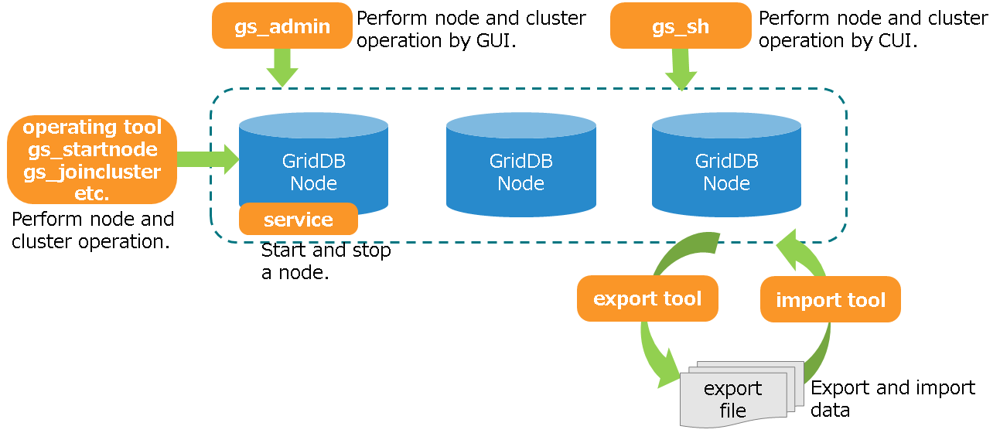
<figcaption>List of operation tools</figcaption>
</figure>

| Name                                                   | Displayed information |
|------------------------------------------|--------------------------------------------------------------------|
| Service                                                | Linux service management tools to start and/or stop GridDB nodes.          |
| Integrated operation control GUI (gs_admin)           | Web-based integrated operation control GUI (gs_admin) for the operating functions of GridDB clusters.|
| Cluster operation control command interpreter (gs_sh) | CUI tool for operation management and data manipulation of GridDB clusters.|
| Operating commands                                     | Commands to perform the operating functions of GridDB clusters. . |
| Exporting/importing tool                               | Export/import data. |


<a id="operating_commands"></a>

### Operating commands

The following commands are available in GridDB. The following commands are available in GridDB. All the operating command names of GridDB start with gs_.

| Type               | Command             | Functions                |
|----------------------|--------------------|---------------------|
| Node operations    | gs_startnode       | start node         |
|                      | gs_stopnode        | stop node         |
| Cluster operations | gs_joincluster     | Join a node to a cluster. Join to cluster configuration |
|                      | gs_leavecluster    | Cause a particular node to leave a cluster. Used, when causing a particular node to leave from a cluster for maintenance. The partition distributed to the node to leave the cluster will be rearranged (rebalance). |
|                      | gs_stopcluster     | Cause all the nodes, which constite a cluster, to leave the cluster. Used for stopping all the nodes. The partitions are not rebalanced when the nodes leave the cluster. |
|                      | gs_config          | Get cluster configuration data      |
|                      | gs_stat            | Get cluster data         |
|                      | gs_appendcluster[EE only]   | Add a node to the cluster in a STABLE state.      |
|                      | gs_failovercluster[EE only] | Do manual failover of a cluster Used also to start a service accepting a data lost. Used also to start a service accepting a data lost.     |
|                      | gs_partition       | Get partition data        |
|                      | gs_loadbalance[EE only]     | Set autonomous data redistribution        |
| User management    | gs_adduser         | Registration of administrator user         |
|                      | gs_deluser         | Deletion of administrator user        |
|                      | gs_passwd          | Change a password of an administrator user         |
| Log data           | gs_logs            | Display recent event logs     |
|                      | gs_logconf         | Display and change the operation categories and output levels to be output to event and audit logs.|
| Restoring a backup | gs_backup[EE only]          | Collect backup data        |
|                      | gs_backuplist[EE only]      | Display backup data list          |
|                      | gs_restore[EE only]         | Restore a backup data           |
| Import/export      | gs_import          | Import exported containers and database on the disk       |
|                      | gs_export          | Export containers and database as CSV or ZIP format to the disk     |
| Maintenance        | gs_paramconf       | Display and change parameters    |
|                 | gs_authcache[EE only]  | Listing and deleting cache for user information for faster authentication of general users and of LDAP.   |


<a id="integrated_operation_control"></a>
### Integrated operation control GUI (gs_admin)[Enterprise Edition]

The integrated operation control GUI (hereinafter referred to gs_admin) is a Web application that integrates GridDB cluster operation functions. gs_admin is an intuitive interface that provides cluster operation information in one screen (dashboard screen). start and stop operation to individual nodes constituting the cluster, check performance information, etc.

<figure>
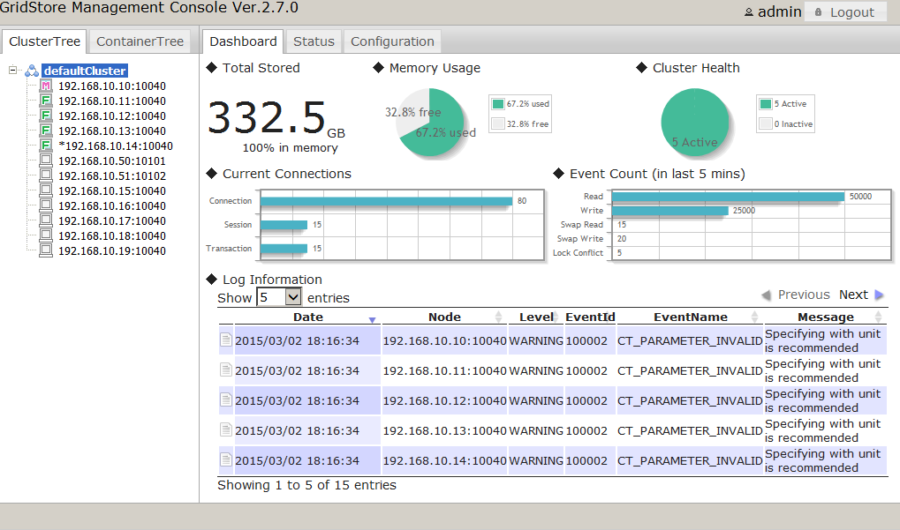
<figcaption>Gs_admin dashboard screen</figcaption>
</figure>

gs_admin also supports the following functions to support development, so it can be used effectively in the development stage of the system.
-   Create and drop database, manage general user
-   Create, drop and search container
-   Create and drop indexes
-   Execute TQL/SQL statement to container
-   Execute SQL


<a id="label_gs_sh"></a>
### Cluster operation control command interpreter (gs_sh)

The cluster operation control command interpreter (hereinafter referred to gs_sh) is a command line interface tool to manage GridDB cluster operations and data operations. While operating commands provide operation on a per-node basis, gs_sh provides interfaces for processing on a per-cluster basis. In addition to user management operations, it also provides data manipulation such as creating databases, containers and tables, and searching by TQL or SQL.

There are two types of start modes in gs_sh. Interactive mode: specify sub-command interactively to execute processing, Batch mode: Execute a script file containing a series of operations with sub-commands. Use of batch script enables automation of operation verification at development and labor saving of system construction.

``` example
// Interactive mode
$ gs_sh
// start gs_sh and execute sub-command "version"
gs> version

// Batch mode: execute a script file specified as an argument
$gs_sh test.gsh
```

gs_sh provides, cluster operations such as starting a node, starting a cluster, and data manipulation, such as creating containers.

- Cluster operations
  - Starting and stopping a node, starting and stopping a cluster, displaying the state of a node and a cluster, etc.

- Data operation
  - Creating containers, building an index, executing TQL and SQL, etc.


<a id="label_parameters"></a>
# Parameter

Describes the parameters to control the operations in GridDB. In the GridDB parameters, there is a node definition file to configure settings such as the setting information and usable resources etc., and a cluster definition file to configure operational settings of a cluster.  Explains the meanings of the item names in the definition file and the settings and parameters in the initial state.

The unit of the setting is set as shown below.

-   The byte size can be specified in the following units: TB, GB, MB, KB, B, T, G, M, K, or lowercase notations of these units. Unit cannot be omitted unless otherwise stated.

-   Time can be specified in the following units: h, min, s, ms. Unit cannot be omitted unless otherwise stated.

  

## Cluster definition file (gs_cluster.json)


The same setting in the cluster definition file needs to be made in all the nodes constituting the cluster. As the partitionNum and storeBlockSize parameters are important parameters to determine the database structure, they cannot be changed after GridDB is started for the first time.

The meanings of the various settings in the cluster definition file are explained below.

The system can be caused to recognize an item not included in the initial state by adding its name as a property. In the change field, indicate whether the value of that parameter can be changed and the change timing.
-   Disallowed: Node cannot be changed once it has been started. The database needs to be initialized if you want to change the setting.
-   Restart: Parameter can be changed by restarting all the nodes constituting the cluster.
-   Online: Parameters that are currently in operation online can be changed. However, the contents in the definition file need to be manual amended as the change details will not be perpetuated.

  

| Configuration of GridDB | Default   | Meaning of parameters and limitation values | Change     |
|----------------------------------------------|-----------|--------------------------------------------------|----------|
| /notificationAddress                         | 239.0.0.1 | Standard setting of a multi-cast address. This setting will become valid if a parameter with the same cluster, transaction name is omitted. If a different value is set, the address of the individual setting is valid.  | Restart     |
| /dataStore/partitionNum                      | 128       | Specify a common multiple that will allow the number of partitions to be divided and placed by the number of constituting clusters.  Integer: Specify an integer that is 1 or higher and 10000 or lower.   | Disallowed |
| /dataStore/storeBlockSize                    | 64KB      | Specify the disk I/O size from 64KB,1MB,4MB,8MB,16MB,32MB. Larger block size enables more records to be stored in one block, suitable for full scans of large tables, but also increases the possibility of conflict. Select the size suitable for the system. Cannot be changed after server is started.                                            | Disallowed |
| /cluster/clusterName                         | \-        | Specify the name for identifying a cluster. Mandatory input parameter.              | Restart     |
| /cluster/replicationNum                      | 2         | Specify the number of replicas. Partition is doubled if the number of replicas is 2.             | Restart     |
| /cluster/notificationAddress                 | 239.0.0.1 | Specify the multicast address for cluster configuration                      | Restart     |
| /cluster/notificationPort                    | 20000     | Specify the multicast port number for cluster configuration. Specify a value within a range that can be specified as a port number.  | Restart     |
| /cluster/notificationInterval                | 5s        | Multicast period for cluster configuration.  Specify the value more than 1 second and less than 2<sup>31</sup> seconds.     | Restart     |
| /cluster/heartbeatInterval                   | 5s        | Specify a check period (heart beat period) to check the node survival among clusters.  Specify the value more than 1 second and less than 2<sup>31</sup> seconds.  | Restart     |
| /cluster/loadbalanceCheckInterval            | 180s      | To adjust the load balance among the nodes constituting the cluster, specify a data sampling period, as a criteria whether to implement the balancing process or not.  Specify the value more than 1 second and less than 2<sup>31</sup> seconds.                                         | Restart     |
| /cluster/notificationMember                  | \-        | Specify the address list when using the fixed list method as the cluster configuration method.            | Restart     |
| /cluster/notificationProvider/url            | \-        | Specify the URL of the address provider when using the provider method as the cluster configuration method.   | Restart     |
| /cluster/notificationProvider/updateInterval | 5s        | Specify the interval to get the list from the address provider. Specify the value more than 1 second and less than 2<sup>31</sup> seconds.   | Restart     |
| /sync/timeoutInterval                        | 30s       | Specify the timeout time during data synchronization among clusters.   If a timeout occurs, the system load may be high, or a failure may have occurred.  Specify the value more than 1 second and less than 2<sup>31</sup> seconds.      | Restart     |
| /cluster/rackZoneAwareness | none            | Specify whether to use the rack-zone awareness feature. | Restart     |
| /transaction/notificationAddress             | 239.0.0.1 | Multi-cast address that a client connects to initially. Master node is notified in the client.      | Restart     |
| /transaction/notificationPort                | 31999     | Multi-cast port that a client connects to initially. Specify a value within a specifiable range as a multi-cast port no.    | Restart     |
| /transaction/notificationInterval            | 5s        | Multi-cast period for a master to notify its clients. Specify the value more than 1 second and less than 2<sup>31</sup> seconds.           | Restart     |
| /transaction/replicationMode                 | 0         | Specify the data synchronization (replication) method when updating the data in a transaction. Specify a string or integer, "ASYNC"or 0 (non-synchronous), "SEMISYNC"or 1 (quasi-synchronous).             | Restart     |
| /transaction/replicationTimeoutInterval      | 10s       | Specify the timeout time for communications among nodes when synchronizing data in a quasi-synchronous replication transaction. Specify the value more than 1 second and less than 2<sup>31</sup> seconds.                              | Restart     |
| /transaction/authenticationTimeoutInterval   | 5s        | Specify the authentication timeout time.                             | Restart       |
| /transaction/useMultitenantMode   | false       | Use this parameter to display items related to data management information included in database statistics (#database_stats). If no value is specified, the corresponding items are displayed as having unspecified values.                            | Restart  |
| /sql/notificationAddress                     | 239.0.0.1 | Multi-cast address when the JDBC/ODBC client is connected initially. Master node is notified in the client.  | Restart     |
| /sql/notificationPort                        | 41999     | Multi-cast port when the JDBC/ODBC client is connected initially. Specify a value within a specifiable range as a multi-cast port no. | Restart     |
| /sql/notificationInterval                    | 5s        | Multi-cast period for a master to notify its JDBC/ODBC clients. Specify the value more than 1 second and less than 2<sup>31</sup> seconds.      | Restart     |
| /sql/costBasedJoin                    | true        | Specifies whether to use the cost-based method for determining join order during SQL plan generation. If set to false, it uses the rule-based method to determine join order. The default value is true, which indicates the cost-based method.      | Restart     |
| /security/authentication | INTERNAL  | Specify either INTERNAL (internal authentication) or LDAP (LDAP authentication) as an authentication method to be used. | Restart     |
| /security/ldapRoleManagement | USER  | Specify either USER (mapping using the LDAP user name) or GROUP (mapping using the LDAP group name) as to which one the GridDB role is mapped to. | Restart     |
| /security/ldapUrl   |  | Specify the LDAP server with the format: ldaps://host[:port] | Restart     |
| /security/ldapUserDNPrefix |   | To generate the user's DN (identifier), specify the string to be concatenated in front of the user name. | Restart     |
| /security/ldapUserDNSuffix |  | To generate the user's DN (identifier), specify the string to be concatenated after the user name. | Restart     |
| /security/ldapBindDn |   | Specify the LDAP administrative user's DN. | Restart     |
| /security/ldapBindPassword |  | Specify the password for the LDAP administrative user. | Restart     |
| /security/ldapBaseDn |  | Specify the root DN from which to start searching. | Restart     |
| /security/ldapSearchAttribute | uid  | Specify the attributes to search for. | Restart     |
| /security/ldapMemberOfAttribute | memberof | Specify the attributes where the group DN to which the user belongs is set (valid if ldapRoleManagement=GROUP).     |
| /system/serverSslMode | DISABLED  | For SSL connection settings, specify DISABLED (SSL invalid), PREFERRED (SSL valid, but non-SSL connection is allowed as well), or REQUIRED (SSL valid; non-SSL connection is not allowed ). | Restart     |
| /system/sslProtocolMaxVersion | TLSv1.2 | As a TLS protocol version, specify either TLSv1.2 or TLSv1.3. | Restart     |  


## Node definition file (gs_node.json)

A node definition file defines the default settings of the resources in nodes constituting a cluster. In an online operation, there are also parameters whose values can be changed online from the resource, access frequency, etc., that have been laid out.

The meanings of the various settings in the node definition file are explained below.

The system can be caused to recognize an item not included in the initial state by adding its name as a property. In the change field, indicate whether the value of that parameter can be changed and the change timing.
-   Disallowed: Node cannot be changed once it has been started. The database needs to be initialized if you want to change the setting.
-   Restart: The value of the parameter can be changed by restarting the target nodes.
-   Online: Parameters that are currently in operation online can be changed. However, the contents in the definition file need to be manual amended as the change details will not be perpetuated.

Specify the directory by specifying the full path or a relative path from the GS_HOME environmental variable. For relative path, the initial directory of GS_HOME serves as a reference point. Initial configuration directory of GS_HOME is /var/lib/gridstore.

| Configuration of GridDB | Default   | Meaning of parameters and limitation values | Change       |
|--------------------------------------|----------------------------|---------------------------------|-----|
| /serviceAddress | \- | Set the initial value of each cluster, transaction, sync service address. The initial value of each service address can be set by setting this address only without having to set the addresses of the 3 items.   | Restart       |
| /dataStore/dbPath | data | The placement directory of data files and checkpoint log files is specified with the full or relative path. | Restart       |
| /dataStore/transactionLogPath  | txnlog | The placement directory of transaction files is specified with the full or relative path.    | Restart       |
| /dataStore/dbFileSplitCount | 0 (no split) | Number of data file splits    | Disallowed       |
| /dataStore/backupPath | backup | Specify the backup file deployment directory path.                                   | Restart       |
| /dataStore/syncTempPath | sync | Specify the path of the Data sync temporary file directory.                                   | Restart       |
| /dataStore/storeMemoryLimit | 1024MB | Upper memory limit for data management                                                        | Online |
| /dataStore/concurrency | 4 | Specify the concurrency of processing.                                                                         | Restart       |
| /dataStore/logWriteMode | 1 | Specify the log writing mode and cycle.  If the log writing mode period is -1 or 0, log writing is performed at the end of the transaction. If it is 1 or more and less than 2<sup>31</sup>, log writing is performed at a period specified in seconds | Restart       |
| /dataStore/persistencyMode | 1(NORMAL) | In the persistence mode, specify the retention period of an update log file during a data update. Specify either 1 (NORMAL) or 2 (RETAINING_ALL_LOG). In "NORMAL", a transaction log file which is no longer required is deleted by a checkpoint. In"RETAINING_ALL_LOG", all transaction log files are retained.  | Restart       |
| /dataStore/affinityGroupSize | 4 | Number of affinity groups | Restart       |
| /dataStore/storeCompressionMode | NO_COMPRESSION | Data block compression mode | Restart       |
| /checkpoint/checkpointInterval | 60s | Checkpoint process execution period to perpetuate a data update block in the memory | Restart       |
| /checkpoint/partialCheckpointInterval | 10 | The number of split processes that write block management information to checkpoint log files during a checkpoint. | Restart       |
| /cluster/serviceAddress | Comforms to the upper serviceAddress | Standby address for cluster configuration | Restart       |
| /cluster/servicePort | 10010 | Standby port for cluster configuration | Restart       |
| /cluster/notificationInterfaceAddress | "" | Specify the address of the interface which sends multicasting packets. | Restart       |
| /cluster/rackZoneId  | ""                       | ID for grouping nodes with the same level of availability together | Restart      |
| /sync/serviceAddress | Comforms to the upper serviceAddress | Reception address for data synchronization among the clusters | Restart       |
| /sync/servicePort | 10020 | Standby port for data synchronization | Restart       |
| /system/serviceAddress | Comforms to the upper serviceAddress | Standby address for operation commands | Restart       |
| /system/servicePort | 10040 | Standby port for operation commands | Restart       |
| /system/eventLogPath | log | Event log file deployment directory path | Restart       |
| /system/securityPath | security  | Specify the full path or relative path to the directory where the server certificate and the private key are placed.  | Restart     |
| /system/serviceSslPort | 10045 | SSL listen port for operation commands | Restart     |
| /transaction/serviceAddress | Conforms to the upper serviceAddress | Standby address for the default transaction processing  | Restart       |
| /transaction/publicServiceAddress | Conforms to the upper serviceAddress | Standby address for transaction processing dedicated to clients | Restart       |
| /transaction/servicePort | 10001 | Standby port for transaction process | Restart       |
| /transaction/connectionLimit | 5000 | Upper limit of the no. of transaction process connections | Restart       |
| /transaction/totalMemoryLimit        | 1024 MB | The maximum size of the memory area for transaction processing. | Restart |
| /transaction/transactionTimeoutLimit | 300s | Transaction timeout upper limit | Restart       |
| /transaction/reauthenticationInterval | 0s (disabled) | Re-authentication interval. (After the specified time has passed, authentication process runs again and updates permissions of the general users who have already been connected.)  The default value, 0 sec, indicates that re-authentication is disabled. | Online       |
| /transaction/workMemoryLimit | 128MB | Maximum memory size for data reference (get, TQL) in transaction processing (for each concurrent processing) | Online       |
| /transaction/notificationInterfaceAddress | "" | Specify the address of the interface which sends multicasting packets. | Restart       |
| /sql/serviceAddress | Conforms to the upper serviceAddress | Standby address for the default NewSQL interface access processing  | Restart       |
| /sql/publicServiceAddress | Conforms to the upper serviceAddress | Standby address for NewSQL interface access processing dedicated to clients | Restart       |
| /sql/servicePort | 20001 | Standby port for New SQL access process | Restart       |
| /sql/storeSwapFilePath | swap | SQL intermediate store swap file directory | Restart       |
| /sql/storeSwapSyncSize | 1024MB | SQL intermediate store swap file and cache size | Restart       |
| /sql/storeMemoryLimit | 1024MB | Upper memory limit for intermediate data held in memory by SQL processing. | Restart       |
| /sql/workMemoryLimit | 32MB | Upper memory limit for operators in SQL processing | Restart       |
| /sql/workCacheMemory | 128MB | Upper size limit for cache without being released after use of work memory. | Restart       |
| /sql/connectionLimit | 5000 | Upper limit of the no. of connections processed for New SQL access | Restart       |
| /sql/concurrency | 4 | No. of simultaneous execution threads | Restart       |
| /sql/traceLimitExecutionTime | 300s | The lower limit of execution time of a query to write in an event log | Online |
| /sql/traceLimitQuerySize | 1000 | The upper size limit of character strings in a slow query (byte) | Online |
| /sql/notificationInterfaceAddress | "" | Specify the address of the interface which sends multicasting packets. | Restart       |
| /sql/addBatchMaxCount | 1000 | The upper limit of rowcount for batch update. | Online       |
| /trace/fileCount | 30 | Upper file count limit for event log files. | Restart       |
| /security/userCacheSize | 1000  | Specify the number of entries for general and LDAP users to be cached.  | Restart     |
| /security/userCacheUpdateInterval | 60  | Specify the refresh interval for cache in seconds. | Restart     |

<a id="audit_configuration"></a>
Settings related to audit logs

| GridDB configuration                         | initial value                    | definition of a parameter and its limits     | <span style="white-space: nowrap;">Change</span>       |
|--------------------------------------|----------------------------|---------------------------------|-----|
| /trace/auditLogs |  false      | Enable the audit log feature | Restart     |
| /trace/auditLogsPath |  ""      | destination path for audit log files | Restart     |
| /trace/auditFileLimit |  ""      | maximum size of an audit log file | Restart     |
| /trace/auditMessageLimit |  ""      | maximum message size for a single audit event in an audit log file. | Restart     |
| /trace/auditConnect |  INFO      | output level of audit logs related to connection (including disconnection and authentication) | Online     |
| /trace/auditSqlRead |  INFO      | output level of audit logs related to SQL (SELECT) | Online     |
| /trace/auditSqlWrite |  INFO      | output level of audit logs related to SQL (DML) | Online |
| /trace/auditDdl |  INFO      | output level of audit logs related to SQL (DDL) | Online    |
| /trace/auditDcl |  INFO      | output level of audit logs related to SQL (DCL) | Online    |
| /trace/auditNosqlRead |  INFO      |  output level of audit logs related to NoSQL for executeQuery operation  | Online     |
| /trace/auditSqlWrite |  INFO      |  output level of audit logs related to NoSQL for executeUpdate operation | Online     |
| /trace/auditSystem |  INFO      | output level of audit logs for operating commands other than  STAT | Online     |
| /trace/auditStat |  INFO      | output level of audit logs for the operating command STAT | Online     |

System limiting values
================

Limitations on numerical value
----------------

| Block size                                                              | 64KB        | 1MB - 32MB          |
|--------------------------------------------|-------------|-------------------|
| STRING/GEOMETRY data size                                               | 31KB        | 128KB             |
| BLOB data size                                                          | 1GB - 1Byte | 1GB - 1Byte       |
| Array length                                                            | 4000        | 65000             |
| No. of columns                                                          | 1024        | Approx. 7K - 32000 (\*1) |
| No. of indexes (Per container)                                          | 1024        | 16000           |
| No. of users                                                            | 128         | 128               |
| No. of databases                                                        | 128         | 128             |
| Number of affinity groups                                               | 10000       | 10000             |
| No. of divisions in a timeseries container with a cancellation deadline | 160         | 160               |
| Size of communication buffer managed by a GridDB node                   | Approx. 2GB | Approx. 2GB             |

| Block size     | 64KB        | 1MB          | 4MB           | 8MB           | 16MB        | 32MB        |
|----------------------------|-------------|-------------|-------------|-------------|-------------|-------------|
| Partition size | Approx. 4TB | Approx. 64TB | Approx. 256TB | Approx. 512TB | Approx. 1PB | Approx. 2PB       |

- STRING
  - Limiting value is equivalent to UTF-8 encode
- Spatial-type
  - Limiting value is equivalent to the internal storage format
- (*1) The number of columns
  - There is a restriction on the upper limit of the number of columns. The total size of a fixed length column (BOOL, INTEGER, FLOAT, DOUBLE, TIMESTAMP type) must be less than or equal to 59 KB. The upper limit of the number of columns is 32000 if the type is not a fixed length column.
    - Example) If a container consists of LONG type columns: the upper limit of the number of columns is 7552 ( The total size of a fixed length column 8B \* 7552 = 59KB )
    - Example) If a container consists of BYTE type columns: the upper limit of the number of columns is 32000 ( The total size of a fixed length column 1B \* 32000 = Approx. 30KB -\> Up to 32000 columns can be created because the size restriction on a fixed length column does not apply to it )
    - Example) If a container consists of STRING type columns: the upper limit of the number of columns is 32000 ( Up to 32000 columns can be created because the size restriction on a fixed length column does not apply to it )

Limitations on naming
----------------------

| Field | Allowed characters | Maximum length                    |
|------------------------|----------------------------------------------------|-------------------------------|
| Administrator user | The head of name is "gs\#" and the following characters are either alphanumeric or '_' | 64 characters                        |
| General user | Alphanumeric, '_', '-', '.', '/', and '=' | 64 characters                        |
| role   | alphanumeric characters, '\_', '-', ', '/', '='     | 64 characters                        |
| &lt;Password&gt; | Composed of an arbitrary number of characters<br />using the unicode code point | 64 bytes (by UTF-8 encoding) |
| cluster name | Alphanumeric, '_', '-', '.', '/', and '=' | 64 characters                        |
| &lt;Database name&gt; | Alphanumeric, '_', '-', '.', '/', and '=' | 64 characters                        |
| Container name<br />Table name<br />View name | Alphanumeric, '_', '-', '.', '/', and '='<br />(and '@' only for specifying a node affinity) | 16384 characters (for 64KB block)<br /> | 131072 characters (for 1MB - 32MB block) |
| Column name | Alphanumeric, '_', '-', '.', '/', and '=' | 256 characters                       |
| Index name | Alphanumeric, '_', '-', '.', '/', and '=' | 16384 characters (for 64KB block)<br />131072 characters (for 1MB - 32MB block) |
| &lt;Backup name&gt; | Alphanumeric and '_' | 12 characters                        |
| Data Affinity | Alphanumeric, '_', '-', '.', '/', and '=' | 8 characters                         |

- Case sensitivity
  - Cluster names, backup names and passwords are case-sensitive. So the names of the following example are handled as different names.

    ``` example
    Example) mycluster, MYCLUSTER
    ```

- Other names are not case-sensitive. Uppercase and lowercase characters are identified as the same.
- Uppercase and lowercase characters in names at the creation are hold as data.
- The names enclosed with '"' in TQL or SQL are case-sensitive. In that case, uppercase and lowercase characters are not identified as the same.

  ``` example
  Example) Search on the container "SensorData" and the column "Column1"
    select "Column1" from "SensorData"   Success
    select "COLUMN1" from "SENSORDATA" Fail (Because "SENSORDATA" container does not exist)
  ```

- Specifying names by TQL and SQL
  - In the case that the name is not enclosed with '"', it can contain only alphanumeric and '_'. To use other characters, the name is required to be enclosed with '"'.
    ``` example
    Example) select "012column", data_15 from "container.2017-09"
    ```

Appendix
====


Directory structure[Enterprise Edition]
----------------

The directory configuration after the GridDB server and client are installed is shown below. X.X.X indicates the GridDB version.

``` example
(Machine installed with a server/client)
/usr/griddb-ee-X.X.X/                                    GridDB installation directory
                     Readme.txt
                     bin/
                         gs_xxx                          various commands
                         gsserver                        server module
                         gssvc                           server module
                     conf/
                     etc/
                     lib/
                         gridstore-tools-X.X.X.jar
                         XXX.jar                         Freeware
                     license/
                     misc/
                     prop/
                     sample/

/usr/share/java/gridstore-tools.jar -> /usr/griddb-ee-X.X.X/lib/gridstore-tools-X.X.X.jar

/usr/griddb-ee-webui-X.X.X/                              integrated operation control GUI directory
                           conf/
                           etc/
                           griddb-webui-ee-X.X.X.jar

/usr/griddb-ee-webui/griddb-webui.jar -> /usr/griddb-ee-webui-X.X.X/griddb-webui-ee-X.X.X.jar

/var/lib/gridstore/                                      GridDB home directory (working directory)
                   admin/                                integrated operation control GUI home directory (adminHome)
                   backup/                               backup file directory
                   conf/                                 definition file directory
                        gs_cluster.json                  Cluster definition file
                        gs_node.json                     Node definition file
                        password                         User definition file
                   data/                                 database file directory
                   txnlog/                               transaction log storage directory
                   expimp/                               Export/Import tool directory
                   log/                                  event log directory
                   webapi/                               Web API directory

/usr/bin/
         gs_xxx -> /usr/griddb-ee-X.X.X/bin/gs_xxx                       link to various commands
         gsserver -> /usr/griddb-ee-X.X.X/bin/gsserver                   link to server module
         gssvc -> /usr/griddb-ee-X.X.X/bin/gssvc                         link to server module

/usr/lib/systemd/system
       gridstore.service                            systemd unit file

/usr/griddb-ee-X.X.X/bin
       gridstore                                    rc script

(Machine installed with the library)
/usr/griddb-ee-X.X.X/                                    installation directory
                     lib/
                         gridstore-X.X.X.jar
                         gridstore-advanced-X.X.X.jar
                         gridstore-call-logging-X.X.X.jar
                         gridstore-conf-X.X.X.jar
                         gridstore-jdbc-X.X.X.jar
                         gridstore-jdbc-call-logging-X.X.X.jar
                         gridstore.h
                         libgridstore.so.0.0.0
                         libgridstore_advanced.so.0.0.0
                         python/                         Python library directory
                         nodejs/                         Node.js library directory
                             sample/
                             griddb_client.node
                             griddb_node.js
                         go/                             Go library directory
                             sample/
                             pkg/linux_amd64/griddb/go_client.a
                             src/griddb/go_client/       The source directory of Go library
                         conf/                           
                         javadoc/                           

/usr/griddb-ee-webapi-X.X.X/                             Web API directory
                     conf/
                     etc/
                     griddb-webapi-ee-X.X.X.jar

/usr/girddb-webapi/griddb-webapi.jar -> /usr/griddb-ee-webapi-X.X.X/griddb-webapi-ee-X.X.X.jar

/usr/share/java/gridstore.jar -> /usr/griddb-ee-X.X.X/lib/gridstore-X.X.X.jar
/usr/share/java/gridstore-advanced.jar -> /usr/griddb-ee-X.X.X/lib/gridstore-advanced-X.X.X.jar
/usr/share/java/gridstore-call-logging.jar -> /usr/griddb-ee-X.X.X/lib/gridstore-call-logging-X.X.X.jar
/usr/share/java/gridstore-conf.jar -> /usr/griddb-ee-X.X.X/lib/gridstore-conf-X.X.X.jar
/usr/share/java/gridstore-jdbc.jar -> /usr/griddb-ee-X.X.X/lib/gridstore-jdbc-X.X.X.jar
/usr/share/java/gridstore-jdbc-call-logging.jar -> /usr/griddb-ee-X.X.X/lib/gridstore-jdbc-call-logging-X.X.X.jar


/usr/include/gridstore.h -> /usr/griddb-ee-X.X.X/lib/gridstore.h

/usr/lib64/                                            \* For CentOS, /usr/lib64; for Ubuntu Server, /usr/lib/x86_64-linux-gnu.
           libgridstore.so -> libgridstore.so.0
           libgridstore.so.0 -> libgridstore.so.0.0.0
           libgridstore.so.0.0.0 -> /usr/griddb-ee-X.X.X/lib/libgridstore.so.0.0.0
           libgridstore_advanced.so -> libgridstore_advanced.so.0
           libgridstore_advanced.so.0 -> libgridstore_advanced.so.0.0.0
           libgridstore_advanced.so.0.0.0 -> /usr/griddb-ee-X.X.X/lib/libgridstore_advanced.so.0.0.0
```

Copyright (c) 2017 TOSHIBA Digital Solutions Corporation
