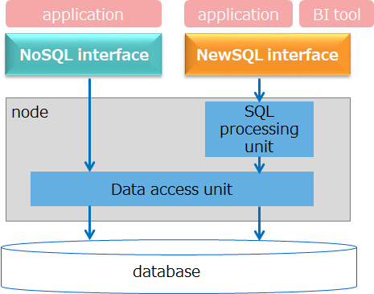
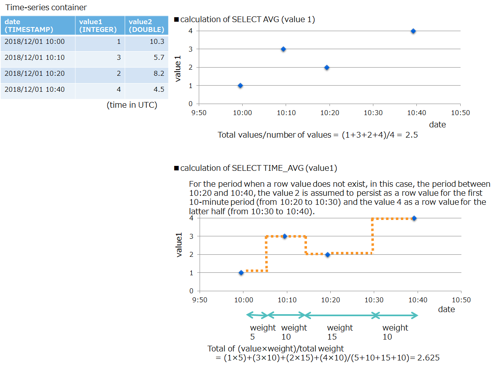
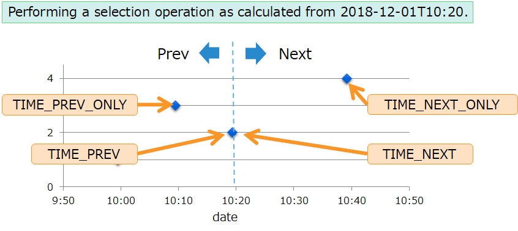
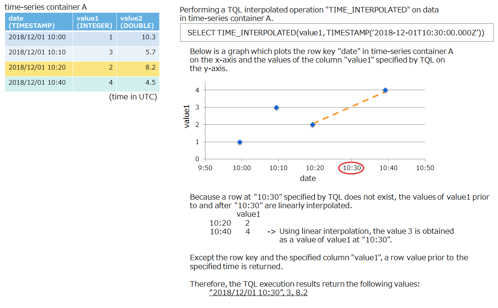
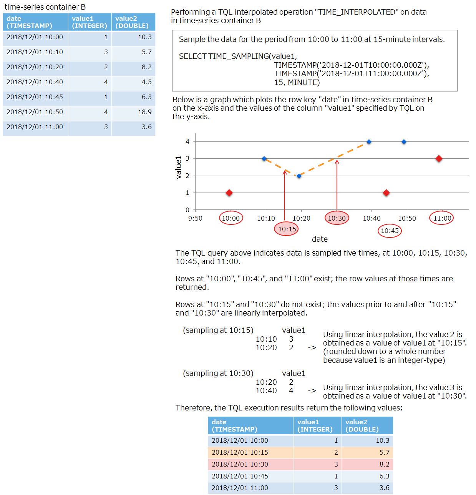

# Introduction

**This documentation describes application programming for GridDB, primarily targeting those designers and developers engaged in system design and development with GridDB.**


This documentation is organized as follows:

- Overview

  - Describes development language, NoSQL/New SQL interfaces, and support coverage.

- Java API (NoSQL interface)

  - Describes Java programming with NoSQL interface.

- C API (NoSQL interface)

	- Describes C programming with NoSQL interface.

- JDBC (NewSQL interface)

	- Describes Java programming with NewSQL interface.


# Overview

## Development Language

GridDB application programming interfaces are of two types: NoSQL interface enabling basic data access and TQL execution, and New SQL interface enabling execution of SQL-92 compliant SQL.


NoSQL interface enables faster data registration and search than NewSQL interface because it bypasses SQL processing.
By comparison, New SQL interface allows data analysis using SQL and access from BI (Business Intelligence) and ETL (Extract Transfer Load) tools, among others.


<figure>
  
  <figcaption>NoSQL interface and NewSQL interface</figcaption>
</figure>

| I/F | Features | Development Language | API   |
|-------------------|--------------|----------|-----------|
| NoSQL interface | - basic data access and TQL execution<br>- GridDB-specific API<br>- fast processing including data registration and search | Java<br>C<br>Python<br>Node.js<br>Go | Java API<br>C API<br>Python API<br>Node.js API<br>Go API |
| NewSQL interface | - execution of SQL-92 compliant SQL<br>- API complying with standard specification<br>- parallel distributed processing in SQL | Java<br>C | JDBC<br>ODBC(\*1) |

(\*1) ODBC is Enterprise Edition only.


[Notes]
- No difference exists between containers created with NoSQL interface and containers created with NewSQL interface.
Regardless of which interface is used in creating a container, all containers can be accessed from both types of interface.
- Containers created with New NewSQL interface may be referred to as "tables," but containers and tables mean the same.


## Support coverage

NoSQL interface and NewSQL interface differ in their support features and coverage of data types.
This section explains support coverage of each interface.
For the details on support coverage, see the Appendix.


### Data types
GridDB data types are of two kinds: basic types and complex types. The two tables below shows which data types each interface supports.

**Basic types**

| GridDB data types | NoSQL interface | NewSQL interface |
|-------------------|---|---|
| BOOL types        | ✓               | ✓ |
| STRING types      | ✓               | ✓ |
| BYTE types        | ✓               | ✓ |
| SHORT types       | ✓               | ✓ |
| INTEGER types     | ✓               | ✓ |
| LONG types        | ✓               | ✓ |
| FLOAT types       | ✓               | ✓ |
| DOUBLE types      | ✓               | ✓ |
| TIMESTAMP types   | ✓               | ✓ |
| GEOMETRY types    | ✓               | ✗ |
| BLOB types        | ✓               | △ |

(Note: ✓:fully supported; △ partially supported; ✗: not supported)


**Complex types**

| GridDB data types | NoSQL interface | NewSQL interface |
|----------------|---|---|
| BOOL array types      | ✓               | ✗ |
| STRING array types    | ✓               | ✗ |
| BYTE array types      | ✓               | ✗ |
| SHORT array types     | ✓               | ✗ |
| INTEGER array types   | ✓               | ✗ |
| LONG array types      | ✓               | ✗ |
| FLOAT array types     | ✓               | ✗ |
| DOUBLE array types    | ✓               | ✗ |
| TIMESTAMP array types | ✓               | ✗ |

(Note: ✓:fully supported; ✗: not supported)


### Features

The two tables below shows which GridDB features each interface supports.

**Basic features**

| GridDB features | NoSQL interface | NewSQL interface |
|---------------------------|----|-----|
| connection to clusters                 | ✓                           | ✓ |
|---------------------------|--------------------------|--------------------------|
| container creation/deletion            | ✓                           | ✓(SQL) |
| row registration/deletion              | ✓                           | ✓(SQL) |
| TQL execution                          | ✓                           | ✗ |
| SQL execution                          | ✗                           | ✓ |
| commit/rollback                        | ✓                           | ✗ only allows auto-commit |
|---------------------------|--------------------------|--------------------------|
| index creation/deletion                | ✓                           | ✓(SQL) |
|---------------------------|--------------------------|--------------------------|
| retrieval of a list of container names | ✓                           | ✓ |
| retrieval of column information        | ✓                           | ✓ |

Note: ✓: supported; ✓(SQL): supported by SQL; ✗: not supported


**Extended features**

| GridDB features | NoSQL interface | NewSQL interface |
|----------------------------------|----|--------|
| affinity settings            | ✓               | ✓(SQL) |
| partition container creation | ✗               | ✓(SQL) |

(Note: ✓:fully supported; △ partially supported; ✗: not supported)


# Java API (NoSQL interface)

## Developing applications using Java API

### Executing a sample program

This section explains how to compile and run a sample program.

For program compilation/execution, set the gridstore.jar library in the class path. Set other libraries, such as logging, as needed.

- ex). compilation/execution of Sample.java

  ```
  $ javac -classpath "/usr/share/java/gridstore.jar:." Sample.java
  $ java -classpath "/usr/share/java/gridstore.jar:." Sample
  ```


list of sample programs

| category                                                                                 | program name                  | description                                                                           | container name to create |
|------|------------|------|-------------------|
| [Connecting to a cluster](#java_connect)                                                 | Connect.java                  | connects to a cluster using the multicast method and then disconnects the connection.  | - |
| [Creating a collection (method)](#java_create_collection_by_method)                      | CreateCollectionByMethod.java | creates a collection using a class definition to specify a schema.  | SampleJava_collection1 |
| [Creating a collection (class definition)](#java_create_collection_by_class)             | CreateCollectionByClass.java  | creates a collection using a class definition to specify a schema.  | SampleJava_collection2 |
| [Creating a time-series container (method)](#java_create_container_by_method)            | CreateTimeSeriesByMethod.java | creates a time-series container by specifying a schema using a method  | SampleJava_timeseries1 |
| [Registering a row](#java_put_row)                                                       | PutRow.java                   | registers one row per container          | SampleJava_PutRow |
| [Registering multiple rows](#java_put_rows)                                              | PutRows.java                  | registers multiple rows per container            | SampleJava_PutRows |
| [Retrieving a row](#java_get_row)                                                        | GetRow.java                   | specifies a row key to retrieve a row from a container      | SampleJava_GetRow |
| [Searching for a row using a TQL](#java_tql_select)                                      | TQLSelect.java                | retrieves a row using a TQL SELECT statement                   | SampleJava_TQLSelect |
| [Executing the TQL aggregate function](#java_tql_aggregation)                            | TQLAggregation.java           | Executes an aggregation operation using a TQL statement.               | SampleJava_TQLAggregation |
| [Registering a row in multiple containers](#java_multiput)                               | MultiPut.java                 | registers a bulk of rows in multiple containers              | SampleJava_MultiPut1, SampleJava_MultiPut2 |
| [Retrieving rows from multiple containers](#java_multiget)                               | MultiGet.java                 | retrieves a bulk of rows from multiple containers.   | SampleJava_MultiGet1, SampleJava_MultiGet2 |
| [Executing TQL on multiple containers](#java_fetchall)                                   | FetchAll.java                 | executes a bulk of TQLs on multiple containers.     | SampleJava_FetchAll1, SampleJava_FetchAll2 |
| [Registering/searching binary data](#java_binary)                                        | BlobData.java                 | registers binary data in a container and retrieves the data from a container  | SampleJava_BlobData |
| [Updating a row](#java_update)                                                           | UpdateRowByTQL.java           | updates a row using the RowSet retrieved by TQL             | SampleJava_UpdateRowByTQL |
| [Deleting a row (row key)](#java_remove_row)                                             | RemoveRowByRowkey.java        | specifies a row key to delete a row         | SampleJava_RemoveRowByRowkey |
| [Deleting a row (TQL)](#java_remove_rowset)                                              | RemoveRowByTQL.java           | deletes the row retrieved using TQL             | SampleJava_RemoveRowByTQL |
| [Creating an index](#java_create_index)                                                  | CreateIndex.java              | creates an index                        | SampleJava_Index |
| [Performing time-series operations](#java_timeseries_function)                           | TQLTimeseries.java            | performs various operations for time-series data  | SampleJava_TQLTimeseries |
| [Handling array type data](#java_arraydata)                                              | ArrayData.java                | registers/searches array type data                | SampleJava_ArrayData |
| [Handling spatial type data](#java_geometry_data)                                        | GeometryData.java             | registers/searches spatial type data                | SampleJava_GeometryData |
| [Retrieving a list of container names](#java_containernames)                             | ContainerNames.java           | retrieves a list of container names                       | － |
| [Retrieving schema information of a container](#java_containerinfo)                      | ContainerInformation.java     | Retrieves schema information of a container     | SampleJava_Info |
| [Using composite row keys to retrieve rows from multiple containers](#java_compositekey) | CompositeKeyMultiGet.java     | Uses composite row keys to retrieve a bulk of rows from multiple containers.   | SampleJava_CompositeKeyMultiGet1, SampleJava_CompositeKeyMultiGet2 |


## Basic programming

This section explains basic programming using Java API.


<a id="java_connect"></a>
### Connecting to a cluster

Connect to a cluster for data registration/search and other operations In connection operation, use the following methods:

| category                            | method |
|-------|---------|
| GridStoreFactory instance retrieval | GridStoreFactory GridStoreFactory.getInstance()  |
| GridStore instance retrieval        | GridStore GridStoreFactory.getGridStore(java.util.Properties properties) |


Below is a sample program for connecting to a cluster:

<!-- Connect.java -->
```java
import java.util.Properties;

import com.toshiba.mwcloud.gs.GridStore;
import com.toshiba.mwcloud.gs.GridStoreFactory;

public class Connect {

	public static void main(String[] args){
		try {
			// (1)
			Properties prop = new Properties();
			prop.setProperty("notificationAddress", "239.0.0.1");
			prop.setProperty("notificationPort", "31999");
			prop.setProperty("clusterName", "myCluster");
			prop.setProperty("database", "public");
			prop.setProperty("user", "admin");
			prop.setProperty("password", "admin");
			prop.setProperty("applicationName", "SampleJava");

			// (2)
			GridStore store = GridStoreFactory.getInstance().getGridStore(prop);

			// (3)
			store.getContainer("dummyContainer");

			System.out.println("Connect to cluster");

			// (4)
			store.close();
			System.out.println("success!");

		} catch ( Exception e ){
			e.printStackTrace();
		}
	}
}
```

The following explains the connection operation in the program above.

(1) Specifies the connection information, including the cluster address, user, and password in the Java properties class.

(2) Creates a GridStore object based on the properties of the connection information.

(3) Once a container is created/retrieved using the GridStore object, a connection to the GridDB cluster will be enabled.

(4) A close disconnects the connection.


#### Connection methods

Three methods are available to connect to a cluster: multicast method, fixed list method, and provider method[EE only].

| Connection methods | description |
| --------|------|
| multicast method   | method using multicast communication |
| fixed list method  | method where the addresses of all the nodes constituting the cluster are specified directly. |
| provider method    | method where the addresses of all the nodes constituting the cluster are provided by the provider. |

In connecting to a cluster from an application, make sure to set the settings on the application side according to the connection method defined in the cluster definition file gs_cluster.json.

First, check which connection method is being used by referring to the cluster definition file gs_cluster.json. Then, enter the corresponding values in the Properties object according to the connection method.


| Connection methods | Property keys to specify<br>in the application | description | values to be specified |
| --------|----------------------------------------|------|-----------|
| multicast method | notificationAddress<br><br>notificationPort | multicast address<br><br>multicast port number | /values of /transaction/notificationAddress<br><br>values of /transaction/notificationPort |
| fixed list method | notificationMember | a list of addresses and port numbers of nodes constituting the cluster | list format values of /transaction/address and /transaction/port in /cluster/notificationMember  |
| provider method | notificationProvider | provider's URL | values of /cluster/notificationProvider/url |


Below are the descriptions of the cluster definition file gs_cluster.json and examples of the corresponding connection programs for each of the three connection methods.

**example for the multicast method**

- descriptions of gs_cluster.json (excerpt)

  ```json
  {
    "transaction":{
        "notificationAddress":"239.0.0.1",
        "notificationInterval":"1s",
        "notificationPort":31999,
    }
  }
  ```

- Specify the multicast address and the port number in the GridStore Property keys for the connection program, "notificationAddress" and "notificationPort," respectively.

  ```Java
  Properties prop = new Properties();
  prop.setProperty("notificationAddress", "239.0.0.1");
  prop.setProperty("notificationPort", "31999");
  prop.setProperty("clusterName", "myCluster");
  prop.setProperty("database", "public");
  prop.setProperty("user", "admin");
  prop.setProperty("password", "admin");
  prop.setProperty("applicationName", "SampleJava");
  ```


**example for the fixed list method**

- descriptions of gs_cluster.json (excerpt)

  ```json
  {
      "cluster":{
          "clusterName":"myCluster",
          "replicationNum":2,
          "notificationMember":[
              {
                  "cluster": {"address":"192.168.1.10", "port":10010},
                  "sync":    {"address":"192.168.1.10", "port":10020},
                  "system":  {"address":"192.168.1.10", "port":10040},
                  "transaction": {"address":"192.168.1.10", "port":10001}
              },
              {
                  "cluster": {"address":"192.168.1.11", "port":10010},
                  "sync":    {"address":"192.168.1.11", "port":10020},
                  "system":  {"address":"192.168.1.11", "port":10040},
                  "transaction": {"address":"192.168.1.11", "port":10001}
              },
              {
                  "cluster": {"address":"192.168.1.12", "port":10010},
                  "sync":    {"address":"192.168.1.12", "port":10020},
                  "system":  {"address":"192.168.1.12", "port":10040},
                  "transaction": {"address":"192.168.1.12", "port":10001}
              }
          ]
      }
  }
  ```

- Enter a list of values of colon-separated address/port number pairs separated by a comma in the GridStore Property key for the connection program, "notificationMember."

  ```Java
  Properties prop = new Properties();
  prop.setProperty("notificationMember", "192.168.1.10:10001,192.168.1.11:10001,192.168.1.12:10001");
  prop.setProperty("clusterName", "myCluster");
  prop.setProperty("database", "public");
  prop.setProperty("user", "admin");
  prop.setProperty("password", "admin");
  prop.setProperty("applicationName", "SampleJava");
  ```


**example for the provider method**

- descriptions of gs_cluster.json (excerpt)

  ```json
  {
      "cluster":{
          "clusterName":"myCluster",
          "replicationNum":2,
          "notificationProvider":{
              "url":"http://example.com/notification/provider",
              "updateInterval":"30s"
          }
      }
  }
  ```

- Enter the url in the GridStore Property key for the connection program, "notificationProvider."

  ```Java
  Properties prop = new Properties();
  prop.setProperty("notificationProvider", "http://example.com/notification/provider");
  prop.setProperty("clusterName", "myCluster");
  prop.setProperty("database", "public");
  prop.setProperty("user", "admin");
  prop.setProperty("password", "admin");
  prop.setProperty("applicationName", "SampleJava");
  ```

#### Properties

Main properties other than connection methods include the following:
For details on the rest of the properties and their descriptions, see the section "GridStoreFactory.getGridStore(java.util.Properties properties)" in GridDB Java API Reference ([GridDB_Java_API_Reference.html](GridDB_Java_API_Reference.html)).


| item | property key | required | values to be specified |
| -----------------|-----------------|---------|----------------|
| cluster name | clusterName | required | values specified in /cluster/clusterName in gs_cluster.json |
| database name | database | optional if connecting to a public database<br>If not, required. | name of the database to connect to |
| user name| user | required | name of a user who is connecting (both administrative and general users are allowed)  |
| password | password | required | password of a user who is connecting |
| application name | applicationName | optional | name to be used to distinguish an application<br>(shown when checking connection information and events being run using the gs_sh operation tool) |
| time zone | timeZone | optional | Specify in hours and minutes using the pattern ±hh:mm or ±hhmm<br>time zone ID: supports only "Z."<br>carry-over of a higher environment (JavaVM): auto<br>When omitted, equivalent to "Z"|
| address of the interface to receive the multicast packets from    | notificationInterfaceAddress    | optional | To configure the cluster network in multicast mode when multiple network interfaces are available, specify the IP address of the interface to receive the multicast packets from.|
| failover timeout | failoverTimeout | optional | The number of seconds required for a client failover to start. <br>\* When omitted, the value set for GridStoreFactory is used. |
| transaction timeout | transactionTimeout | optional | the transaction timeouts (in seconds). <br>\* When omitted, the value 300 (seconds) is used. |


[Notes]

- Apart from the above, the following properties are available to be specified in GridStoreFactory. For details, see the section on "GridStoreFactory.setProperties(java.util.Properties properties)" in the "GridDB Java API Reference"  ([GridDB_Java_API_Reference.html](GridDB_Java_API_Reference.html)).

    | item | property key | required | values to be specified |
    | -----------------|-----------------|---------|----------------|
    | failover timeout    | failoverTimeout | optional| The number of seconds required for a client failover to start.<br>\* When omitted, the value 120 (seconds) is used. |
    | maximum connection pool size | maxConnectionPoolSize | optional | The maximum number of connections retained in the connection pool. <br>\* When omitted, the value 16 is used. |

- Specify a database while connecting. On that connection, only the data in the specified database can be accessed. To operate on other databases, restart a connection.
	- ex). program for operating on the databases "public" and "userDB1"

  	```Java
  	// public
  	prop.setProperty("database", "public");
  	GridStore store1 = GridStoreFactory.getInstance().getGridStore(prop);
  	store1.getContainer("container1");
  	store1.close();

  	// userDB1
  	prop.setProperty("database", "userDB1");
  	GridStore store2 = GridStoreFactory.getInstance().getGridStore(prop);
  	store2.getContainer("container1");
  	store2.close();
  	```


- To accelerate container retrieval (getContainer), the functionality to cache container information is provided.
Users are recommended to increase the cache size if accessing a large number of containers.
Use the property key at the time of connection to specify the cache size.
	- By default, the cache function is invalid.
	- Use the number of Container objects that store information in the cache to be stored in the cache as a value to be specified in the property key containerCacheSize.

  	```java
  	prop.setProperty("containerCacheSize", "10000");
  	```


- Connection to clusters actually starts the first time data operation such as container creation and search is performed after creating a GridStore object.
If connection fails due to an error in the connection destination, or for other reasons, a connection error does not occur in the creation of a GridStore object "GridStoreFactory.getGridStore," but in the subsequent data operation method.


- Properties can be specified by entering them in an external file. For details, see the Appendix.

- The supported range of time zone is as follows:
	- offset range: -23:59 - +23:59
	- summer time: not supported
	- time zone ID (eg. JST): supports only "Z."

- To handle time zones within the date and time functions, see the section [Recommendations for applications in using the date and time functions](#date_function) in the Appendix.

### Creating a container

This section shows how to create a container. Containers come in two types: collections and time-series containers.
To create a container, specify schemas, including column names and data types.
The following two methods are available to specify a schema:

- How to specify a schema using a method
	- Use a Java API method to specify a schema


- How to specify a schema using a class definition
  - Use a user-defined Java class to specify a schema


[Notes]
- For a list of characters that can be used as a container name, see the section "Name restrictions" in [GridDB Features Reference](GridDB_FeaturesReference.md)).


<a id="java_create_collection_by_method"></a>
#### How to specify a schema using a method

Here a schema of a container is dynamically specified using a Java API method.
For this purpose, use a container information class "ContainerInfo" and a column information class "ColumnInfo," both of which represent a schema.
The following lists the methods for creating a container using these classes.

| category                            | method |
|----------------|---------|
| Creating a collection                                       | putCollection(String name, ContainerInfo info, boolean modifiable) |
| Creating a time-series container                            | putTimeSeries(String name, ContainerInfo info, boolean modifiable) |
| Creating a container (collection, or time-series container) | GridStore.putContainer(String name, ContainerInfo info, boolean modifiable) |

[Notes]
- The container creation method "putContainer" can create both collections and time-series containers.
- If you specify the same name as another container that already exists, an error does not occur as long as a newly specified schema definition is the same as the schema definition of an existing container.
 In this case, the behavior is identical to executing getContainer for retrieving a container.
- However, if these schema definitions are different and the argument "modifiable" is set to true, existing schema definitions will be modified.
In contrast, if these schema definitions are different and the argument "modifiable" is set to false, an error will occur. Note that "modifiable" is an argument for specifying whether to permit modifying the schema of an existing container.
Set "modifiable" to false when creating a new container.


##### Creating a collection with putCollection

Below is the entire program to create a collection using putCollection for creating a collection.

<!-- CreateCollectionByMethod.java -->
```Java
import java.util.ArrayList;
import java.util.List;
import java.util.Properties;

import com.toshiba.mwcloud.gs.Collection;
import com.toshiba.mwcloud.gs.ColumnInfo;
import com.toshiba.mwcloud.gs.ContainerInfo;
import com.toshiba.mwcloud.gs.GSType;
import com.toshiba.mwcloud.gs.GridStore;
import com.toshiba.mwcloud.gs.GridStoreFactory;
import com.toshiba.mwcloud.gs.Row;

public class CreateCollectionByMethod {

	public static void main(String[] args){
		try {
			Properties prop = new Properties();
			prop.setProperty("notificationAddress", "239.0.0.1");
			prop.setProperty("notificationPort", "31999");
			prop.setProperty("clusterName", "myCluster");
			prop.setProperty("database", "public");
			prop.setProperty("user", "admin");
			prop.setProperty("password", "admin");
			prop.setProperty("applicationName", "SampleJava");

			GridStore store = GridStoreFactory.getInstance().getGridStore(prop);
			store.getContainer("dummyContainer");

			// (1)
			ContainerInfo containerInfo = new ContainerInfo();

			// (2)
			List<ColumnInfo> columnList = new ArrayList<ColumnInfo>();
			columnList.add(new ColumnInfo("id", GSType.INTEGER));
			columnList.add(new ColumnInfo("productName", GSType.STRING));
			columnList.add(new ColumnInfo("count", GSType.INTEGER));

			// (3)
			containerInfo.setColumnInfoList(columnList);

			// (4)
			containerInfo.setRowKeyAssigned(true);

			// (5)
			Collection<Void, Row> collection = store.putCollection("SampleJava_collection1", containerInfo, false);

			System.out.println("Create Collection name=SampleJava_collection1");

			collection.close();
			store.close();
			System.out.println("success!");

		} catch ( Exception e ){
			e.printStackTrace();
		}
	}
}
```

The following explains the part of the program where a collection is created; refer to the comments in the program.
(2) Sets column names and data types to column information "ColumnInfo."
If there is more than one column, a multiple number of ColumnInfo will be created.
(3) Stores ColumnInfo in a list object and then sets it to container information "ContainerInfo"
(5) With this data, creates a collection using putCollection.

[Notes]

- If a row key is set using setRowKeyAssigned, the first column will be a row key.
- The return value of putCollection is Collection<K,R>.
The generic type <K,R> is returned as <data type of a row key, Row type>.
In case of a collection without a row key, set Void type or wild card type ("?") for the data type of a row key.

  ```java
  Collection<?, Row> collection = store.putCollection("collectionNotRowkey", containerInfo, false);
  ```


<a id="java_create_container_by_method"></a>
##### Creating a time-series container with putTimeSeries

This section shows how to create a time-series container using putTimeseries for creating a time-series container.
The overall flow of the program is the same as the program for creating a collection; only the differences are shown below.

<!-- CreateTimeSeriesByMethod.java -->
```Java
// (1)
ContainerInfo containerInfo = new ContainerInfo();

// (2)
List<ColumnInfo> columnList = new ArrayList<ColumnInfo>();
columnList.add(new ColumnInfo("date", GSType.TIMESTAMP));
columnList.add(new ColumnInfo("value", GSType.DOUBLE));
containerInfo.setColumnInfoList(columnList);

// (3)
containerInfo.setRowKeyAssigned(true);

// (4)
TimeSeries<Row> timeseries = store.putTimeSeries("SampleJava_timeseries1", containerInfo, false);

System.out.println("Create TimeSeries name=SampleJava_timeseries1");
```

[Notes]

- In time-series containers, the first column should be a TIMESTAMP data type and a row key should be set.
- The return value of putTimeseries is Timeseries. The generic type is returned as \<Row type\>.
- For other settings specific to a time-series container , use the object "TimeseriesProperties".


##### Creating a container with putContainer

The putContainer method for creating a container can create both a container and a time-series container.
Set a type of a container and a time-series container using Container.Info.setType.

- How to create a collection

	```Java
	containerInfo.setType(ContainerType.COLLECTION);
	Container<?, Row> collection = store.putContainer("collection3", containerInfo, false);
	```

- How to create a time-series container

	```Java
	containerInfo.setType(ContainerType.TIME_SERIES);
	Container<?, Row> timeseries = store.putContainer("timeseries3", containerInfo, false);
	```


<a id="java_create_collection_by_class"></a>
#### How to specify a schema using a class definition
Here a schema of a container is specified using a Java class definition.
Java class variables will be mapped to the columns in a GridDB container.

ex.) mappings applied if the Java class is defined as below:

- mappings between column variables and columns
  - Class variable: int id -> Column name: id, Data type: INTEGER
  - Class variable: String productName -> Column name: productName, Data type: STRING
  - Class variable: int count -> Column name: count, Data type: INTEGER


  <!-- CreateCollectionClass.java -->
  ```java
  class Products{
  	@RowKey int id;
  	String productName;
  	int count;
  }
  ```


Columns are created in the same order as a sequence of class variables.
For details about data type mappings, see the section "Interface Container\<K,R\>" in GridDB Java Reference ([GridDB_Java_API_Reference.html](GridDB_Java_API_Reference.html)).


To specify the schema of a container by using Java class definitions, use the following methods:

| category                            | method |
|-------------------|----------|
| Creating a collection | putCollection(String name, java.lang.Class rowType)<br>putCollection(String name, java.lang.Class rowType, boolean modifiable) |
| Creating a time-series container | putTimeSeries(String name, java.lang.Class rowType)<br>putTimeSeries(String name, java.lang.Class rowType, TimeSeriesProperties props, boolean modifiable)  |
| Creating a container (collection, or time-series container) | putContainer(String name, java.lang.Class rowType, ContainerInfo info, boolean modifiable)  |


Below is the entire program for creating a collection with a row key, using putCollection for creating a collection. (Connection and termination procedures are the same as in previous programs.)

putTimeSeries for creating time-series containers and putContainer for creating containers follow the same program flow.


<!-- CreateCollectionByClass.java -->
```Java
import java.util.Properties;

import com.toshiba.mwcloud.gs.Collection;
import com.toshiba.mwcloud.gs.GridStore;
import com.toshiba.mwcloud.gs.GridStoreFactory;
import com.toshiba.mwcloud.gs.RowKey;

public class CreateCollectionByClass {

    static class Product{
        @RowKey int id;
        String productName;
        int count;
    }

    public static void main(String[] args){
        try {
            Properties prop = new Properties();
            prop.setProperty("notificationAddress", "239.0.0.1");
            prop.setProperty("notificationPort", "31999");
            prop.setProperty("clusterName", "myCluster");
            prop.setProperty("database", "public");
            prop.setProperty("user", "admin");
            prop.setProperty("password", "admin");
            prop.setProperty("applicationName", "SampleJava");

            GridStore store = GridStoreFactory.getInstance().getGridStore(prop);
            store.getContainer("dummyContainer");

            Collection<Integer, Product> collection = store.putCollection("SampleJava_collection2", Product.class, false);

            System.out.println("Create Collection name=SampleJava_collection2");

            collection.close();
            store.close();
            System.out.println("success!");

        } catch ( Exception e ){
            e.printStackTrace();
        }
    }
}
```

- When using putCollection for creating collections, specify a Java class as an argument
- The return value of putCollection is Collection<K,R>.
	The generic type <K,R> is returned as <data type of a row key, Row type>.
	In case of a collection without a row key, set Void type or wild card type ("?") for the data type of a row key.
- Java class definitions allow specification of annotations listed below:
  - Specify row keys using annotation@RowKey.
  - For container variables not to be created as container columns, specify @TransientRowField.
  - To specify different column names from class variable names, specify @RowField(name="column name").
	- To explicitly specify the order of columns, specify @RowField(columnNumber=column number) (where column number denotes values 0 and above but less than the number of columns)
	- ex.) class definition and annotation
		- The class variable "comment" is not created in a container column.
		- The class variable" tmp" is not used as a container name; Instead the container is named "value".
		- Columns are arranged in the order: id, value, status.

		```java
		class Data{
			@TransientRowField
			String comment;

			@RowField(columnNumber=2)
			boolean status;

			@RowKey
			@RowField(columnNumber=0)
			int id;

			@RowField(name="value",columnNumber=1)
			long tmp;
		}
		```

[Notes]
- If you specify the same name as another container that already exists, an error does not occur as long as a newly specified schema definition is the same as the schema definition of an existing container.
 In this case, the behavior is identical to executing getContainer for retrieving a container.
- However, if these schema definitions are different and the argument "modifiable" is set to true, existing schema definitions will be modified.
In contrast, if these schema definitions are different and the argument "modifiable" is set to false, an error will occur. Note that "modifiable" is an argument for specifying whether to permit modifying the schema of an existing container.
Set "modifiable" to false when creating a new container.


### Retrieving a container

This section shows how to retrieve a container by specifying its name.
Retrieve a container first in order to register data and manipulate rows, such as TQL.

The following methods are available for container retrieval. These methods are categorized into the following two depending on the differences in the type of rows used in row manipulation.

**Row interface**

- The following methods retrieve container objects. Rows in the retrieved container object can be operated on using com.toshiba.mwcloud.gs.Row.

	| category                            | method |
	|-------|---------|
	| collection retrieval            | \<K\> Collection\<K,Row\> getCollection(java.lang.String name) |
	| time-series container retrieval | TimeSeries\<Row\> getTimeSeries(java.lang.String name)  |
	| container retrieval             | \<K\> Container\<K,Row\> getContainer(java.lang.String name)  |


**user-defined class**

- The following methods retrieve container objects. Rows in the retrieved container object can be operated on by using a class that the user defined as a schema.

	| category                            | method |
	|-------|---------|
	| collection retrieval            | \<K,R\> Collection\<K,R\> getCollection(java.lang.String name, java.lang.Class\<R\> rowType)  |
	| time-series container retrieval | \<R\> TimeSeries\<R\> getTimeSeries(java.lang.String name, java.lang.Class\<R\> rowType)   |


ex.) container retrieval (manipulating rows with the Row interface)
```java
Collection<Integer, Row> collection = store.getCollection("collection1");
Row row = collection.get(0);
```

ex.) container retrieval (manipulating rows using a user-defined class)
```java
static class Product{
    int id;
    String productName;
    int count;
}

// :

Collection<Integer, Product> collection = store.getCollection("collection1", Product.class);
Product product = collection.get(0);
```


<a id="java_put_row"></a>
### Registering data

To register a row in a container, use the following methods:

| category                            | method |
|-------|---------|
| row registration | Container.put(R row)  |


Below is the entire program for creating a collection and registering one row.
(Connection and termination procedures are the same as in previous programs.)

<!-- PutRow.java -->
```Java
import java.util.ArrayList;
import java.util.List;
import java.util.Properties;

import com.toshiba.mwcloud.gs.ColumnInfo;
import com.toshiba.mwcloud.gs.Container;
import com.toshiba.mwcloud.gs.ContainerInfo;
import com.toshiba.mwcloud.gs.GSType;
import com.toshiba.mwcloud.gs.GridStore;
import com.toshiba.mwcloud.gs.GridStoreFactory;
import com.toshiba.mwcloud.gs.Row;

public class PutRow {

    public static void main(String[] args){
        try {
            Properties prop = new Properties();
            prop.setProperty("notificationAddress", "239.0.0.1");
            prop.setProperty("notificationPort", "31999");
            prop.setProperty("clusterName", "myCluster");
            prop.setProperty("database", "public");
            prop.setProperty("user", "admin");
            prop.setProperty("password", "admin");
            prop.setProperty("applicationName", "SampleJava");

            GridStore store = GridStoreFactory.getInstance().getGridStore(prop);
            store.getContainer("dummyContainer");

            ContainerInfo containerInfo = new ContainerInfo();
            List<ColumnInfo> columnList = new ArrayList<ColumnInfo>();
            columnList.add(new ColumnInfo("id", GSType.INTEGER));
            columnList.add(new ColumnInfo("productName", GSType.STRING));
            columnList.add(new ColumnInfo("count", GSType.INTEGER));
            containerInfo.setColumnInfoList(columnList);
            containerInfo.setRowKeyAssigned(true);

            String containerName = "SampleJava_PutRow";
            store.putCollection(containerName, containerInfo, false);
            System.out.println("Create Collection name="+containerName);


            // (1)
            Container<?, Row> container = store.getContainer(containerName);
            if ( container == null ){
                throw new Exception("Container not found.");
            }

            // (2)
            Row row = container.createRow();

            // (3)
            row.setInteger(0, 0);
            row.setString(1, "display");
            row.setInteger(2, 150);

            // (4)
            container.put(row);

            System.out.println("Put Row num=1");

            container.close();
            store.close();
            System.out.println("success!");

        } catch ( Exception e ){
            e.printStackTrace();
        }
    }
}
```

The following explains how to register rows, referring to the program above.
(1) Retrieves a container for registering rows. Null is returned if there is no container having the specified name.
(2) Creates an empty row object from a container object.
(3) Sets data to be registered in this empty row object.
(4) Registers the rows in the container in step (1).

For more about mappings between GridDB data types and Java data types, see the section["data type mappings."](#java_data_type)

[Notes]
- If you specify a row with the same value as an existing row key when performing a put operation on containers with a row key, the existing row will be updated.

- For commit, two operating modes are available: auto-commit mode and manual commit mode.
	- In auto-commit mode, executing put automatically commits rows. commit() is not necessary.
	- In manual commit mode, commit() is explicitly needed. commit is executed per container. Transaction operations will not be performed across containers.
	- The default is auto-commit mode.
	- ex.) manual commit mode

		```Java
		container.setAutoCommit(false);
		container.put(row);
		container.commit();
		```

- If column values are not set in a row object, the initial value of the column will be registered.
The initial value is defined by the data type of a column.
For details, see the section "Interface Container\<K,R\>" in GridDB Java Reference ([GridDB_Java_API_Reference.html](GridDB_Java_API_Reference.html)).


<a id="java_put_rows"></a>
**Registering multiple rows in one container**

Multiple rows can be registered all at once. For this purpose, use the following method:

| category                            | method |
|-------|---------|
| row registration | Container.put(java.util.Collection rowCollection) |

Below is a program for registering multiple rows using a put operation.

<!-- PutRows.java -->
```Java
// (1)
Container<?, Row> container = store.getContainer(containerName);
if ( container == null ){
    throw new Exception("Container not found.");
}

// (2)
String[] nameList = {"notebook PC", "desktop PC", "keyboard", "mouse", "printer"};
int[] numberList = {108, 72, 25, 45, 62};

List<Row> rowList = new ArrayList<Row>();
for ( int i = 0; i < nameList.length; i++ ){
    Row row = container.createRow();
    row.setInteger(0, (i+1));
    row.setString(1, nameList[i]);
    row.setInteger(2, numberList[i]);
    rowList.add(row);
}

// (3)
container.put(rowList);

System.out.println("Put Rows num=" + nameList.length);
```

In this program, multiple row objects are created to set them in a list. Then the put operation is performed by specifying this list as an argument.


[Notes]
- If you specify a row with the same value as an existing row key when performing a put operation on containers with a row key, the existing row will be updated.


<a id="java_get_row"></a>
### Retrieving data

Retrieving data means retrieving rows from a container.

In cases of containers with their row keys already set, rows can be retrieved by specifying row key values.
If, on the other hand, row keys are not set, retrieve a row using TQL, as will be described later.

| category                            | method |
|-------|---------|
| row retrieval | Container.get(K key) |


Below is a program for retrieving a row with a row key value "0" from a collection with a row key.

<!-- GetRow.java -->
```java
// (1)
Container<Integer, Row> container = store.getContainer(containerName);
if ( container == null ){
    throw new Exception("Container not found.");
}

// (2)
Row row = container.get(0);
if ( row == null ){
    throw new Exception("Row not found");
}

// (3)
int id = row.getInteger(0);
String name = row.getString(1);
int count = row.getInteger(2);

System.out.println("Get Row id="+ id + ", name=" + name + ", count=" + count);
```

The following explains the operation to retrieve rows in the program above.
(2) Specifies a row key in the get command to retrieve a row from a container.
(3) To fetch column values from the retrieved row, uses the get method so as to match the data type of the column.


### Executing a TQL

This section shows how to execute a TQL.

In TQL execution, the class of run results and their processing method vary according to the type of SELECT selection formulas.

| types of SELECT selection formulas | description | class type of execution results   |
|---------------------|-----------------------|--------------------|
| row (\*) | retrieves rows stored in a container.<br>ex.) SELECT * FROM container1 | row object type of a container<br>(type of R in Container\<K,R\>) |
| aggregation operations (including MAX, MIN, and COUNT) | retrieves the result of an aggregation operation.<br>ex.) SELECT COUNT(*) FROM container1 | AggregationResult type |


[Notes]
- To specify containers and columns using TQL, enclose the names with double quotes if they contain any symbols.

  ```
  select * from "test.container";
  ```


<a id="java_tql_select"></a>
#### Searching for a row

To execute a TQL for searching for row values, use the methods below:

| category                            | method |
|-------|---------|
| query creation  | Query\<R\> Container\<K,R\>.query(java.lang.String tql)  |
| query execution | RowSet\<R\> Query\<R\>.fetch()  |


The following is a TQL program for searching a collection for rows whose column count exceeds 50 and returning the search result sorted by ascending order of id.

<!-- TQLSelect.java -->
```Java
// (1)
Container<?, Row> container = store.getContainer(containerName);
if ( container == null ){
    throw new Exception("Container not found.");
}

// (2)
Query<Row> query = container.query("SELECT * WHERE count >= 50 ORDER BY id");
RowSet<Row> rs = query.fetch();

// (3)
while ( rs.hasNext() ) {
    Row row = rs.next();
    int id = row.getInteger(0);
    String name = row.getString(1);
    int count = row.getInteger(2);
    System.out.println("row id=" + id + ", name=" + name + ", count=" + count);
}
```

The following explains the search operation in the program above. (2) Creates a query using a TQL to be executed and performs search using the fetch command.
(3) Retrieves search results; retrieves row values using the get method so as to match the data type of a column in a container.


<a id="java_tql_aggregation"></a>
#### Performing an aggregation operation

To execute a TQL for an aggregation operation, use the following methods:

| category                            | method |
|-------|---------|
| query creation  | Query\<S\> Container\<K,R\>.query(java.lang.String tql, java.lang.Class\<S\> rowType)  |
| query execution | RowSet\<S\> Query\<S\>.fetch()  |

The following is a program for retrieving the maximum column value from a collection.

<!-- TQLAggregate.java -->
```Java
// (1)
Query<AggregationResult> query = container.query("SELECT MAX(value)", AggregationResult.class);
RowSet<AggregationResult> rs = query.fetch();

// (2)
if ( rs.hasNext() ){
    AggregationResult result = rs.next();
    long value = result.getLong();
    System.out.println("max = "+ value);
}
```

(1) When creating queries, specifies AggretationResult which refers to the type of aggregation operation results as the second argument.
The results of query execution are returned by the object AggregationResult.
(2) The data type of values of the object AggregationResult varies according to the type of aggregation operations performed. Values are retrieved using getLong, getDouble, or getTimestamp, according to the data type.


Below is a list of aggregation operations in TQL

| aggregation operations in TQL | description | operation arguments | value type of operation results (AggregationResult) |
|---------|------|-----------|-------------|
| MAX(column) | maximum value of the specified column | numerical or TIMESTAMP-type column | type identical to the specified column |
| MIN(column) | minimum value of the specified column | numerical or TIMESTAMP-type column | type identical to the specified column |
| COUNT(\*) | number of rows to be aggregated | only "\*" | LONG types |
| SUM(column) | sum of the specified columns | numerical column | LONG type if the specified column is of integer type<br>LONG type if the specified column is of floating-point type |
| AVG(column) | average of the specified columns | numerical column | DOUBLE types |
| VARIANCE(column) | variance of the specified columns | numerical column | DOUBLE types |
| STDDEV(column) | standard deviation of the specified columns | numerical column | DOUBLE types |


[Notes]

- Only one aggregation operation can be specified in one query.
	- ex.) The following TQL leads to an error.   SELECT MAX(value), MIN(value)


<a id="java_batch_functions"></a>
### Performing a bulk of operations on multiple containers

Data registration and search operations allow multiple operations to be performed at once. The following are the methods for multiple containers.

| category                            | method |
|-------|---------|
| Registering a row in multiple containers | GridStore.multiPut(java.util.Map\<java.lang.String,java.util.List\> containerRowsMap)  |
| Retrieving rows from multiple containers | GridStore.multiGet(java.util.Map\<java.lang.String,? extends RowKeyPredicate\<?\>\> containerPredicateMap)   |
| Executing a TQL on multiple containers   | GridStore.fetchAll(java.util.List\<? extends Query\<?\>\> queryList) |


Operations on one container and operations on multiple containers differ in methods, retrieval criteria, and other properties; use the one that best suits your purpose.
 The table below shows the differences among them.
For explanations on each method, refer to the links in this document.

| category | container to be processed | method | retrieval criteria | links in this document |
|------|--------------|----------|---------------|----------------------|
| row registration | one | Container.put(R row)<br>Container.put(java.util.Collection rowCollection) | \- | [Registering data](#java_put_row) |
|         | more than one | GridStore.multiPut(java.util.Map\<java.lang.String, java.util.List\> containerRowsMap) | \- | [Registering a row in multiple containers](#java_multiput) |
| row retrieval<br>(by specifying a row key) | one | Container.get(K key) | row key specified | [Retrieving data](#java_get_row) |
|                      | more than one | GridStore.multiGet(java.util.Map\<java.lang.String, ? extends RowKeyPredicate\<?\>\> containerPredicateMap) | Row key range specification or row key range specification, using the RowKeyPredicate class | [Retrieving rows from multiple containers](#java_multiget) |
| Row retrieval<br>(TQL execution) | one | GridStore.query(java.lang.String tql)<br>Query.fetch() | TQL queries | [Executing a TQL](#java_tql_select) |
|                  | more than one | GridStore.fetchAll(java.util.List\<? extends Query\<?\>\> queryList) | TQL queries | [Executing a TQL on multiple containers](#java_fetchall) |


<a id="java_multiput"></a>
#### Registering a row in multiple containers

Multiple rows are registered in multiple containers.
For this, you can register rows using multiPut by creating pairs of container names and a list of rows to be registered.

| category                            | method |
|-------|---------|
| Registering a row in multiple containers | GridStore.multiPut(java.util.Map\<java.lang.String,java.util.List\> containerRowsMap)  |

The following program shows how to register two rows in both collections and time-series containers.

<!-- MultiPut.java -->
```Java
Map<String, List<Row>> paramMap = new HashMap<String, List<Row>>();

// (1)
{
    String containerName = "SampleJava_MultiPut1";
    Container<Integer, Row> container = store.getContainer(containerName);
    if ( container == null ){
        throw new Exception("Container not found.");
    }

    String[] nameList = {"notebook PC", "desktop PC", "keyboard", "mouse", "printer"};
    int[] numberList = {55, 81, 39, 72, 14};

    List<Row> rowList = new ArrayList<Row>();
    for ( int i = 0; i < nameList.length; i++ ){
        Row row = container.createRow();
        row.setInteger(0, (i+1));
        row.setString(1, nameList[i]);
        row.setInteger(2, numberList[i]);
        rowList.add(row);
    }
    paramMap.put(containerName, rowList);
}

// (2)
{
    String containerName = "SampleJava_MultiPut2";
    Container<Integer, Row> container = store.getContainer(containerName);
    if ( container == null ){
        throw new Exception("Container not found.");
    }

    String[] dateList = {"2018/12/01 10:20:19.111+0900", "2018/12/02 03:25:45.023+0900",
                    "2018/12/03 08:29:21.932+0900", "2018/12/04 21:55:48.153+0900"};
    double[] valueList = { 129.9, 13.2, 832.7, 52.9 };

    SimpleDateFormat format = new SimpleDateFormat("yyyy/MM/dd hh:mm:ss.SSSZ");

    List<Row> rowList = new ArrayList<Row>();
    for ( int i = 0; i < dateList.length; i++ ){
        Row row = container.createRow();
        row.setTimestamp(0, format.parse(dateList[i]));
        row.setDouble(1, valueList[i]);
        rowList.add(row);
    }
    paramMap.put(containerName, rowList);
}

// (3)
store.multiPut(paramMap);

System.out.println("MultiPut");
```

Just like when registering a row in one container, create an empty row from a container object to create rows to be registered.
Then store pairs of containers and rows and register them together using multiPut.

[Notes]

- Only the existing containers can be specified.
- Just like when registering a row in one container, commit is performed per container. This does not mean that all specified multiple containers will be committed together.


<a id="java_multiget"></a>
#### Retrieving rows from multiple containers

The following explains how to retrieve rows that meet the specified criteria from multiple containers.

| category                            | method |
|-------|---------|
| Retrieving rows from multiple containers | GridStore.multiGet(java.util.Map\<java.lang.String,? extends RowKeyPredicate\<?\>\> containerPredicateMap)   |

Criteria on row keys can be specified per container. There are two types of criteria: individual criteria, which specify specific values, and range criteria, which specify the value range. Specify criteria using a method in the RowKeyPredicate class.

| criteria | method |
|-----|------|
| individual criteria on row keys | RowKeyPredicate.add(K key) |
| range criteria on row keys | RowKeyPredicate.setStart(K startKey)<br>RowKeyPredicate.setFinish(K finishKey) |

[Notes]

- Do not use a mixture of both types of criteria: individual criteria and range criteria.
- If none of the two criteria is set, all rows will be retrieved.
- The RowKeyPredicate class can only be used in the multiGet method for retrieving rows in multiple containers. It is not allowed in other get methods for row retrieval.


Below is a program for retrieving from a collection a row whose INTEGER-type row key value is equivalent to "0" and then retrieving from another collection a row whose INTEGER-type row key value is equivalent to "2" or "4".


<!-- MultiGet.java -->
```Java
// (1)
Map<String, RowKeyPredicate<Integer>> predMap = new HashMap<String, RowKeyPredicate<Integer>>();
{
  RowKeyPredicate<Integer> predicate = RowKeyPredicate.create(Integer.class);
  predicate.add(0);
  predMap.put("SampleJava_MultiGet1", predicate);
}
{
  RowKeyPredicate<Integer> predicate = RowKeyPredicate.create(Integer.class);
  predicate.add(2);
  predicate.add(4);
  predMap.put("SampleJava_MultiGet2", predicate);
}

// (2)
Map<String, List<Row>> outMap = store.multiGet(predMap);

System.out.println("MultiGet");

// (3)
for (Map.Entry<String, List<Row>> entry : outMap.entrySet()) {
  System.out.println("containerName="+entry.getKey());

  for (Row row : entry.getValue()) {
    int id = row.getInteger(0);
    String name = row.getString(1);
    int count = row.getInteger(2);

    System.out.println("    id=" + id + " name=" + name +" count=" + count);
  }
}
```
(1) Using the class RowKeyPredicate, creates conditions on rows to be retrieved and store pairs of container names and RowKeyPredicate in MAP.
(2) Performs search using multiGet.
(3) The results are returned as a combination of container names and row lists.


<a id="java_fetchall"></a>
#### Executing a TQL on multiple containers

TQL is executed on multiple containers. TQL can be specified per container.

| category                            | method |
|-------|---------|
| Executing a TQL on multiple containers | GridStore.fetchAll(java.util.List\<? extends Query\<?\>\> queryList) |

The following is a program for executing two TQLs together, each corresponding to a collection, to retrieve rows.

<!-- FetchAll.java -->
```Java
List<Query<Row>> queryList = new ArrayList<Query<Row>>();

// (1)
{
  Container<Integer, Row> container = store.getContainer("SampleJava_FetchAll1");
  if ( container == null ){
    throw new Exception("Container not found.");
  }
  queryList.add(container.query("select * where count > 60"));
}
// (2)
{
  Container<Integer, Row> container = store.getContainer("SampleJava_FetchAll2");
  if ( container == null ){
    throw new Exception("Container not found.");
  }
  queryList.add(container.query("select * where count > 100"));
}

// (3)
store.fetchAll(queryList);

// (4)
for (int i = 0; i < queryList.size(); i++) {
  System.out.println("SampleJava_FetchAll"+(i+1));
  Query<Row> query = queryList.get(i);
  RowSet<Row> rs = query.getRowSet();

  while (rs.hasNext()) {
    Row row = rs.next();
    int id = row.getInteger(0);
    String name = row.getString(1);
    int count = row.getInteger(2);
    System.out.println("    row id=" + id + ", name=" + name + ", count=" + count);
  }
}
```

(1)(2) Creates TQL queries from container objects and stores them in a list.
(3) Specifies a list of queries and execute fetchAll to execute all TQLs together.
(4) Search results are stored in the query list specified in (3). .


<a id="java_binary"></a>
### Handling binary data

This section shows how to register and retrieve binary data. The data type for binary data is Blob type. You can manipulate binary data like other data types.

**Registering binary data**

The program below loads binary data from a file and registers rows.

<!-- BlobData.java -->
```Java
import java.sql.Blob;

// (1)
FileInputStream blobFile = new FileInputStream(new File("BlobData.java"));
Blob blob = container.createBlob();
OutputStream blobBuffer = blob.setBinaryStream(1);
int len = -1;
while ((len = blobFile.read()) > -1) {
  blobBuffer.write(len);
}
blobBuffer.flush();

// (2)
Row row = container.createRow();
row.setInteger(0, 0);
row.setBlob(1, blob);

// (3)
container.put(row);

System.out.println("Put Row (Binary)");

blobFile.close();
```

(1) Loads binary data from a file. The Blob for storing binary data can be created using the createBlob method in the Container class.
It is also possible to use instances in another class where Blob (eg. SerialBlob) has been implemented.
(2) Sets binary data using setBlob, and (3) registers rows.


**Retrieving binary data**

Use getBlob to retrieve binary data.

<!-- BlobData.java -->
```Java
Row row = container.get(0);
Blob blob = row.getBlob(1);
```

  

<a id="java_update"></a>
### Updating data

Updating data means updating rows. There are two ways to update rows. One is to update them by specifying row keys, and the other is to update them using the execution results of a TQL.

| category                            | method |
|-------|---------|
| Updating rows by specifying row keys | put(R row)<br>put(K key, R row)<br>put(java.util.Collection rowCollection) |
| Updating rows based on TQL run results | RowSet.update(R rowObj) |


In the first method, where rows are updated by specifying the corresponding row keys, data are only updated if data already exist that contain the same row key as the row specified by the put operation.
If there exist no row key data, or if row keys are not set in the collection, executing the command put will always register new rows.


Below is a program for updating rows based on TQL run results.

<!-- UpdateRowByTQL.java -->
```Java
Container<Integer, Row> container = store.getContainer(containerName);
if ( container == null ){
  throw new Exception("Container not found.");
}

// (1)
container.setAutoCommit(false);

// (2)
Query<Row> query = container.query("SELECT * WHERE id = 3");
RowSet<Row> rs = query.fetch(true);

// (3)
while( rs.hasNext() ){
  Row row = rs.next();

  row.setInteger(2, 77);

  rs.update(row);
}

// (4)
container.commit();

System.out.println("Update Row");
```

[Notes]

- To update rows based on TQL search results "RowSet", set the commit mode to manual commit mode and lock a set of rows in the search results by specifying true as an argument for the fetch method.


### Deleting data

Deleting data means deleting rows. There are two ways to delete rows. One is to delete them by specifying row keys, and the other is to delete them from the search results of a TQL.

| category                            | method |
|-------|---------|
| deleting rows by specifying row keys | Container.remove(K key)<br>TimeSeries.remove(java.util.Date key) |
| deleting rows from TQL search results | RowSet.remove() |

<a id="java_remove_row"></a>
Below is a program for deleting rows whose row key value is "3" using the first method, namely, by specifying row keys to delete rows.

<!-- RemoveRowByRowkey.java -->
```Java
container.remove(3);
```

<a id="java_remove_rowset"></a>
Below is another program for deleting rows using the second method, namely, by deleting rows from TQL search results

<!-- RemoveRowByTQL.java -->
```Java
Container<Integer, Row> container = store.getContainer(containerName);
if ( container == null ){
  throw new Exception("Container not found.");
}

// (1)
container.setAutoCommit(false);

// (2)
Query<Row> query = container.query("SELECT * WHERE id = 50");
RowSet<Row> rs = query.fetch(true);

// (3)
while( rs.hasNext() ){
  Row row = rs.next();

  row.setInteger(2, 77);

  rs.update(row);
}

// (4)
container.commit();

System.out.println("Update Row");
```

[Notes]

- To delete rows based on TQL search results "RowSet", set the commit mode to manual commit mode and lock a set of rows in the search results by specifying true as an argument for the fetch method.


### Deleting a container

The following shows how to delete containers by specifying their names. The following methods can be used to delete containers:

| category                            | method |
|-------|---------|
| collection deletion            | GridStore.dropCollection(java.lang.String name)  |
| time-series container deletion | GridStore.dropTimeSeries(java.lang.String name) |
| container deletion             | GridStore.dropContainer(java.lang.String name) |

[Notes]

- In dropCollection for collection deletion and dropTimeSeries for time-series container deletion, an error occurs if the container type specified as an argument and the selected method type differ.
	
	- ex.) An error occurs while attempting to delete the collection "collection1" using dropTimeSeries.
- In contrast, dropContainer for container deletion can delete either type: a collection and a time-series container.


Below is a program for deleting the collection "collection1".

```Java
store.dropCollection("collection1");
```


<a id="java_create_index"></a>
### Creating an index

The following shows how to create an index in a column in a container.


Two types of indexes are available, as shown below: The index types that can be specified depend on the container type and the data type of columns.

| index type | description |
|-------|---------|
| tree index | - an index that uses B trees; <br>- suits search with equality condition (=) and range search (eg. \> and \<=); <br>- not applicable if the data type of columns is spatial-type, BLOB-type, or array-type. Also not applicable to the row key for a time-series container. <br>- allows to create composite indexes.|
| spatial index | - an index for spatial types; <br>- suits high-speed spatial search; <br>- only applicable to a collection, whose column data is of spatial type.|

The following three methods are available for index creation, which differ in how index types and columns are specified:

| category                            | method |
|---------|------|
| index creation (specify a column name and number, an index type, and an index name) | Container.createIndex(IndexInfo info) |
| index creation (specify a column name)                                              | Container.createIndex(java.lang.String columnName)  |
| index creation (specify a column name and an index type)                            | Container.createIndex(java.lang.String columnName, IndexType type)  |

[Notes]

- If an index type is not specified, a default index type as defined in the data type of a column will be created.
For more information on default index types, see the section "createIndex(IndexInfo info)" in GridDB Java API Reference ([GridDB_Java_API_Reference.html](GridDB_Java_API_Reference.html)).
- Specification of index names is optional. Whether specified or not, an index is created.
- To create composite indexes, only "createIndex(IndexInfo info)" is applicable.


The following is a program fro creating a tree index in the column count of a collection using createIndex(IndexInfo info) for creating an index.

<!-- CreateIndex.java -->
```Java
// (1)
IndexInfo indexInfo = new IndexInfo();
indexInfo.setColumnName("count");
indexInfo.setType(IndexType.TREE);
indexInfo.setName("tree_index");

// (2)
container.createIndex(indexInfo);

// (3)
IndexInfo compositeInfo = new IndexInfo();
compositeInfo.setColumnNameList(Arrays.asList("count","productName"));
compositeInfo.setType(IndexType.TREE);
compositeInfo.setName("composite_index");

// (4)
container.createIndex(compositeInfo);
```

For the index information IndexInfo, specify the index type, the column to be created (column number or column name), and the index name.  
(2) Execute createIndex with IndexInfo as an argument.  
(3) In composite indexes, use the List form to specify the column to be created (column number or column name), that is specified in the index information IndexInfo.  
(4) Execute createIndex with IndexInfo as an argument.

### Others

<a id="java_data_type"></a>
#### Data type mappings

The following shows mappings between GridDB data types and Java data types. When retrieving and setting values from a row, use the following data types:

| GridDB data types | Java data types|
|-------------------|------|
| BOOL types        | boolean |
| STRING types      | java.lang.String  |
| BYTE types        | byte |
| SHORT types       | short |
| INTEGER types     | int |
| LONG types        | long |
| FLOAT types       | float |
| DOUBLE types      | double |
| TIMESTAMP types   | java.util.Date |
| GEOMETRY types    | Geometry |
| BLOB types        | java.sql.Blob |


#### Error handling

If an error occurs in the Java API method, GSException is thrown.

Errors are handled using getErrorCode() for retrieving error codes and printStackTrace() for displaying a stack trace.


#### TIMESTAMP type utility function

In Java API, TIMESTAMP type data is treated as java.util.Date type.
The following methods are available as utility functions for the TIMESTAMP type.

| category                            | method         |
|-------------------------------|-----------------|
| Retrieving the current time | TimestampUtils.current()<br>TimestampUtils.currentCalendar()   |
| Adding time | TimestampUtils.add(java.util.Date timestamp, int amount, TimeUnit timeUnit)<br>TimestampUtils.add(java.util.Date timestamp, int amount, TimeUnit timeUnit, java.util.TimeZone zone)  |
| Converting GSTimestamp type into a string representation | TimestampUtils.format(java.util.Date timestamp)<br>TimestampUtils.format(java.util.Date timestamp, java.util.TimeZone zone)  |
| Converting a string representation into GSTimestamp type | TimestampUtils.parse(java.lang.String source)  |
| Retrieving the notation format of TIMESTAMP values | TimestampUtils.getFormat()<br>TimestampUtils.getFormat(java.util.TimeZone zone) |


Below is an example to convert TIMESTAMP type values retrieved from rows into a string representation.

```
Date date = row.getTimestamp(0);
String dateStr = TimestampUtils.format(date)
```


## Advanced programming


<a id="java_timeseries_function"></a>
### Handling time-series data

Operations specific to time-series data can be executed on a time-series container.
This section explains operations specific to time-series data.

Such operations can be executed using TQL or the methods listed below:

| category | name | TQL operation | method         |
|---------|---------------|----------------|------------------|
| Aggregation operation | weighted average | TIME_AVG | TimeSeries.aggregate<br>(Specify Aggregation.WEIGHTED_AVERAGE) |
| Selection operation | time immediately after | TIME_NEXT | TimeSeries.get<br>(Specify TimeOperator.NEXT) |
|         | time immediately after | TIME_NEXT_ONLY | TimeSeries.get<br>(Specify TimeOperator.NEXT_ONLY) |
|         | time immediately before | TIME_PREV | TimeSeries.get<br>(Specify TimeOperator.PREVIOUS) |
|         | time immediately before | TIME_PREV_ONLY | TimeSeries.get<br>(Specify TimeOperator.PREVIOUS_ONLY) |
| Interpolation operation | linear interpolation | TIME_INTERPOLATED | TimeSeries.interpolate |
|         | sampling | TIME_SAMPLING | TimeSeries.query<br>(Specify InterpolationMode) |


- In simple search and aggregation operations, slightly better performance may be achieved by using methods than TQL. By contrast, use TQL operations if a large number of hits are expected or if complex operations, such as aggregation after search, are needed.

The following explains programming with TQL operations as an example.

#### Aggregation operation

<a id="java_timeseries_time_avg"></a>
##### TIME_AVG: weighted time average

The operation TIME_AVG calculates the average weighted by time intervals for rows. The longer the time intervals, the greater the weights.
In other words, for the period in which no values are registered, the immediately preceding value is treated as remaining constant for the first half and the immediately following value is treated as if it remaining constant for the rest.

| TQL operation     | description                                                         | operation arguments                          | type of operation results |
|------------------|-------------------------------------------------|-----------------------------|----------|
| TIME_AVG(column) | weighted average based on the time of a row in the specified column | numerical columns in a time-series container | DOUBLE types |

- ex.) using TIME_AVG for an aggregation operation in a TQL

  <figure>
    
    <figcaption>example for TIME_AVG</figcaption>
  </figure>


	<!-- TQLTimeseries.java -->
  ```Java
  Query<AggregationResult> query = container.query("SELECT TIME_AVG(value1)", AggregationResult.class);
  RowSet<AggregationResult> rs = query.fetch();

  if ( rs.hasNext() ){
  	AggregationResult result = rs.next();
  	double value = result.getDouble();
  	System.out.println("TIME_AVG = "+ value);
  }
  ```

[Notes]

- An error occurs if a TIME_AVG operation is executed on a collection using TQL.
- It is also possible to execute operations equivalent to TIME_AVG operations in TQL, using the Java API method TimeSeries.aggregate(java.util.Date start, java.util.Date end, java.lang.String column, Aggregation aggregation).


<a id="java_timeseries_next_prev"></a>
#### TQL selection operations

A selection operation returns a row whose time of a row key in a time-series container matches the specified time (timestamp), based on the selection criteria on immediately before/after.

| TQL selection operations | description                                              |
|------------------------------|---------------------------------------------------|
| TIME_NEXT(*, timestamp) | returns a row whose time is immediately after the specified time (timestamp) <br>If a row with the identical timestamp exists, returns that row. |
| TIME_NEXT_ONLY(*, timestamp) | returns a row whose time is immediately after the specified time (timestamp) |
| TIME_PREV(*, timestamp) | returns a row whose time is immediately before the specified time (timestamp) <br>If a row with the identical timestamp exists, returns that row. |
| TIME_PREV_ONLY(*, timestamp) | returns a row whose time is immediately before the specified time (timestamp) |

- ex.) using a selection operation in a TQL

  <figure>
    
    <figcaption>example for TIME_NEXT and TIME_PREV</figcaption>
  </figure>

  <!-- TQLTimeseries.java -->
  ```Java
  Query<Row> query = container.query("SELECT TIME_NEXT(*, TIMESTAMP('2018-12-01T10:10:00.000Z'))");
  RowSet<Row> rs = query.fetch();

  if ( rs.hasNext() ){
    Row row = rs.next();
    Date date = row.getTimestamp(0);
    int value1 = row.getInteger(1);
    double value2 = row.getDouble(2);
    System.out.println("TIME_NEXT row date=" + TimestampUtils.format(date) + ", value1=" + value1 + ", value2=" + value2);
  }
  ```

[Notes]

- An error occurs if an selection operation is executed on a collection using TQL.
- It is also possible to execute operations equivalent to selection operations in TQL, using the Java API method TimeSeries.get(java.util.Date base, TimeOperator timeOP).

<a id="java_timeseries_sampling"></a>
#### TQL interpolation operations

This section shows how time-series data is interpolated.

| TQL interpolation operations | description | operation arguments   |
|------------------|-----------------------|-------------|
| TIME_INTERPOLATED(column, timestamp) | If a row with the specified time (timestamp) does not exist, returns interpolated values for column. | column: numerical column<br>timestamp: time  |
| TIME_SAMPLING(\*\|column, timestamp_start, timestamp_end, interval, time_unit) | For the specified duration, returns the result of row sampling. | timestamp_start: start time<br>timestamp_end: end time<br>interval: sampling interval<br>time_unit: unit of sampling intervals (DAY\|HOUR\|MINUTE\|SECOND\|MILLISECOND) |


**TIME_INTERPOLATED(column, timestamp): interpolation of values**
- If a row with the specified time (timestamp) exists, that row is returned without any processing.
- If a row with the specified time (timestamp) does not exist, rows that store interpolated values will be returned. The value of the column "column" will be equal to the value calculated by linearly interpolating the value of the previous and next rows The row key value will be equivalent to the timestamp value. The values of the columns other than these will be equal to the values of rows previous to the specified time "timestamp".
- In linearly interpolating the value of the previous and next rows, if one of the values is NULL, the interpolated value will be NULL.

- ex.) executing an INTER_INTERPOLATED operation

  <figure>
    
    <figcaption>example for an execution of a TIME_INTERPOLATED operation</figcaption>
  </figure>

  <!-- TQLTimeseries.java -->
  ```Java
  Query<Row> query = container.query("SELECT TIME_INTERPOLATED(value1, TIMESTAMP('2018-12-01T10:30:00.000Z'))");
  RowSet<Row> rs = query.fetch();

  if ( rs.hasNext() ){
    Row row = rs.next();
    Date date = row.getTimestamp(0);
    int value1 = row.getInteger(1);
    double value2 = row.getDouble(2);
    System.out.println("TIME_INTERPOLATED row date=" + date + ", value1=" + value1 + ", value2=" + value2);
  }
  ```


**TIME_SAMPLING(\*|column, timestamp_start, timestamp_end, interval, time_unit): sampling of values**
- Values are sampled at sampling intervals "interval" for the duration between the start time timestamp_start and the end time timestamp_end.
- If a row for the sampling time exists, that row will be returned without any processing.
- If a row for the sampling time does not exist, returns rows that store interpolated values. The value of the column "column" (or if \*, the values of all columns) will be equal to the value calculated by linearly interpolating the value of the previous and next rows The row key value will be equivalent to the timestamp value. The values of the columns other than these will be equal to the values of rows previous to the sampling time.
- In linearly interpolating the value of the previous and next rows, if one of the values is NULL, the interpolated value will be NULL.

- ex.) executing a TIME_SAMPLING operation

  <figure>
    
    <figcaption>example for an execution of a TIME_SAMPLING operation</figcaption>
  </figure>

  <!-- TQLTimeseries.java -->
  ```Java
  Query<Row> query = container.query("SELECT TIME_SAMPLING(value1, TIMESTAMP('2018-12-01T10:00:00.000Z'),TIMESTAMP('2018-12-01T11:00:00.000Z'), 15, MINUTE)");
  RowSet<Row> rs = query.fetch();

  while ( rs.hasNext() ){
    Row row = rs.next();
    Date date = row.getTimestamp(0);
    int value1 = row.getInteger(1);
    double value2 = row.getDouble(2);
    System.out.println("TIME_SAMPLING row date=" + date + ", value1=" + value1 + ", value2=" + value2);
  }
  ```

[Notes]

- An error occurs if TIME_INTERPOLATED and/or TIME_SAMPLING are executed on a collection using TQL.
- You cannot specify aggregation operations (including MAX, MIN, and COUNT), and TIME_INTERPOLATED and/or TIME_SAMPLING simultaneously.
- It is also possible to execute operations equivalent to TIME_INTERPOLATED operations in TQL, using the Java API method TimeSeries.interpolate(java.util.Date base, java.lang.String column).
- It is also possible to execute operations equivalent to TIME_SAMPLING operations in TQL, using the Java API method TimeSeries.query(java.util.Date start, java.util.Date end, java.util.Set\<java.lang.String\> columnSet, InterpolationMode mode, int interval, TimeUnit intervalUnit).


<a id="java_arraydata"></a>
### Handling array type data

Array type data is mapped to Java arrays.
The Row class contains array type setter/getter methods for setting and retrieving array type data.
Use the setter/getter method appropriate for the array data type to register and retrieve data.

| category                            | method |
|-------|---------|
| Boolean type array | void Row.setBoolArray(int column, boolean[] fieldValue)<br>boolean[] Row.getBoolArray(int column) |
| STRING type array | void Row.setStringArray(int column, java.lang.String[] fieldValue)<br>java.lang.String[] Row.getStringArray(int column) |
| BYTE type array | void Row.setByteArray(int column, byte[] fieldValue)<br>byte[] Row.getByteArray(int column) |
| SHORT type array | void Row.setShortArray(int column, short[] fieldValue)<br>short[] Row.getShortArray(int column) |
| INTEGER type array | void Row.setIntegerArray(int column, int[] fieldValue)<br>int[] Row.getIntegerArray(int column) |
| LONG type array | void Row.setLongArray(int column, long[] fieldValue)<br>long[] Row.getLongArray(int column) |
| FLOAT type array | void Row.setFloatArray(int column, float[] fieldValue)<br>float[] Row.getFloatArray(int column) |
| DOUBLE type array | void Row.setDoubleArray(int column, double[] fieldValue)<br>double[] Row.getDoubleArray(int column) |
| TIMESTAMP type array | void Row.setTimestampArray(int column, java.util.Date[] fieldValue)<br>java.util.Date[] Row.getTimestampArray(int column) |


Below is a program for registering array type data.

<!-- ArrayData.java -->
```Java
String[] stringArray = {"Sales", "Development", "Marketing", "Research"};
int[] integerArray = {39, 92, 18, 51 };

Row row = container.createRow();
row.setInteger(0, 0);
row.setStringArray(1, stringArray);
row.setIntegerArray(2, integerArray);

container.put(row);
```


Below is a program for retrieving array type data.

<!-- ArrayData.java -->
```Java
Row row = container.get(0);

String[] stringArray = row.getStringArray(1);
int[] integerArray = row.getIntegerArray(2);
```

[Notes]

- Array type columns cannot be set in row keys.


<a id="java_geometry_data"></a>
### Handling spatial type data

This section explains how to register and retrieve spatial type data.

Operations are performed by creating the Geometry object from values in Well-Known Text (WKT) format which represent spatial type data.
WKT format is an ISO standard used to represent spatial data in a textual format.

- ex.) spatial type data in WKT format
	- a point (2,3) on the two-dimensional space→POINT (2 3)

The Row class includes array type setter/getter methods for setting and retrieving spatial type data.
Register/retrieve spatial type data using these setters/getters.

| category                            | method |
|-------|---------|
| Setting of spatial type data    | void Row.setGeometry(int column, Geometry fieldValue)  |
| Extraction of spatial type data | Geometry getGeometry(int column) |


Below is a program for registering spatial type data.

<!-- GeometryData.java -->
```Java
import com.toshiba.mwcloud.gs.Geometry;

Geometry geometry = Geometry.valueOf("POINT(2 3)");

Row row = container.createRow();
row.setInteger(0, 0);
row.setGeometry(1, geometry);

container.put(row);
```


Below is a program for retrieving spatial type data.

<!-- GeometryData.java -->
```Java
import com.toshiba.mwcloud.gs.Geometry;

Row row = container.get(0);

Geometry geometry = row.getGeometry(1);
```

[Notes]

- Spatial type columns cannot be set for row keys.


### Retrieving container information

This section explains the operation for retrieving information on containers.

- Retrieving a list of container names
- Retrieving schema information of a container


<a id="java_containernames"></a>
#### Retrieving a list of container names

The following methods retrieve a list of the containers that have been created.

To retrieve a list of container names, use a controller "PartitionController" instance for retrieving partition information.

| category                            | method |
|-------|---------|
| Retrieving partition controllers     | GridStore.getPartitionController() |
| Retrieving the number of partitions  | PartitionController.getPartitionCount() |
| Retrieving a list of container names | PartitionController.getContainerNames(int partitionIndex, long start, java.lang.Long limit) |

A list of container names can be retrieved for each partition via a partition controller.
Below is a program for retrieving a list of container names.

<!-- ContainerNames.java -->
```Java
// (1)
PartitionController partitionController = store.getPartitionController();
int partitionCount = partitionController.getPartitionCount();

// (2)
for (int i = 0; i < partitionCount; i++) {
    List<String> containerNames = partitionController.getContainerNames(i, 0, null);
    if ( containerNames.size() > 0 ){
        System.out.println(containerNames);
    }
}
```
(2) If the second argument is specified as 0, and the third argument as NULL using the method getContainerName, all containers on the specified partition will be retrieved.
To limit the number of container names to retrieve, specify that number of limits as the third argument.

[Notes]

- Only a list of those containers on the databases specified while connecting to a cluster can be retrieved.
	To obtain a list of container names for other databases, you need to connect to that particular database.

- Such conditions as regular expressions cannot be specified on container names to be retrieved.


<a id="java_containerinfo"></a>
#### Retrieving schema information of a container

Retrieve information about containers from the container information "ContainerInfo."

| category                            | method |
|-------|---------|
| Retrieving container information | GridStore.getContainerInfo(java.lang.String name) |

ContainerInfo contains setter methods to retrieve various information. Use whichever method that retrieves information needed.
For details about methods, see GridDB Java API Reference ([GridDB_Java_API_Reference.html](GridDB_Java_API_Reference.html)).


The following is a program for retrieving information on containers and indexes.

<!-- ContainerInformation.java -->
```Java
ContainerInfo containerInfo = store.getContainerInfo(containerName);

String name = containerInfo.getName();
ContainerType type = containerInfo.getType();
System.out.println("name=" + name +", type="+type);

for (int i = 0; i < containerInfo.getColumnCount(); i++){
  ColumnInfo info = containerInfo.getColumnInfo(i);

  String columnName = info.getName();
  GSType columnType = info.getType();
  boolean columnNullable = info.getNullable();
  Set<IndexType> indexTypes = info.getIndexTypes();

  System.out.println("column name="+columnName+", type="+columnType+", nullable="+columnNullable);
  if ( indexTypes.size() > 0 ) System.out.println("       indexTypes="+indexTypes);
}
```

<a id="java_compositekey"></a>
### Handling composite row keys

In processing for data registration and retrieval, operations can be performed by specifying composite row keys.

Below is a program for registering the data set with composite row keys. As composite row keys, specify the first INTEGER type and the second STRING type.

<!-- CompositeKeyMultiGet.java -->
```Java
// (1)
ContainerInfo containerInfo = new ContainerInfo();
containerInfo.setType(ContainerType.COLLECTION);
List<ColumnInfo> columnList = new ArrayList<ColumnInfo>();
columnList.add(new ColumnInfo("id", GSType.INTEGER));
columnList.add(new ColumnInfo("productName", GSType.STRING));
columnList.add(new ColumnInfo("count", GSType.INTEGER));
containerInfo.setColumnInfoList(columnList);

// (2)
containerInfo.setRowKeyColumnList(Arrays.asList(0, 1));

// (3)
Container<?, Row> container = store.putContainer("SampleJava_CompositeKeyMultiGet1", containerInfo, false);

// (4)
String[] nameList = {"notebook PC", "desktop PC", "keyboard", "mouse", "printer"};
int[] numberList = {108, 72, 25, 45, 62};
List<Row> rowList = new ArrayList<Row>();
for ( int i = 0; i < nameList.length; i++ ){
    Row row = container.createRow();
    row.setInteger(0, i);
    row.setString(1, nameList[i]);
    row.setInteger(2, numberList[i]);
    rowList.add(row);
}
container.put(rowList);
```

Below is a program for retrieving data that meets the criteria specified by composite row keys. It specifies individual criteria to retrieve from the first container a row whose INTEGER-type row key value is "0" and whose STRING-type row key value matches "notebook PC," and from the second container a row whose INTEGER-type row key value is "2" and whose STRING-type row key value matches "keyboard" and a row whose INTEGER-type row key value is "4" and whose STRING-type row key value matches "printer."


<!-- CompositeKeyMultiGet.java -->
```Java
// (1)
Map<String, RowKeyPredicate<Key>> predMap = new HashMap<String, RowKeyPredicate<Key>>();
{
    RowKeyPredicate<Key> predicate = RowKeyPredicate.create(containerInfo);
    Key rowKey = store.createRowKey(containerInfo);
    rowKey.setInteger(0,  0);
    rowKey.setString(1,  "notebook PC");
    predicate.add(rowKey);
    predMap.put("SampleJava_CompositeKeyMultiGet1", predicate);
}
{
    RowKeyPredicate<Key> predicate = RowKeyPredicate.create(containerInfo);

    Key rowKey = store.createRowKey(containerInfo);
    rowKey.setInteger(0,  2);
    rowKey.setString(1,  "keyboard");
    predicate.add(rowKey);
    rowKey.setInteger(0,  4);
    rowKey.setString(1,  "printer");
    predicate.add(rowKey);

    predMap.put("SampleJava_CompositeKeyMultiGet2", predicate);
}

// (2)
Map<String, List<Row>> outMap = store.multiGet(predMap);
System.out.println("CompositeKeyMultiGet");

// (3)
for (Map.Entry<String, List<Row>> entry : outMap.entrySet()) {
    System.out.println("containerName="+entry.getKey());

    for (Row row : entry.getValue()) {
        int id = row.getInteger(0);
        String name = row.getString(1);
        int count = row.getInteger(2);

        System.out.println("    id=" + id + " name=" + name +" count=" + count);
    }
}
```

[Notes]

- Do not use a mixture of both types of criteria: individual criteria and range criteria.
- If none of the two criteria is set, all rows will be retrieved.
- The RowKeyPredicate class can only be used in the multiGet method for retrieving rows in multiple containers. It is not allowed in other get methods for row retrieval.


# C API (NoSQL interface)

## Application development using C API (Linux)

### Building a development/execution environment

To develop a C API application, install C API packages first:

[Memo]
The header and the library path of RHEL and CentOS are:
  - /usr/include/gridstore.h
  - /usr/lib64/libgridstore.so
The header and the library path of Ubuntu Server are:
  - /usr/include/gridstore.h
  - /usr/lib/x86_64-linux-gnu/libgridstore.so


In developing or executing applications, set LD_LIBRARY_PATH to the path `/usr/lib64`.

Example for configuring RHEL and CentOS)
```
$ export LD_LIBRARY_PATH=${LD_LIBRARY_PATH}:/usr/lib64
```

Example for configuring Ubuntu Server)
```
$ export LD_LIBRARY_PATH=${LD_LIBRARY_PATH}:/usr/lib/x86_64-linux-gnu
```


### How to build a program

This section explains how to compile and run a sample program.

To compile a program, specify the library "gridstore" with the -l option. Execute the created execution file.

- ex.) compiling and running Sample1.c

  ```
  $ gcc sapmle1.c -lgridstore -o sample1
  $ ./sample1
  ```


## Application development using the C API (Windows)

### Building a development/execution environment

C API libraries for Windows can be found in the "C:\Proram Files\GridDB\GridDB C Client" directory. (gridstore_c.lib, gridstore.h, gridstore_c.dll, msvcp140.dll, vcruntime140.dll)

The library is a 64-bit dll.
If the runtime library for Visual Studio 2017 has not been installed, copy msvcp140.dll and vcruntime140.dll.
(You can download the runtime library for Visual Studio 2017 "Microsoft Visual C++ Redistributable for Visual Studio 2017" from the Microsoft official page.)


### How to build a program

Explains how to compile a program. The following is the procedure for VS2017.
* Create x64 project. Select [x64] in [Configuration Manager]-[Active Solution Platform]-[New].
* Add sample1.c to the Source Files of the project.
* Include directory settings. Specify the directory where gridstore.h exists in [Configuration Properties]-[C / C ++]-[General]-[Additional Include Directories].
* Import library (gridstore_c.lib) settings. Add to [Linker]-[Input]-[Additional Dependencies]
* Specify the directory where gridstore_c.lib exists in [Configuration Properties]-[Linker]-[General]-[Additional Library Directories].
* Build the sample project

list of sample programs

| category                                                                                 | program name                  | description                                                                           | container name to create |
|------|------------|------|-------------------|
| [Connecting to a cluster](#c_connect)                                                 | Connect.c                  | connects to a cluster using the multicast method and then disconnects the connection.  | - |
| [Creating a collection (method)](#c_create_collection_by_method)                      | CreateCollectionByMethod.c | creates a collection using a class definition to specify a schema.  | SampleC_collection1 |
| [Creating a collection (class definition)](#c_create_collection_by_class)             | CreateCollectionByClass.c  | creates a collection using a class definition to specify a schema.  | SampleC_collection2 |
| [Creating a time-series container (method)](#c_create_container_by_method)            | CreateTimeSeriesByMethod.c | creates a time-series container by specifying a schema using a method  | SampleC_timeseries1 |
| [Registering a row](#c_put_row)                                                       | PutRow.c                   | registers one row per container          | SampleC_PutRow |
| [Registering multiple rows](#c_put_rows)                                              | PutRows.c                  | registers multiple rows per container            | SampleC_PutRows |
| [Retrieving a row](#c_get_row)                                                        | GetRow.c                   | specifies a row key to retrieve a row from a container      | SampleC_GetRow |
| [Searching for a row using a TQL](#c_tql_select)                                      | TQLSelect.c                | retrieves a row using a TQL SELECT statement.                   | SampleC_TQLSelect |
| [Executing the TQL aggregate function](#c_tql_aggregation)                            | TQLAggregation.c           | Executes an aggregation operation using a TQL statement.               | SampleC_TQLAggregation |
| [Registering a row in multiple containers](#c_multiput)                               | MultiPut.c                 | registers a bulk of rows in multiple containers              | SampleC_MultiPut1, SampleC_MultiPut2 |
| [Retrieving rows from multiple containers](#c_multiget)                               | MultiGet.c                 | retrieves a bulk of rows from multiple containers.   | SampleC_MultiGet1, SampleC_MultiGet2 |
| [Executing TQL on multiple containers](#c_fetchall)                                   | FetchAll.c                 | executes a bulk of TQLs on multiple containers.     | SampleC_FetchAll1, SampleC_FetchAll2 |
| [Registering/searching binary data](#c_binary)                                        | BlobData.c                 | registers binary data in a container and retrieves the data from a container  | SampleC_BlobData |
| [Updating a row](#c_update)                                                           | UpdateRowByTQL.c           | updates a row using the RowSet retrieved by TQL             | SampleC_UpdateRowByTQL |
| [Deleting a row (row key)](#c_remove_row)                                             | RemoveRowByRowkey.c        | specifies a row key to delete a row         | SampleC_RemoveRowByRowkey |
| [Deleting a row (TQL)](#c_remove_rowset)                                              | RemoveRowByTQL.c           | deletes the row retrieved using TQL             | SampleC_RemoveRowByTQL |
| [Creating an index](#c_create_index)                                                  | CreateIndex.c              | creates an index                                        | SampleC_Index |
| [Performing time-series operations](#c_timeseries_function)                           | TQLTimeseries.c            | performs various operations for time-series data  | SampleC_TQLTimeseries |
| [Handling array type data](#c_array_data)                                             | ArrayData.c                | registers/searches array type data                | SampleC_ArrayData |
| [Handling spatial type data](#c_geometry_data)                                        | GeometryData.c             | registers/searches spatial type data                | SampleC_GeometryData |
| [Retrieving a list of container names](#c_containernames)                             | ContainerNames.c           | retrieves a list of container names                       | － |
| [Retrieving schema information of a container](#c_containerinfo)                      | ContainerInformation.c     | Retrieves schema information of a container     | SampleC_Info |
| [Using composite row keys to retrieve rows from multiple containers](#c_compositekey) | CompositeKeyMultiGet.c  | Uses composite row keys to retrieve a bulk of rows from multiple containers.   | SampleC_CompositeKeyMultiGet1, SampleC_CompositeKeyMultiGet2 |


## Basic programming

This section explains basic programming using the C API.

<a id="c_connect"></a>
### Connecting to a cluster

Connect to a cluster for data registration/search and other operations
In connection operation, use the following methods:

| category                            | method |
|-----|------------|
| GridStoreFactory instance retrieval | gsGetDefaultFactory() |
| GridStore instance retrieval        | gsGetGridStore(GSGridStoreFactory \*factory, const GSPropertyEntry \*properties, size_t propertyCount, GSGridStore \*\*store) |
| Resource releasing                  | gsCloseGridStore(GSGridStore \*\*store, GSBool allRelated) |

Below is a sample program for connecting to a cluster:

<!-- Connect.c -->
```C
#include "gridstore.h"
#include <stdlib.h>
#include <stdio.h>

void main(int argc, char *argv[]){

    GSGridStore *store;
    GSContainer *container;
    GSResult ret;
    size_t stackSize;
    GSResult errorCode;
    GSChar errMsgBuf1[1024], errMsgBuf2[1024];
    int i;

    // (1)
    const GSPropertyEntry props[] = {
        { "notificationAddress", "239.0.0.1" },
        { "notificationPort", "31999" },
        { "clusterName", "myCluster" },
        { "database", "public" },
        { "user", "admin" },
        { "password", "admin" },
        { "applicationName", "SampleC" }
    };

    const size_t propCount = sizeof(props) / sizeof(*props);


    // (2)
    ret = gsGetGridStore(gsGetDefaultFactory(), props, propCount, &store);
    if ( !GS_SUCCEEDED(ret) ){
        fprintf(stderr, "gsGetGridStore error\n");
        goto LABEL_ERROR;
    }

    // (3)
    ret = gsGetContainerGeneral(store, "containerName", &container);
    if ( !GS_SUCCEEDED(ret) ){
        fprintf(stderr, "gsGetContainerGeneral error\n");
        goto LABEL_ERROR;
    }
    gsCloseContainer(&container, GS_TRUE);
    printf("Connect to Cluster\n");


    // (4)
    gsCloseGridStore(&store, GS_TRUE);

    printf("success!\n");

    return;


LABEL_ERROR:
    stackSize = gsGetErrorStackSize(store);
    for ( i = 0; i < stackSize; i++ ){
        errorCode = gsGetErrorCode(store, i);
        gsFormatErrorMessage(store, i, errMsgBuf1, sizeof(errMsgBuf1));
        gsFormatErrorLocation(store, i, errMsgBuf2, sizeof(errMsgBuf2));
        fprintf(stderr, "[%d] %s (%s)\n", errorCode, errMsgBuf1, errMsgBuf2);
    }

    gsCloseGridStore(&store, GS_TRUE);
    return;
}
```

The following explains the connection operation in the program above.

(1) Set connection information including user and password to GSPropertyEntry.
GSPropertyEntry is an array of combinations of property keys and values.
Calculate the number of specified properties using sizeof. This number will be needed to retrieve an instance in the next step (2).

(2) Retrieve a GridStore instance based on the properties in connection information.

(3) Once a container is created/retrieved using the GridStore object, a connection to the GridDB cluster will be enabled.

(4) Disconnect and release the resources. In the second argument, specify whether to release all the resources that have been retrieved using a GSGridStore instance. If GS_TRUE is specified, all resources will be released. If GS_FALSE is specified, each resource must be released individually elsewhere.


For more about error handling, see the section [Error handling](#c_error_handling).


#### Connection methods

Three methods are available to connect to a cluster: multicast method, fixed list method, and provider method[EE only].

| Connection methods | description |
| --------|------|
| multicast method   | method using multicast communication |
| fixed list method  | method where the addresses of all the nodes constituting the cluster are specified directly. |
| provider method    | method where the addresses of all the nodes constituting the cluster are provided by the provider. |

In connecting to a cluster from an application, make sure to set the settings on the application side according to the connection method defined in the cluster definition file gs_cluster.json.

First, check which connection method is being used by referring to the cluster definition file gs_cluster.json. Then, enter the corresponding values in the Properties object according to the connection method.


| Connection methods | Property keys to specify in the application | description | values to be specified |
| --------|----------------------------------------|------|-----------|
| multicast method | notificationAddress<br><br>notificationPort | multicast address<br><br>multicast port number | /values of /transaction/notificationAddress<br><br>values of /transaction/notificationPort |
| fixed list method | notificationMember | a list of addresses and port numbers of nodes constituting the cluster | list format values of /transaction/address and /transaction/port in /cluster/notificationMember  |
| provider method | notificationProvider | provider's URL | values of /cluster/notificationProvider/url |

[Memo]
Connection pooling is enabled by default. The maximum number of connections can be specified in the property maxConnectionPoolSize in GridStoreFactory. The default value is 16. For details, see the "GridDB C API Reference"  ([GridDB_C_API_Reference.html](GridDB_C_API_Reference.html)).

Below are the descriptions of the cluster definition file gs_cluster.json and examples of the corresponding connection programs for each of the three connection methods.

**example for the multicast method**

- If gs_cluster.json is represented as shown below (excerpt):

  ```json
  {
      "transaction":{
          "notificationAddress":"239.0.0.1",
          "notificationInterval":"1s",
          "notificationPort":31999,
      }
  }
  ```

- Specify the multicast address and the port number in the Property keys for the connection program, "notificationAddress" and "notificationPort," respectively.

  ```C
  const GSPropertyEntry props[] = {
  	{ "notificationAddress", "239.0.0.1" },
  	{ "notificationPort", "31999" },
  	{ "clusterName", "myCluster" },
  	{ "user", "admin" },
  	{ "password", "admin" }
  	{ "applicationName", "SampleC" }
  };
  ```

**example for the fixed list method**

- Values entered in gs_cluster.json (excerpt)

  ```json
  {
      "cluster":{
          "clusterName":"myCluster",
          "replicationNum":2,
          "notificationMember":[
              {
                  "cluster": {"address":"192.168.1.10", "port":10010},
                  "sync":    {"address":"192.168.1.10", "port":10020},
                  "system":  {"address":"192.168.1.10", "port":10040},
                  "transaction": {"address":"192.168.1.10", "port":10001}
              },
              {
                  "cluster": {"address":"192.168.1.11", "port":10010},
                  "sync":    {"address":"192.168.1.11", "port":10020},
                  "system":  {"address":"192.168.1.11", "port":10040},
                  "transaction": {"address":"192.168.1.11", "port":10001}
              },
              {
                  "cluster": {"address":"192.168.1.12", "port":10010},
                  "sync":    {"address":"192.168.1.12", "port":10020},
                  "system":  {"address":"192.168.1.12", "port":10040},
                  "transaction": {"address":"192.168.1.12", "port":10001}
              }
          ]
      }
  }
  ```

- Enter a list of values of colon-separated address/port number pairs separated by a comma in the Property key for the connection program, "notificationMember."

  ```C
  const GSPropertyEntry props[] = {
  	{ "notificationMember", "192.168.1.10:10001,192.168.1.11:10001,192.168.1.12:10001" },
  	{ "clusterName", "myCluster" },
  	{ "user", "admin" },
  	{ "password", "admin" }
  	{ "applicationName", "SampleC" }
  };
  ```


**example for the provider method**

- If gs_cluster.json is represented as shown below (excerpt):

  ```json
  {
      "cluster":{
          "clusterName":"myCluster",
          "replicationNum":2,
          "notificationProvider":{
              "url":"http://example.com/notification/provider",
              "updateInterval":"30s"
          }
      }
  }
  ```

- Enter the url in the Property keys for the connection program, "notificationProvider."

  ```C
  const GSPropertyEntry props[] = {
  	{ "notificationProvider", "http://example.com/notification/provider" },
  	{ "clusterName", "myCluster" },
  	{ "user", "admin" },
  	{ "password", "admin" }
  	{ "applicationName", "SampleC" }
  };
  ```

#### Properties

Main properties other than connection methods include the following:
For details on the rest of the properties and their descriptions, see the section "gsGetGridStore" in GridDB C API Reference ([GridDB_C_API_Reference.html](GridDB_C_API_Reference.html)).


| item | property key | required | values to be specified |
| -----------------|-----------------|---------|----------------|
| cluster name | clusterName | required | values specified in /cluster/clusterName in gs_cluster.json |
| database name | database | optional if connecting to a public database<br>If not, required. | name of the database to connect to |
| user name| user | required | name of a user who is connecting (both administrative and general users are allowed)  |
| password | password | required | password of a user who is connecting |
| application name | applicationName | optional | name to be used to distinguish an application<br>(shown when checking connection information and events being run using the gs_sh operation tool)  |
| time zone | timeZone | optional | Specify in hours and minutes using the pattern ±hh:mm or ±hhmm<br>time zone ID: supports only "Z."<br>carry-over of a higher environment (JavaVM): auto<br>When omitted, equivalent to "Z"|
| address of the interface to receive the multicast packets from    | notificationInterfaceAddress    | optional | To configure the cluster network in multicast mode when multiple network interfaces are available, specify the IP address of the interface to receive the multicast packets from.|
| failover timeout | failoverTimeout | optional | The number of seconds required for a client failover to start. <br>\* When omitted, the value set for GridStoreFactory is used. |
| transaction timeout | transactionTimeout | optional | the transaction timeouts (in seconds). <br>\* When omitted, the value 300 (seconds) is used. |


[Notes]

- Apart from the above, the following properties are available to be specified in GridStoreFactory. For details, see the "GridDB C API Reference"  ([GridDB_C_API_Reference.html](GridDB_C_API_Reference.html)).

    | item | property key | required | values to be specified |
    | -----------------|-----------------|---------|----------------|
    | failover timeout    | failoverTimeout | optional| The number of seconds required for a client failover to start.<br>\* When omitted, the value 120 (seconds) is used. |
    | maximum connection pool size | maxConnectionPoolSize | optional | The maximum number of connections retained in the connection pool. <br>\* When omitted, the value 16 is used. |


- Specify a database while connecting. On that connection, only the data in the specified database can be accessed. To operate on other databases, restart a connection.
	- ex). program for operating on the databases "public" and "userDB1"

    ```C
    // public
    const GSPropertyEntry props[] = {
    	{ "database", "public" },
    	・・・
    }
    ret = gsGetGridStore(gsGetDefaultFactory(), props, propCount, &store1);
    gsGetContainerGeneral(store1, "container1", &container);
    gsCloseGridStore(&store1, GS_TRUE);

    // userDB1
    const GSPropertyEntry props[] = {
    	{ "database", "userDB1" },
    	・・・
    }
    ret = gsGetGridStore(gsGetDefaultFactory(), props, propCount, &store2);
    gsGetContainerGeneral(store1, "container2", &container);
    gsCloseGridStore(&store2, GS_TRUE);
    ```


- To accelerate container retrieval (getContainer), the functionality to cache container information is provided.
Users are recommended to increase the cache size if accessing a large number of containers.
Use the property key at the time of connection to specify the cache size.
	- By default, the cache function is invalid.
	- Use the number of Container objects that store information in the cache to be stored in the cache as a value to be specified in the property key containerCacheSize.

  ```C
  const GSPropertyEntry props[] = {
  	{ "containerCacheSize", "10000" },
  	・・・
  }
  ```


- Connection to clusters actually starts the first time data operation such as container creation and search is performed after creating a GridStore object.
If connection fails due to an error in the connection destination, or for other reasons, a connection error does not occur in the creation of a GridStore object, but in the subsequent data operation method.


- The supported range of time zone is as follows:
	- offset range: -23:59 - +23:59
	- summer time: not supported
	- time zone ID (eg. JST): supports only "Z."

- To handle time zones within the date and time functions, see the section [Recommendations for applications in using the date and time functions](#date_function) in the Appendix.

### Creating a container

This section shows how to create a container. Containers come in two types: collections and time-series containers.
To create a container, specify schemas, including column names and data types.
The following two methods are available to specify a schema:

- How to specify a schema using a method
  -  Specify a schema using the C API method.


- How to specify a schema using a struct
  - Specify a schema using a C struct.


The following explains these two methods in turn.


<a id="c_create_collection_by_method"></a>
#### How to specify a schema using a method

A schema for a container is dynamically specified using the following methods:
For this purpose, use a container information class "GSContainerInfo" and a column information class "GSColumnInfo," both of which represent a schema.
The following are the methods for creating containers using these setters/getters.

| category                            | method |
|-------|---------|
| Creating a collection                                       | gsPutCollectionGeneral(GSGridStore \*store, const GSChar \*name, const GSContainerInfo \*info, GSBool modifiable, GSCollection \*\*collection) |
| Creating a time-series container                            | gsPutTimeSeriesGeneral (GSGridStore \*store, const GSChar \*name, const GSContainerInfo \*info, GSBool modifiable, GSTimeSeries \*\*timeSeries) |
| Creating a container (collection, or time-series container) | gsPutContainerGeneral(GSGridStore \*store, const GSChar \*name, const GSContainerInfo \*info, GSBool modifiable, GSContainer \*\*container) |

gsPutContainerGeneral, which is a method for container creation, can create both types of container: collections and time-series containers.


##### Creating a collection with gsPutCollectionGeneral

Below is the entire program to create a collection using gsPutCollectionGeneral for creating a collection.

<!-- CreateCollectionByMethod.c -->
```C
#include "gridstore.h"
#include <stdlib.h>
#include <stdio.h>

void main(int argc, char *argv[]){

    GSGridStore *store;
    GSContainer *container;
    GSCollection *collection;
    GSContainerInfo info = GS_CONTAINER_INFO_INITIALIZER;
    GSColumnInfo columnInfo = GS_COLUMN_INFO_INITIALIZER;
    GSColumnInfo columnInfoList[3];
    GSResult ret;
    size_t stackSize;
    GSResult errorCode;
    GSChar errMsgBuf1[1024], errMsgBuf2[1024];
    int i;

    const GSPropertyEntry props[] = {
        { "notificationAddress", "239.0.0.1" },
        { "notificationPort", "31999" },
        { "clusterName", "myCluster" },
        { "database", "public" },
        { "user", "admin" },
        { "password", "admin" },
        { "applicationName", "SampleC" }
    };

    const size_t propCount = sizeof(props) / sizeof(*props);


    ret = gsGetGridStore(gsGetDefaultFactory(), props, propCount, &store);
    if ( !GS_SUCCEEDED(ret) ){
        fprintf(stderr, "ERROR gsGetGridStore\n");
        goto LABEL_ERROR;
    }
    ret = gsGetContainerGeneral(store, "containerName", &container);
    if ( !GS_SUCCEEDED(ret) ){
        fprintf(stderr, "ERROR gsGetContainerGeneral\n");
        goto LABEL_ERROR;
    }
    gsCloseContainer(&container, GS_TRUE);
    printf("Connect to Cluster\n");


    // (1)
    info.type = GS_CONTAINER_COLLECTION;

    // (2)
    info.rowKeyAssigned = GS_TRUE;

    // (3)
    columnInfo.name = "id";
    columnInfo.type = GS_TYPE_INTEGER;
    columnInfoList[0] = columnInfo;

    columnInfo.name = "productName";
    columnInfo.type = GS_TYPE_STRING;
    columnInfoList[1] = columnInfo;

    columnInfo.name = "count";
    columnInfo.type = GS_TYPE_INTEGER;
    columnInfoList[2] = columnInfo;

    // (4)
    info.columnCount = sizeof(columnInfoList) / sizeof(*columnInfoList);
    info.columnInfoList = columnInfoList;

    // (5)
    ret = gsPutCollectionGeneral(store, "SampleC_collection1", &info, GS_FALSE, &collection);
    if ( !GS_SUCCEEDED(ret) ){
        fprintf(stderr, "ERROR gsPutCollectionGeneral\n");
        goto LABEL_ERROR;
    }

    printf("Create Collection name=SampleC_collection1\n");

    gsCloseGridStore(&store, GS_TRUE);

    printf("success!\n");

    return;


LABEL_ERROR:
    stackSize = gsGetErrorStackSize(store);
    for ( i = 0; i < stackSize; i++ ){
        errorCode = gsGetErrorCode(store, i);
        gsFormatErrorMessage(store, i, errMsgBuf1, sizeof(errMsgBuf1));
        gsFormatErrorLocation(store, i, errMsgBuf2, sizeof(errMsgBuf2));
        fprintf(stderr, "[%d] %s (%s)\n", errorCode, errMsgBuf1, errMsgBuf2);
    }

    gsCloseGridStore(&store, GS_TRUE);
    return;

}
```

The following explains the part of the program where a collection is created; refer to the comments in the program.
(2) Sets column names and data types to column information "GSColumnInfo."
If there are multiple columns, multiple GSColumnIinfo objects are created.
(2) Sets GSColumnInfo to container information "GSContainterInfo".
(5) With this data, creates a collection using putCollection.

[Notes]

- If you specify the same name as another container that already exists, an error does not occur as long as a newly specified schema definition is the same as the schema definition of an existing container.
 In this case, the behavior is identical to executing a statement for retrieving a container (eg. including GSGetContainerGeneral).

	However, if these schema definitions are different and the argument "modifiable" is set to true, existing schema definitions will be modified.
In contrast, if these schema definitions are different and the argument "modifiable" is set to false, an error will occur. Note that "modifiable" is an argument for specifying whether to permit modifying the schema of an existing container.
Set "modifiable" to false when creating a new container.
- If a row key is set, it will be set to the first column.


<a id="c_create_container_by_method"></a>
##### Creating a time-series container with gsPutTimeSeriesGeneral

This section shows how to create a time-series container using gsPutTimeseries for creating a time-series container.
The overall flow of the program is the same as the program for creating a collection; only the differences are shown below.

<!-- CreateTimeseries.c -->
```C
// (1)
info.type = GS_CONTAINER_TIME_SERIES;

// (2)
info.rowKeyAssigned = GS_TRUE;

// (3)
columnInfo.name = "date";
columnInfo.type = GS_TYPE_TIMESTAMP;
columnInfoList[0] = columnInfo;

columnInfo.name = "value";
columnInfo.type = GS_TYPE_DOUBLE;
columnInfoList[1] = columnInfo;

// (4)
info.columnCount = sizeof(columnInfoList) / sizeof(*columnInfoList);
info.columnInfoList = columnInfoList;

// (5)
ret = gsPutTimeSeriesGeneral(store, "SampleC_timeseries1", &info, GS_FALSE, &timeseries);
if ( !GS_SUCCEEDED(ret) ){
  fprintf(stderr, "ERROR gsPutTimeSeriesGeneral\n");
  goto LABEL_ERROR;
}

printf("Create TimeSeries name=SampleC_timeseries1\n");
```

[Notes]

- In time-series containers, the first column should be a TIMESTAMP data type and a row key should be set.
- For other settings specific to a time-series container , use the object "GSTimeseriesProperties".


##### Creating a container with gsPutContainerGeneral

gsPutContainerGeneral, which is a method for container creation, can create both types of container: collections and time-series containers.
Use GSContainerInfo.type to specify the types of a collection and a time-series container.

- How to create a collection

  ```C
  info.type = GS_CONTAINER_COLLECTION;
  ret = gsPutContainerGeneral(store, "collection3", &info, GS_FALSE, &collection);
  ```

- How to create a time-series container

  ```C
  info.type = GS_CONTAINER_TIME_SERIES;
  ret = gsPutContainerGeneral(store, "timeseries3", &info, GS_FALSE, &timeseries);
  ```


<a id="c_create_collection_by_class"></a>
#### How to specify a schema using a struct
This section shows how to define a container schema using a C struct. Member variables are mapped to the columns in a GridDB container.
Use the following methods to specify a schema using a struct.

| category                            | method |
|-------|---------|
| Creating a collection                                       | gsPutCollection(GSGridStore \*store, const GSChar \*name, const GSBinding \*binding, const GSCollectionProperties \*properties, GSBool modifiable, GSCollection \*\*collection) |
| Creating a time-series container                            | gsPutTimeSeries(GSGridStore \*store, const GSChar \*name, const GSBinding \*binding, const GSTimeSeriesProperties \*properties, GSBool modifiable, GSTimeSeries \*\*timeSeries) |
| Creating a container (collection, or time-series container) | gsPutContainer(GSGridStore \*store, const GSChar \*name, const GSBinding \*binding, const GSContainerInfo \*info, GSBool modifiable, GSContainer \*\*container)  |

gsPutContainer, which is a method for container creation, can create both types of container: collections and time-series containers.


Below is a program for creating a collection with a row key, using gsPutCollection for creating a collection.

gsPutTimeSeries for creating time-series containers and gsPutContainer for creating containers follow the same program flow.


<!-- CreateCollectionByClass.c -->
```C
// (1)
typedef struct {
    int id;
    const GSChar *productName;
    uint64_t count;
} Product;

// (2)
GS_STRUCT_BINDING(Product,
    GS_STRUCT_BINDING_KEY(id, GS_TYPE_INTEGER)
    GS_STRUCT_BINDING_ELEMENT(productName, GS_TYPE_STRING)
    GS_STRUCT_BINDING_ELEMENT(count, GS_TYPE_INTEGER)
);

void main(int argc, char *argv[]){
    // :

  ret = gsPutCollection(store, "SampleC_collection2", GS_GET_STRUCT_BINDING(Product), NULL, GS_FALSE, &collection);
    if ( !GS_SUCCEEDED(ret) ){
        fprintf(stderr, "ERROR gsPutCollection\n");
        goto LABEL_ERROR;
    }

    fprintf(stdout, "Create Collection name=SampleC_collection2\n");
```

(1) defines a collection using a C struct.

(2) defines the mapping between a struct and a collection schema, using GS_STRUCT_BINDING.

| category                                                                                            | macro                         |
|------------------------|-------------------------------|
| Retrieving the mapping between a struct and a schema.                                               | GS_GET_STRUCT_BINDING(type) |
| Defining the mapping between a struct and a schema.                                                 | GS_STRUCT_BINDING(type, entries)     |
| Defining the mapping between a struct member and a row key.                                         | GS_STRUCT_BINDING_KEY(member, memberType) |
| Defining the mapping between a struct member and a column (basic type).                             | GS_STRUCT_BINDING_ELEMENT(member, memberType) |
| Defining the mapping between a struct member and a column (array type).                             | GS_STRUCT_BINDING_ARRAY(member, sizeMember, elementType)  |
| Defining the mapping between a struct member and a row key (by specifying a column name).           | GS_STRUCT_BINDING_NAMED_KEY(name, member, memberType) |
| Defining the mapping between a struct member and a column (basic type) by specifying a column name. | GS_STRUCT_BINDING_NAMED_ELEMENT(name, member, memberType) |
| Defining the mapping between a struct member and a column (array type) by specifying a column name. | GS_STRUCT_BINDING_NAMED_ARRAY(name, member, sizeMember, elementType) |

- The columns are ordered as specified in the entries in GS_STRUCT_BINDING.
- In array types, structs need to have variables for storing array size.

ex.)
```C
typedef struct {
    int id;
    const int8_t *lob;
    size_t lobSize;
} Product;

GS_STRUCT_BINDING(Product,
    GS_STRUCT_BINDING_KEY(id, GS_TYPE_INTEGER)
        GS_STRUCT_BINDING_ARRAY(lob, lobSize, GS_TYPE_BYTE)
);
```

[Notes]
- If you specify the same name as another container that already exists, an error does not occur as long as a newly specified schema definition is the same as the schema definition of an existing container.
 In this case, the behavior is identical to executing a statement for retrieving a container (eg. including GSGetContainerGeneral).


### Retrieving a container

This section shows how to retrieve a container by specifying its name.
Retrieve a container first in order to register data and manipulate rows, such as TQL.

The following methods are available for container retrieval. These methods are categorized into the following two depending on the differences in the type of rows (GS Row and user-defined structs) used in row manipulation.

**GSRow**

- The following methods retrieve container objects. Rows in the retrieved container object can be operated on using GSRow.

	| category                            | method |
	|-------|---------|
	| collection retrieval            | gsGetCollectionGeneral(GSGridStore \*store, const GSChar \*name, GSCollection \*\*collection) |
	| time-series container retrieval | gsGetTimeSeriesGeneral(GSGridStore \*store, const GSChar \*name, GSTimeSeries \*\*timeSeries)  |
	| container retrieval             | gsGetContainerGeneral(GSGridStore \*store, const GSChar \*name, GSContainer \*\*container)  |


**user-defined structs**

- The following methods retrieve container objects. Rows in the retrieved container object can be operated on by using a struct that the user defined as a schema.

	| category                            | method |
	|-------|---------|
	| collection retrieval            | gsGetCollection(GSGridStore \*store, const GSChar \*name, const GSBinding \*binding, GSCollection \*\*collection) |
	| time-series container retrieval | gsGetTimeSeries(GSGridStore \*store, const GSChar \*name, const GSBinding \*binding, GSTimeSeries \*\*timeSeries)   |


ex.) container retrieval (manipulating rows with GSRow)
```C
Row * row;

// (1)
gsGetCollectionGeneral(store, "collection1", &collection);

// (2)
gsCreateRowByContainer(collection, &row);

// (3)
gsGetRowByInteger(container, 0, row, GS_FALSE, NULL);

// (4)
gsGetRowFieldAsInteger(row, 0, &id);
gsGetRowFieldAsString(row, 1, &productName);
```

ex.) container retrieval (manipulating rows using a user-defined class)
```C
typedef struct {
    int id;
    const GSChar *productName;
    uint64_t count;
} Product;
GS_STRUCT_BINDING(Product,
    GS_STRUCT_BINDING_KEY(id, GS_TYPE_INTEGER)
    GS_STRUCT_BINDING_ELEMENT(productName, GS_TYPE_STRING)
    GS_STRUCT_BINDING_ELEMENT(count, GS_TYPE_INTEGER)
);

void main(int argc, char *argv[]){
    Product product;
    // :

    // (1)
    gsGetCollection(store, "collection1", GS_GET_STRUCT_BINDING(Product), &collection);

    // (2)
    gsGetRowByInteger(collection, 0, &product, GS_FALSE, NULL);

    // (3)
    int id = product.id;

    // :
```


<a id="c_put_row"></a>
### Registering data

To register a row in a container, use the following methods:

| category                            | method |
|-------|---------|
| Creating a row object (with a container specified)           | gsCreateRowByContainer(GSContainer \*container, GSRow \*\*row) |
| Creating a row object (with container information specified) | gsCreateRowByStore(GSGridStore \*store, const GSContainerInfo \*info, GSRow \*\*row) |
| storing a value in a row object                              | gsSetRowFieldByXXXXX (where XXXXX indicates a data type) |
| row registration                                             | gsPutRow(GSContainer \*container, const void \*key, const void \*rowObj, GSBool \*exists)  |

Below is a program for registering one row in a container.

<!-- PutRow.c -->
```C
// (1)
ret = gsGetContainerGeneral(store, "SampleC_PutRow", &container);
if ( !GS_SUCCEEDED(ret) ){
  fprintf(stderr, "ERROR gsGetContainerGeneral\n");
  goto LABEL_ERROR;
}
if ( container == NULL ){
  fprintf(stderr, "ERROR Container not found. name=SampleC_PutRow\n");
  goto LABEL_ERROR;
}

// (2)
ret = gsCreateRowByContainer(container, &row);
if ( !GS_SUCCEEDED(ret) ){
  fprintf(stderr, "ERROR gsCreateRowByContainer\n");
  goto LABEL_ERROR;
}

// (3)
gsSetRowFieldByInteger(row, 0, 0);
gsSetRowFieldByString(row, 1, "display");
gsSetRowFieldByInteger(row, 2, 150);

// (4)
ret = gsPutRow(container, NULL, row, NULL);
if ( !GS_SUCCEEDED(ret) ){
  fprintf(stderr, "ERROR gsPutRow\n");
  goto LABEL_ERROR;
}
```

The following explains how to register rows, referring to the program above.
(1) Retrieves a container for registering rows.
(2) Creates an empty row object from a container object.
(3) Sets data to be registered in this empty row object.
(4) Registers the rows in the container in step (1).

For more about mappings between GridDB data types and C data types, see the section [data type mappings](#c_data_type).

[Notes]

- For commit, two operating modes are available: auto-commit mode and manual commit mode.
	- In auto-commit mode, executing gsPutRow automatically commits rows.
	- In manual commit mode, execution of commit is explicitly needed. commit is executed per container. Transaction operations will not be performed across containers.
	- The default is auto-commit mode.

    | category                            | method |
    |-------|---------|
    | commit mode settings | gsSetAutoCommit(GSContainer \*container, GSBool enabled) |
    | commit               | gsCommit(GSContainer \*container) |
    | abort                | gsAbort(GSContainer \*container) |


  - ex.) manual commit mode

    ```C
    gsSetAutoCommit(container, GS_FALSE);
    gsPutRow(container, NULL, row, NULL);
    gsCommit(container);
    ```

- If column values are not set in a row object, the initial value of the column will be registered.
The initial value is defined by the data type of a column.
For details, see the section "gsCreateRowByStore" in GridDB C API Reference ([GridDB_Java_C_Reference.html](GridDB_C_API_Reference.html)).


<a id="c_put_rows"></a>
**Registering multiple rows in one container**

Multiple rows can be registered all at once. For this purpose, use the following method:

| category                            | method |
|-------|---------|
| row registration | gsPutMultipleRows(GSContainer \*container, const void \*const \*rowObjs, size_t rowCount, GSBool \*exists) |

Below is a program registering multiple rows in one container, using gsPut MultipleRows.

<!-- PutRows.c -->
```C
GSRow *row;
const void * const * rowObj;
GSRow * rowList[5];
// :

// (1)
ret = gsGetContainerGeneral(store, "SampleC_PutRows", &container);
if ( !GS_SUCCEEDED(ret) ){
  fprintf(stderr, "ERROR gsGetContainerGeneral\n");
  goto LABEL_ERROR;
}
if ( container == NULL ){
  fprintf(stderr, "ERROR Container not found. name=SampleC_PutRows\n");
  goto LABEL_ERROR;
}

// (2)
for ( i = 0; i < 5; i++ ){
  gsCreateRowByContainer(container, &row);

  gsSetRowFieldByInteger(row, 0, i);
  gsSetRowFieldByString(row, 1, "dvd");
  gsSetRowFieldByInteger(row, 2, 10*i);

  rowList[i] = row;
}
  rowObj = (void *)rowList;

// (3)
ret = gsPutMultipleRows(container, rowObj, 5, NULL);
if ( !GS_SUCCEEDED(ret) ){
  fprintf(stderr, "ERROR gsPutMultipleRows\n");
  goto LABEL_ERROR;
}
```

In this program, multiple row objects are created to execute gsPutMultipleRows.


[Notes]
- If you specify a row with the same value as an existing row key when performing a put operation on containers with a row key, the existing row will be updated.

- In auto-commit mode (default), executing put automatically commits rows.


<a id="c_get_row"></a>
### Retrieving data

Retrieving data means retrieving rows from a container.

In cases of containers with their row keys already set, rows can be retrieved by specifying row key values.
If, on the other hand, row keys are not set, retrieve a row using TQL, as will be described later.

| category                            | method |
|-------|---------|
| row retrieval                              | gsGetRow(GSContainer \*container, const void \*key, void \*rowObj, GSBool \*exists) |
| row retrieval                              | gsSetRowFieldByXXXXX (where XXXXX indicates the data type of a row key) |
| Retrieving column values from a row object | gsSetRowFieldByXXXXX (where XXXXX indicates the data type of a column) |

Below is a program for retrieving a row with a row key value "0" from a collection with a row key.

<!-- GetRow.c -->
```C
// (1)
ret = gsGetContainerGeneral(store, containerName, &container);
if ( !GS_SUCCEEDED(ret) ){
  fprintf(stderr, "ERROR gsGetContainerGeneral\n");
  goto LABEL_ERROR;
}
if ( container == NULL ){
  fprintf(stderr, "ERROR Container not found. name=%s\n", containerName);
  goto LABEL_ERROR;
}

// (2)
gsCreateRowByContainer(container, &row);

// (3)
ret = gsGetRowByInteger(container, 0, row, GS_FALSE, NULL);
if ( !GS_SUCCEEDED(ret) ){
  fprintf(stderr, "ERROR gsGetRowByInteger\n");
  goto LABEL_ERROR;
}

// (4)
gsGetRowFieldAsInteger(row, 0, &id);
gsGetRowFieldAsString(row, 1, &productName);
gsGetRowFieldAsInteger(row, 2, &count);

printf("Get Row (id=%d, productName=%s, count=%d)\n", id, productName, count);
```

The following explains the operation to retrieve rows in the program above.
(2) Creates an empty row object.
(3) Specifies a row key by performing a get operation on a container and retrieves the row.
(4) Fetches the value of the retrieved row using the get method so as to match the data type of a column.


### Executing a TQL

This section shows how to execute a TQL.

In TQL execution, the class of run results and their processing method vary according to the type of SELECT selection formulas.

| types of SELECT selection formulas | description | class type of execution results   |
|---------------------|-----------------------|--------------------|
| row (\*) | retrieves rows stored in a container.<br>ex.) SELECT * FROM container1 | row object type of a container<br>(type of R in Container\<K,R\>) |
| aggregation operations (including MAX, MIN, and COUNT) | retrieves the result of an aggregation operation.<br>ex.) SELECT COUNT(*) FROM container1 | AggregationResult type |


[Notes]
- To specify containers and columns using TQL, enclose the names with double quotes if they contain any symbols.

  ```
  select * from "test.container";
  ```


<a id="c_tql_select"></a>
#### Searching for a row

To execute a TQL for searching for row values, use the methods below:

| category                            | method |
|-------|---------|
| query creation                          | gsQuery(GSContainer \*container, const GSChar \*queryString, GSQuery \*\*query)  |
| query execution                         | gsFetch(GSQuery \*query, GSBool forUpdate, GSRowSet \*\*rowSet)  |
| whether rows exist in the result set    | gsHasNextRow (GSRowSet \*rowSet) |
| Retrieving row objects from result sets | gsGetNextRow(GSRowSet \*rowSet, void \*rowObj) |

The following is a TQL program for searching a collection for rows whose column count exceeds 50 and returning the search result sorted by ascending order of id.

<!-- TQLSelect.c -->
```C
// (1)
ret = gsGetContainerGeneral(store, containerName, &container);
if ( !GS_SUCCEEDED(ret) ){
  fprintf(stderr, "ERROR gsGetContainerGeneral\n");
  goto LABEL_ERROR;
}
if ( container == NULL ){
  fprintf(stderr, "ERROR Container not found. name=%s\n", containerName);
  goto LABEL_ERROR;
}

// (2)
const GSChar * queryStr = "SELECT * WHERE count >= 50 ORDER BY id";
printf("TQL query : %s\n", queryStr);
ret = gsQuery(container, queryStr, &query);
if ( !GS_SUCCEEDED(ret) ){
  fprintf(stderr, "ERROR gsQuery\n");
  goto LABEL_ERROR;
}
ret = gsFetch(query, GS_FALSE, &rs);
if ( !GS_SUCCEEDED(ret) ){
  fprintf(stderr, "ERROR gsFetch\n");
  goto LABEL_ERROR;
}

// (3)
gsCreateRowByContainer(container, &row);

// (4)
while (gsHasNextRow(rs)) {
  int id;
  const GSChar *productName;
  int count;


  // (5)
  ret = gsGetNextRow(rs, row);
  if ( !GS_SUCCEEDED(ret) ){
    fprintf(stderr, "ERROR gsGetNextRow\n");
    goto LABEL_ERROR;
  }

  gsGetRowFieldAsInteger(row, 0, &id);
  gsGetRowFieldAsString(row, 1, &productName);
  gsGetRowFieldAsInteger(row, 2, &count);

  printf("TQL result: id=%d, productName=%s, count=%d\n", id, productName, count);
}
```

The following explains the search operation in the program above. (2) Creates a query object using a TQL to be executed and performs search using the fetch command.
(3) Creates an empty row object to retrieve results.
(4) Retrieves search results; retrieves row values using the get method so as to match the data type of a column in a container.


<a id="c_tql_aggregation"></a>
#### Performing an aggregation operation

To execute a TQL for an aggregation operation, use the following methods:

| category                            | method |
|-------|---------|
| query creation                          | gsQuery(GSContainer \*container, const GSChar \*queryString, GSQuery \*\*query)  |
| query execution                         | gsFetch(GSQuery \*query, GSBool forUpdate, GSRowSet \*\*rowSet)  |
| whether rows exist in the result set    | gsHasNextRow (GSRowSet \*rowSet) |
| Retrieving GSAggregationResult from result sets | gsGetNextAggregation (GSRowSet \*rowSet, GSAggregationResult \*\*aggregationResult) |
| retrieving values from GSAggregationResult      | gsGetAggregationValueAsXXXXX (where XXXXX indicates a data type) |

The following is a program for retrieving the maximum column count from a collection.

<!-- TQLAggregation.c -->
```C
// (1)
ret = gsQuery(container, "SELECT MAX(count)", &query);
if ( !GS_SUCCEEDED(ret) ){
    fprintf(stderr, "ERROR gsQuery\n");
    goto LABEL_ERROR;
}
ret = gsFetch(query, GS_FALSE, &rs);
if ( !GS_SUCCEEDED(ret) ){
    fprintf(stderr, "ERROR gsFetch\n");
    goto LABEL_ERROR;
}

// (2)
while (gsHasNextRow(rs)) {
    int64_t max;

    // (3)
  ret = gsGetNextAggregation(rs, &aggregationResult);
    if ( !GS_SUCCEEDED(ret) ){
        fprintf(stderr, "ERROR gsGetNextRow\n");
        goto LABEL_ERROR;
    }

    // (4)
  gsGetAggregationValueAsLong(aggregationResult, &max, NULL);

  printf("TQL result: max=%d\n", max);
}
```
(3) When fetching values from GSRowSet, uses gsGetNextAggregation for aggregation operation.
(4) The data type of values of the object GSAggregationResult varies according to the type of aggregation operations performed; retrieves values so as to match the data type.


For more about a list of aggregation operations in a TQL, refer to the section "Performing an aggregation operation."

[Notes]

- Only one aggregation operation can be specified in one query.
	- ex.) The following TQL leads to an error.   SELECT MAX(value), MIN(value)


<a id="c_batch_functions"></a>
### Performing a bulk of operations on multiple containers

Data registration and search operations allow multiple operations to be performed at once. The following are the methods for multiple containers.

| category                            | method |
|-------|---------|
| Registering a row in multiple containers | gsPutMultipleContainerRows(GSGridStore \*store, const GSContainerRowEntry \*entryList, size_t entryCount)  |
| Retrieving rows from multiple containers | gsGetMultipleContainerRows(GSGridStore \*store, const GSRowKeyPredicateEntry \*const \*predicateList, size_t predicateCount, const GSContainerRowEntry \*\*entryList, size_t \*entryCount)   |
| Executing a TQL on multiple containers   | gsFetchAll(GSGridStore \*store, GSQuery \*const \*queryList, size_t queryCount) |


Operations on one container and operations on multiple containers differ in methods, retrieval criteria, and other properties; use the one that best suits your purpose.
 The table below shows the differences among them.

For explanations on each method, refer to the links in this document.

| category | container to be processed | method | retrieval criteria | links in this document |
|------|--------------|----------|---------------|----------------------|
| row registration | one | gsPutRow<br>gsPutMultipleRows | \- | [Registering data](#c_put_row) |
|         | more than one | gsPutMultipleContainerRows | \- | [Registering a row in multiple containers](#c_put_rows) |
| row retrieval<br>(by specifying a row key) | one | gsGetRow | row key specified | [Retrieving data](#c_get_row) |
|                      | more than one | gsGetMultipleContainerRows | Row key or row key range, as specified by the GSRowKeyPredicateEntry class | [Retrieving rows from multiple containers](#c_multiget) |
| Row retrieval<br>(TQL execution) | one | gsQuery<br>gsFetch | TQL queries | [Executing a TQL](#c_tql_select) |
|                  | more than one | gsFetchAll | TQL queries | [Executing a TQL on multiple containers](#c_fetchall) |


<a id="c_multiput"></a>
#### Registering a row in multiple containers

Multiple rows are registered in multiple containers.
For this, you can register rows using multiPut by creating pairs of container names and a list of rows to be registered.

| category                            | method |
|-------|---------|
| Registering a row in multiple containers | gsPutMultipleContainerRows(GSGridStore \*store, const GSContainerRowEntry \*entryList, size_t entryCount)  |

Below is a program for registering two rows in each of the two collections.

<!-- MultiPut.c -->
```C
const GSChar *const containerNameList[2] = { "SampleC_MultiPut1", "SampleC_MultiPut2" };
const size_t containerCount = 2;

const size_t rowCount = 5;
const GSChar * nameList[5] = { "notebook PC", "desktop PC", "keyboard", "mouse", "printer" };
const int numberList[2][5] = { { 108, 72, 25, 45, 62 }, { 50, 11, 208, 23, 153 } };

// :

for ( i = 0; i < containerCount; i++ ){
  // (1)
  ret = gsGetContainerGeneral(store, containerNameList[i], &container);
  if ( !GS_SUCCEEDED(ret) ){
    fprintf(stderr, "ERROR gsGetContainerGeneral\n");
    return;
  }
  if ( container == NULL ){
    fprintf(stderr, "ERROR Container not found. name=%s\n", containerNameList[i]);
    goto LABEL_ERROR;
  }

  // (2)
  for ( j = 0; j < rowCount; j++ ){
    gsCreateRowByContainer(container, &row);

    gsSetRowFieldByInteger(row, 0, j);
    gsSetRowFieldByString(row, 1, nameList[j]);
    gsSetRowFieldByInteger(row, 2, numberList[i][j]);
    allRowList[i][j] = row;
  }

  // (3)
  inEntry.containerName = containerNameList[i];
  inEntry.rowList = allRowList[i];
  inEntry.rowCount = rowCount;
  inEntryList[i] = inEntry;
}

// (4)
ret = gsPutMultipleContainerRows(store, inEntryList, containerCount);
if ( !GS_SUCCEEDED(ret) ){
  fprintf(stderr, "ERROR gsPutMultipleContainerRows\n");
  return;
}
```

Just like when registering a row in one container, create an empty row from a container object to create rows to be registered.
Set container information and rows to GSContainerRowEntry and register those rows together using gsPutMultipleContainerRows.

[Notes]

- Only the existing containers can be specified.
- Just like when registering a row in one container, commit is performed per container. This does not mean that all specified multiple containers will be committed together.


<a id="c_multiget"></a>
#### Retrieving rows from multiple containers

The following explains how to retrieve rows that meet the specified criteria from multiple containers.

| category                            | method |
|-------|---------|
| Retrieving rows from multiple containers | gsGetMultipleContainerRows(GSGridStore \*store, const GSRowKeyPredicateEntry \*const \*predicateList, size_t predicateCount, const GSContainerRowEntry \*\*entryList, size_t \*entryCount)   |

Criteria on row keys can be specified per container. There are two types of criteria: individual criteria, which specify specific values, and range criteria, which specify the value range. Specify these criteria using GSRowKeyPredicate.

| category                            | method |
|-----|------|
| Creating criteria | gsCreateRowKeyPredicate(GSGridStore \*store, GSType keyType, GSRowKeyPredicate \*\*predicate) |
| Setting individual criteria on row keys | gsAddPredicateKeyXXXXX (where XXXXX indicates a data type) |
| Setting range criteria on row keys | gsSetPredicateStartKeyXXXXX<br>gsSetPredicateFinishKeyXXXXX<br>(where XXXXX indicates a data type) |

[Notes]

- Do not use a mixture of both types of criteria: individual criteria and range criteria.
- If none of the two criteria is set, all rows will be retrieved.
- The GSRowKeyPredicate class can only be used in the gsGetMultipleContainerRow method for retrieving rows in multiple containers. It is not allowed in other get methods for row retrieval.


Below is a program for retrieving a bulk of rows from collections by setting individual criteria.

<!-- MultiGet.c -->
```C
const GSChar *const containerNameList[2] = { "SampleC_MultiGet1", "SampleC_MultiGet2" };
const size_t containerCount = 2;

GSRowKeyPredicate *predicate;
GSRowKeyPredicateEntry predEntryValueList[2];
const GSRowKeyPredicateEntry *predEntryList[2];

const GSContainerRowEntry *outEntryList;
size_t outEntryCount;
GSContainerRowEntry outEntry = GS_CONTAINER_ROW_ENTRY_INITIALIZER;
int id;
GSChar const *productName;
int count;

// :

// (1)
for (i = 0; i < containerCount; i++) {
  gsCreateRowKeyPredicate(store, GS_TYPE_INTEGER, &predicate);

  gsAddPredicateKeyByInteger(predicate, 0);
  gsAddPredicateKeyByInteger(predicate, 2);

  predEntryValueList[i].containerName = containerNameList[i];
  predEntryValueList[i].predicate = predicate;

  predEntryList[i] = &predEntryValueList[i];
}

// (2)
ret = gsGetMultipleContainerRows(store, predEntryList, containerCount, &outEntryList, &outEntryCount);
if ( !GS_SUCCEEDED(ret) ){
  fprintf(stderr, "ERROR gsGetMultipleContainerRows\n");
  goto LABEL_ERROR;
}

// (3)
for (i = 0; i < outEntryCount; i++) {
  outEntry = outEntryList[i];

  for (j = 0; j < outEntry.rowCount; j++) {
    row = (GSRow *)outEntry.rowList[j];

    gsGetRowFieldAsInteger(row, 0, &id);
    gsGetRowFieldAsString(row, 1, &productName);
    gsGetRowFieldAsInteger(row, 2, &count);

    printf("MultiGet: container=%s, id=%d, productName=%s, count=%d\n", outEntry.containerName, id, productName, count);
  }
}
```
(1) Using GSRowKeyPredicate, creates conditions on rows to be retrieved and stores pairs of container names and GSRowKeyPredicate in GSRowKeyPredicateEntry.
(2) Uses gsGetMultipleContainerRows to perform search.
(3) The results are returned as a combination of container names and row lists.


<a id="c_fetchall"></a>
#### Executing a TQL on multiple containers

TQL is executed on multiple containers. TQL can be specified per container.

| category                            | method |
|-------|---------|
| Executing a TQL on multiple containers   | gsFetchAll(GSGridStore \*store, GSQuery \*const \*queryList, size_t queryCount) |

The following is a program for executing two TQLs together, each corresponding to a collection, to retrieve rows.


<!-- FetchAll.c -->
```C
const GSChar *const containerNameList[2] = { "SampleC_FetchAll1", "SampleC_FetchAll2" };
const size_t containerCount = 2;

const GSChar *const tqlList[2] = { "select * where count > 60",
                  "select * where count > 100" };

GSContainer * containerList[2];
GSQuery *queryList[2];
GSRowSet *rs;
int id;
GSChar const *productName;
int count;

// :

// (1)
for ( i = 0; i < containerCount; i++ ){
  ret = gsGetContainerGeneral(store, containerNameList[i], &containerList[i]);
  if ( !GS_SUCCEEDED(ret) ){
    fprintf(stderr, "ERROR gsGetContainerGeneral\n");
    goto LABEL_ERROR;
  }
  if ( containerList[i] == NULL ){
    fprintf(stderr, "ERROR Container not found. name=%s\n", containerNameList[i]);
    goto LABEL_ERROR;
  }

  printf("FetchAll query : container=%s, tql=%s\n", containerNameList[i], tqlList[i]);
  ret = gsQuery(containerList[i], tqlList[i], &queryList[i]);
  if ( !GS_SUCCEEDED(ret) ){
    fprintf(stderr, "ERROR gsQuery\n");
    goto LABEL_ERROR;
  }
}


// (2)
ret = gsFetchAll(store, queryList, containerCount);
if ( !GS_SUCCEEDED(ret) ){
  fprintf(stderr, "ERROR gsFetchAll\n");
  goto LABEL_ERROR;
}

// (3)
for (i = 0; i < containerCount; i++) {
  gsCreateRowByContainer(containerList[i], &row);

  ret = gsGetRowSet(queryList[i], &rs);
  if ( !GS_SUCCEEDED(ret) ){
    fprintf(stderr, "ERROR gsGetRowSet\n");
    goto LABEL_ERROR;
  }

  while (gsHasNextRow(rs)) {
    ret = gsGetNextRow(rs, row);
    if ( !GS_SUCCEEDED(ret) ){
      fprintf(stderr, "ERROR gsGetNextRow\n");
      goto LABEL_ERROR;
    }

    gsGetRowFieldAsInteger(row, 0, &id);
    gsGetRowFieldAsString(row, 1, &productName);
    gsGetRowFieldAsInteger(row, 2, &count);

    printf("FetchAll result: container=%s, row=(%d, \"%s\", %d)\n", containerNameList[i], id, productName, count);
  }

  gsCloseRow(&row);
  gsCloseRowSet(&rs);
  gsCloseQuery(&queryList[i]);
}
```

(1) TQL queries are created from container objects and stored in a list.
(3) Executes gsfetchAll to execute all TQLs together.
(3) Search results are stored in the query list specified in (2).


<a id="c_binary"></a>
### Handling binary data

This section shows how to register and retrieve binary data. The data type for binary data is Blob type. You can manipulate binary data like other data types.

**Registering binary data**

The program below loads binary data from a file and registers rows.

<!-- BlobData.c -->
```c
// (1)
file = fopen("BlobData.c", "rb");
// :

// (2)
ret = gsCreateRowByContainer(collection, &row);
if ( !GS_SUCCEEDED(ret) ){
    fprintf(stderr, "ERROR gsCreateRowByContainer\n");
    goto LABEL_ERROR;
}

// (3)
gsSetRowFieldByInteger(row, 0, 0);

blob.size = size;
blob.data = data;
ret = gsSetRowFieldByBlob(row, 1, &blob);
if ( !GS_SUCCEEDED(ret) ){
    fprintf(stderr, "ERROR gsSetRowFieldByBlob\n");
    goto LABEL_ERROR;
}

// (4)
ret = gsPutRow(collection, NULL, row, NULL);
if ( !GS_SUCCEEDED(ret) ){
    fprintf(stderr, "ERROR gsPutRow\n");
    goto LABEL_ERROR;
}
```

(1) Loads binary data from a file. "(2) (3) Set binary data in a row object.


**Retrieving binary data**

Use getBlob to retrieve binary data.

<!-- BlobData.c -->
```c
// (1)
gsCreateRowByContainer(collection, &row);

// (2)
ret = gsGetRowByInteger(collection, 0, row, GS_FALSE, NULL);
if ( !GS_SUCCEEDED(ret) ){
    fprintf(stderr, "ERROR gsGetRowByInteger\n");
    goto LABEL_ERROR;
}

// (3)
GSBlob blob;
gsGetRowFieldAsBlob(row, 1, &blob);
```

<a id="c_update"></a>
### Updating data

Updating data means updating rows. There are two ways to update rows. One is to update them by specifying row keys, and the other is to update them using the execution results of a TQL.

| category                            | method |
|-------|---------|
| Updating rows by specifying row keys | gsPutRow(GSContainer \*container, const void \*key, const void \*rowObj, GSBool \*exists)<br>gsPutMultipleRows(GSContainer \*container, const void \*const \*rowObjs, size_t rowCount, GSBool \*exists) |
| Updating rows based on TQL run results | gsUpdateCurrentRow (GSRowSet \*rowSet, const void \*rowObj) |

In the first method, where rows are updated by specifying the corresponding row keys, data are only updated if data already exist that contain the same row key as the row specified by the put operation.
If there exist no row key data, or if row keys are not set in the collection, executing the command put will always register new rows.


Below is a program for updating rows based on TQL run results.

<!-- UpdateRowByTQL.c -->
```C
// (1)
ret = gsGetContainerGeneral(store, containerName, &container);
if ( !GS_SUCCEEDED(ret) ){
  fprintf(stderr, "ERROR gsGetContainerGeneral\n");
  goto LABEL_ERROR;
}
if ( container == NULL ){
  fprintf(stderr, "ERROR Container not found. name=%s\n", containerName);
  goto LABEL_ERROR;
}

// (2)
gsSetAutoCommit(container, GS_FALSE);

// (3)
ret = gsQuery(container, "SELECT * WHERE id = 4", &query);
if ( !GS_SUCCEEDED(ret) ){
  fprintf(stderr, "ERROR gsQuery\n");
  goto LABEL_ERROR;
}
ret = gsFetch(query, GS_TRUE, &rs);
if ( !GS_SUCCEEDED(ret) ){
  fprintf(stderr, "ERROR gsFetch\n");
  goto LABEL_ERROR;
}

// (4)
while (gsHasNextRow(rs)) {
  int id;
  const GSChar *productName;
  int count;

  gsCreateRowByContainer(container, &row);

  ret = gsGetNextRow(rs, row);
  if ( !GS_SUCCEEDED(ret) ){
    fprintf(stderr, "ERROR gsGetNextRow\n");
    goto LABEL_ERROR;
  }

  gsSetRowFieldByInteger(row, 2, 325);

  ret = gsUpdateCurrentRow(rs, row);
  if ( !GS_SUCCEEDED(ret) ){
    fprintf(stderr, "ERROR gsUpdateCurrentRow\n");
    goto LABEL_ERROR;
  }
}

// (5)
ret = gsCommit(container);
if ( !GS_SUCCEEDED(ret) ){
  fprintf(stderr, "ERROR gsCommit\n");
  goto LABEL_ERROR;
}

printf("Update row id=4\n");
```

[Notes]

- To update rows based on TQL search results "RowSet", set the commit mode to manual commit mode and lock a set of rows in the search results by specifying true as an argument for the gsFetch method.


### Deleting data

Deleting data means deleting rows. There are two ways to delete rows. One is to delete them by specifying row keys, and the other is to delete them from the search results of a TQL.

| category                            | method |
|-------|---------|
| deleting rows by specifying row keys | gsDeleteRow(GSContainer \*container, const void \*key, GSBool \*exists)<br>gsDeleteRowByXXXXX (where XXXXX indicates the data type of a row key) |
| deleting rows from TQL search results | gsDeleteCurrentRow(GSRowSet \*rowSet) |

<a id="c_remove_row"></a>
Below is a program for deleting rows whose row key value is "3" using the first method, namely, by specifying row keys to delete rows.

<!-- RemoveRowByRowkey.c -->
```C
gsDeleteRowByInteger(container, 3, NULL);
```

<a id="c_remove_rowset"></a>
Below is a program for deleting rows whose column count is below 50, using the second method, namely, by deleting rows from TQL search results

<!-- RemoveRowByTQL.c -->
```C
ret = gsGetContainerGeneral(store, containerName, &container);
if ( !GS_SUCCEEDED(ret) ){
  fprintf(stderr, "ERROR gsGetContainerGeneral\n");
  goto LABEL_ERROR;
}
if ( container == NULL ){
  fprintf(stderr, "ERROR Container not found. name=%s\n", containerName);
  goto LABEL_ERROR;
}

// (1)
gsSetAutoCommit(container, GS_FALSE);

// (2)
printf("Delete query : %s\n", "SELECT * WHERE count < 50");
ret = gsQuery(container, "SELECT * WHERE count < 50", &query);
if ( !GS_SUCCEEDED(ret) ){
  fprintf(stderr, "ERROR gsQuery\n");
  goto LABEL_ERROR;
}
ret = gsFetch(query, GS_TRUE, &rs);
if ( !GS_SUCCEEDED(ret) ){
  fprintf(stderr, "ERROR gsFetch\n");
  goto LABEL_ERROR;
}

// (3)
while (gsHasNextRow(rs)) {
  gsCreateRowByContainer(container, &row);

  ret = gsGetNextRow(rs, row);
  if ( !GS_SUCCEEDED(ret) ){
    fprintf(stderr, "ERROR gsGetNextRow\n");
    goto LABEL_ERROR;
  }

  ret = gsDeleteCurrentRow(rs);
  if ( !GS_SUCCEEDED(ret) ){
    fprintf(stderr, "ERROR gsDeleteCurrentRow\n");
    goto LABEL_ERROR;
  }
}

// (4)
ret = gsCommit(container);
if ( !GS_SUCCEEDED(ret) ){
  fprintf(stderr, "ERROR gsCommit\n");
  goto LABEL_ERROR;
}

printf("Delete Row\n");
```

[Notes]

- To delete rows based on TQL search results "RowSet", set the commit mode to manual commit mode and lock a set of rows in the search results by specifying true as an argument for the gsFetch method.


### Deleting a container

The following shows how to delete containers by specifying their names. The following methods can be used to delete containers:

| category                            | method |
|-------|---------|
| collection deletion            | gsDropCollection(GSGridStore \*store, const GSChar \*name)  |
| time-series container deletion | gsDropTimeSeries(GSGridStore \*store, const GSChar \*name) |
| container deletion             | gsDropContainer(GSGridStore \*store, const GSChar \*name) |

[Notes]

- In cases of gsDropCollection for collection deletion and gsDropTimeSeries for time-series container deletion, an error occurs if the container type specified as an argument and the selected method type differ.
	
	- ex.) An error occurs while attempting to delete the collection "collection1" using gsdropTimeSeries.
- gsDropContainer for container deletion can delete both types of container: collections and time-series containers.


Below is a program for deleting the collection "collection1".

```C
gsDropCollection(store, "collection1");
```


<a id="c_create_index"></a>
### Creating an index

The following shows how to create an index in a column in a container.


Two types of indexes are available: tree indexes and spatial indexes.
The index types that can be specified depend on the container type and the data type of columns.
For details on index types, see the section [Creating an index](#java_create_index) in the previous Chapter on JavaAPI.


The following two methods are available for index creation, which differ in how index types and columns are specified:

| category                            | method |
|---------|----------|
| index creation (specify a column name and number, an index type, and an index name) | gsCreateIndexDetail(GSContainer \*container, const GSIndexInfo \*info) |
| index creation (specify a column name and an index type)                            | gsCreateIndex(GSContainer \*container, const GSChar \*columnName, GSIndexTypeFlags flags) |


[Notes]

- Specification of index names is optional. Whether specified or not, an index is created.


The following is a program fro creating a tree index in the column "count" of a collection using gsCreateIndexDetail for creating an index.

<!-- CreateIndex.c -->
```C
// (1)
GSIndexInfo info;
info.name = "tree_index";
info.type = GS_INDEX_FLAG_TREE;
info.columnName = "count";
info.column = 2;

// (2)
ret = gsCreateIndexDetail(container, &info);
if ( !GS_SUCCEEDED(ret) ){
    fprintf(stderr, "ERROR gsCreateIndexDetail\n");
    goto LABEL_ERROR;
}

// (3)
compositeInfo.name = "composite_index";
compositeInfo.type = GS_INDEX_FLAG_TREE;
compositeInfo.columnNameList = indexColumnNameList;
compositeInfo.columnNameCount = indexColumnNameCount;

// (4)
ret = gsCreateIndexDetail(container, &compositeInfo);
if (!GS_SUCCEEDED(ret)) {
    fprintf(stderr, "ERROR gsCreateIndexDetail\n");
    goto LABEL_ERROR;
}
```

(1) To GSIndexInfo (index information), sets index type, index name, and a column to create.  
(2) Execute gsCreateIndexDetail with GSIndexInfo as an argument.  
(3) In composite indexes, use the array form to specify the column to be created (column number or column name), that is specified in the index information GSIndexInfo.  
(4) Execute gsCreateIndexDetail with GSIndexInfo as an argument.

### Others

<a id="c_data_type"></a>
#### Data type mappings

The following shows mappings between GridDB data types and C data types in the C API. When retrieving and setting values from a row, use the following data types:

| GridDB data types | C data types | Additional notes |
|-------------------|-------------|-----|
| BOOL types        | GSBool       | The value is GS_TRUE or GS_FALSE. |
| STRING types      | GSChar       | GSChar is of char type |
| BYTE types        | int8_t      | \- |
| SHORT types       | int16_t     | \- |
| INTEGER types     | int32_t     | \- |
| LONG types        | int64_t     | \- |
| FLOAT types       | float        | \- |
| DOUBLE types      | double       | \- |
| TIMESTAMP types   | GSTimestamp  | GSTimestamp is an int64_t type. The value represents UNIX time in milliseconds. |
| GEOMETRY types    | GSChar       | The value represent strings in WKT format. |
| BLOB types        | GSBlob       | GSBlob is a struct that has data size "size" and a pointer to data "data" as members. |

<a id="c_error_handling"></a>
#### Error handling

Many of the C API methods return an execution result code GSResult, which indicates the success/failure of a method, as a return value.
The success/failure of a method can be checked using the macro GS_SUCCEEDED as follows:

```c
GSResult ret = gsGetContainerGeneral(store, "containerName", &container);
if ( !GS_SUCCEEDED(ret) ){
    // :
}
```


If an error occurs, you can obtain error information using the following methods:

| category                            | method |
|---------|----------|
| Retrieval of the stack size of error information             | gsGetErrorStackSize(void \*gsResource) |
| Retrieval of error codes                                     | gsGetErrorCode(void \*gsResource, size_t stackIndex) |
| Retrieval of error messages                                  | gsFormatErrorMessage(void \*gsResource, size_t stackIndex, GSChar \*strBuf, size_t bufSize) |
| Retrieval of information on where an internal error occurred | gsFormatErrorLocation(void \*gsResource, size_t stackIndex, GSChar \*strBuf, size_t bufSize) |
| Determination of the error codes for timeout errors          | gsIsTimeoutError(GSResult result) |


Below is a sample program for displaying error codes and error messages when an error occurs.

```c
size_t stackSize;
size_t s;
GSResult errorCode;
GSChar errMsgBuf1[1024], errMsgBuf2[1024];

stackSize = gsGetErrorStackSize(store);
for ( s = 0; s < stackSize; s++ ){
    errorCode = gsGetErrorCode(store, s);
    gsFormatErrorMessage(store, s, errMsgBuf1, sizeof(errMsgBuf1));
    gsFormatErrorLocation(store, s, errMsgBuf2, sizeof(errMsgBuf2));
    printf("[%d] %s (%s)\n", errorCode, errMsgBuf1, errMsgBuf2);
}
```

In the argument gsResource, specify the object to operate on when an error occurs, or the parent object that created that object.

For example, if an error occurs while registering rows in a container, information on that error can be retrieved by both the container object and the GSGridStore that was used to retrieve this container object.

Depending on how to handle errors in a program, it is possible to handle errors for each method by specifying objects to be processed; it is also possible to group multiple operations into larger units and handle a large number of errors together by specifying GSGridStore.

ex.) handling errors per method
```c
ret = gsPutRow(container, NULL, row, NULL);
if ( !GS_SUCCEEDED(ret) ){
    fprintf(stderr, "ERROR gsPutRow\n");

    stackSize = gsGetErrorStackSize(container);
    for ( s = 0; s < stackSize; s++ ){
        errorCode = gsGetErrorCode(container, s);
        gsFormatErrorMessage(container, s, errMsgBuf1, sizeof(errMsgBuf1));
        gsFormatErrorLocation(container, s, errMsgBuf2, sizeof(errMsgBuf2));
        printf("[%d] %s (%s)\n", errorCode, errMsgBuf1, errMsgBuf2);
    }
    return;
}
```


#### TIMESTAMP type utility function

TIMESTAMP type errors are treated as GSTimestamp type in the C API.
The following methods are available as utility functions for the GSTIMESTAMP type.

| category                            | method         |
|-------------------------------|-----------------|
| Retrieving the current time                              | gsCurrentTime() |
| Adding time                                              | gsAddTime(GSTimestamp timestamp, int32_t amount, GSTimeUnit timeUnit) |
| Converting GSTimestamp type into a string representation | gsFormatTime(GSTimestamp timestamp, GSChar \*strBuf, size_t bufSize) |
| Converting a string representation into GSTimestamp type | gsParseTime(const GSChar \*str, GSTimestamp \*timestamp) |


Below is an example to convert GSTimestamp type values retrieved from rows into a string representation.

```
GSTimestamp GSTimestamp date;
    GSChar buf[GS_TIME_STRING_SIZE_MAX];
    
    gsGetRowFieldAsTimestamp(row, 0, &date);
    gsFormatTime(date, buf, GS_TIME_STRING_SIZE_MAX);
```


## Advanced programming


<a id="c_timeseries_function"></a>
### Handling time-series data

Operations specific to time-series data can be executed on a time-series container.
This section explains operations specific to time-series data.

Such operations can be executed using TQL or the methods listed below:

| category | name | TQL operation | method         |
|---------|---------------|----------------|------------------|
| Aggregation operation | weighted average | TIME_AVG | gsAggregateTimeSeries<br>(Specify GS_AGGREGATION_WEIGHTED_AVERAGE) |
| Selection operation | time immediately after | TIME_NEXT | gsGetRowByBaseTime<br>(Specify GS_TIME_OPERATOR_NEXT) |
|         | time immediately after | TIME_NEXT_ONLY | gsGetRowByBaseTime<br>(Specify GS_TIME_OPERATOR_NEXT_ONLY) |
|         | time immediately before | TIME_PREV | gsGetRowByBaseTime<br>(Specify GS_TIME_OPERATOR_PREVIOUS) |
|         | time immediately before | TIME_PREV_ONLY | gsGetRowByBaseTime<br>(Specify GS_TIME_OPERATOR_PREVIOUS_ONLY) |
| Interpolation operation | linear interpolation | TIME_INTERPOLATED | gsInterpolateTimeSeriesRow |
|         | sampling | TIME_SAMPLING | gsQueryByTimeSeriesSampling |


- In simple search and aggregation operations, slightly better performance may be achieved by using methods than TQL. By contrast, use TQL operations if a large number of hits are expected or if complex operations, such as aggregation after search, are needed.

The following explains programming with TQL operations as an example.

#### Aggregation operation

##### TIME_AVG: weighted time average

For details on operations, see the section on [TIME_AVG: weighted time average](#java_timeseries_time_avg) TIME_AVG: weighted time average" in the previous chapter on Java API.

- ex.) using TIME_AVG for an aggregation operation in a TQL

	<!-- TQLTimeseries.c -->
  ```C
  // (1)
  printf("TQL query : %s\n", "SELECT TIME_AVG(value1)");
  ret = gsQuery(container, "SELECT TIME_AVG(value1)", &query);
  if ( !GS_SUCCEEDED(ret) ){
    fprintf(stderr, "ERROR gsQuery\n");
    goto LABEL_ERROR;
  }
  ret = gsFetch(query, GS_FALSE, &rs);
  if ( !GS_SUCCEEDED(ret) ){
    fprintf(stderr, "ERROR gsFetch\n");
    goto LABEL_ERROR;
  }

  // (2)
  while (gsHasNextRow(rs)) {
    double value;

    // (3)
    ret = gsGetNextAggregation(rs, &aggregationResult);
    if ( !GS_SUCCEEDED(ret) ){
      fprintf(stderr, "ERROR gsGetNextRow\n");
      goto LABEL_ERROR;
    }

    gsGetAggregationValueAsDouble(aggregationResult, &value, NULL);

    printf("TQL result: %lf\n", value);
  }
  ```

[Notes]

- An error occurs if a TIME_AVG operation is executed on a collection using TQL.
- It is also possible to execute operations equivalent to TIME_AVG operations in TQL, using the method gsAggregateTimeSeries(GSTimeSeries \*timeSeries, GSTimestamp start, GSTimestamp end, const GSChar \*column, GSAggregation aggregation, GSAggregationResult \*\*aggregationResult).


#### TQL selection operations

A selection operation returns a row whose time of a row key in a time-series container matches the specified time (timestamp), based on the selection criteria on immediately before/after.

For details on operations, see the section on "selection operations" in the previous chapter on Java API.

- ex.) using a selection operation in a TQL

	<!-- TQLTimeseries.c -->
  ```C
  ret = gsQuery(container, "SELECT TIME_NEXT(*, TIMESTAMP('2018-12-01T10:10:00.000Z'))", &query);
  if ( !GS_SUCCEEDED(ret) ){
    fprintf(stderr, "ERROR gsQuery\n");
    goto LABEL_ERROR;
  }
  ret = gsFetch(query, GS_FALSE, &rs);
  if ( !GS_SUCCEEDED(ret) ){
    fprintf(stderr, "ERROR gsFetch\n");
    goto LABEL_ERROR;
  }

  // (2)
  while (gsHasNextRow(rs)) {

    gsCreateRowByContainer(container, &row);

    ret = gsGetNextRow(rs, row);
    if ( !GS_SUCCEEDED(ret) ){
      fprintf(stderr, "ERROR gsGetNextRow\n");
      goto LABEL_ERROR;
    }

    gsGetRowFieldAsTimestamp(row, 0, &date);
    gsGetRowFieldAsInteger(row, 1, &value1);
    gsGetRowFieldAsDouble(row, 2, &value2);

    gsFormatTime(date, buf, GS_TIME_STRING_SIZE_MAX);

    printf("TQL result: row=(%s, %d, %lf)\n", buf, value1, value2);
  }
  ```

[Notes]

- An error occurs if selection operations for time-series containers are executed on a collection using TQL.
- It is also possible to execute operations equivalent to selection operations in TQL, using the method gsGetRowByBaseTime(GSTimeSeries \*timeSeries, GSTimestamp base, GSTimeOperator timeOp, void \*rowObj, GSBool \*exists).


#### TQL interpolation operations

This section shows how time-series data is interpolated.

For details on operations, see the section on "interpolation operations" in the previous chapter on Java API.

- ex.) executing an INTER_INTERPOLATED operation

  <!-- TQLTimeseries.c -->
  ```C
  ret = gsQuery(container, "SELECT TIME_INTERPOLATED(value1, TIMESTAMP('2018-12-01T10:30:00.000Z'))", &query);
  if ( !GS_SUCCEEDED(ret) ){
    fprintf(stderr, "ERROR gsQuery\n");
    goto LABEL_ERROR;
  }
  ret = gsFetch(query, GS_FALSE, &rs);
  if ( !GS_SUCCEEDED(ret) ){
    fprintf(stderr, "ERROR gsFetch\n");
    goto LABEL_ERROR;
  }

  // (2)
  while (gsHasNextRow(rs)) {

    gsCreateRowByContainer(container, &row);

    ret = gsGetNextRow(rs, row);
    if ( !GS_SUCCEEDED(ret) ){
      fprintf(stderr, "ERROR gsGetNextRow\n");
      goto LABEL_ERROR;
    }

    gsGetRowFieldAsTimestamp(row, 0, &date);
    gsGetRowFieldAsInteger(row, 1, &value1);
    gsGetRowFieldAsDouble(row, 2, &value2);

    gsFormatTime(date, buf, GS_TIME_STRING_SIZE_MAX);

    printf("TQL result: row=(%s, %d, %lf)\n", buf, value1, value2);
  }
  ```

[Notes]

- An error occurs if TIME_INTERPOLATED and/or TIME_SAMPLING are executed on a collection using TQL.
- You cannot specify aggregation operations (including MAX, MIN, and COUNT), and TIME_INTERPOLATED and/or TIME_SAMPLING simultaneously.
- It is also possible to execute operations equivalent to TIME_INTERPOLATED operations in TQL, using the method gsInterpolateTimeSeriesRow(GSTimeSeries \*timeSeries, GSTimestamp base, const GSChar \*column, void \*rowObj, GSBool \*exists).
- It is also possible to execute operations equivalent to TIME_SAMPLING operations in TQL, using the method gsQueryByTimeSeriesSampling(GSTimeSeries \*timeSeries, GSTimestamp start, GSTimestamp end, const GSChar \*const \*columnSet, size_t columnCount, GSInterpolationMode mode, int32_t interval, GSTimeUnit intervalUnit, GSQuery \*\*query).


<a id="c_array_data"></a>
### Handling array type data

Array type setter/getter methods are available for setting and registering array type data.
Use the setter/getter method appropriate for the array data type to register and retrieve data.

| category                            | method |
|-------|---------|
| Boolean type array | gsSetRowFieldByBoolArray(GSRow \*row, int32_t column, const GSBool \*fieldValue, size_t size)<br>gsGetRowFieldAsBoolArray(GSRow \*row, int32_t column, const GSBool \*\*fieldValue, size_t \*size) |
| STRING type array | gsSetRowFieldByStringArray(GSRow \*row, int32_t column, const GSChar \*const \*fieldValue, size_t size)<br>gsGetRowFieldAsStringArray(GSRow \*row, int32_t column, const GSChar \*const \*\*fieldValue, size_t \*size) |
| BYTE type array | gsSetRowFieldByByteArray(GSRow \*row, int32_t column, const int8_t \*fieldValue, size_t size)<br>gsGetRowFieldAsByteArray(GSRow \*row, int32_t column, const int8_t \*\*fieldValue, size_t \*size) |
| SHORT type array | gsSetRowFieldByShortArray(GSRow \*row, int32_t column, const int16_t \*fieldValue, size_t size)<br>gsGetRowFieldAsShortArray(GSRow \*row, int32_t column, const int16_t \*\*fieldValue, size_t \*size) |
| INTEGER type array | gsSetRowFieldByIntegerArray(GSRow \*row, int32_t column, const int32_t \*fieldValue, size_t size)<br>gsGetRowFieldAsIntegerArray(GSRow \*row, int32_t column, const int32_t \*\*fieldValue, size_t \*size) |
| LONG type array | gsSetRowFieldByLongArray(GSRow \*row, int32_t column, const int64_t \*fieldValue, size_t size)<br>gsGetRowFieldAsLongArray(GSRow \*row, int32_t column, const int64_t \*\*fieldValue, size_t \*size) |
| FLOAT type array | gsSetRowFieldByFloatArray(GSRow \*row, int32_t column, const float \*fieldValue, size_t size)<br>gsGetRowFieldAsFloatArray(GSRow \*row, int32_t column, const float \*\*fieldValue, size_t \*size) |
| DOUBLE type array | gsSetRowFieldByDoubleArray(GSRow \*row, int32_t column, const double \*fieldValue, size_t size)<br>gsGetRowFieldAsDoubleArray(GSRow \*row, int32_t column, const double \*\*fieldValue, size_t \*size) |
| TIMESTAMP type array | gsSetRowFieldByTimestampArray(GSRow \*row, int32_t column, const GSTimestamp \*fieldValue, size_t size)<br>gsGetRowFieldAsTimestampArray(GSRow \*row, int32_t column, const GSTimestamp \*\*fieldValue, size_t \*size) |


Below is a program for registering array type data.

<!-- ArrayData.c -->
```C
// (1)
const GSChar *stringArray[4] = { "Sales", "Development", "Marketing", "Research" };
const int32_t integerArray[4] = { 39, 92, 18, 51 };


// (2)
ret = gsCreateRowByContainer(collection, &row);
if ( !GS_SUCCEEDED(ret) ){
  fprintf(stderr, "ERROR gsCreateRowByContainer\n");
  goto LABEL_ERROR;
}

// (3)
gsSetRowFieldByInteger(row, 0, 0);
gsSetRowFieldByStringArray(row, 1, stringArray, 4);
gsSetRowFieldByIntegerArray(row, 2, integerArray, 4);

// (4)
ret = gsPutRow(collection, NULL, row, NULL);
if ( !GS_SUCCEEDED(ret) ){
  fprintf(stderr, "ERROR gsPutRow\n");
  goto LABEL_ERROR;
}

gsCloseRow(&row)
```


Below is a program for retrieving array type data.

<!-- ArrayData.c -->
```c
int32_t id;
const GSChar * const * stringArray;
const int32_t * integerArray;
size_t stringCount;
size_t integerCount;

// (1)
gsCreateRowByContainer(collection, &row);

// (2)
ret = gsGetRowByInteger(collection, 0, row, GS_FALSE, NULL);
if ( !GS_SUCCEEDED(ret) ){
  fprintf(stderr, "ERROR gsGetRowByInteger\n");
  goto LABEL_ERROR;
}

// (3)
gsGetRowFieldAsInteger(row, 0, &id);
gsGetRowFieldAsStringArray(row, 1, &stringArray, &stringCount);
gsGetRowFieldAsIntegerArray(row, 2, &integerArray, &integerCount);

printf("Get Row (id=%d,", id);

printf("[");
for( i = 0; i < stringCount; i++ ){
  if ( i != 0 ) printf(", ");
  printf("%s", *stringArray);
  stringArray++;
}
printf("],[");

for( i = 0; i < integerCount; i++ ){
  if ( i != 0 ) printf(", ");
  printf("%d", *integerArray);
  integerArray++;
}
printf("])\n");

gsCloseRow(&row);
```

[Notes]

- Array type columns cannot be set in row keys.


<a id="c_geometry_data"></a>
### Handling spatial type data

This section explains how to register and retrieve spatial type data.

Values are handled in Well-Known Text (WKT) format which represent spatial type data.
WKT format is an ISO standard used to represent spatial data in a textual format.

- ex.) spatial type data in WKT format
	- a point (2,3) on the two-dimensional space→POINT (2 3)

Spatial type setter/getter methods are available for setting and registering spatial type data.
Register/retrieve spatial type data using these setters/getters.

| category                            | method |
|-------|---------|
| Setting of spatial type data    | gsSetRowFieldByGeometry(GSRow \*row, int32_t column, const GSChar \*fieldValue) |
| Extraction of spatial type data | gsGetRowFieldAsGeometry(GSRow \*row, int32_t column, const GSChar \*\*fieldValue) |


Below is a program for registering spatial type data.

<!-- GeometryData.c -->
```c
// (1)
ret = gsCreateRowByContainer(collection, &row);
if ( !GS_SUCCEEDED(ret) ){
  fprintf(stderr, "ERROR gsCreateRowByContainer\n");
  goto LABEL_ERROR;
}

// (2)
gsSetRowFieldByInteger(row, 0, 0);
gsSetRowFieldByGeometry(row, 1, "POINT(2 3)");

// (3)
ret = gsPutRow(collection, NULL, row, NULL);
if ( !GS_SUCCEEDED(ret) ){
  fprintf(stderr, "ERROR gsPutRow\n");
  goto LABEL_ERROR;
}

printf("Put Row (Geometry)\n");

gsCloseRow(&row);
```


Below is a program for retrieving spatial type data.

<!-- GeometryData.c -->
```c
int32_t id;
const GSChar * geometry;

// (1)
gsCreateRowByContainer(collection, &row);

// (2)
ret = gsGetRowByInteger(collection, 0, row, GS_FALSE, NULL);
if ( !GS_SUCCEEDED(ret) ){
  fprintf(stderr, "ERROR gsGetRowByInteger\n");
  goto LABEL_ERROR;
}

// (3)
gsGetRowFieldAsInteger(row, 0, &id);
gsGetRowFieldAsGeometry(row, 1, &geometry);

printf("Get Row (id=%d, geometry=%s)\n", id, geometry);

gsCloseRow(&row);
```

[Notes]

- Spatial type columns cannot be set for row keys.


### Retrieving container information

This section explains the operation for retrieving information on containers.

- Retrieving a list of container names
- Retrieving schema information of a container


<a id="c_containernames"></a>
#### Retrieving a list of container names

The following methods retrieve a list of the containers that have been created.

To retrieve a list of container names, use a controller "GSPartitionController" instance for retrieving partition information.

| category                            | method |
|-------|---------|
| Retrieving partition controllers     | gsGetPartitionController(GSGridStore \*store, GSPartitionController \*\*partitionController) |
| Retrieving the number of partitions  | gsGetPartitionCount(GSPartitionController \*controller, int32_t \*partitionCount) |
| Retrieving a list of container names | gsGetPartitionContainerNames(GSPartitionController \*controller, int32_t partitionIndex, int64_t start, const int64_t \*limit, const GSChar \*const \*\*nameList, size_t \*size) |

A list of container names can be retrieved for each partition via a partition controller.
Below is a program for retrieving a list of container names.

<!-- ContainerNames.c -->
```c
GSPartitionController * pc;
int32_t pcCount;
const GSChar *const * nameList;
size_t nameCount;

// (1)
ret = gsGetPartitionController(store, &pc);
if ( !GS_SUCCEEDED(ret) ){
  fprintf(stderr, "ERROR gsGetPartitionController\n");
  goto LABEL_ERROR;
}
gsGetPartitionCount(pc, &pcCount);


// (2)
for( i = 0; i < pcCount; i++) {
  ret = gsGetPartitionContainerNames(pc, i, 0, NULL, &nameList, &nameCount);
  if ( !GS_SUCCEEDED(ret) ){
    fprintf(stderr, "ERROR gsGetPartitionContainerNames\n");
    goto LABEL_ERROR;
  }

  for( j = 0; j < nameCount; j++ ){
    printf("%s\n", *nameList);
    nameList++;
  }
}
```
(2) If the third argument "start" is specified as 0, and the fourth argument "limit" as NULL using the method gsGetPartitionContainerNames, all containers on the specified partition will be retrieved.
To limit the number of container names to retrieve, specify that number of limits to the fourth argument "limit".

[Notes]

- Only a list of those containers on the databases specified while connecting to a cluster can be retrieved.
	To obtain a list of container names for other databases, you need to connect to that particular database.

- Such conditions as regular expressions cannot be specified on container names to be retrieved.


<a id="c_containerinfo"></a>
#### Retrieving schema information of a container

Retrieve information about containers from the container information "ContainerInfo."

| category                            | method |
|-------|---------|
| Retrieving container information | gsGetContainerInfo(GSGridStore \*store, const GSChar \*name, GSContainerInfo \*info, GSBool \*exists) |

ContainerInfo contains setter methods to retrieve various information. Use whichever method that retrieves information needed.
For details about methods, see GridDB Java API Reference ([GridDB_Java_API_Reference.html](GridDB_Java_API_Reference.html)).


The following is a program for retrieving information on container columns.

<!-- ContainerInformation.c -->
```c
GSContainerInfo info = GS_CONTAINER_INFO_INITIALIZER;
GSBool exist;

// (1)
ret = gsGetContainerInfo(store, "SampleC_Info", &info, &exist);
if ( !GS_SUCCEEDED(ret) ){
  fprintf(stderr, "ERROR gsGetContainerInfo\n");
  goto LABEL_ERROR;
}
if ( !exist ){
  printf("Container not found\n");
  goto LABEL_ERROR;
}

// (2)
printf("Get ContainerInfo: \n    name=%s\n", info.name);
if ( info.type == GS_CONTAINER_COLLECTION ){
  printf("    type=Collection\n");
} else {
  printf("    type=TimeSeries\n");
}
printf("    rowKeyAssigned=%d\n", info.rowKeyAssigned);

printf("    columnCount=%d\n", info.columnCount);
for ( i = 0; i < info.columnCount; i++ ){
  printf("    column (%s, %d)\n", info.columnInfoList[i].name, info.columnInfoList[i].type);
}
```

<a id="c_compositekey"></a>
### Handling composite row keys

In processing for data registration and retrieval, operations can be performed by specifying composite row keys.

Below is a program for registering the data set with composite row keys. As composite row keys, specify the first INTEGER type and the second STRING type.

<!-- CompositeKeyMultiGet.c -->
```c
	const GSPropertyEntry props[] = {
		{ "notificationAddress", "239.0.0.1" },
		{ "notificationPort", "31999" },
		{ "clusterName", "myCluster" },
		{ "database", "public" },
		{ "user", "admin" },
		{ "password", "admin" },
		{ "applicationName", "SampleC" }
	};
	
	const size_t propCount = sizeof(props) / sizeof(*props);

	const int32_t rowKeyColumnList[] = { 0, 1 };
	const size_t rowKeyColumnCount = sizeof(rowKeyColumnList) / sizeof(*rowKeyColumnList);

	GSBool exists;

	ret = gsGetGridStore(gsGetDefaultFactory(), props, propCount, &store);
	if ( !GS_SUCCEEDED(ret) ){
		fprintf(stderr, "ERROR gsGetGridStore\n");
		goto LABEL_ERROR;
	}
	ret = gsGetContainerGeneral(store, "SampleC_CompositKey", &collection);
	if ( !GS_SUCCEEDED(ret) ){
		fprintf(stderr, "ERROR gsGetContainerGeneral\n");
		goto LABEL_ERROR;
	}
	gsCloseContainer(&container, GS_TRUE);
	printf("Connect to Cluster\n");

	info0.type = GS_CONTAINER_COLLECTION;
	info0.rowKeyColumnList = rowKeyColumnList;
	info0.rowKeyColumnCount = rowKeyColumnCount;

	columnInfo.name = "id";
	columnInfo.type = GS_TYPE_INTEGER;
	columnInfoList[0] = columnInfo;

	columnInfo.name = "productName";
	columnInfo.type = GS_TYPE_STRING;
	columnInfoList[1] = columnInfo;

	columnInfo.name = "count";
	columnInfo.type = GS_TYPE_INTEGER;
	columnInfoList[2] = columnInfo;

	info.columnCount = sizeof(columnInfoList) / sizeof(*columnInfoList);
	info.columnInfoList = columnInfoList;

	for ( i = 0; i < containerCount; i++ ){
		ret = gsPutContainerGeneral(store, containerNameList[i], &info0, GS_FALSE, &container);
		if ( !GS_SUCCEEDED(ret) ){
			fprintf(stderr, "ERROR gsPutCollectionGeneral\n");
			goto LABEL_ERROR;
		}
		printf("Sample data generation: Create Collection name=%s\n", containerNameList[i]);

		for ( j = 0; j < rowCount; j++ ){
			gsCreateRowByContainer(container, &row);
			gsSetRowFieldByInteger(row, 0, j);
			gsSetRowFieldByString(row, 1, nameList[j]);
			gsSetRowFieldByInteger(row, 2, numberList[i][j]);

			rowList[j] = row;
		}
		rowObj = (void *)rowList;
		ret = gsPutMultipleRows(container, rowObj, rowCount, NULL);
		if ( !GS_SUCCEEDED(ret) ){
			fprintf(stderr, "ERROR gsPutMultipleRows\n");
			goto LABEL_ERROR;
		}
		printf("Sample data generation: Put Rows count=%d\n", rowCount);
		
		gsCloseContainer(&container, GS_TRUE);
	}
```

Below is a program for retrieving data that meets the criteria specified by composite row keys. It specifies individual criteria to retrieve from the first container a row whose INTEGER-type row key value is "0" and whose STRING-type row key value matches "notebook PC," and from the second container a row whose INTEGER-type row key value is "0" and whose STRING-type row key value matches "notebook PC," in the same manner as the first container.


<!-- CompositeKeyMultiGet.c -->
```c
// (1)
for (i = 0; i < containerCount; i++) {
    ret = gsCreateRowKeyByStore(store, &info0, &rowKey);
    if (!GS_SUCCEEDED(ret)) {
        fprintf(stderr, "ERROR gsCreateRowKeyByStore\n");
        goto LABEL_ERROR;
    }

    ret = gsSetRowFieldByInteger(rowKey, 0, 0);
    if (!GS_SUCCEEDED(ret)) {
        fprintf(stderr, "ERROR gsSetRowFieldByInteger\n");
        goto LABEL_ERROR;
    }

    ret = gsSetRowFieldByString(rowKey, 1, "notebook PC");
    if (!GS_SUCCEEDED(ret)) {
        fprintf(stderr, "ERROR gsSetRowFieldByInteger\n");
        goto LABEL_ERROR;
    }

    ret = gsCreateRowKeyPredicateGeneral(store, &info0, &predicate);
    if (!GS_SUCCEEDED(ret)) {
        fprintf(stderr, "ERROR gsCreateRowKeyPredicateGeneral\n");
        goto LABEL_ERROR;
    }

    ret = gsAddPredicateGeneralKey(predicate, rowKey);
    if (!GS_SUCCEEDED(ret)) {
        fprintf(stderr, "ERROR gsAddPredicateGeneralKey\n");
        goto LABEL_ERROR;
    }

    predEntryValueList[i].containerName = containerNameList[i];
    predEntryValueList[i].predicate = predicate;

    predEntryList[i] = &predEntryValueList[i];
}

// (2)
ret = gsGetMultipleContainerRows(store, predEntryList, containerCount, &outEntryList, &outEntryCount);
if ( !GS_SUCCEEDED(ret) ){
    fprintf(stderr, "ERROR gsGetMultipleContainerRows\n");
    goto LABEL_ERROR;
}

// (3)
for (i = 0; i < outEntryCount; i++) {
    outEntry = outEntryList[i];
    for (j = 0; j < outEntry.rowCount; j++) {
        allRowList[i][j] = (GSRow*)outEntry.rowList[j];
    }
}

// (4)
for (i = 0; i < outEntryCount; i++) {
    for (j = 0; j < outEntryList[i].rowCount; j++) {
        row = allRowList[i][j];

        gsGetRowFieldAsInteger(row, 0, &id);
        gsGetRowFieldAsString(row, 1, &productName);
        gsGetRowFieldAsInteger(row, 2, &count);

        printf("MultiGet: container=%s, id=%d, productName=%s, count=%d\n", outEntryList[i].containerName, id, productName, count);
    }
}
```

[Notes]

- Do not use a mixture of both types of criteria: individual criteria and range criteria.
- If none of the two criteria is set, all rows will be retrieved.
- The GSRowKeyPredicate class can only be used in the gsGetMultipleContainerRows method for retrieving rows in multiple containers. It is not allowed in other gsGetRow methods for row retrieval.
- Such functions as gsGetRowFieldAsString that retrieve the result gsGetRowFieldAsXXX and gsGetPredicateDistinctKeysAsString that retrieves values for the criteria gsGetPredicateXXX may modify the temporary memory area that stores the values of specified GSRow and GSRowKeyPredicate. For detail, see the description of a " temporary memory area" in each function in the GridDB C API Reference ([GridDB_C_API_Reference.html](GridDB_C_API_Reference.html)).

# JDBC (NewSQL interface)

## Developing applications using JDBC


### Log functionality

GridDB JDBC has a functionality to output logs for each method call. These logs record what operations have been performed using JDBC, which means they can be used as a source of information for analyzing the cause of a problem, should a problem occur in the application.
It is recommended to validate the log functionality.

To validate the log functionality, add the following library to the class path.

- gridstore-jdbc-call-logging.jar

Second, place the SLF4J library on the class path; the log functionality uses SLF4J.

- ex.) In the case where the client package has been installed
	- slf4j-api-1.7.7.jar

Third, add the logging library to the class path.
The example below assumes the logging library uses Logback.

- ex.)
	- logback-core-1.0.13.jar
	- logback-classic-1.0.13.jar

Fourth, place the logback settings file (logback.xml) in the directory, which in turn is placed in the class path.

The configuration that needs to be defined in the Logback settings file will be explained later.

#### log output

JDBC outputs the following logs:

- log level: TRACE
 - log at the start of a method
 - log showing the arguments of a method
 - log showing the return values of a method
 - log at the end of a method

Log outputs cover the following:

- Connection interface
- DatabaseMetaData interface
- ParameterMetaData interface
- PreparedStatement interface
- ResultSetMetaData interface
- Statement interface

#### Logback settings file

JDBC log starts with the logger name "com.toshiba.mwcloud.gs.sql.Logger".
The output method of this logger is defined in the Logback settings file. A sample settings file is shown below:
``` xml
<configuration scan="true" scanPeriod="10 minutes">

	<property name="logPath" value="/var/lib/gridstore/log" />

	<appender name="FILEJDBCLOG"
		class="ch.qos.logback.core.rolling.RollingFileAppender">
		<rollingPolicy class="ch.qos.logback.core.rolling.TimeBasedRollingPolicy">
			<fileNamePattern>${logPath}/gridstore-jdbc-%d{yyyyMMdd}-%i.log</fileNamePattern>
			<timeBasedFileNamingAndTriggeringPolicy class="ch.qos.logback.core.rolling.SizeAndTimeBasedFNATP">
				<maxFileSize>100MB</maxFileSize>
			</timeBasedFileNamingAndTriggeringPolicy>
			<maxHistory>30</maxHistory>
		</rollingPolicy>

		<encoder>
			<pattern>%d{yyyy-MM-dd HH:mm:ss.SSS} [%t] [%-5p] %m%n</pattern>
		</encoder>
	</appender>

	<logger name="com.toshiba.mwcloud.gs.sql.Logger" level="TRACE" additivity="false">
		<appender-ref ref="FILEJDBCLOG" />
	</logger>

	<root level="info">
	</root>
</configuration>
```
The sample above outputs the JDBC log in the log file in the file with the following name:

- /var/lib/gridstore/log/griddb-jdbc.yyyymmdd.n.log
  - where yyyymmdd is the date (year, month, day).

Below is an example of log outputs.
``` example
2019-03-08 11:32:13.008 [main] [TRACE] [Trace Start] pid=16112 SQLConnection::prepareStatement()
2019-03-08 11:32:13.011 [main] [TRACE]   [argument]  pid=16112 String=select * from Collection_NoPart_0001 where id = ? and integercol = ?
2019-03-08 11:32:13.049 [main] [TRACE]   [return]    pid=16112 $Proxy3=com.toshiba.mwcloud.gs.sql.internal.SQLPreparedStatement@37b79249
2019-03-08 11:32:13.049 [main] [TRACE] [Trace End]   pid=16112 SQLConnection::prepareStatement()
2019-03-08 11:32:13.049 [main] [TRACE] [Trace Start] pid=16112 SQLPreparedStatement::setString()
2019-03-08 11:32:13.049 [main] [TRACE]   [argument]  pid=16112 Integer=1
2019-03-08 11:32:13.049 [main] [TRACE]   [argument]  pid=16112 String=ID0005
2019-03-08 11:32:13.049 [main] [TRACE] [Trace End]   pid=16112 SQLPreparedStatement::setString()
2019-03-08 11:32:13.050 [main] [TRACE] [Trace Start] pid=16112 SQLPreparedStatement::setInt()
2019-03-08 11:32:13.050 [main] [TRACE]   [argument]  pid=16112 Integer=2
2019-03-08 11:32:13.050 [main] [TRACE]   [argument]  pid=16112 Integer=10006
2019-03-08 11:32:13.050 [main] [TRACE] [Trace End]   pid=16112 SQLPreparedStatement::setInt()
2019-03-08 11:32:13.050 [main] [TRACE] [Trace Start] pid=16112 SQLPreparedStatement::executeQuery()
2019-03-08 11:32:13.060 [main] [TRACE]   [return]    pid=16112 SQLResultSet=com.toshiba.mwcloud.gs.sql.internal.SQLResultSet@52e53663
2019-03-08 11:32:13.060 [main] [TRACE] [Trace End]   pid=16112 SQLPreparedStatement::executeQuery()
2019-03-08 11:32:13.061 [main] [TRACE] [Trace Start] pid=16112 SQLConnection::close()
2019-03-08 11:32:13.062 [main] [TRACE] [Trace End]   pid=16112 SQLConnection::close()
```

### Executing a sample program

This section explains how to compile and run a sample program.

To compile and run a sample program, add the library gridstore-jdbc.jar to the class path.

- ex). compilation/execution of Sample.java

  ```
  $ javac -classpath "/usr/share/java/gridstore-jdbc.jar:." Sample.java
  $ java -classpath "/usr/share/java/gridstore-jdbc.jar:." Sample
  ```


list of sample programs

| category                                                                                 | program name                  | description                                                                           | container name to create |
|------|------------|------|-------------------|
| [Connecting to a cluster](#jdbc_connect)                                              | JDBCConnect.java           | connects to a cluster using the multicast method and then disconnects the connection.  | - |
| [Executing an SQL (container creation and row registration)](#jdbc_sql_create_insert) | JDBCCreateTableInsert.java | creates a container and registers a row using SQL  | SampleJDBC_Create |
| [Executing an SQL (search)](#jdbc_sql_select)                                         | JDBCSelect.java            | searches for rows in an SQL  | SampleJDBC_Select |
| [Executing a prepared statement](#jdbc_prepared)                                      | JDBCPreparedStatement.java | creates a time-series container by specifying a schema using a method  | SampleJDBC_Prepared |
| [Handling binary data](#jdbc_blob)                                                    | JDBCBlobData.java          | handles binary data  | SampleJDBC_BlobData |
| [Retrieving metadata](#jdbc_meta)                                                     | JDBCMetaData.java          | retrieves metadata  | - |


## Basic programming

The JDBC provided by GridDB is compatible with the JDBC standard, but some features are not supported by the GridDB JDBC and some differences exist between the two.
For details, see [GridDB JDBC Driver User Guide](GridDB_JDBC_Driver_UserGuide.md).

<a id="jdbc_connect"></a>
### Connecting to a cluster

This section explains how to connect to a cluster using the JDBC DriverManaget interface.

To connect to a cluster, use one of the methods below:

|category | method | specification of the user and password  |
|------------------|-----------------------|----------------|
| connection | DriverManager.getConnection(String url) | Specify the user and password in the URL.<br>URL format: http://...&amp;user=(user name)&amp;password=(password) |
| connection | DriverManager.getConnection(String url, String user, String password) | Specify the user and password in the argument. |
| connection | DriverManager.getConnection(String url, Properties info)<br>or<br>Connection Driver.connect(String url, Properties info) | Specify the user, password, application names, and other necessary data in the Properties. <br>Property keys<br>user: user name (required)<br>password: password (required)<br>applicationName: application name (optional)<br>loginTimeout: login timeout (optional) |


Below is a connection program that uses DriverManager.getConnection to specify the user and password in the Properties.

```java
import java.net.URLEncoder;
import java.sql.Connection;
import java.sql.DriverManager;
import java.util.Properties;

public class JDBCConnect {

    public static void main(String[] args){
        try {
            String jdbcAddress = "239.0.0.1";
            String jdbcPort = "41999";
            String clusterName = "myCluster";
            String databaseName = "public";
            String username = "admin";
            String password = "admin";
            String applicationName = "SampleJDBC";

            // (1)
            String encodeClusterName = URLEncoder.encode(clusterName, "UTF-8");
            String encodeDatabaseName = URLEncoder.encode(databaseName, "UTF-8");

            // (2)
            String jdbcUrl = "jdbc:gs://"+jdbcAddress+":"+jdbcPort+"/"+encodeClusterName+"/"+encodeDatabaseName;

            Properties prop = new Properties();
            prop.setProperty("user", username);
            prop.setProperty("password", password);
            prop.setProperty("applicationName", applicationName);

            // (3)
            Connection con = DriverManager.getConnection(jdbcUrl, prop);

            System.out.println("Connect to cluster");

            // (4)
            con.close();
            System.out.println("success!");

        } catch ( Exception e ){
            e.printStackTrace();
        }
    }
}
```

#### URL format for connection

This section explains the URL format to be specified during connection. The URL format varies depending on how to connect to clusters.
You need to specify the connection address of a cluster, a cluster name, database name, and other necessary data in the URL,
of which the cluster name and database name require URL encoding.


**multicast method**

- The connection URL for the multicast method has the following format:

  | Connection methods | URL format |
  |----------|---------|
  | multicast method | jdbc:gs://(multicastAddress):(multicastPort)/(clusterName)/(databaseName) |


  | variables in the URL format | description           | values to be specified |
  |-----------|-------------|----------------|
  | multicastAddress            | multicast address     | values specified in /sql/notificationAddress in gs_cluster.json |
  | multicastPort               | multicast port number | values specified in /sql/notificationPort in gs_cluster.json |
  | clusterName                 | cluster name          | values specified in /cluster/clusterName in gs_cluster.json |
  | databaseName                | database name         | any name (optional, in case of public database) |
  | notificationInterfaceAddress | address of the interface to receive the multicast packets from | optional (address of the interface to receive the multicast packets from)) |

  [Notes]

- ex.)
  - If gs_cluster.json is represented as shown below:

    ```
              :
    "cluster":{
        "clusterName":"myCluster",
              :
    },
              :
    "sql":{
        "notificationAddress":"239.0.0.1",
        "notificationPort":41999,
              :
    }
              :
    ```

  - representation of the connection URL

    ```
    jdbc:gs://239.0.0.1:41999/myCluster/public
    ```

  - program

    ``` java
    String jdbcAddress = "239.0.0.1";
    String jdbcPort = "41999";
    String clusterName = "myCluster";
    String databaseName = "public";

    String encodeClusterName = URLEncoder.encode(clusterName, "UTF-8");
    String encodeDatabaseName = URLEncoder.encode(databaseName, "UTF-8");

    String jdbcUrl = "jdbc:gs://"+jdbcAddress+":"+jdbcPort+"/"+encodeClusterName+"/"+encodeDatabaseName;
    ```


**fixed list method**

- The connection URL for the fixed list method has the following format:

  | Connection methods | URL format |
  |----------|---------|
  | fixed list method  | jdbc:gs:///(clusterName)/(databaseName)?notificationMember=(notificationMember) |


  | variables in the URL format | description           | values to be specified |
  |-----------|-------------|----------------|
  | notificationMember          | a list of addresses and port numbers of nodes constituting the cluster | list format values converted of /sql/address and /sql/port in /cluster/notificationMember in gs_cluster.json (URL encoding required) |
  | clusterName                 | cluster name                                                           | values specified in /cluster/clusterName in gs_cluster.json |
  | databaseName                | database name         | any name (optional, in case of public database) |

  [Notes]

  	- Be sure that the URL has three slashes (///) before the cluster name.

- ex.)
  - If gs_cluster.json is represented as shown below:
    ```
    "cluster":{
        "clusterName":"myCluster",
        "replicationNum":2,
        "notificationMember":[
            {
                "cluster": {"address":"192.168.1.10", "port":10010},
                "sync":    {"address":"192.168.1.10", "port":10020},
                "system":  {"address":"192.168.1.10", "port":10040},
                "transaction": {"address":"192.168.1.10", "port":10001},
                "sql": {"address":"192.168.1.10", "port":20001}
            },
            {
                "cluster": {"address":"192.168.1.11", "port":10010},
                "sync":    {"address":"192.168.1.11", "port":10020},
                "system":  {"address":"192.168.1.11", "port":10040},
                "transaction": {"address":"192.168.1.11", "port":10001},
                "sql": {"address":"192.168.1.11", "port":20001}
            },
            {
                "cluster": {"address":"192.168.1.12", "port":10010},
                "sync":    {"address":"192.168.1.12", "port":10020},
                "system":  {"address":"192.168.1.12", "port":10040},
                "transaction": {"address":"192.168.1.12", "port":10001},
                "sql": {"address":"192.168.1.12", "port":20001}
            }
        },
          .....
    ```

  - representation of the connection URL

    - Enter values consisting of comma-separated address/port number pairs separated by a colon in the property key "notificationMember".

    ```
    jdbc:gs:///myCluster/public/?notificationMember=192.168.1.10:20001,192.168.1.11:20001,192.168.1.12:20001
    ```

  - program

    ```java
    String fixedList = "192.168.1.10:20001,192.168.1.11:20001,192.168.1.12:20001";
    String encodeFixedList = URLEncoder.encode(fixedList, "UTF-8");
    // :
    String jdbcUrl = "jdbc:gs:///" + encodeClusterName + "/" + encodeDatabaseName
          + "?notificationMember="+encodeFixedList;
    ```


**provider method[EE only]**

- The connection URL for the provider method has the following format:

  | Connection methods | URL format |
  |----------|---------|
  | provider method    | jdbc:gs:///(clusterName)/(databaseName)?notificationProvider=(notificationProvider) |

  | variables in the URL format | description           | values to be specified |
  |-----------|-------------|----------------|
  | notificationProvider        | provider's URL | values specified in /cluster/notificationProvider/url in gs_cluster.json |
  | clusterName                 | cluster name                                                           | values specified in /cluster/clusterName in gs_cluster.json |
  | databaseName                | database name         | any name (optional, in case of public database) |

  [Notes]

  	- Be sure that the URL has three slashes (///) before the cluster name.

- ex.)
  - If gs_cluster.json is represented as shown below:
    ```
    "cluster":{
        "clusterName":"myCluster",
        "replicationNum":2,
        "notificationProvider":{
            "url":"http://example.com/notification/provider",
            "updateInterval":"30s"
        }
        .....
    ```

  - representation of the connection URL

    - In the property key notificationProvider, enter the url value.

    ```
    jdbc:gs:///myCluster/public/?notificationProvider=http://example.com/notification/provider
    ```

  - program
    ```Java
    String providerUrl = "http://example.com/notification/provider";
    String encodeProviderUrl = URLEncoder.encode(providerUrl, "UTF-8");
    // :
    String jdbcUrl = "jdbc:gs:///" + encodeClusterName + "/" + encodeDatabaseName
          + "?notificationProvider="+encodeProviderUrl;
    ```


#### Setting login timeout

This section shows how to set login timeout during connection. Two methods are available for settings: one is to set the settings on an entire driver and the other is to set the settings while obtaining a connection.
In the latter case, information on login timeout is propagated only to the connection obtained at that particular time.

| category                            | method                                         |
|--------------------|-------------------------------------------------|
| Settings on an entire driver | void DriverManager.setLoginTimeout(int seconds) |
| Settings on a connection | Connection DriverManager.getConnection(String url, Properties info)<br>Connection Driver.connect(String url, Properties info) |

- The property key for setting the settings using properties is "loginTimeout".
- The unit for values is in seconds; from 1 to Integer.MAX_VALUE. If values outside this range are specified, they will be ignored.
- If the settings are applied to both an entire driver and a connection, settings on a connection will be prioritized.


### Transaction control

JDBC does not support transaction control.
In operations including INSERT for data registration, rows are automatically committed at the time of executing SQL statements.

- In transaction operations including INSERT and UPDATE, rows are automatically committed at the time of executing SQL statements.
- If commit () and rollback () are executed, these requests will be ignored. This will not lead to an error.
- If multiple rows are specified using INSERT and UPDATE, changes are automatically committed by row.


ex.)
```java
Statement stmt = con.createStatement();
stmt.executeUpdate("CREATE TABLE sqlCollection ( id integer, value string )");

int ret0 = stmt.executeUpdate("INSERT INTO sqlCollection values (0, 'test0')");

int ret1 = stmt.executeUpdate("INSERT INTO sqlCollection values "+
                            "(1, 'test1'),(2, 'test2'),(3, 'test3'),(4, 'test4')");
```

[Notes]

- In some cases, transaction isolation level will not be READ_COMMITTED while executing search in SQL.
  For details about data consistency during search consistency during search, see [GridDB JDBC Driver User Guide](GridDB_JDBC_Driver_UserGuide.md).


<a id="jdbc_sql_create_insert"></a>
### Executing an SQL (container creation and row registration)

Below is a program for executing an SQL to create containers and register rows.

```java
import java.net.URLEncoder;
import java.sql.Connection;
import java.sql.DriverManager;
import java.sql.Statement;
import java.util.Properties;

public class JDBCCreateTableInsert {

    public static void main(String[] args){
        try {
            String jdbcAddress = "239.0.0.1";
            String jdbcPort = "41999";
            String clusterName = "myCluster";
            String databaseName = "public";
            String username = "admin";
            String password = "admin";
            String applicationName = "SampleJDBC";

            String encodeClusterName = URLEncoder.encode(clusterName, "UTF-8");
            String encodeDatabaseName = URLEncoder.encode(databaseName, "UTF-8");

            String jdbcUrl = "jdbc:gs://"+jdbcAddress+":"+jdbcPort+"/"+encodeClusterName+"/"+encodeDatabaseName;

            Properties prop = new Properties();
            prop.setProperty("user", username);
            prop.setProperty("password", password);
            prop.setProperty("applicationName", applicationName);

            Connection con = DriverManager.getConnection(jdbcUrl, prop);


            // (1)
            Statement stmt = con.createStatement();

            stmt.executeUpdate("DROP TABLE IF EXISTS SampleJDBC_Create");

            // (2)
            stmt.executeUpdate("CREATE TABLE SampleJDBC_Create ( id integer PRIMARY KEY, value string )");
            System.out.println("SQL Create Table name=SampleJDBC_Create");

            // (3)
            int ret0 = stmt.executeUpdate("INSERT INTO SampleJDBC_Create values (0, 'test0')");
            System.out.println("SQL Insert count=" + ret0);

            int ret1 = stmt.executeUpdate("INSERT INTO SampleJDBC_Create values "+
                                        "(1, 'test1'),(2, 'test2'),(3, 'test3'),(4, 'test4')");
            System.out.println("SQL Insert count=" + ret1);


            stmt.close();
            con.close();
            System.out.println("success!");

        } catch ( Exception e ){
            e.printStackTrace();
        }
    }
}
```

"(1) Creates a statement.
The return value for container creation is 0 if the execution is successful; the return value for row registration is the number of registered rows.


<a id="jdbc_sql_select"></a>
### Executing an SQL (search)

To search using SQL, use the Statement.executeQuery method. 

<!-- JDBCSelect.java -->
```java
Statement stmt = con.createStatement();

ResultSet rs = stmt.executeQuery("SELECT * from SampleJDBC_Select where ID > 2");

while( rs.next() ){
  int id = rs.getInt(1);
  String value = rs.getString(2);
  System.out.println("SQL row(id=" + id + ", value=" + value + ")");
}
```

The program above executes search using executeQuery and fetches the resulting rows using ResultSet.next.
It also obtains the row values using the getter that corresponds to the data type.

Use Statement.setFetchSize or ResultSet.setFetchSize to give the JDBC driver a hint about the number of rows to obtain, as below.

```java
ResultSet rs = stmt.executeQuery("SELECT * from SampleJDBC_Select where ID > 2");
stmt.setFetchSize(1000);
```

[Notes]

- When fetching row values from the search result (ResultSet), the columns are numbered consecutively starting from 1.

- To specify containers and columns using SQL, enclose the names with double quotes if they contain symbols.

  ```
  select * from "test.container";
  ```


<a id="jdbc_prepared"></a>
### Executing a prepared statement

The following program performs search using a prepared statement.

<!-- JDBCPreparedStatement.java -->
```java
PreparedStatement pstmt = con.prepareStatement("SELECT * from SampleJDBC_Prepared where ID > ?");

pstmt.setInt(1, 3);

ResultSet rs = pstmt.executeQuery();

while( rs.next() ){
  int id = rs.getInt(1);
  String value = rs.getString(2);
  System.out.println("SQL row(id=" + id + ", value=" + value + ")");
}
```


<a id="jdbc_blob"></a>
### Handling binary data

#### Registering binary data

Use the PreparedStatement interface to register binary data.

Create PreparedStatement in the INSERT statement for registering rows and set binary data using setBlob(int parameterIndex, Blob x) to register them.
The PreparedStatement interface contains a variety of methods to set binary data; however, GridDB JCBc only supports setBlob(int parameterIndex, Blob x).

A Blob object uses a class that contains Blob, such as SerialBlob. createBlob() in the Connection interface for creating a Blob object is yet to be supported.

```java
stmt.executeUpdate("CREATE TABLE SampleJDBC_BlobData ( id integer PRIMARY KEY, data blob )");
stmt.close();

PreparedStatement pstmt = con.prepareStatement("INSERT INTO SampleJDBC_BlobData(id, data) VALUES(?, ?)");

File file = new File("JDBCBlobData.class");
FileInputStream fis = new FileInputStream(file);
byte[] b = new byte[1];
ByteArrayOutputStream baos = new ByteArrayOutputStream();
while (fis.read(b) > 0) {
    baos.write(b);
}
baos.close();
fis.close();
b = baos.toByteArray();

SerialBlob serialBlob = new SerialBlob(b);
pstmt.setBlob(2,  serialBlob);
pstmt.setInt(1, 0);

pstmt.executeUpdate();
pstmt.close();
```

[Notes]

- The PreparedStatement interface does not support setBinaryStreamand setBytes(int parameterIndex, byte[] x), both of which set binary data using a stream.
	Instead, use setBlob(int parameterIndex, Blob x).


#### Retrieving binary data

Use getBinaryStream and getBlob in ResultSet to retrieve binary data.

```java
Statement stmt = con.createStatement();
ResultSet rs = stmt.executeQuery("SELECT * FROM SampleJDBC_BlobData WHERE id = 0");

while( rs.next() ){
  InputStream input = rs.getBinaryStream(2);
  FileOutputStream output = new FileOutputStream("jdbc_output");
  int c;
  while((c=input.read())!=-1){
    output.write(c);
  }
  input.close();
  output.close();
}
```


<a id="jdbc_meta"></a>
### Retrieving metadata

The DatabaseMetaData interface and the ResultSetMetaData interface allow you to retrieve a list of container names, schema information of a container, index information, and column information in search results.

For details about methods, see [GridDB JDBC Driver User Guide](GridDB_JDBC_Driver_UserGuide.md).

#### Retrieving a list of container names

The program blow uses DatabaseMetaData.getTables to retrieve a list of container names.
You can specify a filtering condition using wildcards to refine your search results for container names.

<!-- JDBCMetaData.java -->
```java
DatabaseMetaData meta = con.getMetaData();

System.out.println("DatabaseMetadata.getTables  null");

ResultSet rs = meta.getTables(null, null, null, null);
while( rs.next() ){
  String name = rs.getString("TABLE_NAME");
  String type = rs.getString("TABLE_TYPE");
  System.out.println("  (name=" + name + ", type=" + type +")");
}
rs.close();

System.out.println("DatabaseMetadata.getTables SampleJDBC\_%");

rs = meta.getTables(null, null, "SampleJDBC\_%", null);
while( rs.next() ){
  String name = rs.getString("TABLE_NAME");
  String type = rs.getString("TABLE_TYPE");
  System.out.println("  (name=" + name + ", type=" + type +")");
}
rs.close();
```

#### Retrieving schema information of a container

The program below uses DatabaseMetadata.getColumns to retrieve schema information of a container.
Information including column names, data types, and NOT NULL limitations can be retrieved.

<!-- JDBCMetaData.java -->
```java
DatabaseMetaData meta = con.getMetaData();

System.out.println("DatabaseMetadata.getColumns  SampleJDBC_Meta1");

rs = meta.getColumns(null, null, "SampleJDBC_Meta1", null);
while( rs.next() ){
    String name = rs.getString("TABLE_NAME");
    String columnName = rs.getString("COLUMN_NAME");
    int columnDataType = rs.getInt("DATA_TYPE");
    String columnTypeName = rs.getString("TYPE_NAME");
    int nullable = rs.getInt("NULLABLE");
    String isNullable = rs.getString("IS_NULLABLE");
    System.out.println("  (name=" + name + ", columnName=" + columnName
            + ", dataType=" + columnDataType + ", typeName=" + columnTypeName
            + ", nullable="+nullable+", isNullable="+isNullable+")");
}
rs.close();
```


#### Retrieving metadata in the search results.

Use the ResultSetMetaData interface to retrieve the metadata in the SQL search results ResultSet.
Metadata such as column names and data types can be retrieved.

```java
Statement stmt = con.createStatement();
ResultSet rs = stmt.executeQuery("SELECT * from sqlCollection where ID > 2");

ResultSetMetaData rsMeta = rs.getMetaData();

for ( int i = 1; i <= rsMeta.getColumnCount(); i++ ){
    String columnName = rsMeta.getColumnName(i);
    String columnLabelName = rsMeta.getColumnLabel(i);
    String columnTypeClassName = rsMeta.getColumnClassName(i);
    int columnType = rsMeta.getColumnType(i);
    String columnTypeName = rsMeta.getColumnTypeName(i);
    System.out.println("columnName="+columnName+", columnLabelName="+columnLabelName
            + ", columnTypeClassName="+columnTypeClassName+", columnType="+columnType
            + ", columnTypeName="+columnTypeName);
}
```


### Handling containers having data types not supported by JDBC.

JDBC does not support spatial types (Geometry type) and array types among GridDB data types.
This section explains how applications behave when accessing containers with these data types of columns using JDBC.

[Notes]

- Containers with spatial or array columns can be created using an API in the NoSQL interface.


#### Executing an SQL (row registration)

If containers have spatial or array columns, the rows cannot be registered.
Even if you specify in the INSERT statement for registering rows, only those column values of the data types that are within the supported range, you cannot register rows.

Below is a program for executing an INSERT statement that specifies only columns id and double for containers having the following four columns:
 This program returns an error.

- column name: id, data type: Integer type
- column name: double, data type: Double type
- column name: geometry, data type: Geometry type
- column name: string_array, data type: String-type array type

```java
Statement stmt = con.createStatement();
stmt.executeUpdate("INSERT INTO collection_type (id, double) VALUES (1, 192.3)");
// ->SQLException
```


#### Executing an SQL (search)

If you search for containers having spatial or array columns, NULL is always returned as a result of retrieving the values of those columns.
The ResultSet interface does not have a getter exclusively for data types, but you can use getObject to retrieve the values.

Below is a program for searching for containers having the following four columns:

- column name: id, data type: Integer type
- column name: double, data type: Double type
- column name: geometry, data type: Geometry type
- column name: string_array, data type: String-type array type

```java
Statement stmt = con.createStatement();
ResultSet rs = stmt.executeQuery("SELECT * FROM collection_type");

while( rs.next() ){
    int id = rs.getInt(1);
    Object geometry = rs.getObject(2);  // NULL
    Object string_array = rs.getObject(3);  // NULL
}
```

In Geometry type columns and String type array columns, NULL is returned as a column value.


#### Retrieving metadata

If you retrieve column information in the DatabaseMetadata interface, the name of the data type UNKNOWN and the value of the data type Types.OTHER will be retuned spatial and array columns that are not currently supported.


# Appendix

## Detailed features within the support range of the APIs

### Connection features

| GridDB features                                                          | Java API | C API | JDBC |
|-----------------------------------------------------|----|-----|-------|
| Connection using the multicast method                                    | ✓        | ✓     | ✓ |
| connecting using the fixed list method                                   | ✓        | ✓     | ✓ |
| connection using the provider method[EE only]                                     | ✗        | ✗     | ✗ |
| option settings during connection (database)                             | ✓        | ✓     | ✓ |
| option settings during connection (login timeout)                        | ✗        | ✗     | ✓ |
| option settings during connection (transaction timeout)                  | ✓        | ✓     | ✗ |
| option settings during connection (failover timeout)                     | ✓        | ✓     | ✗ |
| option settings during connection (query timeout)                        | ✗        | ✗     | ✓ |
| option settings during connection (data consistency)                     | ✓        | ✓     | ✗ |
| option settings during connection (container cache)                      | ✓        | ✓     | ✗ |
| option settings during connection (definition of data affinity patterns) | ✓        | ✗     | ✗ |
| option settings during connection (address of the interface to receive the multicast packets from)          | ✓ | ✓ | ✓ |
| loading of the client properties file                                    | ✓        | ✗     | ✗ |
| maximum connection pool size settings                                    | ✓        | ✓     | ✗ |


### container features

The support coverage for the features of containers (not including partitioning containers) is given below:


| GridDB features                                                          | Java API | C API | JDBC |
|---------------------------------------|----------|-------|------|
| container creation (schema definition by method) | ○ GridStore.putContainer | ○ gsPutContainerGeneral | ○(SQL) CREATE TABLE |
| container creation (schema definition by class) | ○ GridStore.putContainer | ○ gsPutContainer | ✗ |
| container deletion | ○ GridStore.dropContainer | ○ gsDropContainer | ○(SQL) DROP TABLE |
| column addition | ○ GridStore.putContainer | ○ gsPutContainer<br>gsPutContainerGeneral | ○(SQL) ALTER TABLE |
| column deletion | ○ GridStore.putContainer | ○ gsPutContainer<br>gsPutContainerGeneral | ✗ |
| index (without name) creation | ○ Container.createIndex | ○ gsCreateIndex | ✗ |
| index (with name) creation | ○ Container.createIndex | ○ gsCreateIndexDetail | ○(SQL) CREATE INDEX |
| index deletion | ○ Container.dropIndex | ○ gsDropIndex<br>gsDropIndexDetail | ○(SQL) DROP INDEX |
|---------------------------|----------------------------|-----------------------------|----------------|
| Option settings for container creation (data affinity) | ○ ContainerInfo.setDataAffinity | <br>GSContainerInfo.dataAffinity | ○(SQL) CREATE TABLE |
| Option settings for container creation (node affinity) | ○ Specify by container name | ○ Specify by container name | ○(SQL) Specify by container name |
| Option settings for container creation (NOT NULL limitations) | ○ ColumnInfo | ○ GSColumnInfo.options | ✓(SQL) |
|---------------------------|----------------------------|-----------------------------|----------------|
| Retrieval of container objects | ○ GridStore.getContainer | ○ gsGetContainerGeneral | ✗ |
| Retrieval of container column information | ○ Container.getContainerInfo | ○ gsGetContainerInfo | ✓ |
| Retrieval of container index information | ○ Container.getIndexInfo | ○ gsGetContainerInfo | ✓ |
|---------------------------|----------------------------|-----------------------------|----------------|
| row retrieval (by specifying a row key) | ○ Container.get(K key) | ○ gsGetRow | ✓(SQL) |
| row retrieval (lock reference) | ○ Container.get(K key, boolean forUpdate) | ○ gsGetRowForUpdate | ✗ |
| row registration | ○ Container.put(R row) | ○ gsPutRow | ✓(SQL) |
| row registration (by specifying a row key) | ○ Container.put(K key, R row) | ○ gsPutRowGeneral | ✓(SQL) |
| multiple row registration | ○ Container.put(Collection rowCollection) | ○ gsPutMultipleRows | ✓(SQL) |
| row deletion | ○ Container.remove | ○ gsDeleteRow | ✓(SQL) |
|---------------------------|----------------------------|-----------------------------|----------------|
| row object creation | ○ Container.createRow | ○ gsCreateRowByContainer<br>gsCreateRowByStore | ✗ |
| initial value (whether or not to use NULL) settings of a row object | ○ ColumnInfo(..,boolean defaultValueNull,..) | ✓ | ✗ |
| NULL reference/settings for a row object | ○ Row.setNull<br>Row.isNull | ✓ | ✗ |
|---------------------------|----------------------------|-----------------------------|----------------|
| TQL query creation | ○ Container.query | ○ gsQuery | ✗ |
| TQL fetch (without lock) | ○ Query.fetch | ○ gsFetch | ✗ |
| TQL fetch (with lock) | ○ Query.fetch | ○ gsFetch | ✗ |
| Retrieval of the number of TQL results | ○ RowSet.size | ○ gsGetRowSetSize | ✗ |
| TQL cursor check | ○ RowSet.hasNext | ○ gsHasNextRow | ✗ |
| TQL cursor movement | ○ RowSet.next | ○ gsGetNextRow | ✗ |
| updating of a row at the position a TQL cursor | ○ RowSet.update | ○ gsUpdateCurrentRow | ✗ |
| deletion of a row at the position a TQL cursor | ○ RowSet.remove | ○ gsDeleteCurrentRow | ✗ |
|---------------------------|----------------------------|-----------------------------|----------------|
| SQL execution | ✗ | ✗ | ✓ |
|---------------------------|----------------------------|-----------------------------|----------------|
| commit mode settings | ○ Container.setAutoCommit | ○ gsSetAutoCommit | ✗ |
| commit | ○ Container.commit | ○ gsCommit | ✗ |
| abort | ○ Container.abort | ○ gsAbort | ✗ |
| data flash | ○ Container.flush | ○ gsFlush | ✗ |
|---------------------------|----------------------------|-----------------------------|----------------|
| Registering a row in multiple containers | ○ GridStore.multiPut | ○ gsPutMultipleContainerRows | ✗ |
| Retrieving rows from multiple containers | ○ GridStore.multiGet | ○ gsGetMultipleContainerRows | ✗ |
| Executing a TQL on multiple containers | ○ GridStore.fetchAll | ○ gsFetchAll | ✗ |


**Features specific to time-series containers**

| GridDB features                                                          | Java API | C API | JDBC |
|-----------------------------|---------|--------|------|
| row retrieval (by specifying adjacent time)            | ○ TimeSeries.get         | ○ gsGetRowByBaseTime          | ✗ |
| row retrieval (aggregation operation)                  | ○ TimeSeries.aggregate   | ○ gsAggregateTimeSeries       | ✗ |
| row retrieval (interpolation operation)                | ○ TimeSeries.interpolate | ○ gsInterpolateTimeSeriesRow  | ✗ |
| sampling query creation                                | ○ TimeSeries.query       | ○ gsQueryByTimeSeriesSampling | ✗ |
| row registration (Add a new row with the current time) | ○ TimeSeries.append      | ○ gsAppendTimeSeriesRow       | ✗ |


**Features specific to collections**

| GridDB features                                                          | Java API | C API | JDBC |
|------------------------------|----------|-------|------|
| query creation for spatial type search criteria                           | ○ Collection.query(java.lang.String column, Geometry geometry, GeometryOperator geometryOp)           | ○ gsQueryByGeometry                      | ✗ |
| query creation for spatial type search criteria (with an exclusion range) | ○ Collection.query(java.lang.String column, Geometry geometryIntersection, Geometry geometryDisjoint) | ○ gsQueryByGeometryWithDisjointCondition | ✗ |


### Features of partitioning containers

The support coverage for the features of partitioning containers is given below:

| GridDB features                                                          | Java API | C API | JDBC |
|---------------------------------------------------|----------|---------|---------|
| container creation (hash partitioning) | ✗ | ✗ | ✓(SQL) |
| container creation (interval partitioning) | ✗ | ✗ | ✓(SQL) |
| container creation (interval hash partitioning) | ✗ | ✗ | ✓(SQL) |
| container deletion | ✗ | ✗ | ✓(SQL) |
| column addition | ✗ | ✗ | ✓(SQL) |
| column deletion | ✗ | ✗ | ✗ |
| index (unnamed) creation/deletion | ✗ | ✗ | ✗ |
| index (named) creation/deletion | ✗ | ✗ | ✓(SQL) |
|--------------------------------------|----------------------|------------|-----------|
| Option settings for container creation (data affinity) | ✗ | ✗ | ✓(SQL) |
| Option settings for container creation (node affinity) | ✗ | ✗ | ✗ |
| Option settings for container creation (NOT NULL limitations) | ✗ | ✗ | ✓(SQL) |
| Option settings for container creation (partitioning expiration) | ✗ | ✗ | ✓(SQL) |
|--------------------------------------|----------------------|------------|-----------|
| Retrieval of container objects | ○ GridStore.getContainer | ✗ | ✗ |
| Retrieval of container column information | ○ Container.getContainerInfo | ✗ | ✓ |
| Retrieval of container index information | ○ Container.getIndexInfo | ✗ | ✓ |
|--------------------------------------|----------------------|------------|-----------|
| row retrieval (by specifying a row key) | ○ Container.get(K key) | ✗ | ✓(SQL) |
| row retrieval (lock reference) | ✗ | ✗ | ✗ |
| row registration | ○ Container.put(R row) | ✗ | ✓(SQL) |
| row registration (by specifying a row key) | ✗ | ✗ | ✗ |
| multiple row registration | ○ Container.put(Collection rowCollection) | ✗ | ✓(SQL) |
| row deletion | ○ Container.remove(K key) | ✗ | ✓(SQL) |
|--------------------------------------|----------------------|------------|-----------|
| row object creation | ○ Container.createRow | ✗ | ✗ |
| initial value (whether or not to use NULL) settings of a row object | ○ ColumnInfo(..,boolean defaultValueNull,..) | ✗ | ✗ |
| NULL reference/settings for a row object | ○ Row.setNull<br>Row.isNull | ✗ | ✗ |
|--------------------------------------|----------------------|------------|-----------|
| TQL query creation | ○ Container.query | ✗ | ✗ |
| TQL fetch (without lock) | ○ Query.fetch | ✗ | ✗ |
| TQL fetch (with lock) | ✗ | ✗ | ✗ |
| Retrieval of the number of TQL results | ○ RowSet.size | ✗ | ✗ |
| TQL cursor check | ○ RowSet.hasNext | ✗ | ✗ |
| TQL cursor movement | ○ RowSet.next | ✗ | ✗ |
| updating of a row at the position a TQL cursor | ✗ | ✗ | ✗ |
| deletion of a row at the position a TQL cursor | ✗ | ✗ | ✗ |
|--------------------------------------|----------------------|------------|-----------|
| SQL execution | ✗ | ✗ | ✓ |
|--------------------------------------|----------------------|------------|-----------|
| commit mode settings | ✗ | ✗ | ✗ |
| commit | ✗ | ✗ | ✗ |
| abort | ✗ | ✗ | ✗ |
| data flash | ○ Container.flush | ✗ | ✗ |
|--------------------------------------|----------------------|------------|-----------|
| Registering a row in multiple containers | ○ GridStore.multiPut | ✗ | ✗ |
| Retrieving rows from multiple containers | ○ GridStore.multiGet | ✗ | ✗ |
| Executing a TQL on multiple containers | ○ GridStore.fetchAll | ✗ | ✗ |


**Features specific to time-series containers**

| GridDB features                                                          | Java API | C API | JDBC |
|-----------------------------|-----|----|----|
| row retrieval (by specifying adjacent time)            | ✗        | ✗     | ✗ |
| row retrieval (aggregation operation)                  | ✗        | ✗     | ✗ |
| row retrieval (interpolation operation)                | ✗        | ✗     | ✗ |
| sampling query creation                                | ✗        | ✗     | ✗ |
| row registration (Add a new row with the current time) | ✗        | ✗     | ✗ |


**Features specific to collections**

| GridDB features                                                          | Java API | C API | JDBC |
|-----------------------------|----|----|----|
| query creation for spatial type search criteria                           | ✗        | ✗     | ✗ |
| query creation for spatial type search criteria (with an exclusion range) | ✗        | ✗     | ✗ |


### Other features

| GridDB features                                                          | Java API | C API | JDBC |
|--------------------------------|---------|--------|--------|
| Retrieving partition controllers | ○ GridStore.getPartitionController | ○ gsGetPartitionController | ✗ |
| Retrieving the number of partitions | ○ PartitionController. getPartitionCount | ○ gsGetPartitionCount | ✗ |
| Retrieving the number of containers for each partition | ○ PartitionController. getContainerCount | ○ gsGetPartitionContainerCount | ✗ |
| Retrieving container names for each partition | ○ PartitionController. getContainerNames | ○ gsGetPartitionContainerNames | ✗ |
| Retrieving a list of node addresses | ○ PartitionController. getHosts | ○ gsGetPartitionHosts | ✗ |
| Retrieving the owner address | ○ PartitionController. getOwnerHost | ○ gsGetPartitionOwnerHost | ✗ |
|--------------------------------|--------------------------|---------------------------|--------|
| Retrieving the current time | ○ TimestampUtils.current | ○ gsCurrentTime | ✗ |
| Adding time | ○ TimestampUtils.add | ○ gsAddTime | ✗ |
| Converting strings into Timestamp type | ○ TimestampUtils.parse | ○ gsParseTime | ✗ |
| Converting Timestamp type into strings | ○ TimestampUtils.format | ○ gsFormatTime | ✗ |
|--------------------------------|--------------------------|---------------------------|--------|
| Setting individual criteria for retrieving rows in multiple containers | ○ RowKeyPredicate.add | ○ gsAddPredicateKeyXXXXX | ✗ |
| Setting range criteria for retrieving rows in multiple containers | ○ RowKeyPredicate.setStart<br>RowKeyPredicate.setFinish | ○ gsSetPredicateStartKeyXXXXX<br>gsSetPredicateFinishKeyXXXXX | ✗ |


## How to specify property Java API properties using an external file

In Java API, there are two ways to specify properties for connecting to a cluster using external files, as shown below:

- Using file loading in Java Properties
- Using the "client properties file" of Java API.

If an external file is used to specify properties, properties, including where to connect to, can be modified without modifying the application source.

### Using file loading in Java Properties

Load a property file using the Properties object.

```java
Properties prop = new Properties();
prop.load(new FileInputStream("connect.properties"));
GridStore store = GridStoreFactory.getInstance().getGridStore(prop);
```

Enter properties in the property file.

```
notificationAddress=239.0.0.1
notificationPort=31999
clusterName=myCluster
database=public
user=admin
password=admin
```

### Using the "client properties file" of Java API.

Java API provides a functionality for automatically loading the "client properties file," where properties on connection are entered.

Use the following library to establish a connection using this functionality.

- gridstore-conf.jar

- procedures
	- a) Create a client properties file and enter properties.
  		- Name the file as `gs_client.properties`.
  		- Append "store." before property keys as below:

			```
			store.notificationAddress=239.0.0.1
			store.notificationPort=31999
			store.clusterName=myCluster
			store.user=admin
			store.password=admin
			```

	- b) Specify `gridstore-conf.jar` and `gs_client.properties` to the class path.

		```
		ex.)
		export CLASSPATH=${CLASSPATH}:/usr/share/java/gridstore.jar:/usr/share/java/gridstore-conf.jar:gs_client.properties
		```

	- c) Do not specify properties in the source. Pass an empty Property object to the getGridStore method. There is no need to specify the file name `gs_client.properties`. The file will automatically be loaded.

		```java
		Properties prop = new Properties();
		GridStore store = GridStoreFactory.getInstance().getGridStore(prop);
		```

- If properties are specified in both the Property object and the client properties file, information in the client properties file is prioritized.

[Notes]

- JDBC does not have a client properties file lading functionality.

## Tips when using NoSQL interfaces

### What happens if you create a container with a name that already exists?

If you create a container with the same name using putContainer, the same behavior as getContainer (retrieving a container) occurs, provided that the existing container and a container to be created have the same schema information including columns and row keys.
However, if they have different schema information, an error occurs in container creation.

  

### What happens if you register a row with a row key value that already exists?

If you register a row that has the same row key value as a row that already exists in a container with row keys, using the put operation, the existing row will be updated.

If you register a row in a container without row keys, using the put operation, a new row will be added.

  

### What happens if you register a row which has a different definition from that of the container to register in?

An error occurs in row registration (put).

  

### What happens if anomalies occur in the middle of multiple row registration?

In auto-commit mode, if any anomalies occur in the middle of multiple row registration (put(Collection rowCollection), multiPut), only a subset of rows may be registered.

  

### Points to remember when creating a time-series container

You need to set TIMESTAMP type row keys in a time-series container.

For this reason, specify the TIMESTAMP type as the data type in the first column and validate row key settings.

If these requirements are not met, an error will occur in creating a container.

  

### How to retrieve the latest or the oldest row in the time-series data

To retrieve the latest or the oldest row in the time-series data, use a selection operation.

- Retrieving one row which is the oldest within a time-series container

  - Specify the smallest TIMESTAMP type time allowed by the specification and execute the selection operation TIME_NEXT.

    ```
    SELECT TIME_NEXT(*, TIMESTAMP('1970-01-01T00:00:00.000Z'))
    ```

- Retrieving one row which is the newest within a time-series container

  - Specify the greatest TIMESTAMP type time allowed by the specification and execute the selection operation TIME_PREV.

    ```
    SELECT TIME_PREV(*, TIMESTAMP('9999-12-31T23:59:59.999Z'))
    ```

This method minimizes the number of rows to access by refining row search using row key indexes for time-series containers, and thereby enables you to quickly retrieve rows.

In contrast, an ORDER BY statement in a TQL, namely, "SELECT \* ORDER BY time-series column DESC LIMIT 1", does not refine data and loads all row data, which leads to performance degradation.


<a id="date_function"></a>
## Recommendations for applications in using the date and time functions.

- To input/output date data in GridDB, It is strongly recommended to use a type-safe and time zone-independent type (TIMESTAMP).

  - ex.) To register data using PreparedStatement and the INSERT statement in a JDBC application, do not use the String value of the date for interpreting within the SQL statement, but convert the date into the java.util.Date value within the application beforehand.

- It is strongly recommended to perform processing that is dependent on the time zone, date, time, and locale outside GridDB.

  - ex.) To modify the date and time display format in a JDBC application, do not edit within the SQL, but use the existing Java library within the application.  
  \* This offers more functionality and reduces the cost for retrieval from GridDB.

- It is recommended to use the date and time, and time-zone dependent functions of GridDB, only when absolutely necessary.

  - ex. 1) grouping operation by year, month, and day.  
  - ex. 2) modification of the date and time display format for a BI tool.  

Copyright (c) 2017 TOSHIBA Digital Solutions Corporation
