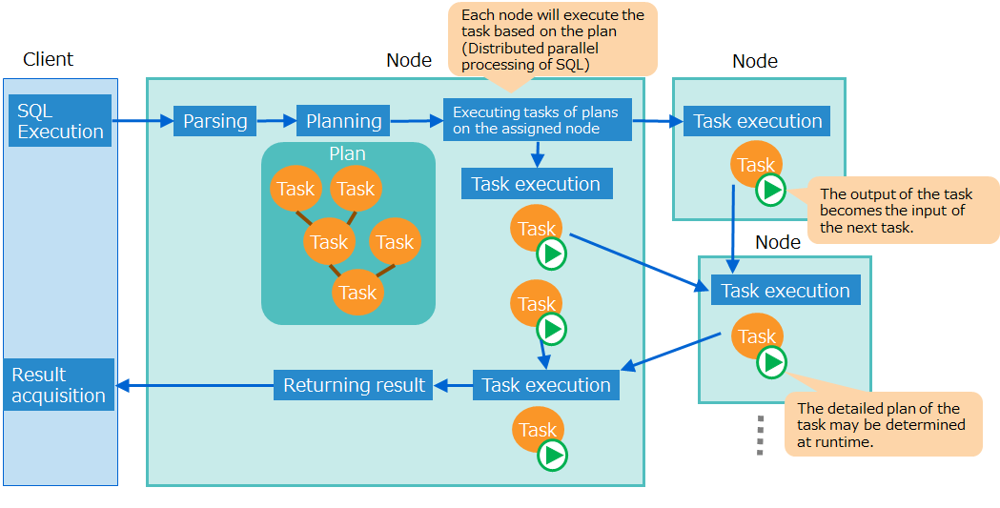
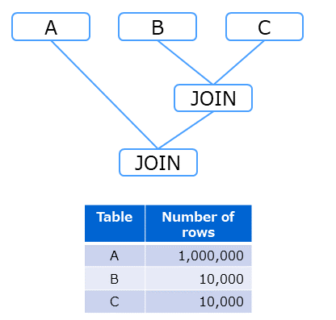
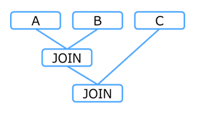
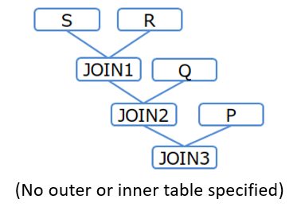
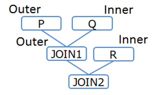
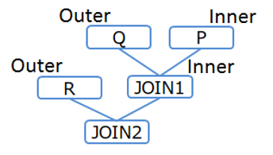
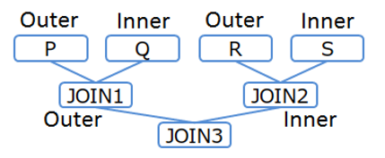

# GridDB SQL Tuning Guide

## table of contents
* [Introduction](#Introduction)
* [Tuning steps](#Tuning-steps)
* [Optimize SQL](#Optimize-SQL)
* [SQL plan](#label_plan)

---
# Introduction

## Purpose and organization of this document

**This document describes GridDB SQL tuning.**

This document is intended for developers who develop systems using SQL with GridDB.

The contents of this manual are as follows.

- Tuning steps
  - The steps for tuning SQL are described.

- Optimize SQL
  - Optimization rules in SQL scan and join processing are described.

- SQL plan (execution plan)
  - SQL plans, namely the result of SQL optimization, is described.


For optimization rules and tuning, the distinctive features of GridDB are mainly descried.

      

# Tuning steps

SQL tuning is performed by following the following steps, as in the case of general database systems.

- STEP 1 Check a slow query

  - If there is a problem with SQL performance on the system, identify slow queries that take a long time to execute.


- STEP 2 Obtain the plan

  - Get the plan of the slow query.


- STEP 3 Tune the query

  - Analyze the plan to see whether it works as intended and which part of the query is taking longer time than expected.
  - Tune the query according to the problem by rewriting or indexing the query.


- STEP 4 Re-execute the query

  - Execute the tuned query to check the performance. If the problem is not solved, start from STEP 2 again.

  

STEPs 1 to 3 will be explained in more detail in the following sections.

  

## Check a slow query

Identify which of the queries running on the system are slow queries that are taking a long time.

A slow query that takes a long execution time can be set to output information about the query and the execution time to the event log.
This helps identify which of the queries executed from an application are causing a bottleneck.

The procedure to check the slow query is as follows.

1. Set the parameters to output slow query settings

  - GridDB node has parameters for the threshold of slow query execution time and the upper limit of the query character string size output to the event log.

    | Parameter                    | Description                                                                              | Default value |
    |------------------------------|-------------------------------------------------------|------|
    | /sql/traceLimitExecutionTime | Lower limit of execution time (unit: second) for the event logging as a slow query.      | 300s |
    | /sql/traceLimitQuerySize     | Size upper limit of the query character string for logging as a slow query. (unit: byte) | 1000 |

  - To change from the default value, use either of the following two methods.
    - Stop the node and set parameters in the node definition file (gs_node.json)
    - Change the setting online using the operating command gs_paramconf. Note that, the setting changed online is reset by restarting the node. To make the change permanent, set the parameters in the node definition file (gs_node.json) after changing the setting online.

    [Memo]
    - Since SQL is executed on any node of the cluster configuration, be sure to set the output setting of the slow query for all nodes.
  

2. Execute a query.

  - Execute a query. The query exceeding the execution time that has been set in step 1 is output to the event log.

  

3. Check slow queries

  - Check the log of the slow query using one of the two methods below and identify the slow query.

    | Methods | Description |
    |-------------|----------|
    | Check the latest information online | Execute the option --slowlogs of operation tool gs_logs to display the information of a slow log. <br><br>- Only the information of the latest event log file is displayed. <br>The event log file is rotated when the file size exceeds the threshold or when the date changes. Once rotated, gs_logs will not show the contents of the old event log file.|
    | Check an event log file directly. | Check the event log file of a node directly. <br>Get the slow query log from the log file using "SQL_LONG_QUERY" as a keyword. |

    [Memo]
    - Since SQL is executed on any node of the cluster configuration, be sure to check the slow query log in all nodes.
  

## Obtain the plan

Execute the slow query identified in STEP 1 and get the query plan (global plan).

Use the operation tool gs_sh to get a plan. Execute the query with EXPLAIN ANALYZE syntax and get the plan with the sub-command getplantxt.

  

(1) Execute the query in the "EXPLAIN ANALYZE" syntax.

```
gs[public]> sql EXPLAIN ANALYZE select * from table1, table2 where table1.value=1 and table1.id=table2.id ;
A search was executed. (19 ms)
```

(2) Get the plan.

```
gs[public]> getplantxt
Id Type       Input Rows Lead time Actual time Node                 And more..
--------------------------------------------------------------------------------------------------------------------
 0 SCAN       -     -           30          30 192.168.15.161:10001 table: {table1}
 1   SCAN     0     3000        21          21 192.168.15.161:10001 table: {table1, table2} INDEX SCAN JOIN_EQ_HASH
 2     RESULT 1     14           0           0 192.168.15.161:20001
```

  

GridDB processes SQL as follows:
A node parses queries and generates a plan. The plan consists of plans for each task, which is a unit of execution, and each node executes assigned tasks.

<figure>
  
  <figcaption>SQL plan and the flow of processing</figcaption>
</figure>

The sub-command getplantxt for showing a plan displays a per-task plan, line by line. An output of a task becomes the input of the next task.

See the execution example of "(2) Get the plan" above and check the following.

- "Input" of plan ID1 is "0", which means the input of Plan ID1 is the result of plan ID0.
- "Rows" of plan ID1 is "3000", which means the number of rows input from Plan ID0 is 3000.
- "Node" of plan ID1 is "192.168.15.161:10001", which means this task was executed on the node "192.168.15.161."


  

## Tune the query

In the scan processing under a search condition in a WHERE clause and in the scan processing for joining a table, the performance may greatly vary depending on whether the index is used or not.
In the latter case, the performance also depends on the join order.
Note these points when tuning a query.


(1) Analyze a plan

Analyze a plan to check whether the index is used and the queries are executed as intended.
See the [SQL plan](#label_plan) for the details of a plan.

- How to check whether the index is used or not

  - In the scan processing under a search condition in a WHERE clause and in the scan processing for joining a table, the performance may greatly change depending on whether the index is used or not.
  - When "Type" of the slow task is "SCAN", check whether the index is used in the scan processing.
  - When the index is used, "INDEX SCAN" will be displayed under "And mode ..". If not, the index is not used.


(2) Tuning

Tune using the following methods depending on the problem identified from the analysis of a plan.

- Create an index
  - If a column that needs an index is not indexed yet, create an index.
  - However, it is recommended not to create an index in the following case, where it is not effective.
    - The index can hardly help narrow down values in query execution, such as when the cardinality of the column is low (that is, the number of types of column value is smaller than the number of rows).

- Rewrite a query
  - Rewrite descriptions including WHERE clause search conditions and join order based on the result of [SQL optimization](#label_sql_optimization).
  - Use a hint phrase. For example, when the index is left unused or when the index should not be used for a certain query, modify the plan using a hint phrase.

  

Example:
The following example illustrates how to tune a query for joining tables.

Get a plan for a query which joins table1 and table2 with the value of the column value.

```
gs[public]> EXPLAIN ANALYZE select * from table1, table2 where table1.value=0 and table1.value=table2.value;
A search was executed. (13 ms)
gs[public]> getplantxt
Id Type       Input Rows  Lead time Actual time Node                 And more..
-------------------------------------------------------------------------------------
 0 SCAN       -     -            20          20 192.168.15.161:10001 table: {table1}
 1 SCAN       -     -             9           9 192.168.15.161:10001 table: {table2}
 2   JOIN     0,1   10000,3000  891         891 192.168.15.161:20001 JOIN_EQ_HASH
 3     RESULT 2     32            2           2 192.168.15.161:20001
```

In this plan, both table1 and table2 are scanned, and join is processed without using an index.

The index information of the table shows the column value is not indexed; therefore, create an index.

Execute the same query to get a plan.

```
gs[public]> EXPLAIN ANALYZE select * from table1, table2 where table1.value=0 and table1.value=table2.value;
A search was executed. (7 ms)
gs[public]> getplantxt
Id Type       Input Rows Lead time Actual time Node                 And more..
--------------------------------------------------------------------------------------------------------------------
 0 SCAN       -     -           20          20 192.168.15.161:10001 table: {table1}
 1   SCAN     0     10000       80          80 192.168.15.161:10001 table: {table1, table2} INDEX SCAN JOIN_EQ_HASH
 2     RESULT 1     32           3           3 192.168.15.161:20001
```

"INDEX SCAN" is displayed for plan ID2, which shows the plan has changed to use an index in join processing.


  


<a id="label_sql_optimization"></a>
# Optimize SQL


## Scan using an index

In a scan processing to find part of data from the entire table, the "index scan" using the table index is often faster than the "full scan" which accesses all the rows of the table. The index scan can be used in the following processing.
- Processing to find data that matches the search condition of WHERE clause. 
- Processing to find the maximum and minimum values using the aggregate function.

The index scan is more effective when the search condition of a WHERE clause can narrow down the data by reducing the hit ratio to the number of rows of a table. This is especially true of the first case above.

  

<a id="scan_index_selection_rule"></a>
### Index selection rules (processing the search condition)

This section explains rules to select an index for processing the search condition in the WHERE clause.

Rules vary depending on the operator or expression specified.

  
**AND**

Basically, when indexes are set on the columns used as search conditions, the first index is used.

Example:
```
a>1 AND b=2 (Both "a" and "b" are indexed)
```
  - The index for a is used.
  
  

There may be exceptional cases where the first index is not used, as in the following cases:

- If the OR condition "OR false" denoting a constant false is added, the index is not used.

  Specify this syntax in order not to use an index in a scan.

  Example: In order not to use the index for a in "a>1 AND b=2"
  ```
  (a>1 OR false) AND b=2 (Both "a" and "b" are indexed)
  ```
    - The index for a is not used; the index for b is used.

  Example: In order not to use the indexes for a and b in "a>1 AND b=2"
  ```
  (a>1 AND b=2) OR false    (Both "a" and "b" are indexed)
  a>1 AND b=2 OR false      (Both "a" and "b" are indexed)
  ```
    - The indexes for a and b are not used.


- If an AND condition contains OR or IN, the index is used only in the first expression (the leftmost expression) for which an index is available.

  Example:
  ```
  (a=1 OR a=3) AND b=2   (Both "a" and "b" are indexed)
  a IN (1,3) AND b=2     (Both "a" and "b" are indexed)
  ```
    - The index for a is used; the index for b is not used.

  Example:
  ```
  (a=1 OR a=3 OR false) AND b=2   (Both "a" and "b" are indexed)
  (a IN (1,3) OR false) AND b=2   (Both "a" and "b" are indexed)
  ```
    - Since the expression on the left side of AND includes a constant false as an OR condition, the index for a cannot be used, and the index for b on the right side is used.
  

If conditions for the same column overlap, merge the conditions before using the index.

Example:
```
a>1 AND a<=4 AND a<=3 ("a" is indexed)
```
  - The conditions are merged into a condition "1<a<=3" before using the index for a.

  

**OR**

For OR, the index is used only when all the columns specified as search conditions are indexed.

Example:
```
a>1 OR b=2 (Both "a" and "b" are indexed)
```
  - The indexes for a and b are used.

Example:
```
a>1 OR b=2 ("b" is indexed)
```
  - Since a is not indexed, indexes for a and b are not used.

  

**Expressions for a comparison operator**

The index is used only when the expressions for a comparison operator consist of a single column value and a constant expression.

Example:
```
a> 10*1000-1 ("a" is indexed)
```
  - The index for a is used.

Example:
```
a+1>10*1000-1 ("a" is indexed)
```
  - The index for a is not used.

Example:
```
a>b (Both "a" and "b" are indexed)
```
  - The indexes for a and b are not used.

  

**IN, BETWEEN**

For IN and BETWEEN interpreted as expressions combining AND/OR and comparison operators, the rules mentioned above are applied.

Example:
```
a IN (1,2)        → a=1 OR a=2     ("a" is indexed)
a BETWEEN 1 AND 2 → a>=1 AND a<=2   ("a" is indexed)
```
  - The index for a is used.

  

[Memo]
- TREE indexes created with NoSQL or NewSQL interface and TREE indexes that are automatically set for a primary key are the only indexes used for index scan.
  HASH indexes and spatial indexes created with the NoSQL interface are not used.

- Use the SQL syntax hint "NoIndexScan" to specify a scan without using an index. Refer to "[Hint phrases](#label_hint)" for the details about this hint.

## Index selection rules (processing to find the maximum and minimum values)

The following explains index selection rules used in finding the maximum and minimum values using the aggregate function.

To calculate the MIN and MAX functions that aggregate indexed columns in the column list for the SELECT clause, use indexes as a general rule. Indexes are also used when the column list for the SELECT clause only contain an expression that combines these two aggregate functions and constant expressions.

[Memo]
- In a SQL statement with the WHERE clause, such SQL optimization takes effect only in the case in which the search condition is a combination of the following two expressions. If the search condition includes other expressions, index are not used.
  - Comparison expression for the column to be aggregated
  - Expression evaluated as always true
- If the target table is a partitioning table, index selection rules are applied for each data partition.
- If the target table is an interval partitioning table or interval hash partitioning table, a search condition expression that would include each entire data partition is treated as an "expression evaluated as always true."

Example:

```
SELECT MIN(a)         FROM table1            ("a" is indexed)
SELECT MAX(a)         FROM table1 WHERE a<10 ("a" is indexed)
SELECT MAX(a)-MIN(a)  FROM table1            ("a" is indexed)
```
  - As an index based on the aggregate function, the index for a is used.

Example:
```
SELECT MIN(a), MAX(b) FROM table1            (Both "a" and "b" are indexed)
```
  - As an index based on the aggregate function, the indexes for both a and b are used.

Example:
```
SELECT MAX(a)         FROM table1 WHERE a=10 ("a" is indexed)
SELECT MAX(a)         FROM table1 WHERE b<10 ("a" is indexed; no partitioning setting)
SELECT MIN(a), SUM(a) FROM table1            ("a" is indexed)
SELECT MIN(a), MAX(b) FROM table1 WHERE a<10 (Both "a" and "b" are indexed)
```
  - As an index based on the aggregate function, the index for a is not used.

Example:
```
SELECT MAX(a)         FROM table1 WHERE b>=TIMESTAMP('2024-01-01T00:00:00Z')
    ("a" is indexed; b denotes a partitioning key for an one-day interval)
```
  - As an index based on the aggregate function, the index for a is used (for scan processing of each data partition).

### Composite index selection rules

This section explains rules to select a composite index for scan processing when optimizing GridDB SQL.

The range that uses an index differs depending on the column or the operator specified in the search condition.
The part from the beginning of a column that comprises a composite index to the end of consecutive column conditions joined by the AND condition is used as the composite index.

[Memo]
- Once the OR condition is added, the subsequent conditions are not used as the composite index.
- The order of SQL column description does not affect whether the composite index is used or not.
- If the values processed by a function are used as values to be compared against comparison criteria, indexes are not used.

Example:
```
where col1 = 1 and col2 = 1 and col3 = 2 (with a composite index consisting of col1, col2, and col3)
```
  - Use the composite index with the conditions of col1, col2, col3.
```
where col1 = 1 and col2 > 1 and col3 < 2 (with a composite index consisting of col1, col2, and col33)
```
  - Use the composite index with the conditions of col1, col2, col3.
```
where col1 = 1 and col2 = 1 (with a composite index consisting of col1, col2, and col3)
```
  - Use the composite index up to col1, col2 conditions.
```
where col1 = 1 and col3 = 2 (with a composite index consisting of col1, col2, and col3)
```
  - The composite index is used up to the condition col1 because the second column col2 is not specified.
```
where col2 = 1 (with a composite index consisting of col1, col2, and col3)
```
  - The composite index is not used because the first column col1 is not specified.
```
where col1 = 1 and (col3 >= 0 and col3 < 10) and col2 = 1 (with a composite index consisting of col1, col2, and col3)
```
  - Use the composite index with the conditions of col1, col2, col3.
```
where col1 = 1 and (col3 = 0 or col3 = 1) and col2 = 1 (with a composite index consisting of col1, col2, and col3)
```
  - Use the composite index up to col1, col2 conditions.
```
where (col1 = 0 or col1 = 1) and col2 = 1 (with a composite index consisting of col1, col2, and col3)
```
  - Use the composite index up to col1 condition.
```
where col1 = 1 and (col3 >= 0 and col3 < 10) (with a composite index consisting of col1, col2, and col3)
```
  - Use the composite index up to col1 condition. 
```
where col1 = 1 and (col3 >= 0 and col3 < 10) and ABS(col2) = 1 (with a composite index consisting of col1, col2, and col3)
```
  - Use the composite index up to col1 condition.


## Join

This section describes how to determine the method of performing the operation of joining multiple tables for SQL optimization in GridDB.

- [How to determine the join order](#join_order_selection_approach)
  - Determine the order of joining multiple tables.
  - There are two approaches to determining the order: cost-based and rule-based.
  
- [How to determine index application](#join_index_adaption_rule)
  - Determine whether to use indexes in processing joins based on rules.

- [How to determine index selection](#join_index_selection_rule)
  - When index application rules determine that indexes are used, determine which indexes are used based on rules.
  
- [How to determine the approaches to join operations](#join_calculation_method_selection_rule)
  - Determine how to perform join operations based on rules.

For join processing without using indexes, the join order and the join operation method greatly influence the performance.

<a id="join_order_selection_approach"></a>
### How to determine the join order

In executing an SQL statement that contains three or more table joins, it is required to determine which table should be joined in what order. Two approaches are available for determining the order: cost-based and rule-based. Whichever approach can be selected according to the settings described below.

<a id="join_order_selection_approach_config"></a>
#### Setting the join order method

The join order method can be switched between cost-based and rule-based; the method can be set as follows:

- Either one of methods of determining the join order can be specified in the cluster configuration (gs_cluster.json) of the server. The method selected in the file will be applied to all SQL statements by default. For specifics on how to specify the method, see the [GridDB Features Reference](GridDB_FeaturesReference.md).
- By describing hints, one of the two methods of the determining the join order can be specified for each SQL statement. For the specifics on how to describe hints, see [Hint phrases](#label_hint).

 [Memo]
- By default, the method of determining the join order is cost-based.

<a id="cost_based_join_order_selection_approach"></a>
#### Cost-based method

The cost-based method for determining the join order is a method for determining the order with the lowest estimated cost for executing join operations.
The cost here refers to the rough estimate of the number of rows in the tables to be joined and the join results (intermediate result).
In joining multiple tables, there can be many choices for join operations, as to which of the tables are joined and in what order they are joined.
For each one of the choices for join operations, a rough estimate of the number of rows that are input and output for join operations is calculated, and the one which results in the smallest estimated number of rows that are joined upon the execution of SQL statements.
Because the choice which results in the smaller number of rows to be operated performs operations faster, the one that is ultimately chosen will be the optimal join order.

The estimated number of rows that are join output is found by an evaluation made by GridDB by following the two criteria from the two different perspectives given below:

- Perspective 1: degree of filtering join operations
- Perspective 2: degree of filtering join results

To determine the degree of filtering, the following evaluation criteria are used:

- Criteria on the types of comparison conditions. They are applied in the following order in which the first type has the highest degree of filtering.
  - equality comparison (=,IN)
  - greater than and less than comparison (<,<=,>,>=,BETWEEN)
- Criteria on the structure of the logical sum and product of conditions. They are applied in the following order in which the first type has the highest degree of filtering.
  - number of combinations of logical product (AND) (the greater the number, the higher the degree of filtering)
  - number of combinations of logical sum (OR) (the greater the number, the higher the degree of filtering)

[Memo]

- If multiple choices for join operations have the same degree of filtering, the join order cannot be determined on the basis of cost (estimate number of rows), in which case, join operations are executed according to the following priorities:

  - the one where the largest estimate number of rows in the nodes contained in join operations (partial tree) is smaller
  - the one with a smaller number of nodes contained in join operations (partial tree)
  - the one in which the join operation comes first in the SQL statement

Because the cost-based and rule-based methods employ different criteria in determining the join order, the two methods may result in different join order. For details about the rule-based method, see [Rule-based method]("#rule_based_join_order_selection_approach").

The following simple example illustrates how the order of joining three tables (A, B, and C) is determined.

  Example
  ```
  SELECT * FROM A,B,C
  WHERE A.x = B.x AND B.y = C.y
  ```

In the cost-based method, the given SQL statement and the estimated number of rows in each table are referenced to analyze the cost. In this example, the estimated number of rows in Table A is much greater than the number in the rest of the tables. In this case, the cost of executing the join operation for Table A is judged as high. As a result, a table join plan shown in the figure below is generated where the join operations for Tables B and C are executed first and the join operation for Table A is executed at the end.
<figure>

<figcaption>Join order (as determined by the cost-based method)</figcaption>
</figure>

In the rule-based method, a plan is generated by analyzing only the given SQL statement. In the example SQL statement, a join order plan as shown in the figure below is generated according to the order of the join descriptions. While the join operation for Table A with many rows would likely result in a greater number of outputs, a plan is generated in such a way that the operation result of Table A is joined with Table C, according to the description of the SQL statement.
<figure>

<figcaption>Join order (as determined by the rule-based method)</figcaption>
</figure>

[Memo]
 - The cost used for criteria in the cost-based method is only an estimate; therefore, a plan generated by the cost-based method does not necessarily give faster operations than a plan generated by the rule-based method. It is recommended to tune the SQL statement by using [Hint phrases](#label_hint) if needed.


<a id="rule_based_join_order_selection_approach"></a>
#### Rule-based method

The rule-based method for determining the join order is a method for determining the order according to the degree of joins of the SQL statement and the degree of filtering.

- Tables with a strong degree of coupling are joined consecutively.

  Example:
  ```
  FROM A, B, C
  ```
    - Without any conditions specified, the tables are joined in the order described. (A and B are joined, and the joined result and C are joined)

  Example:
  ```
  FROM A, B, C WHERE A.x=C.z AND C.z=B.y
  ```
    - Since the degree of coupling between A and C is strong, A, C, B are joined in this order. (A and C are joined, and the joined result and B are joined)

  Example:
  ```
  FROM A, B, C WHERE A.x>=C.z AND C.z>=B.y AND B.y=A.x
  ```
    - Since the degree of coupling between A and B is strong, A, B, C are joined in this order. (A and B are joined, and the joined result and C are joined)


- The tables with a stronger condition to narrow down the data, which is presumed to filter out fewer data, are joined earlier.

  Example:
  ```
  FROM A, B, C WHERE A.x=C.z AND C.z=B.y AND B.x=1
  ```
  - B has a stronger condition to narrow down the data, the join order will become B, C, and A.

  Example:
  ```
  FROM A, B, C WHERE A.x=C.z AND C.z=B.y AND A.x IN (1, 2) AND B.x IN (1, 2, 3)
  ```
  - A has a stronger condition to narrow down the data, the join order will become A, C, and B.


[Memo]
- The order of join can be changed using the SQL syntax hint "Leading". See the [hint phrase](#label_hint) for the details of the hint.


#### Selecting the driving table

In join processing, the table accessed first is called the driving table, and the table accessed next and joined is called the internal table.

The order of joins (driving table and inner table) is determined by the following rules.

When joining two tables, a table which has a conditional expression equal to a constant becomes a drive table.

Example
```
t1.a=t2.x AND t2.y=1
```
  - t2, which has a search condition with an expression including a constant 1, is the driving table, and t1 is the internal table.
  
<a id="join_index_adaption_rule"></a>
### Method for determining join application

This section explains the rules for using indexes in join processing.

An index is used if all of the following five rules are true:

- The driving table has an equivalent condition.

  Example:
  ```
  t1.a=t2.x AND t2.y=1 ("a" is indexed, the driving table is t2, and the internal table is t1)
  ```
    - The driving table has an equivalent condition (t2.y=1); as such, the index is used in join processing.

  Example:
  ```
  t1.a=t2.x AND t2.y>1 ("a" is indexed, the driving table is t2, and the internal table is t1)
  ```
    - The driving table does not have an equivalent condition (t2.y>1); as such, the index is not used in join processing.
      


- The first join condition is an equijoin condition.

  Example:
  ```
  t1.a>t2.x AND t1.b=t2.y AND t2.z=1 ("a" is indexed, the driving table is t2, and the internal table is t1)
  ```
    - The first join condition is not an equijoin condition (t1.a>t2.x); as such, the index is not used in join processing.
      

- The equijoin condition column of the internal table for the first join condition is indexed.

  Example:
  ```
  t1.a=t2.x AND t2.y=1 ("a" is not indexed, the driving table is t2, and the internal table is t1)
  ```
    - The equijoin condition column of the internal table for the first join condition is not indexed; as such, the index is not used in join processing.
      

- INNER JOIN

- Not disabled by NoIndexJoin hint.


[Memo]
- Selection of driving tables and internal tables for joining can be specified using a Leading hint. See the [hint phrase](#label_hint) for the details of the hint.
- Use of an index for joining can also be specified using the IndexJoin hint/NoIndexJoin hint. See the [hint phrase](#label_hint) for the details of the hint.


<a id="join_index_selection_rule"></a>
### Method for determining join selection

When the join syntax applies to the [method for determining join application](#join_index_adaption_rule), an index is used to join.
This section explains the rules to choose the index used to join.

Basically, [the rules for using an index](#scan_index_selection_rule) are the same as the rules for choosing an index to scan.
All indexes set for columns are used in the order described.

Note that in some cases, not all the indexes are used, as below.

When indexes are set on the columns used as search conditions, the first index is used.

  Example:
  ```
  t1.a=t2.x AND t1.b>t2.y AND t2.z=1 (a and b are indexed, the driving table is t2, and the internal table is t1)
  ```
  - Only the index for a is used.

  

In the OR condition (A OR B), when B is a false constant, the index for A is not used.

  Example:
  ```
  t1.a=t2.x AND (t1.b=t2.y OR false) AND t2.z=1 (a and b are indexed, the driving table is t2, and the internal table is t1)
  ```
  - The index for b is not used; the index for a is used.

  

<a id="join_calculation_method_selection_rule"></a>
### Method for determining how join operations are executed

The following three methods for join operation are available: hash join, sort merge, and nested loop join.

| Join operation method | Description |
|------------------------|------|
| Hash join             | Create a temporary table in the memory by hashing the join key of the driving table and then compare the table to the hash value of the internal table. |
| Sort merge join       | Sort the two tables to be joined by the join key, compare them in order and join them. |
| Nested loop join      | For the values of the join key of the driving table, find and join the data of the inner table that matched the join conditions.   |

Hash join is the quickest, followed by sort merge join and nested loop join.

  

Choose one of these operation methods based on the type of the first join condition.

| First condition | Method to choose                  |
|---------|----------------------------------|
| Equivalent condition | Hash join or sort merge join<br>(Even if hash join is chosen, some of the operations may switch to sort merge join due to limits on memory resources.) |
| Comparison condition | Sort merge join              |
| \- | Nested loop join          |

  

The first join condition of the join is selected in the following priority.

- A simple column expression is prioritized to be the first join condition.

  Example:
  ```
  t1.a=abs(t2.x)+10 AND t1.b=t2.y
  ```
    - t1.b=t2.y, a simple column expression, is selected as the first condition. Since the first condition is an equivalent condition, hash join or sort merge join is used.


- When there are two or more simple column expressions, the expression described earlier is selected as the first join condition.

  Example:
  ```
  t1.a>t2.x AND t1.b=t2.y
  ```
  - Since both "t1.a>t2.x" and "t1.b=t2.y" are simple column expressions, "t1.a>t2.x" is selected as the first condition in the order of description. Since the first condition is a comparison condition, sort merge join is used.

  
<a id="label_hint"></a>
## Hint phrase
  
An execution plan can be controlled by specifying a hint in a query to modify the execution plan, without changing the SQL statement.

[Points to note]
-   This function might change in future release.

### Terminology

The following table provides the definition of terms for the hint function.

| Term        | Description                                                         |
|----------|--------------------------------------------------------------|
| Hint phrase | Information for controlling the execution plan                                 |
| Hints       | A list of hint phrases. Specified in the query to control an execution plan. |

### Specifying hints

Write a hint in the block comment of the query to control the execution plan. The block comment for the hint can only be written immediately before or after the first SELECT (INSERT/UPDATE/DELETE) statement in SQL. To distinguish a hint comment from regular comments, the block comment for the hint begins with "/\*+".

The target to give a hint is specified by the object name or alias in parentheses. The targets are separated by either space, tab, or newline.

In the following example, the Leading hint clause specifies the table join order.

``` example
/*+
Leading(t3 t2 t1)
 */
SELECT *
  FROM t1, t2, t3
    ON t1.x = t2.y and t2.y = t3.z
  ORDER BY t1.x
  LIMIT 10;
```

[Memo]
-   When using a table with the same name more than once in the query due to a schema difference or multiple use of the same table, distinguish each table by giving an alias to the table.

### List of hint phrases

The following table gives available hint phrases.

| Category | Operation | Description                                          |
|------------------|------------------------------------------------|-----------------------------------------------|
| Parallelism | MaxDegreeOfTaskInput(upper_limit) | Maximum number of inputs for one task.                         |
|                  | MaxDegreeOfExpansion(upper_limit) | Maximum number of expansions for plan nodes.                    |
| Scanning method | IndexScan(table) | Index scan is used if possible.    |
|                  | NoIndexScan(table) | No index scan is used.              |
| Join order      | CostBasedJoin()                               | Determine the join order based on cost.     |
|                 |  NoCostBasedJoin()                             | Do not determine the join order based on cost; determine the join order based on rules.     |
|                 |   TableRowCount(number of table rows)               | Give the estimate number of rows to determine the join order based on cost. (applicable only when the join order is determined based on cost)     |
| Joining method | IndexJoin(table table) | Using index join if possible.    |
|                  | NoIndexJoin(table table) | No index join is used.              |
| Table joining order | Leading(table table \[table ...\]) | Join specified tables in the specified order.      |
|                  | Leading(( table set table set )) | Join the first specified table set as the outer table and<br>the second table set as the inner table indicates single table or table set)     |
| Number of intermediate rows generated   | MaxGeneratedRows (upper limit)   　　　　　　　　　  | Maximum number of rows generated in a task for interpolation operations that use the GROUP BY RANGE clause.   |


Table set = { table or ( table set table set )

### Details of hint phrases

This section details each category of hint phrases.

#### Parallelism

Control parallelization processing.

-   MaxDegreeOfTaskInput(upper_limit)
    -   Specify the maximum number of inputs for one task. It applies to the following processing:
        -   UNION ALL processing when scanning the partitioned table
-   MaxDegreeOfExpansion(upper_limit)
    -   Specify the maximum number of expansions for plan nodes. It applies to the following processing:
        -   Push down join optimization processing

#### Scanning method

Specify the scanning method.

-   IndexScan(table)
    -   Index scan is used if possible. If it cannot be used, nothing is done.
-   NoIndexScan(table)
    -   No index scan is used.


#### Join order

Specify how to determine the join order when given three or more tables.

-   CostBasedJoin()
    - Determines the join order by the cost-based method.
-   NoCostBasedJoin()
    - Determines the join order by the rule-based method, as opposed to the cost-based method.
-   TableRowCount(number of table rows)
    - Gives the estimate number of rows used in the cost calculation for determining the join order based on cost. (only applicable when the join order is determined based on cost.)
    
#### Joining method

Specify which joining method to select for a table combination.

-   IndexJoin(table table)
    -   Index join is used if possible. If it cannot be used, nothing is done.
-   NoIndexJoin(table table)
    -   No index join is used.

#### Table joining order

Specify in what order the tables are joined.

**(1) Specify only the join order: Leading(table table \[table ...\])**

Specify the table names or aliases in order from the first table to be joined. In this method, only Left-deep join orders are used.

[Example 1]

``` example
/*+ Leading(S R Q P) */
SELECT * FROM P,Q,R,S WHERE P.x = Q.x AND ...
```

<figure>

<figcaption>Table joining order (Example 1)</figcaption>
</figure>


**(2) Specify the join order and direction: Leading(( _table set_ _table set_ ))**

table set = { table or ( table set table set ) }

If only the join order is specified as in (1), the join direction (different for outer table or inner table) may differ from what is expected. To fix the join direction, use the following expression.

``` example
/*+ Leading((t1 (t2 t3))) */
SELECT ...
```

In this expression, parentheses can be nested. It joins the first specified table set as the outer table and the second set as the inner table.

[Example 2-1]

``` example
/*+ Leading(((P Q) R)) */
SELECT * FROM P,Q,R WHERE P.x = Q.x AND ...
```

<figure>

<figcaption>Table joining order (Example 2-1)</figcaption>
</figure>


[Example 2-2]

``` example
/*+ Leading((R (Q P))) */
SELECT * FROM P,Q,R WHERE P.x = Q.x AND ...
```

<figure>

<figcaption>Table joining order (Example 2-2)</figcaption>
</figure>


[Example 2-3]

``` example
/*+ Leading(((P Q) (R S))) */
SELECT * FROM P,Q,R,S WHERE P.x = Q.x AND ...
```

<figure>

<figcaption>Table joining order (Example 2-3)</figcaption>
</figure>


[Memo]
-   When joining three or more tables with no join conditions between the tables, the join order cannot be specified using a hint.

#### Number of intermediate rows generated

Specify the maximum number of intermediate rows generated by a single task. This number is applied to a task for interpolation operations that use the GROUP BY RANGE clause.

-  MaxGeneratedRows (upper limit)
    - The upper limit is a value to be set for the number of rows in the intermediate result generated by a single task 
      It is applied to the following processing:
      - task that performs interpolation operations using the GROUP BY RANGE clause.
    - The final number of rows obtained after executing SQL statements is equal to the total number of rows for multiple tasks. For this reason, the final number may exceed the settings value above.

### Error handling

In the following cases, a syntax error occurs.
-   Multiple block comments for hints are described
-   The hint is described in the wrong position
-   There is a syntax error in the description of the hint phrase
-   Duplicate hints of the same class are specified for the same table

In the following case, a table specification error occurs:
-   The table specification of the hint phrase is incorrect

[Memo]
-   When a table specification error occurs, ignore the error hint phrase and execute the query using the others.
-   When a syntax error and a table specification error occur at the same time, a syntax error occurs.


  
<a id="label_plan"></a>
# SQL plan (execution plan)

The EXPLAIN ANALYZE statement of SQL indicates what operation and index were chosen by SQL optimization.

In SQL processing, SQL syntax is analyzed, optimized, and divided into processing units called "tasks", such as join and sort scan, and then a plan (execution plan) is generated.

Tasks are executed on any one of the nodes which constitute a cluster, in parallel execution, exchanging data between these tasks.

[Memo]
- When the plan by SQL optimization is not adequate, a hint can be used to modify the plan. See the [hint phrase](#label_hint) for details.

  

Execution of the EXPLAIN ANALYZE statement will output information, including the task plans, execution time, in JSON format for each task in a line.

The main items to be output are as follows.

| Item             | Description  |
|------|------|
| id               | Plan ID |
| type             | Type of processing |
| inputList        | List of plan IDs of the plans to be input |
| profile/plan | Cost information estimated during plan generation (when the join order is determined based on cost) |
| profile/leadtime | Processing time |
| profile/rows     | Number of inputs |
| profile/address  | The address and port number of the node which executed the processing |

[Memo]
- The number of inputs may fluctuate depending on the communication timing of control information between tasks.

The types of processing are as follows.

| Value of type          | Description |
|----------|-----|
| GROUP                  | Grouping operation |
| JOIN                   | Join operation  |
| LIMIT                  | Filter operation of the number of lines |
| SCAN                   | Table scan operation |
| SELECT                 | Selection operation (condition filter projection) |
| SORT                   | Sort operation |
| UNION                  | Combine and set operation  |
| INSERT, UPDATE, DELETE | Various operations to change the container |
| DDL                    | DDL/DCL statement |
| RESULT                 | Retain the result |

  

A plan can be obtained using the operation tool gs_sh.
  

Example: To get the plan of a query "select \* from table1, table2 where table1.value = 0 and table1.id = table2.id"

```
gs[public]> EXPLAIN ANALYZE select * from table1, table2 where table1.value=0 and table1.id=table2.id;
A search was executed. (11 ms)
gs[public]> getplantxt
Id Type       Input Rows Lead time Actual time Node                 And more..
--------------------------------------------------------------------------------------------------------------------
 0 SCAN       -     -            0           0 192.168.15.161:10001 table: {table1} INDEX SCAN
 1   SCAN     0     0            2           2 192.168.15.161:10001 table: {table1, table2} INDEX SCAN JOIN_EQ_HASH
 2     RESULT 1     0            0           0 192.168.15.161:20001
```

Execute the getplanjson subcommand with gs_sh to output the plan in JSON format.

[Notes]

- The JSON format of a plan may change the data structure in a future version.

Example of JSON format of a plan
```
{
  "nodeList" : [ {
    "cmdOptionFlag" : 65,
    "id" : 0,
    "indexInfoList" : [ 3, 3 ],
    "inputList" : [ ],
    "outputList" : [ {
      "columnId" : 0,
      "columnType" : "INTEGER",
          :
          :
}
```

Copyright (c) 2017 TOSHIBA Digital Solutions Corporation
